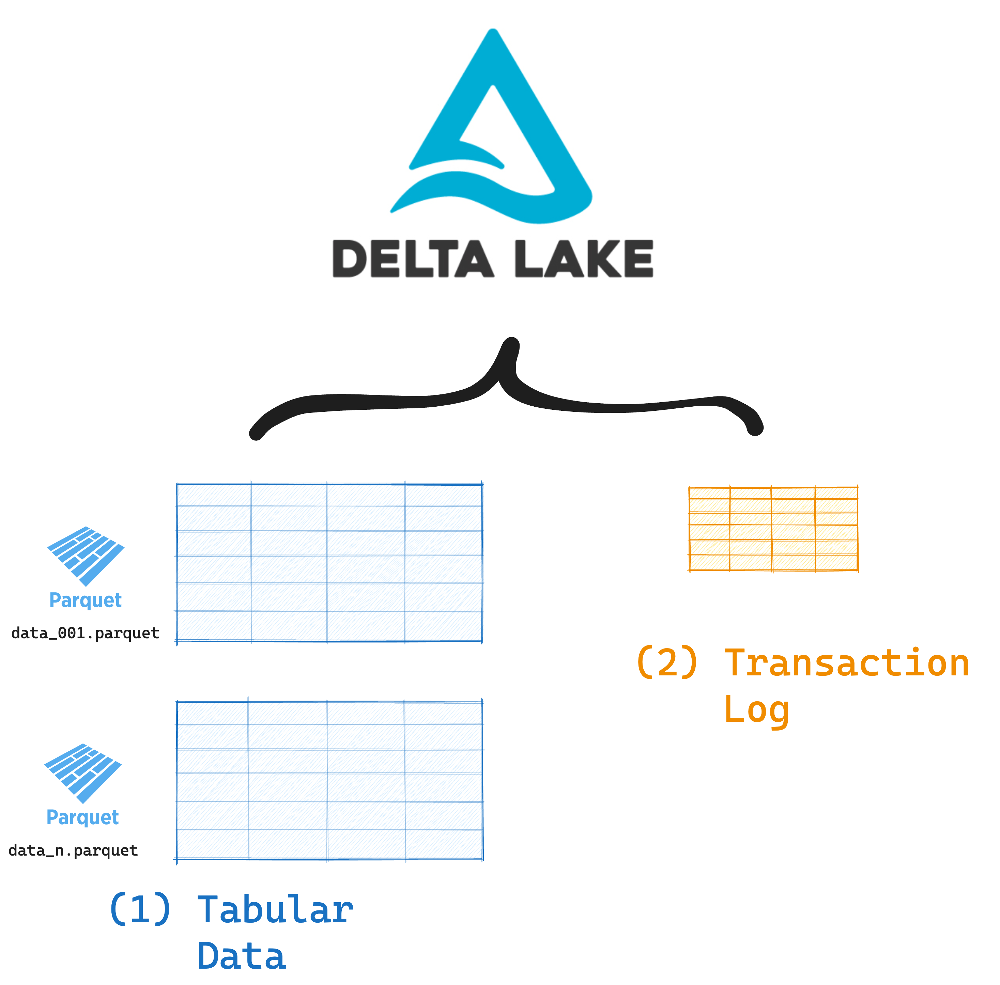
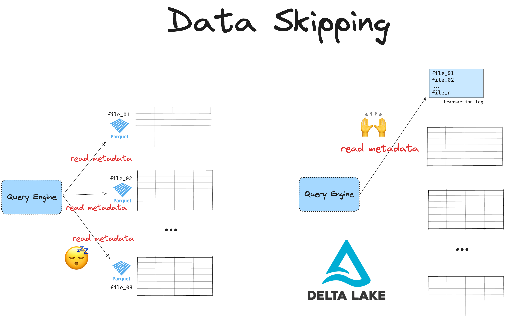

This article explains what data skipping is and how you can use it to achieve faster query performance with Delta Lake.

You will learn how data skipping works and why data skipping performance varies significantly across different data storage formats. You will also learn about the different data skipping features in Delta Lake and how to choose the best one for your use case.

Let’s jump in! 🪂

## What is data skipping?

Data skipping is a strategy for query optimization that lets your query engine skip irrelevant rows in your dataset. It is a feature of your data storage format.

Data skipping is most useful when running queries with selective filters. For example:

```python
df = spark.read.format("delta").load("transactions")
df.filter("amount > 10000 AND date > '2024-01-01'")
```

Delta Lake supports advanced data skipping. For the query above, Spark can easily figure out which rows and even entire files to skip when running this selective query. The “Data Skipping with Delta Lake” section below goes into more detail about how this works with Delta Lake.

Data storage formats that support data skipping will allow query engines to skip reading data that is definitely not relevant to your query. In this example above, all columns other than `amount` and `date` can be ignored. Data skipping will save you lots of time and money on compute.

Data skipping depends on two core factors:

1. Metadata availability, and
2. Data layout

The data storage format needs to store metadata (such as column names and min/max values) in a way that query engines can easily access. Different metadata handling strategies will result in different data skipping performance. Data skipping can then be optimized even more through data layout strategies, e.g. physical partitioning, Z-ordering or liquid clustering. We will cover these data layout strategies towards the end of the article.

Let’s take a look at the different data skipping capabilities of 3 common storage formats: CSV, Parquet and Delta Lake.

## Data skipping with CSV

CSV (Comma-Separated Values) is a common data storage format. It is a simple text-based format that stores data in a flat, sequential structure. CSV files do not give you much opportunity for data skipping.

When reading CSV files with a selective filter, query engines need to:

1. Read the file from beginning to end
2. Parse each line individually
3. Find rows that match your query

Query engines cannot optimize your query with data skipping because CSV files are limited in the following ways:

- No built-in metadata about the data's content
- No predefined schema or data type information
- No way to skip irrelevant portions of the file

The only basic form of "data skipping" you might achieve with CSV files is at the file level. If your data is split across multiple CSV files and you have a clear naming convention that indicates the content of each file, then you can manually instruct your query engine to only read specific CSV files. This is not true data skipping but more of a data organization strategy. It requires you to manually define which parts of the data to skip.

If you’re working with large datasets and/or often run selective queries, you’ll probably want to avoid storing your data in CSV files.

## Data skipping with Parquet

[Apache Parquet](https://parquet.apache.org/) is a columnar data storage format with native metadata storage. Your data is stored in row groups and Parquet automatically collects statistics for each column in each row group, including:

- `min_value: minimum value in column`
- `max_value: maximum value in column`
- `null_count: count of null values`
- `distinct_count: approximate distinct values`

This metadata gives you some nice opportunities for data skipping when running selective queries.

### Predicate Pushdown

Parquet’s row-group statistics enable smart data skipping of irrelevant row groups. Your engine reads the statistics in the file footer and can skip row groups that can't possibly match the selective query. This is called “predicate pushdown”.

For example:

```python
df = spark.read.format("parquet").load("transactions.parquet") \
.filter("amount > 10000")
```

For this query, your Parquet reader will:

1. Check row group statistics
2. Skip groups where `max(amount)` &lt;= 10000
3. Only read relevant row groups

This is much faster than reading all the rows in the dataset.

### Column Pruning

Since Parquet stores data in a columnar format, it allows your engine to skip reading entire columns that aren't needed for your query. This is called column pruning, and is really useful when you’re reading specific columns from a wide dataset.

For example:

```python
summary_df = spark.read.parquet("transactions.parquet") \
    .select("transaction_date", "amount") \
    .filter("transaction_date > '2024-01-01'")
```

For this query, your engine will:

1. Only read `transaction_date` and `amount` columns
2. Skip all other columns in the Parquet file
3. Apply predicate pushdown on `transaction_date`

### Limitations of Parquet Data Skipping

Parquet's data skipping capabilities are pretty great, but there are some important constraints:

- No support for file-level statistics (only row group level)
- Limited to basic statistics (min/max/null/distinct counts)
- No support for complex data skipping patterns
- Often coupled with inefficient physical partitioning strategies

Delta Lake is built on top of Parquet to extend its data skipping features. Let’s look at how this works.

## Data skipping with Delta Lake

Delta Lake is an [open table format] (#link-to-article-when-live). This means that it stores your data _along with valuable metadata_ in an advanced storage framework that improves performance and reliability.

Delta Lake tables consist of:

1. Your tabular data stored using a best-in-class file format (Parquet)
2. Metadata stored in a separate transaction log



The Delta Lake transaction log unlocks great features like ACID transactions, time travel and more advanced data skipping. Read the [Delta Lake vs Data Lake](https://delta.io/blog/delta-lake-vs-data-lake/) article for more information on all of these features.

Let’s look at how Delta Lake handles metadata and how this improves data skipping.

### Metadata Handling

Parquet files store column statistics for row groups in each file's footer. When you query a large dataset stored across multiple Parquet files, your engine needs to open each file to read these statistics. This becomes slow when you have lots of Parquet files, since each file needs to be accessed individually.

Delta Lake instead stores all file-level statistics in the centralized transaction log. This is smarter because when you run a query, your engine can directly check this log with a single request. This makes your queries run much faster.



Because Delta Lake stores metadata at the file-level, query engines can skip entire files. This is more efficient than Parquet data skipping, which needs to iterate over multiple row groups within each file.

Next, let’s look at the different data layout strategies and how they impact your data skipping gains.

## Data skipping: Liquid Clustering

Delta Lake supports multiple data layout optimization techniques to further improve data skipping and make your queries run even faster. These techniques are liquid clustering, Z-ordering and Hive-style physical partitioning.

Liquid clustering is the most effective way to optimize your data layout. If you need faster queries and smarter storage, consider using liquid clustering for all your new Delta tables.

Especially when:

- Your data has skewed distributions.
- Filtering columns vary significantly in cardinality.
- You frequently ingest new data into tables.
- Your system handles multiple concurrent writes.
- Query patterns evolve over time.
- Traditional partitioning would create a small file problem.

Liquid clustering isn’t compatible with Hive-style partitioning or Z-ordering. If your downstream systems rely on Hive-style partitioning, this may not be the right choice. For more on this topic, check out the [Delta Lake partitioning] (#add-when-live) guide.

## Data skipping: Z-Ordering

[Z-Ordering](https://delta.io/blog/2023-06-03-delta-lake-z-order/) is a Delta Lake feature that stores related rows together within the same files. It sorts data across multiple dimensions using a clustering algorithm, so that rows with similar values are stored close to each other. This layout significantly speeds up queries on either or all of your clustering columns.

Z-Ordering doesn’t force you to optimize for just one column. This means you get more flexibility than with traditional Hive-style partitioning. You can also combine Z-Ordering with physical partitioning.

## Data skipping: Hive-style Partitioning

Hive-style partitioning organizes partitions using the physical directory structure. For example:

```
spark-warehouse/sales_data
├── region=East
│   ├── part-00001.snappy.parquet
│   └── part-00002.snappy.parquet
└── region=North
    └── part-00003.snappy.parquet
└── region=South
    └── part-00004.snappy.parquet
└── region=West
    └── part-00005.snappy.parquet
```

To find files in a partition, query engines need to perform file listing operations.

These file listings can become a bottleneck when:

- Your data is stored in cloud object storage, which relies on key-value systems.
- You have many small partitions, leading to the Small File Problem.

Delta Lake avoids this issue. Partitioning information is stored as metadata in the transaction log, not in the file system. This allows Delta readers to directly access the transaction log to locate the required files for a query. Your query engine skips the expensive file listing process and runs your queries much faster.

## Data skipping with Delta Lake

This article has explained what data skipping is and how data skipping performance varies across common data storage formats: CSV, Parquet and Delta Lake.

Delta Lake offers the best data skipping performance. You can further improve it by enabling liquid clustering. Delta Lake optimizes both your data layout and metadata handling so query engines can easily find the relevant data for your queries.