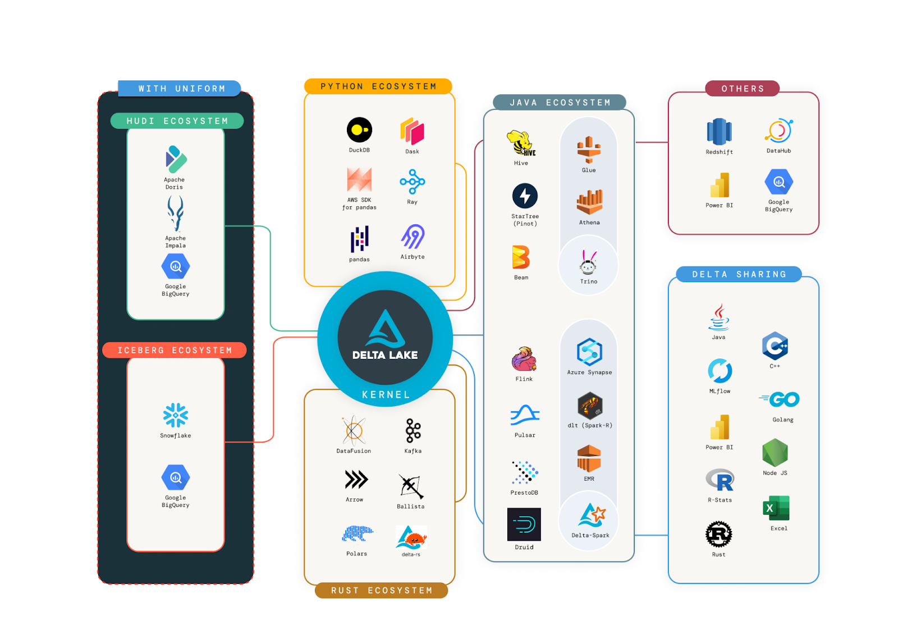
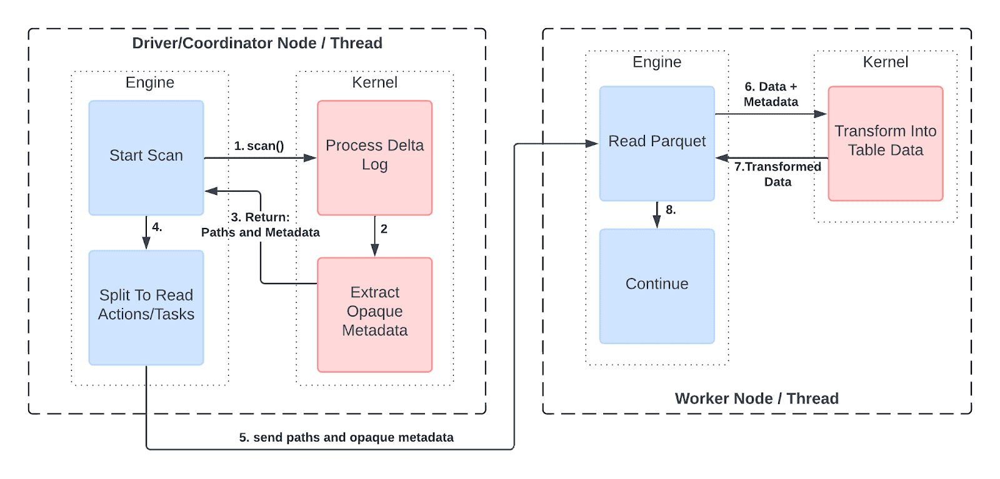
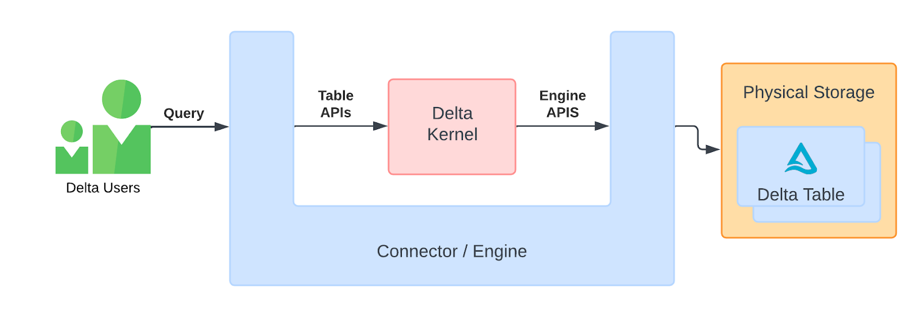

Delta Lake recently hit an impressive milestone of being downloaded more than 20M times per month! This clearly signals Delta Lake has become one of the most popular data formats for building data lakes and data lakehouses. This success is largely due to the amazing community and the ecosystem of connectors that allow Delta tables to be operable from any engine.



_Showing the rich connector ecosystem. Our goal is for all these connectors to have Delta Kernel at their core._

As Delta Lake continues to innovate and build amazing new features. For example: [Type Widening](https://github.com/delta-io/delta/blob/master/protocol_rfcs/type-widening.md), [Variant type support](https://github.com/delta-io/delta/blob/master/protocol_rfcs/variant-type.md), [In-Commit Timestamps](https://github.com/delta-io/delta/blob/master/protocol_rfcs/in-commit-timestamps.md), and [more](https://github.com/delta-io/delta/tree/master/protocol_rfcs). The real challenge is to ensure that all connectors can keep up with this rate of innovation by supporting newer features in the protocol. To avoid fragmentation in the ecosystem, [last year](https://delta.io/blog/delta-lake-3-0/) we started the Delta Kernel initiative to abstract away protocol details so connector developers can focus less on the complex internal details of Delta and more on APIs that allow for a seamless integration.

In this blog, we discuss who is using Delta Kernel, what the Delta Kernel is, why it was challenging to design it, and how you can start using it to build Delta connectors.

## Who is using Delta Kernel?

This Delta Kernel initiative is still in the early phase where the APIs are still being stabilized. Specifically,

- **[Kernel Java APIs](https://github.com/delta-io/delta/blob/master/kernel/USER_GUIDE.md)** - Read APIs (that is, `Scan`, first released in [Delta 3.0](https://github.com/delta-io/delta/releases/tag/v3.0.0)) have largely stabilized, write APIs (first released in [Delta 3.2](https://github.com/delta-io/delta/releases/tag/v3.2.0)) are still evolving.
- **[Kernel Rust APIs](https://docs.rs/delta_kernel)** - Read APIs were released in version 0.1.

Despite its lack of maturity, the Delta community has started adopting Kernel.

- **[DuckDB](https://github.com/duckdb/duckdb_delta)** - DuckDB has already released its Delta support using Delta Kernel Rust.
- **[Apache Druid](https://druid.apache.org/docs/latest/development/extensions-contrib/delta-lake)** - Druid has already added its first Delta support using Kernel Java.
- **[Apache Flink](https://github.com/delta-io/delta/tree/master/connectors/flink)** - Even a partial migration to Delta Kernel Java gave 3x startup time performance improvements to the Delta Flink connector.
- **[Delta Sharing](https://github.com/delta-io/delta-sharing/issues/438)** - Delta Sharing ecosystem has evolved its protocol to share the Delta metadata directory. Both communities are working together to adopt Delta Kernel in the Sharing Server, and the Sharing clients like delta-sharing-pandas.
- **[Delta-rs](https://github.com/delta-io/delta-rs/)** - We have worked closely with the Delta-rs community to begin [migrating](https://github.com/delta-io/delta-rs/pull/2495) to Delta Kernel Rust.

There is a lot more adoption in progress. Stay tuned for more updates and blog posts. We invite the entire community to build new Delta connectors or migrate existing ones to use Delta Kernel. Specifically, **existing connectors using Delta Standalone are strongly recommended to migrate to Delta Kernel as Delta Standalone is no longer maintained and is soon to be deprecated.**

To help you get started, let's discuss what Delta Kernel is, and how you can get started using it!

## What is the Delta Lake Protocol?

Before we jump into what Delta Kernel is, a quick refresher on the Delta Lake Protocol. Delta Lake is a [protocol](https://github.com/delta-io/delta/blob/master/PROTOCOL.md) which brings[ ACID](https://en.wikipedia.org/wiki/ACID) properties to large collections of data, stored as files, in a distributed file system or object store like S3, Google Cloud Storage or Azure Data Lake Storage. A Delta Lake table is made up of an atomic transaction log, which specifies ordering and metadata about the table and transactions, and the actual raw data files, stored as Parquet.

To read or write a Delta Lake table, an engine or connector must understand how to interpret the log and combine its metadata with the raw parquet data to produce the correct table data.

A simple example of this is partition columns. When data is partitioned by a column, every row in a given partition shares the same value for that column. To save space and speed up reads, we don’t store that column in the raw Parquet file; instead, we note the value in the Delta log. At query time, this value is propagated to every row in that partition.

Each Delta feature requires specific operations to read or write data correctly. Keeping up with these operations in every engine and connector is challenging, which led to the creation of Delta Kernel.

## What is the Delta Kernel?

Delta Kernel is a set of libraries that you can use to operate on Delta Lake tables from any engine. Specifically, you can find the latest versions of the kernels at:

- [Delta Kernel in Java](https://github.com/delta-io/delta/tree/master/kernel)
- [Delta Kernel in Rust](https://github.com/delta-incubator/delta-kernel-rs)

The wide data ecosystem has engines written in all sorts of languages - Java (e.g., Spark, Trino), Python (e.g., Pandas), C/C++ (e.g., DuckDB), Rust (e.g., Delta-rs, Polars, DataFusion). It's pretty hard to build a single library in a single language that satisfies the requirements for all such engines. So, we're building two kernels, one in [Java](https://github.com/delta-io/delta/tree/master/kernel) and one in [Rust](https://github.com/delta-incubator/delta-kernel-rs). The Java Kernel will be used for any JVM based engines that wish to add Delta support. The Rust Kernel also has [C and C++ bindings](https://github.com/delta-incubator/delta-kernel-rs/tree/main/ffi), which means it can be integrated into projects written in Rust, C, C++, Python or anything else that can consume such libraries. The Rust Kernel FFI layer has presented some unique API design challenges. We will have follow-up blog posts that cover some of the details there for interested readers.

These libraries provide stable APIs for high level operations (e.g., read, append) that abstract away all the details of combining the log metadata with the raw table table. They hide Delta Lake protocol details like partition columns, [Deletion Vectors](https://github.com/delta-io/delta/blob/master/PROTOCOL.md#deletion-vectors), or [Column Mapping](https://github.com/delta-io/delta/blob/master/PROTOCOL.md#column-mapping) from the API users. This allows simply pointing your connector at a table and getting back the correct data. Additionally, Delta Kernel helps with the simplest aspects of Delta tables. It understands the log, computes the latest snapshot of the table, and simplifies the process of reading and writing data. The goal of these libraries is ultimately to make the entire Delta community happy! Let's understand how.

- **Delta connector developers will be happy** - Before Kernel, developers building connectors to read Delta tables from their engine had to understand many low-level protocol specifications (e.g., Deletion Vectors) to implement support. For the first five years of Delta's existence, when the protocol specification was relatively simple, understanding and implementing this spec was much easier for connector developers, leading to a rich connector ecosystem.

  However, the pace of innovation in Delta is accelerating: Delta added _[eight new features](https://github.com/delta-io/delta/blob/master/PROTOCOL.md#valid-feature-names-in-table-features)_ to the protocol in the last year and _[seven new features](https://github.com/delta-io/delta/tree/master/protocol_rfcs)_ are currently in development. With every feature, the specification grows more complex, making it harder for connectors to keep up. For example, [Deletion Vectors (DVs)](https://delta.io/blog/2023-07-05-deletion-vectors/) fundamentally changed the architecture of Delta tables, requiring developers to update many parts of their connector, such as filtering read data with DV bitmaps and adjusting min/max stats. With Kernel, connector developers only need to understand the stable high-level Kernel APIs. Once they build or migrate their Delta connector using Kernel, they can simply upgrade to the latest Kernel version to support the latest protocol features.

- **Delta end users (that is, data engineers and data scientists) will be happy** - Since Delta connectors can easily support the latest features via Kernel upgrades, Delta users will always be able to operate on Delta tables from their favorite engines without compatibility concerns and take advantage of the latest innovation. For example, users of both Apache Spark and Apache Druid can easily enable Deletion Vectors (DVs) in their Delta tables to enjoy [4x faster MERGE operations in Spark](https://delta.io/blog/state-of-the-project-pt2/), and read the tables from Druid (recently [released](https://druid.apache.org/docs/latest/development/extensions-contrib/delta-lake) Delta support using Kernel).
- **Delta protocol developers will be happy** - Developers who design new protocol features want their features to be quickly and widely adopted by end users. Kernel makes the rollout and adoption of new features easier for them: they can implement their proposed feature in Kernel (since they know their proposed specification best), and the connector ecosystem can quickly adopt and use their features. In fact, the [RFC process for proposing protocol changes](https://github.com/delta-io/delta/tree/master/protocol_rfcs/) requires that a chance can only be [accepted if it is possible to implement the change within Kernel](https://github.com/delta-io/delta/tree/master/protocol_rfcs#3-finally-accept-or-reject-the-rfc). In other words, Delta Kernel will provide the guiding path for the future of Delta.

For Delta Kernel libraries to make this as much of a win-win-win situation as possible, they have to work across the multitude of processing engines and connectors out there. When we started this initiative last year, we realized that this was a pretty large challenge. Let's understand why.

## Why was designing Delta Kernel challenging?

At first glance, designing such a library might seem straightforward. After all, there are many libraries for file formats like JSON, Avro, and Parquet, which allow users to read data without understanding the intricacies of these protocols. So, why is “yet another format” difficult?

Let's explore why designing Delta Kernel posed a unique set of challenges.

- **Challenge 1: Abstracting a _"table format"_ -** Formats like JSON, Avro, Parquet are "_file_ formats", meaning each single file contains both the data and the metadata necessary to read it. For example, Parquet footers include all the schema and row group information needed to read the columnar data. A Parquet table is essentially a collection of Parquet files that implicitly share a consistent schema. However, these implicit assumptions can be fragile — one incorrectly written file can render the table inconsistent or corrupted (e.g., inconsistent schema, partial files).

  These limitations of file formats led to development of "table formats" like Delta Lake, Iceberg and Hudi, where the table-level metadata is stored separately in "metadata files" and transactionally updated by table operations. Building a library that can abstract both metadata and data for table formats is a novel challenge, as it requires handling both aspects cohesively — a problem not fully explored before.

- **Challenge 2: Support for distributed engines with the right level of abstraction -** If an engine wants to read data in a single thread or process, then Delta Kernel simply needs to return table data when given a Path. However, distributed engines like Apache Spark or Trino, or DuckDB's multi-threaded parquet reader, operate differently: they require the table's metadata (schema, list of files, etc.) in order to plan out the tasks of the distributed jobs. These tasks, running on different machines or threads, read different parts of the table data based on the parts of the metadata they were given.

  To support distributed engines, Delta Kernel must provide the right level of abstraction. It needs to:

  1. Expose just enough "abstract metadata" that an engine can use for planning without having to understand protocol details.
  2. Allow reading of table data with the necessary abstract metadata.

  Specifically, Delta Kernel returns information about files such as paths and statistics (e.g. row counts, min/max values) in the table as opaque metadata ("abstract metadata") . An engine does not need to understand the content of the data, but can split the data into subsets to be distributed to the workers. In each worker, the opaque metadata can be passed back into Delta Kernel which uses it to read and return the raw table data.



_Showing how distributed engines can use Kernel_

- **Challenge 3: Make it customizable to any engine with plugin interfaces -** Engines often need full control over system resources like memory, CPU, and disk, as well as the environment, like installed libraries. For Delta Kernel to be usable in any engine, it needs to be designed with as few assumptions about the environment as possible. In Kernel we have therefore encapsulated all resource-intensive operations like parquet reading, JSON parsing, or expression evaluation, behind an `Engine` interface. This interface allows connector developers to plug in engine-customized implementations so the engine can have full control of the resources used by Kernel. Kernel aims to remain a thin library that can insert in the middle of a connector/engine, allowing leverage of as much of the engine's capabilities as possible. This is illustrated in the following architecture diagram.



This "U" shaped architecture let's data flow from engine to kernel, and then back into the engine, allowing the engine to use its own data types, memory allocation, and other resource management.

Note that there are two sets of APIs

1. Table APIs for connectors operate on tables. More on that later.
2. Engine APIs for optionally plugging in engine-specific components.

- **Challenge 4: Make a simple connector easy to write, while supporting sophisticated engines -** Kernel provides a "batteries included" default implementation of the Engine interface. This ensures that a developer can use this default implementation to quickly and easily get started. After they have built an end-to-end complete connector, they can swap out the default pieces with engine-specific ones (that is, "better batteries") as needed to enable better performance, memory usage, or to meet any other requirements an engine might have.

To the best of our knowledge, Delta Kernel is the first attempt to solve all of these challenges together.

## How do I use Delta Kernel APIs?

As mentioned earlier, Delta Kernel has two major groups of APIs, "Table" and "Engine".

### Table APIs

"Table APIs" are those that an engine can call to initiate reading or writing of data. These are quite simple, especially in the case of reading. For example, to scan all the data in a Delta table, one could simply write:

```
engine = default_engine.create()
table = Table.for_path(engine, "/path/to/table")
snapshot = table.get_latest_snapshot(engine)

scan = snapshot.get_scan_builder(engine).with_schema("id", "name", "address").build()
data = scan.execute()
```

You can see full example usage of these APIs in the example programs we have in the Kernel repos:

- [Rust example](https://github.com/delta-incubator/delta-kernel-rs/blob/main/kernel/examples/read-table-single-threaded/src/main.rs)
- [Java example](https://github.com/delta-io/delta/blob/master/kernel/examples/kernel-examples/src/main/java/io/delta/kernel/examples/SingleThreadedTableReader.java)

### Engine APIs

To execute this scan, the Delta Kernel needs to actually read json files to get the metadata, read parquet files to get the raw table data, and evaluate expressions on the data to produce the correct final data. As mentioned in [Challenge 4], we want to give engines as much control as possible over how this happens. This is where the "Engine APIs" come into play. These APIs include functions to:

- Read JSON files
- Read Parquet files
- Evaluate expressions over data read by the above apis

By implementing these APIs, an engine can allow Kernel to guide the engine's own data functions and expression evaluation, to correctly read the table. At the end of the scan, the engine will have correct data in its own format, and continue query processing as normal.

Note that implementing the "Engine APIs" is optional. Engines can use the default implementations and get back data in "Kernel format", which is [Arrow](https://docs.rs/arrow/latest/arrow/) for the Rust Kernel and [heap-based](https://github.com/delta-io/delta/tree/master/kernel/kernel-defaults/src/main/java/io/delta/kernel/defaults/internal/data/vector) vectors for the Java Kernel.

To see an example of what an implementation of these APIs looks like, the default engine implementations are a good place to start:

- [Rust example](https://github.com/delta-incubator/delta-kernel-rs/tree/main/kernel/src/engine/sync)
- [Java example](https://github.com/delta-io/delta/tree/master/kernel/kernel-defaults/src/main/java/io/delta/kernel/defaults/engine)

In the near future we'll have some "deep dive" blog posts that will explain more nitty-gritty details about how these APIs work, and how you can either leverage the default implementations or build your own integrations.

## What next?

Moving forward we're excited to stabilize our APIs, add support for all Delta features, and work with the community to integrate into more engines and connectors! You can see the roadmaps for the projects [here](https://github.com/orgs/delta-io/projects/10/views/1).

For more information about the Delta Kernel projects, see the following:

- [Delta Kernel Java](https://github.com/delta-io/delta/tree/master/kernel)
- [Delta Kernel Rust](https://github.com/delta-incubator/delta-kernel-rs/)

For contributing to these projects, see the Github issues for ideas.

- [Delta Kernel Java](https://github.com/delta-io/delta/issues?q=is%3Aopen+is%3Aissue+label%3Akernel)
- [Delta Kernel Rust](https://github.com/delta-incubator/delta-kernel-rs/issues)

For engaging with the Delta community, join the Delta Lake slack channel - [go.delta.io/slack](go.delta.io/slack)
