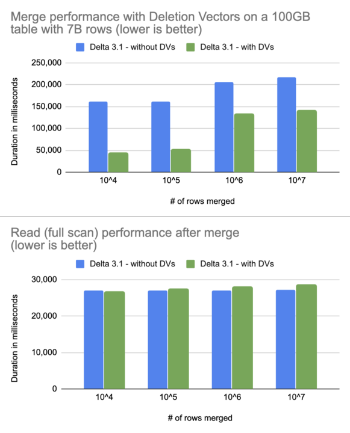
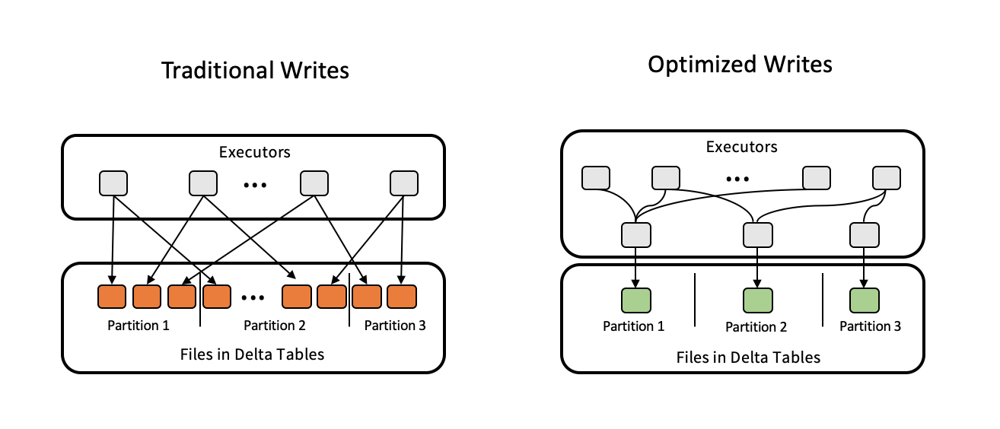

We are pleased to announce the release of Delta Lake 3.1 ([release notes](https://github.com/delta-io/delta/releases/tag/v3.1.0)) on [Apache Spark 3.5](https://spark.apache.org/releases/spark-release-3-5-0.html), with features that make it easier to use and standardize on Delta Lake.

This release includes many improvements and bug fixes, but we'd like to highlight the following:

- `MERGE` with Deletion Vectors: Up to 3.7x reduction in merges
- Optimized Write and Auto Compaction: Two features to automatically optimize file sizes for best out-of-the-box read performance
- Improvements to the Delta Kernel read APIs: Updates to improve read performance, through table state reconstruction and support for query predicate-based data skipping
- UniForm Iceberg compatibility: Support for MAP and LIST data types and improved compatibility with popular Iceberg reader clients
- (Preview) Liquid clustering: A more performant, flexible table layout.
- Delta Sharing integration with Delta-Spark: You can now use Delta-Spark to query Delta Lake tables that have been shared using the Delta Sharing protocol.
- Min/Max query optimization: Uses metadata statistics to speed up min/max aggregate queries by up to 100x

# What’s new in Delta Lake 3.1?

Building on the features released in Delta Lake 3.0, Delta Lake 3.1 introduces a host of performance enhancements and optimizations.

## MERGE with Deletion Vectors

The Delta Lake 3.0 release included some major performance upgrades for `UPDATE` and `DELETE` statements, through their support of [Deletion Vectors](https://docs.delta.io/latest/delta-deletion-vectors.html#enable-deletion-vectors). With this release, `MERGE` now also supports Deletion Vectors. This reduces the write overhead for `MERGE` operations and improves their performance by up to 3.7x. The graph below shows how small updates on a very large table are faster with Deletion Vectors with almost no impact on read performance after merge.



## Optimized Write and Auto Compaction

Frequent writes to a table can lead to fragmentation in the file layout. Lots of small files in a table can lead to slower read performance due to higher overheads of opening and closing small files. Offline operations like Optimize reduce this problem by compacting, and Z-Ordering if needed, small files into larger files. The number of small files in the table can keep growing until these operations are explicitly run. Delta 3.1.0 adds two features that can significantly improve the out-of-the-box performance - [Optimized Write](https://docs.delta.io/3.1.0/optimizations-oss.html#optimized-write) and [Auto Compaction](https://docs.delta.io/3.1.0/optimizations-oss.html#auto-compaction).

Optimized Write forces any distributed write operation (that is, only with Delta on Spark operations) to rebalance the data using a data shuffle prior to writing the files in the table. This significantly reduces the chances of generating small files on write operations. It is highly recommended to enable this on partitioned tables as partitioning has a significantly higher chance of data fragmentation across partitions.



However, Optimize Write by itself can only go so far. For example, in a streaming pipeline that continuously appends data to a Delta Lake table, each write may only include a small amount of data. Optimizing each write individually may still lead to small files accumulating over 1000s of writes. Auto Compaction solves that problem by running a "mini Optimize" operation after every write operation to compact any small files from all previous writes. So when this feature is explicitly enabled on a table, it will prevent any backlog of small files from ever building up.

Note that both features incur slightly higher write latencies for a better out-of-the-box read performance. Hence, these are not enabled by default and you have to enable them based on your workload requirements.

## Data skipping support in Delta Kernel

[Delta Kernel](https://docs.delta.io/3.1.0/api/java/kernel/index.html), a new project to make it easier to build and maintain Delta connectors, was released as part of [Delta Lake 3.0](https://delta.io/blog/delta-lake-3-0/). Based on community feedback, a number of new features, API improvements, and bug fixes have been added. The most notable are related to read performance.

For any given query predicate, Delta Kernel can restrict the list of files to scan, using file-level statistics stored in Delta Lake metadata. By skipping data, less data is scanned for these queries, resulting in faster read performance.

Delta Kernel can now also read the table metadata (that is, schema, properties, etc.) much faster due to improved table state reconstruction. Delta Flink Sink in 3.1.0 includes an experimental Kernel integration that reduced the Flink pipeline initialization time by 45x (that is, by faster table metadata fetch) when writing to an 11 PB table with 7M files.

Delta Kernel also now supports reading tables with column mapping `id` mode.

For more information, please see:

- [Delta Kernel API Documentation](https://docs.delta.io/3.1.0/api/java/kernel/index.html)
- [User guide](https://github.com/delta-io/delta/blob/branch-3.0/kernel/USER_GUIDE.md) on the step-by-step process to use Kernel in a standalone Java program or in a distributed processing connector.
- [Slides](https://docs.google.com/presentation/d/1PGSSuJ8ndghucSF9GpYgCi9oeRpWolFyehjQbPh92-U/edit) that explain the rationale behind Kernel and the API design.
- Example [Java programs](https://github.com/delta-io/delta/tree/branch-3.0/kernel/examples/table-reader/src/main/java/io/delta/kernel/examples) that illustrate how to read Delta tables using the Kernel APIs.

## UniForm Iceberg Compatibility

Delta 3.1.0 extends the UniForm support originally released in Delta Lake 3.0.

Delta 3.1.0 includes a new Iceberg support mode, IcebergCompatV2, which adds support for Map and List data types and offers better compatibility for timestamps, writing timestamps as int64, consistent with the [Iceberg spec](https://iceberg.apache.org/spec/#schemas-and-data-types). File statistics (column min, max, rowCount and nullCount) are now converted to Iceberg format.

Furthermore, you can now upgrade existing Delta Lake tables to UniForm, using the `UPGRADE UNIFORM` command:

```
REORG TABLE table APPLY (UPGRADE
UNIFORM(ICEBERG_COMPAT_VERSION=2))
```

For more information about these new features, check out UniForm’s [documentation](https://docs.delta.io/3.1.0/delta-uniform.html).

## Liquid Clustering

[Hive-style partitioning](https://delta.io/blog/pros-cons-hive-style-partionining/) is commonly used to increase read performance in data lakes, but it can cause maintenance and performance headaches if you have columns with high cardinality, have a lot of data skew, or if your data changes fairly frequently. Depending on the distribution of your data, the partitioning strategy that you start out with may end up causing inconsistencies in file sizes and partition sizes, ultimately resulting in slower performance. If you want to change your partitions to accommodate new data, you have to rewrite your table, a time-consuming and expensive process.

[Delta Lake 2.0](https://github.com/delta-io/delta/releases/tag/v2.0.0) introduced the concept of [Zorder](https://delta.io/blog/2023-06-03-delta-lake-z-order/), a multi-dimensional clustering technique. The `OPTIMIZE ZORDER BY` command applies `ZORDER` clustering and improves the performance of queries that utilize` ZORDER BY` columns in their predicates. However, it has the following limitations:

- `OPTIMIZE ZORDER BY` always reclusters (that is, rewrites) all data in the table resulting in high write amplification. Also, no partial results are saved when execution fails.
- `ZORDER BY` columns are not persisted and the user is required to remember the previous` ZORDER BY` columns, often causing user errors.

[Liquid clustering](https://docs.delta.io/3.1.0/delta-clustering.html), a preview feature available in Delta Lake 3.1.0, introduces a new _incremental_ clustering approach. The key changes are as follows:

- Liquid uses [Hilbert Curve](https://en.wikipedia.org/wiki/Hilbert_curve), a continuous fractal space-filling curve as a multi-dimensional clustering technique, which significantly improves data skipping over `ZORDER`.
- Incremental clustering is built around a new concept of ZCubes. A ZCube is a group of files with Hilbert-clustered data produced by the same `OPTIMIZE` command. Already clustered files are tagged in the file metadata (that is, in the Delta log) by ZCube id and new `OPTIMIZE` commands will only rewrite unclustered files. This significantly limits the write amplification.
- Finally, the clustering column information is stored in the table, so users are not required to specify the clustering columns every time in the `OPTIMIZE` command thus avoiding errors.

Note that Delta 3.1.0 only provides a preview of Liquid clustering with major [limitations](https://docs.delta.io/3.1.0/delta-clustering.html#limitations) In order to use clustering, you need to enable the Spark session configuration flag `spark.databricks.delta.clusteredTable.enableClusteringTablePreview`.

Liquid clustering is enabled at table creation with the `CLUSTER BY` statement:

```
-- Create an empty table
CREATE TABLE table1(col0 int, col1 string) USING DELTA CLUSTER BY (col0);

-- Using a CTAS statement
CREATE TABLE table2 CLUSTER BY (col0)  -- specify clustering after table name, not in subquery
AS SELECT * FROM table1;

-- Optimize / cluster the table without specifying the columns
OPTIMIZE table1
```

See the [documentation](https://docs.delta.io/3.1.0/delta-clustering.html) and the [example](https://github.com/delta-io/delta/blob/branch-3.1/examples/scala/src/main/scala/example/Clustering.scala) for more details. For more in-depth understanding, please see the [original design doc](https://docs.google.com/document/d/1FWR3odjOw4v4-hjFy_hVaNdxHVs4WuK1asfB6M6XEMw/edit#heading=h.skpz7c7ga1wl).

## Delta Sharing Spark connector

With Delta 3.1.0, we have migrated the `delta-sharing-spark` Maven artifact from the [delta-io/delta-sharing](https://github.com/delta-io/delta-sharing) Github repository to the [delta-io/delta](https://github.com/delta-io/delta/) repository. Using this you can use [Apache Spark](https://spark.apache.org/releases/spark-release-3-5-0.html) to read Delta Lake tables that have been shared using the Delta Sharing protocol. The connector supports reading a snapshot of the table, incrementally reading the table via streaming, and [Change Data Feed](https://docs.delta.io/latest/delta-change-data-feed.html) queries. Existing users of `delta-sharing-spark` Maven artifact have to upgrade their version from &lt;= 1.0 to 3.1.

Along with migration, Delta Sharing has also added support for Delta Lake tables with advanced features like [Deletion Vectors](https://docs.delta.io/3.1.0/delta-deletion-vectors.html) and [Column Mapping](https://docs.delta.io/3.1.0/delta-column-mapping.html). To use these features, you must set the configuration in SparkSession to use the Delta Sharing read format. Batch data can be read as is, but for streaming and CDF queries against tables with Deletion Vectors or Column Mapping, you also need to set `responseFormat=delta`. Please see the [documentation](https://docs.delta.io/3.1.0/delta-sharing.html) for more details.

## Min/Max query optimization

Seemingly simple aggregation queries like MIN and MAX can be prohibitively time-intensive for large tables. These operations have been made faster by using the table metadata, reducing the need for full table scans and improving performance by up to 100x.

## Additional Features in Delta Lake 3.1

This release is full of even more features. Please see the [release notes](https://github.com/delta-io/delta/releases/tag/v3.1.0) for the full list.

- [Support for DEFAULT value columns](https://github.com/delta-io/delta/blob/master/PROTOCOL.md#default-columns)
- [Support for Hive Metastore schema sync](https://docs.delta.io/3.1.0/delta-batch.html#syncing-table-schema-and-properties-to-the-hive-metastore)
- [Support for writing partition columns to data files](https://github.com/delta-io/delta/commit/d4fd5e2a)
- [Support for the phase-out of the v2 checkpoint table feature](https://github.com/delta-io/delta/commit/bcd0ee2d)

# Credits

Thank you to everyone involved with the release of Delta Lake 3.1:

Ala Luszczak, Allison Portis, Ami Oka, Amogh Akshintala, Andreas Chatzistergiou, Bart Samwel, BjarkeTornager, Christos Stavrakakis, Costas Zarifis, Daniel Tenedorio, Dhruv Arya, EJ Song, Eric Maynard, Felipe Pessoto, Fred Storage Liu, Fredrik Klauss, Gengliang Wang, Gerhard Brueckl, Haejoon Lee, Hao Jiang, Jared Wang, Jiaheng Tang, Jing Wang, Johan Lasperas, Kaiqi Jin, Kam Cheung Ting, Lars Kroll, Li Haoyi, Lin Zhou, Lukas Rupprecht, Mark Jarvin, Max Gekk, Ming DAI, Nick Lanham, Ole Sasse, Paddy Xu, Patrick Leahey, Peter Toth, Prakhar Jain, Renan Tomazoni Pinzon, Rui Wang, Ryan Johnson, Sabir Akhadov, Scott Sandre, Serge Rielau, Shixiong Zhu, Tathagata Das, Thang Long Vu, Tom van Bussel, Venki Korukanti, Vitalii Li, Wei Luo, Wenchen Fan, Xin Zhao, jintao shen, panbingkun

We’d also like to extend special things to Venki Korukanti for his contributions in making the release.

And, as always, a huge thank you to the contributions from our open source [community](https://delta.io/community).

# Join the community today!

We are always excited to work with our current contributor community and welcome new members. If you’re interested in helping the Delta Lake project, please take a look at the project [roadmap](https://delta.io/roadmap/) and join our community through any of our forums, including [GitHub](https://go.delta.io/github), [Slack](https://go.delta.io/slack), [X](https://twitter.com/DeltaLakeOSS), [LinkedIn](https://go.delta.io/linkedin), [YouTube](https://go.delta.io/youtube), and [Google Groups](https://go.delta.io/groups).
