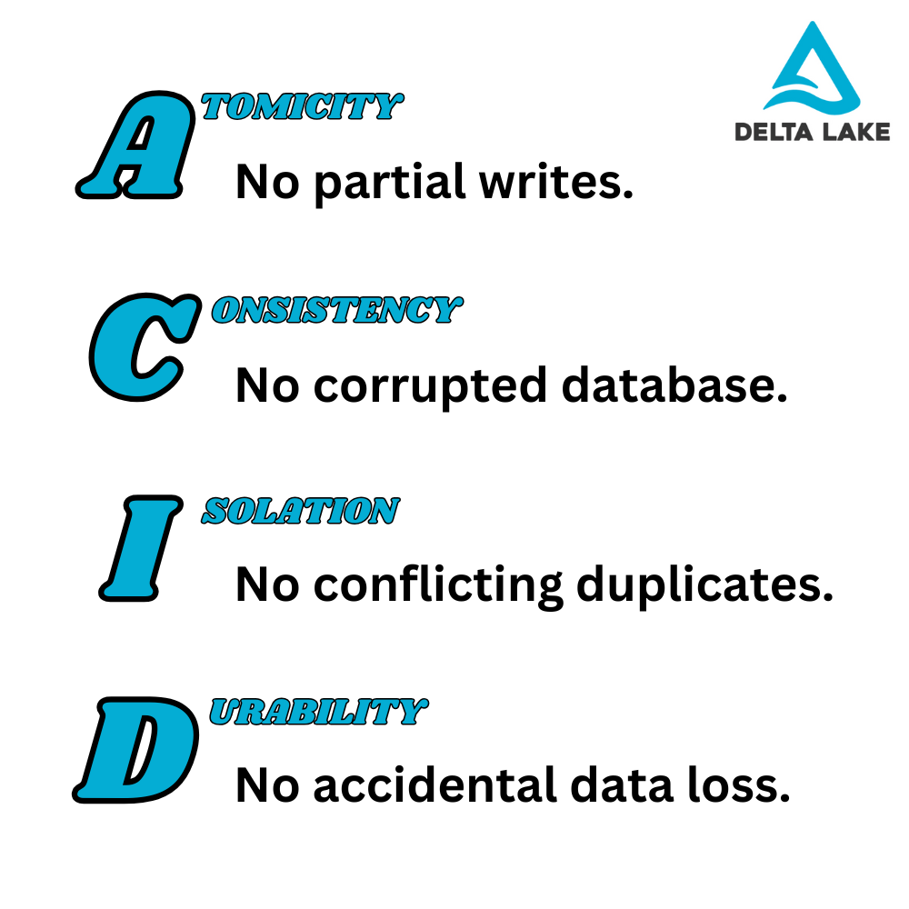

This article explains how Delta Lake uses ACID transactions to make your data workloads more secure and reliable.

When you work with valuable data, you need to be able to trust that it's accurate and safe. ACID transactions provide this kind of reliability guarantee so that you don't have to worry about corrupted data, accidental deletes or partial overwrites.

Let's take a closer look at what ACID transactions are and how Delta Lake uses them to improve your data workloads.

## What are ACID transactions?

A **transaction** is any operation or set of operations that modify your data, for example updating a table or writing new records. Transactions should be processed reliably.

**ACID** is an acronym that stands for: **A**tomicity, **C**onsistency, **I**solation, and **D**urability. They are the four guarantees that keep your data reliable even if something goes wrong, like an accidental delete or partial overwrite. Here's what each guarantee means:

- **Atomicity** means that a transaction is all or nothing. If one part fails, the entire operation is rolled back, so you never end up with incomplete data.

- **Consistency** means that your data always follows defined rules, like your table schema for example. Every transaction moves the system from one valid state to another, preventing corruption.

- **Isolation** means that multiple users can make changes at the same time without interfering with each other, avoiding conflicts and unexpected results.

- **Durability** means that once a transaction is complete, your data is permanently saved, even if there's a system crash or power failure.

## A brief history of ACID transactions

ACID transactions were first developed in the 1970s to keep database operations reliable. They quickly became the standard for database management. But in the 2010s, many organizations shifted to data lakes for storing large-scale data. Unlike databases, traditional data lakes were built on cloud object stores and [didn't enforce ACID guarantees](https://delta.io/blog/delta-lake-vs-data-lake/). This created problems with incomplete writes, data corruption, and conflicting updates.

Delta Lake solves these problems. It brings ACID transactions to your data lake. Every data change is guaranteed to be either fully completed or undone. This keeps your data consistent and secure, no matter what happens.

## Why do I need ACID transactions?

Without ACID transactions, data operations can be risky and unreliable.

Imagine you're adding a large batch of data to a data lake that stores files in Parquet format. If your cluster crashes in the middle of the process, some files may be only partially written. These broken files can cause errors when you try to read the data later, leading to failed queries and incorrect results. To fix the issue, you'll have to manually find and remove the corrupted files, then start the process over from the beginning—hoping that it won't fail again. This is likely going to be time-consuming and frustrating.

This kind of situation is not possible with ACID transactions: the entire write operation will fail and you will be free to retry without having to deal with a corrupted table. Data lakes do not give you any of these guarantees. Your data lake can quickly become a data swamp when it becomes unclear which data you can really trust.

This is one of the many reasons why Delta Lake is better than a traditional data lake for most serious workloads.

## How does Delta Lake use ACID transactions?

Delta Lake brings ACID transactions to your data lake by using a transaction log. This log is stored in a lightweight JSON file and tracks every change to your data. This makes sure that every operation is **atomic** (all or nothing), **consistent** (follows defined rules), **isolated** (avoids conflicts), and **durable** (permanently stored).

This approach gives you the following peace-of-mind guarantees:

- **No Partial Writes** - If a job fails mid-operation, Delta Lake ensures that incomplete changes are rolled back, so your data remains clean.
- **Consistent Reads** - Since all operations are tracked, queries always see a valid and up-to-date view of the data.
- **Concurrent Writes Without Conflicts** - Multiple users can modify data safely without interfering with each other, preventing corruption.

The transaction log also enables [time travel](https://delta.io/blog/2023-02-01-delta-lake-time-travel/), which means that you can roll back to previous versions of your data if something goes wrong.

## Do ACID transactions affect performance?

A common concern with ACID transactions is performance overhead, but Delta Lake minimizes this impact. Since transactions are recorded in lightweight log files, updates are efficient. Delta Lake also uses concurrency control to let multiple users work on the same data without locking files to reduce bottlenecks.

While there is minor overhead in terms of both storage and compute for some operations, this is a small tradeoff for the time and money you will save on not having to work with a corrupted data lake.

By combining ACID transactions with the scalability of a data lake, Delta Lake gives you the best of both worlds: the reliability of a database and the flexibility of big data storage. You get stronger data integrity, safer updates, and fewer operational headaches.

## ACID transactions: Parquet vs Delta Lake

Parquet is a great file format for storing structured data efficiently, but it does not support ACID transactions on its own. When you write data to a Parquet-based data lake, failures can leave behind partially written files, leading to data corruption. There's also no built-in way to handle concurrent writes, which means multiple users updating data at the same time can cause conflicts.

Delta Lake solves these issues by adding a transaction log on top of Parquet. This log tracks every change, ensuring that writes are atomic (all-or-nothing) and consistent (no broken files). It also enables safe concurrent writes, making collaboration easier. Plus, Delta Lake allows time travel, so you can roll back to previous data versions if needed.

For most workloads, Delta Lake is the better choice. It gives you the speed and compression of Parquet, plus the reliability of ACID transactions. That means fewer errors, easier management, and more trustworthy data. Read more in the [Delta Lake vs Parquet](https://delta.io/blog/delta-lake-vs-parquet-comparison) guide.

## Delta Lake and ACID Transactions

ACID transactions help keep your data safe and reliable, and Delta Lake brings them to your data lake. With the Delta Lake transaction log, every change is fully completed or rolled back, so you never get broken data. Unlike plain Parquet, Delta Lake prevents errors, handles multiple users safely, and keeps track of past versions. It gives you the speed of Parquet, the cost benefit of cheap data lake storage, and the reliability of a database. If you want a data lake that just works without corrupted data, Delta Lake is the better choice.
