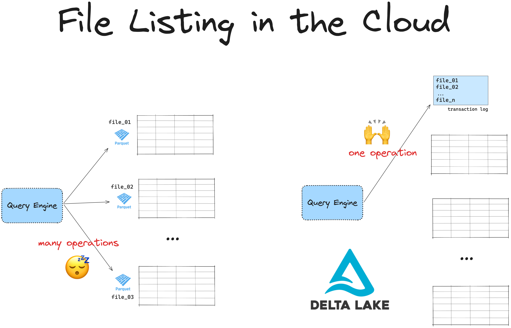
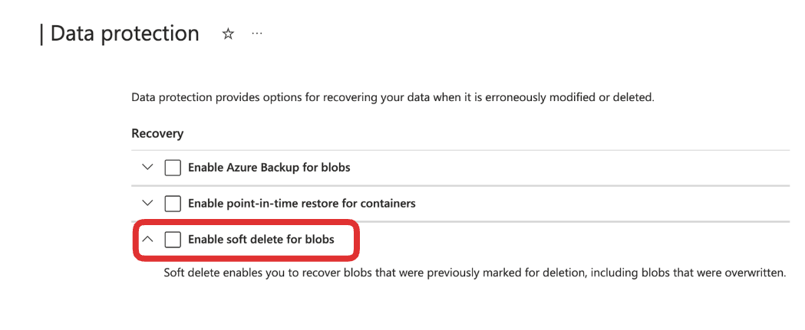

This article shows you how to use Delta Lake with Azure Data Lake Storage (ADLS).

Delta Lake is an open-source framework designed for fast, reliable data storage. It supports ACID transactions, handles metadata efficiently at scale, optimizes query performance, and allows time travel. With Delta Lake, you can build a high-performance lakehouse architecture directly on top of ADLS.

Azure Data Lake Storage is popular for storing large amounts of data in formats like Parquet. ADLS storage is scalable and cost-effective, especially for batch data. However, ADLS doesn’t natively support transactional guarantees or the query optimizations Delta Lake provides.

This guide will cover how to read and write Delta tables on Azure Data Lake Storage, with examples in Spark, Polars and pandas.

You’ll learn:

- Why Delta Lake is ideal for Azure workloads
- How to set up your Spark session to connect ADLS with Delta Lake
- How to configure authentication and write data to ADLS with Delta Lake

Let’s dive in.

## Why Delta Lake is Ideal for Azure Data Lake Storage

Azure Data Lake Storage (ADLS) is fast for storage but slow at listing files. Delta Lake makes data retrieval on ADLS faster by avoiding expensive file listing operations.

All cloud-based storage systems are slow at listing files because unlike hierarchical file systems, they use a flat namespace. ADLS has no true directories. Instead, ‘directories’ are simulated by adding prefixes to object names. Listing files means the system has to scan all objects and filter by prefix.

Additionally, ADLS has API rate limits, requiring multiple API calls to list many files. This creates a bottleneck, especially for large datasets.

This becomes an issue when handling large datasets. If you have a table with data spread across many files in ADLS, your engine must first list all files, then filter out the ones needed. Listing files can add latency and slow down your queries.



Delta Lake solves this by storing all file paths in a transaction log. Instead of listing files, the engine can retrieve all relevant file paths in a single operation, making your queries faster and more efficient. Delta Lake also enables other features like ACID transactions and time travel, adding flexibility and reliability to your ADLS-based lakehouse.

## Setting Up Azure Data Lake Storage (ADLS)

Before getting started, make sure you have the following:

- **Azure Account**: Access to an Azure subscription with the required permissions.
- **Azure CLI**: Install the Azure CLI to set up your storage account.

Now, let’s set up a storage account and contained in Azure Data Lake Storage:

1. **Create a Storage Account in ADLS**:
   - Open the Azure Portal.
   - Go to **Storage Accounts** and select **Create**.
2. **Create a Container**:
   - In the storage account, go to **Containers** and select **+ Container**.
   - Enter a unique container name and click **Create**.

You’ll need the storage account name and container name to configure Delta Lake access.

## How to Use Delta Lake on ADLS

Delta Lake supports a variety of query engines, and many of them can read and write Delta tables on ADLS. For example, here’s how you can read and write Delta tables with Spark:

```python
# Reading from a Delta table
df = spark.read.format("delta").load("abfss://<container_name>@<storage_account>.dfs.core.windows.net/<delta_table_path>")

# Writing data to a Delta table
data.write.format("delta").save("abfss://<container_name>@<storage_account>.dfs.core.windows.net/<delta_table_path>")
```

Some engines require extra configuration to work with Delta Lake on ADLS. Let’s walk through the steps to set up Delta Lake on ADLS with Spark.

## How to Use Delta Lake on ADLS with Spark

This section will cover setting up a Spark session configured to work with Delta Lake on ADLS. Below is an example Spark session with proper configuration.

### Example Delta Lake Spark Setup for ADLS

This code shows how to start a Spark session with Delta Lake configurations for ADLS:

```python
import pyspark
from delta import *

conf = (
    pyspark.SparkConf()
    .setAppName("DeltaLakeOnADLS")
    .set("spark.sql.catalog.spark_catalog", "org.apache.spark.sql.delta.catalog.DeltaCatalog")
    .set("spark.sql.extensions", "io.delta.sql.DeltaSparkSessionExtension")
    .set("spark.hadoop.fs.azurebfs.impl", "org.apache.hadoop.fs.azurebfs.AzureBlobFileSystem")
    .set("fs.azure.account.key.<storage_account>.dfs.core.windows.net", <your-storage-account-key>)
    .setMaster("local[*]")  # Use all available cores
)

extra_packages = [
    "org.apache.hadoop:hadoop-azure:3.3.4",
    #version must match hadoop-client-runtime
]

builder = pyspark.sql.SparkSession.builder.config(conf=conf)
spark = configure_spark_with_delta_pip(
    builder, extra_packages=extra_packages
).getOrCreate()
```

Note these important considerations:

- Replace `<storage_account>` with your ADLS storage account name
- Replace `<your-storage-account-key>` with your actual storage account access key
- Set the correct Hadoop file system
- Install the hadoop-azure JAR using Spark config.

The `hadoop-azure` JAR version should match the version of your `hadoop-client-runtime`. You can find your `hadoop-client-runtime` version by running the code below from your Spark root directory:

```sh
​​cd <spark-root>/jars && ls -l | grep hadoop-client
```

> If your `hadoop-client-runtime` is version 3.3.4 then your `hadoop-azure` should also be 3.3.4, etc.

You will also need to disable Soft Blob deletes in your Azure configurations. Soft Blob Deletes is an Azure feature that lets you recover accidentally deleted data by retaining deleted blobs for a specified retention period. Delta Lake uses a transaction log to track changes, and soft-deleted files can cause problems with operations like VACUUM, file listing, or data queries. To keep things running smoothly, turn off soft delete and rely on Delta Lake's built-in tools like versioning and time travel to manage and recover your data.

You can turn off the Soft Blob deletes in your Data Protection settings:



If you don't disable Soft Blob deletes you will likely see an error like:

```sh
org.apache.hadoop.fs.FileAlreadyExistsException: Operation failed: "This endpoint does not support BlobStorageEvents or SoftDelete. Please disable these account features if you would like to use this endpoint."
```

### Write Data to Delta Lake on ADLS

Now you’re ready to write data to Delta Lake on ADLS. Here’s a sample DataFrame you can write as a Delta table:

```python
# Create sample data
data = spark.range(0, 5)

# Write data to a Delta table in ADLS
data.write.format("delta").save("abfss://<container>@<account>.dfs.core.windows.net/delta-table")
```

Replace `&lt;container_name>` and `&lt;storage_account>` with your Azure container and storage account names, respectively.

### Read Data from Delta Lake on ADLS

To read the data back, simply load the Delta table path:

```python
# Read Delta table from ADLS
df = spark.read.format("delta").load("abfss://<container_name>@<storage_account>.dfs.core.windows.net/delta-table")
df.show()
```

This command reads your Delta table directly from ADLS and should output data like:

```sh
+---+
| id|
+---+
|  3|
|  0|
|  2|
|  1|
|  4|
+---+
```

### Using Delta Lake’s Advanced Features on Azure Data Lake Storage

Delta Lake on ADLS supports advanced operations like updates, deletes, and merges. Here are some examples.

#### **Update and Delete Operations**

```python
from delta.tables import DeltaTable

# Load Delta table
deltaTable = DeltaTable.forPath(spark, "abfss://<container_name>@<storage_account>.dfs.core.windows.net/<path_to_table>")

# Update rows where id is less than 3
deltaTable.update("id < 3", {"id": "id + 10"})

# Delete rows where id is less than 5
deltaTable.delete("id < 5")
```

#### **Merge Operation**

```python
# Merge new data into Delta table
new_data = spark.range(0, 20)

deltaTable.alias("old").merge(
    new_data.alias("new"),
    "old.id = new.id"
).whenMatchedUpdate(set={"id": "new.id"}).whenNotMatchedInsert(values={"id": "new.id"}).execute()
```

## How to Use Delta Lake on ADLS with Polars

You don’t need to use Spark to work with Delta Lake on Azure Data Lake Storage. You can use the Rust implementation of Delta Lake (`delta-rs`) instead.

delta-rs offers native support for using Azure Data Lake Storage (ADLS) as an object storage backend. You don’t need to install any extra dependencies to read or write Delta tables to ADLS with engines that use delta-rs, like Polars. You do need to configure your ADLS access credentials correctly.

**Using Local Authentication**

If your local session is authenticated using the Azure CLI then you can write Delta tables directly to ADLS. Read more about this in the [Azure CLI documentation](https://learn.microsoft.com/en-us/cli/azure/).

**Passing Credentials Explicitly**

You can also pass ADLS credentials to your query engine explicitly. For Polars, you would do this using the `storage_options` keyword as demonstrated above. This will forward your credentials to the object store library that Polars uses for cloud storage access under the hood.

Read the [object store documentation](https://docs.rs/object_store/latest/object_store/azure/enum.AzureConfigKey.html#variants) for more information defining specific credentials.

**Example: Write Delta table to ADLS with Polars**

Using Polars, you can write a Delta table to ADLS directly like this:

```python
import polars as pl

df = pl.DataFrame({"foo": [1, 2, 3, 4, 5]})

# define container name
container = <container_name>

# define credentials
storage_options = {
   "ACCOUNT_NAME": <account_name>,
   "ACCESS_KEY": <access_key>,
}

# write Delta to ADLS
df_pl.write_delta(
   f"abfs://{container}/delta_table",
   storage_options = storage_options
)
```

**Example with pandas**

For libraries without direct `write_delta` methods (like Pandas), you can use the `write_deltalake` function from the `deltalake` library:

```python
import pandas as pd
from deltalake import write_deltalake

df = pd.DataFrame({"foo": [1, 2, 3, 4, 5]})
write_deltalake(
   f"abfs://{container}/delta_table_pandas",
   df,
   storage_options=storage_options
)
```

Read more in the [Delta Lake without Spark](https://delta.io/blog/delta-lake-without-spark/) article.

## Using Delta Lake on Azure Data Lake Storage

This article has shown you how to set up Delta Lake on Azure Data Lake Storage. You have learned how to configure authentication, and how to work with Delta tables in Azure using both Spark and non-Spark engines. Delta Lake on ADLS provides an efficient, reliable way to build scalable lakehouses with all of Delta Lake’s great features: fast queries, reliable transactions, and efficient data handling.

Check out these articles to dive deeper into Delta Lake’s core features:

- Using the transaction log to [optimize your Delta tables](https://delta.io/blog/delta-lake-optimize/).
- Using [Delta Lake for ETL pipelines](https://delta.io/blog/delta-lake-etl/).
- Building the [Delta Lake Medallion architecture](https://delta.io/blog/delta-lake-medallion-architecture/).
