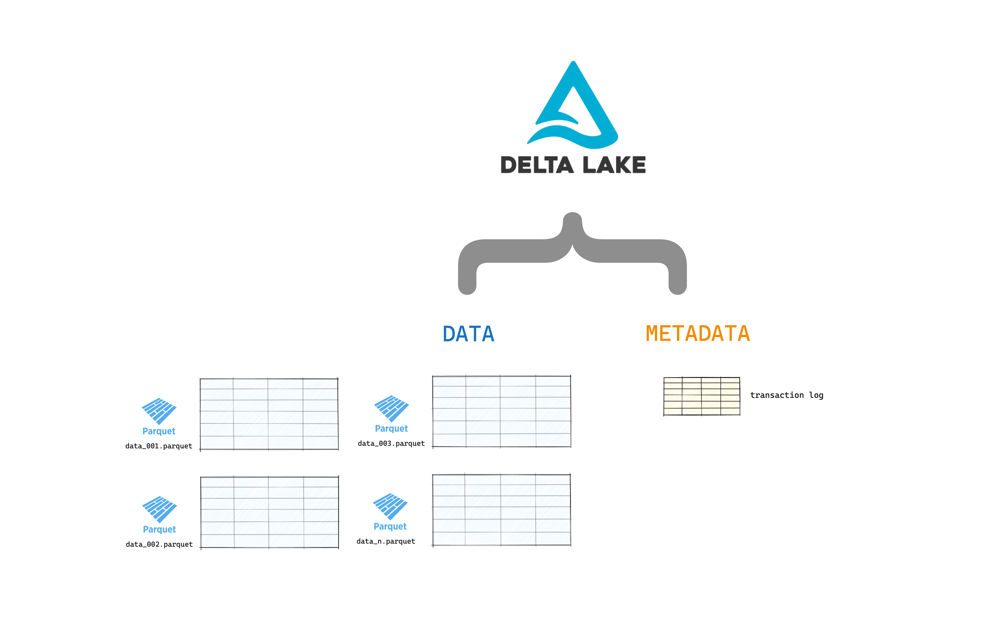
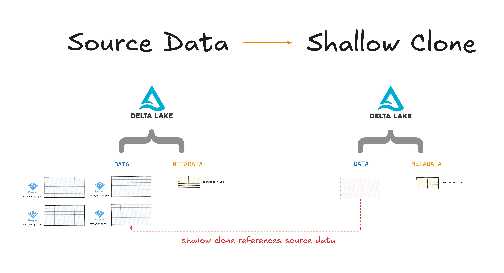
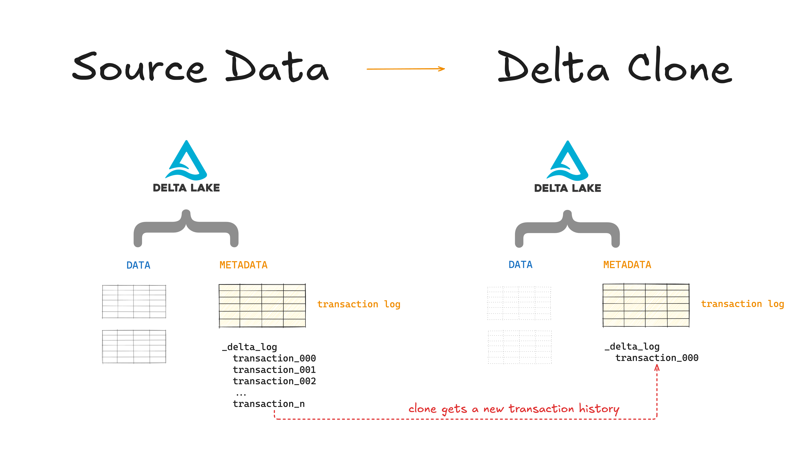
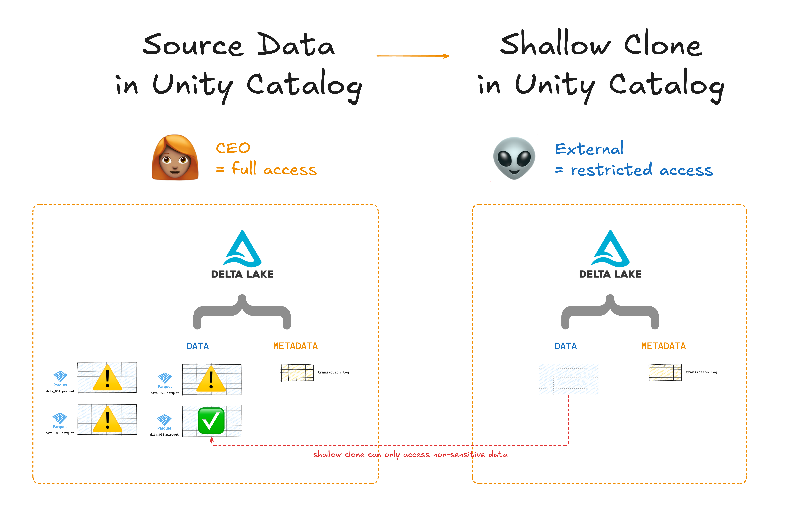

This blog shows you how to clone Delta Lake tables.

Cloning your Delta Lake tables is a great feature that you can use to migrate data, reproduce machine learning flows and create data copies for sharing or experiments. Any changes made to Delta Lake clones affect only the clones themselves and not the source table.

There are different ways to clone your Delta Lake tables. For example, you can clone your Delta Lake tables with or without Unity Catalog. You should understand the differences and their applications so you know when to use which type of Delta Lake clone.

This article will walk you through the different ways to clone your Delta Lake tables in detail.

Let's jump in 🪂

## Delta Lake Clone: Introduction

Let's start with a quick refresher. Delta Lake tables are made of two main components: your data stored in Parquet files and metadata (incl. commits etc.) stored in the transaction log.



**Delta clones** (also called "shallow clones") only copy over the table metadata; they do not copy the source data. You can edit the clone without affecting the source data but not the other way around. Changing to the source data will affect the shallow clone data.



**Shallow clones are fast and computationally cheap** because don't need to copy all of the underlying data. But it's important to remember that they still reference the same source data. If you shallow clone a Delta Lake table and somebody runs a VACUUM operation on the source data, your shallow clone will be affected.

## Delta Lake Clone: Shallow

You can create a shallow clone of any Delta Lake table using the following SQL syntax:

```
    CREATE TABLE delta. `/data/target/` SHALLOW CLONE delta. `/data/source/`
```

This will create a shallow clone of the table at `/data/source` and store it at `/data/target`. You need to use absolute paths.

You can clone a specific version of your Delta Lake source table by adding `VERSION AS OF` to use a version number and TIMESTAMP AS OF to use a timestamp expression, like so:

```
    CREATE TABLE db.target_table SHALLOW CLONE delta.`/data/source` VERSION AS OF version

    CREATE TABLE db.target_table SHALLOW CLONE delta.`/data/source` TIMESTAMP AS OF timestamp_expression
```

Your timestamp can be formatted in YYYY-MM-DD format or using a timestamp expression such as `date_sub(current_date(), 1)`.

You can also replace an existing target table with a shallow clone of a source table using:

```
    CREATE OR REPLACE TABLE db.target_table SHALLOW CLONE db.source_table
```

Note that the target table needs to be emptied first to avoid data duplication.

You can also only clone the table if it doesn't already exist at the target location using:

```
    CREATE TABLE IF NOT EXISTS delta.`/data/target/` SHALLOW CLONE db.source_table
```

If you're using Delta Lake from PySpark you can pass the SQL syntax directly to a `spark.sql(...)` call. For example:

```
    spark.sql('CREATE TABLE delta.`/data/target/` SHALLOW CLONE delta.`/data/source/` ')
```

You can read more about shallow clones in [the Delta docs](https://docs.delta.io/latest/delta-utility.html#shallow-clone-a-delta-table).

## Delta Lake Clone and Time Travel

A cloned Delta Lake table has its own independent history and versioning. This means that time travel queries on a cloned table will not work with the same inputs as they work on its source table.

Suppose you have a source table that is at version 10 and you clone this table. The new (cloned) table will start at version 0. You can not run time travel queries on this new table the way you would do on the source table.

The cloned table gets its own, new history and you can not access history before the moment you performed the clone.



Read more about [Delta Lake time travel](https://delta.io/blog/2023-02-01-delta-lake-time-travel/) in the dedicated blog.

## Delta Lake Clone and Vacuum

Shallow clones reference data files in the source directory.

Suppose you shallow clone a Delta Lake table. The next day, your colleague runs a scheduled VACUUM operation on the source table to clean up old files. Your cloned table can now no longer access the referenced data files and a `FileNotFoundException` is thrown.

You can repair this by running clone with replace over the shallow clone.

Read more about [Delta Lake vacuum](https://delta.io/blog/remove-files-delta-lake-vacuum-command/) in the dedicated blog.

## Delta Lake Clone with Unity Catalog

[Unity Catalog](https://www.unitycatalog.io/) is an open-source catalog for all of your data and AI assets. By registering your assets into Unity Catalog, you gain a clear overview of all your data and can easily control access and security permissions.

Unity Catalog stores tables in [Delta Lake format](https://docs.unitycatalog.io/usage/tables/deltalake). You can use shallow clone to create new Unity Catalog tables from existing Unity Catalog tables.

The syntax for this is the same as we saw above. Use the Unity Catalog reference to your source and target tables instead of paths. For example:

```
    CREATE TABLE <catalog-name>.<schema-name>.<target-table-name> SHALLOW CLONE <catalog-name>.<schema-name>.<source-table-name>
```

You can use shallow clone with Unity Catalog to create tables with access control privileges that are different and independent from their parent tables without having to copy the underlying data files. This can save you a lot of time and compute.

For example, you can use shallow clone with Unity Catalog to restrict access to sensitive tables when sharing data with external parties.



Using Delta Lake with Unity Catalog gives you more control over your data and AI assets.

## Clone Parquet and Iceberg Tables

Delta Lake supports cloning tables in other formats. You can use shallow clone functionality to clone a table stored in Parquet or Iceberg format.

This functionality will convert the data sources into a Delta table and shallow clone it.

Use the following syntax to shallow clone a Parquet table into a Delta Lake table:

```
    CREATE OR REPLACE TABLE <target_table_name> SHALLOW CLONE parquet.`/path/to/data`;
```

And this syntax to clone an Iceberg table into a Delta Lake table:

```
    CREATE OR REPLACE TABLE <target_table_name> SHALLOW CLONE iceberg.`/path/to/data`;
```

It's important to know that this type of convert-by-cloning is unidirectional: changes applied to the target table after the clone occurs cannot be synced back to the source table.

## When to Use Delta Lake Clone

Delta Lake clone is a great feature that can help you copy and store specific versions of your data. You can use it for complex operations like data migration, data archiving, machine learning flow reproduction, short-term experiments, and data sharing.

Let's look at 4 specific use cases:

1. Machine learning model reproduction
2. Experimentation on production datasets
3. Overriding table properties
4. Disaster recovery

### Delta Lake Clone for Machine Learning Reproduction

Suppose you are working on a complex machine learning project. You are training your ML model using a specific version of the dataset and have achieved maximum performance of the model.

You can use Delta Lake clone functionality to archive this version of the table so that future models can be tested on this standardized dataset. This will allow for accurate comparison of performance metrics.

### Delta Lake Clone for Production Data Experimentation

You can also use Delta Lake clone to test production workflows without danger of corrupting your production-grade table. You can use shallow clone to quickly create an independent copy of the data which can be freely experimented with, without affecting any of the production workloads.

Using SQL syntax, that could look something like this:

```
    # Perform shallow clone
    CREATE OR REPLACE TABLE my_test SHALLOW CLONE my_prod_table;

    # Run some transformations
    UPDATE my_test WHERE user_id is null SET invalid=true;

    # When you're happy, merge any changes you want to keep
    MERGE INTO my_prod_table
    USING my_test
    ON my_test.user_id <=> my_prod_table.user_id
    WHEN MATCHED AND my_test.user_id is null THEN UPDATE *;

    # then drop the cloned table
    DROP TABLE my_test;
```

### Delta Lake Clone to Override Table Properties

You can also use Delta Lake clone to override certain table properties.

This can be helpful when you want to share tables with external users and add annotations with relevant information. You can also change properties like the log retention and file retention, which can be useful when creating copies of the data for long-term archival:

```
    CREATE OR REPLACE TABLE archive_table CLONE prod.my_table
    TBLPROPERTIES (
    delta.logRetentionDuration = '3650 days',
    delta.deletedFileRetentionDuration = '3650 days'
    )
```

### Delta Lake Clone for Disaster Recovery

You can also choose to sync Delta clones incrementally to maintain an updated state of a source table for disaster recovery. Incremental cloning means that changes to the source table are automatically forwarded to the target clone table.

## Delta Lake Clone

Delta Lake clone gives you data copying functionality with varying degrees of control and flexibility. You can use Delta Lake clones to perform data migration and archiving, to reproduce production workflows and to safely share data with external parties.

Use shallow clones for quick and cheap data copies that still reference the original source data.

Take a look at [Delta Lake vs Data Lake](https://delta.io/blog/delta-lake-vs-data-lake/) if you want to learn more about Delta Lake basics. When you’re ready to dive deeper, you might enjoy reading about all the ways you can use [Delta Lake for ETL](https://delta.io/blog/delta-lake-etl/).
