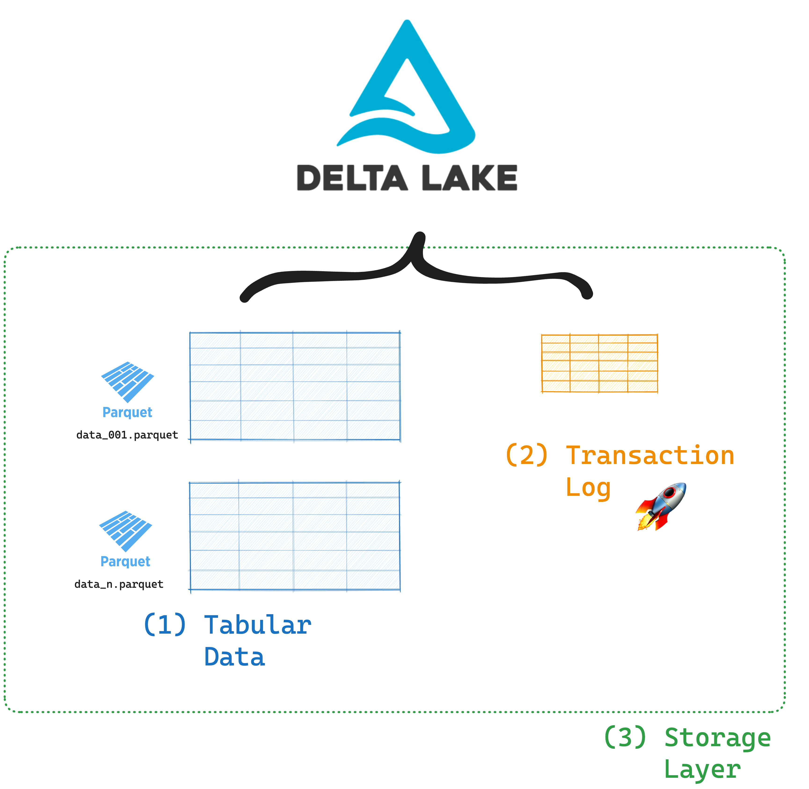

This article explains how to use column mapping with Delta Lake.

Column mapping is a powerful Delta Lake feature that lets you manipulate columns in your Delta table without having to rewrite the underlying data. When you enable column mapping, you can rename and drop columns quickly and freely without the usual restrictions of Parquet. Changes to columns become pure metadata operations that are flexible and quick to execute. This makes your schema evolution operations much more efficient.

Let's take a look at how you can enable column mapping on your Delta tables and why it's such a cool feature.

## How to enable Delta Lake column mapping

You can enable column mapping on an existing Delta table by setting the `delta.columnMapping.mode` table property.

You can set the table property in SQL with:

```SQL
ALTER TABLE my_delta SET TBLPROPERTIES (
    'delta.columnMapping.mode' = 'name'
  )
```

After enabling this setting, you are now free to rename and drop columns in your Delta table without affecting the underlying Parquet files.

## How to rename a Delta column

Use the `RENAME COLUMN` SQL command to rename your Delta table columns:

```SQL
ALTER TABLE <table_name> RENAME COLUMN old_col_name TO new_col_name
```

When column mapping is enabled for your Delta table, you can include spaces as well as any of these characters in the table's column names: `,;{}()\n\t=`. This frees you from the naming limitations of Parquet files which doesn't permit these characters in column names.

## How to drop a Delta column

Use the `DROP COLUMN` SQL command to drop a column from your Delta table:

```SQL
ALTER TABLE table_name DROP COLUMN col_name
```

You can also drop multiple columns at the same time:

```SQL
ALTER TABLE table_name DROP COLUMNS (col_name_1, col_name_2, ...)
```

With Delta Lake, dropping a column does not affect the underlying data. It is a _logical delete_ and not a _physical delete_. Delta Lake marks the dropped column in the transaction log so that future queries won't load it. This means that the drop operation is quick to execute because it does not involve any data writes or deletes. Read more about dropping columns in the [Delta Lake Drop Column post](https://delta.io/blog/2022-08-29-delta-lake-drop-column/).

If you want to physically remove the dropped column from storage you should run a `VACUUM` command. Read more about that command in the [Delta Lake Vacuum post](https://delta.io/blog/efficient-delta-vacuum/).

## How does Delta Lake column mapping work?

Column mapping works by using the powerful features of the Delta Lake transaction log. The transaction log is a separate file within your Delta table where all the table's metadata is stored. This log tracks all the changes that are made to your data.

By storing the metadata in a separate file from your actual data, Delta Lake can make some really great optimizations to improve the speed and reliability of your data operations. The transaction log supports advanced data skipping, data versioning and schema evolution. You can read more about these features in the [Delta Lake vs Data Lake article](https://delta.io/blog/delta-lake-vs-data-lake/).



When column mapping is enabled, each column gets a unique and immutable ID which is stored in the transaction log. All Delta Lake operations from both readers and writers will reference the columns using these IDs.

This means that the names and order of the columns in your table don't really matter anymore. Changing a column name just updates the marker that points to the unique column ID in the transaction log. Dropping a column just removes the marker. The transaction log maps the original column ID to its new name (or marks it as deleted). This makes sure your data stays consistent and prevents schema drift, which can cause incorrect data interpretation.

Delta Lake ensures backward compatibility with all previous versions of your table by referencing the historical mappings stored in the transaction log.

### Example

Let's take a look at how this works with a code example in PySpark.

First create some sample data to work with and write it to a Delta table:

```python
d = [("Amber", 27, "data engineer"), ("Jasper", 44, "CTO"), ("Beatrice", 31, "data scientist"), ("Victoria", 52, "CEO")]
columns = ["name", "age", "role"]
data = spark.createDataFrame(d, schema=columns)
```

Let's take a look at our DataFrame:

```python
> data.show()

+--------+---+--------------+
|    name|age|          role|
+--------+---+--------------+
|   Amber| 27| data engineer|
|  Jasper| 44|           CTO|
|Beatrice| 31|data scientist|
|Victoria| 52|           CEO|
+--------+---+--------------+
```

Next, store this data as a Delta Lake table:

```python
data.write.format("delta").saveAsTable("my_delta_table")
```

Before we enable column mapping and change anything about our columns, let's take a look at the transaction log:

```shell
> !cat spark-warehouse/my_delta_table/_delta_log/00000000000000000000.json

👉 {"protocol":{"minReaderVersion":1,"minWriterVersion":2}}

👉{"add":{"path":"part-00000-c8896ddf-8d5d-456c-897a-1409c9dd111f-c000.snappy.parquet","partitionValues":{},"size":1018,"modificationTime":1739543335051,"dataChange":true,"stats":"{\"numRecords\":1,\"minValues\":{\"name\":\"Amber\",\"age\":27,\"role\":\"data engineer\"},\"maxValues\":{\"name\":\"Amber\",\"age\":27,\"role\":\"data engineer\"},\"nullCount\":{\"name\":0,\"age\":0,\"role\":0}}"}}
👉{"add":{"path":"part-00001-67200b6c-c9f9-467b-985a-955b9b3a5e67-c000.snappy.parquet","partitionValues":{},"size":955,"modificationTime":1739543335075,"dataChange":true,"stats":"{\"numRecords\":1,\"minValues\":{\"name\":\"Jasper\",\"age\":44,\"role\":\"CTO\"},\"maxValues\":{\"name\":\"Jasper\",\"age\":44,\"role\":\"CTO\"},\"nullCount\":{\"name\":0,\"age\":0,\"role\":0}}"}}
👉{"add":{"path":"part-00002-8b5ff01e-1432-4478-abc7-8c94398e574a-c000.snappy.parquet","partitionValues":{},"size":1046,"modificationTime":1739543335077,"dataChange":true,"stats":"{\"numRecords\":1,\"minValues\":{\"name\":\"Beatrice\",\"age\":31,\"role\":\"data scientist\"},\"maxValues\":{\"name\":\"Beatrice\",\"age\":31,\"role\":\"data scientist\"},\"nullCount\":{\"name\":0,\"age\":0,\"role\":0}}"}}
👉{"add":{"path":"part-00003-eba06bb6-c874-4314-98ce-6741fd872a62-c000.snappy.parquet","partitionValues":{},"size":969,"modificationTime":1739543335076,"dataChange":true,"stats":"{\"numRecords\":1,\"minValues\":{\"name\":\"Victoria\",\"age\":52,\"role\":\"CEO\"},\"maxValues\":{\"name\":\"Victoria\",\"age\":52,\"role\":\"CEO\"},\"nullCount\":{\"name\":0,\"age\":0,\"role\":0}}"}}
```

This outputs a lot of information. You don't need to understand all of it. What's important to note are the `protocol` versions and the 4 `add` operations which added the 4 rows of data.

Now let's enable column mapping on the Delta table:

```python
spark.sql(f"""
    ALTER TABLE my_delta_table
    SET TBLPROPERTIES (
    'delta.minReaderVersion' = '2', #set correct protocol versions
    'delta.minWriterVersion' = '5',
    'delta.columnMapping.mode' = 'name'
    )
""")
```

Great work, column mapping is now enabled for your table. Before we proceed with changing our columns, let's check the log again to see what has changed:

```shell
> !cat spark-warehouse/my_delta_table/_delta_log/00000000000000000001.json

👉{"metaData":{"id":"73d6b47a-9e5e-4223-a5d5-f229659976f4","format":{"provider":"parquet","options":{}},"schemaString":"{\"type\":\"struct\",\"fields\":[{\"name\":\"name\",\"type\":\"string\",\"nullable\":true,\"metadata\":{\"delta.columnMapping.id\":1,\"delta.columnMapping.physicalName\":\"name\"}},{\"name\":\"age\",\"type\":\"long\",\"nullable\":true,\"metadata\":{\"delta.columnMapping.id\":2,\"delta.columnMapping.physicalName\":\"age\"}},{\"name\":\"role\",\"type\":\"string\",\"nullable\":true,\"metadata\":{\"delta.columnMapping.id\":3,\"delta.columnMapping.physicalName\":\"role\"}}]}","partitionColumns":[],"configuration":{"delta.columnMapping.mode":"name","delta.columnMapping.maxColumnId":"3"},"createdTime":1739543334798}}

👉{"protocol":{"minReaderVersion":2,"minWriterVersion":5}}
```

What's important to note here is the changes in the `metaData` field. Each column gets assigned a `columnMapping.physicalName` which is the name of the column on disk and a `columnMapping.id` which is its unique, immutable identifier.

You're now all set to change your columns. Let's change the name of the `name` column to `first_name`:

```python
spark.sql("""
    ALTER TABLE my_delta_table
    RENAME COLUMN name TO first_name
""")
```

Let's take a look at our data in a DataFrame now to see if this has worked:

```python
> delta_table = DeltaTable.forName(spark, "my_delta_table")
> delta_table.toDF().show()

+----------+---+--------------+
|first_name|age|          role|
+----------+---+--------------+
|  Beatrice| 31|data scientist|
|     Amber| 27| data engineer|
|  Victoria| 52|           CEO|
|    Jasper| 44|           CTO|
+----------+---+--------------+
```

Excellent!

Finally, let's inspect the log one last time to see what has changed:

```shell
> !cat spark-warehouse/my_delta_table/_delta_log/00000000000000000002.json

{"metaData":{"id":"73d6b47a-9e5e-4223-a5d5-f229659976f4","format":{"provider":"parquet","options":{}},"schemaString":"{\"type\":\"struct\",\"fields\":[{\"name\":\"first_name\",\"type\":\"string\",\"nullable\":true,\"metadata\":{\"delta.columnMapping.id\":1,\"delta.columnMapping.physicalName\":\"name\"}},{\"name\":\"age\",\"type\":\"long\",\"nullable\":true,\"metadata\":{\"delta.columnMapping.id\":2,\"delta.columnMapping.physicalName\":\"age\"}},{\"name\":\"role\",\"type\":\"string\",\"nullable\":true,\"metadata\":{\"delta.columnMapping.id\":3,\"delta.columnMapping.physicalName\":\"role\"}}]}","partitionColumns":[],"configuration":{"delta.columnMapping.mode":"name","delta.columnMapping.maxColumnId":"3"},"createdTime":1739543334798}}
```

Here we see clearly that the string marker to the column with `id = 1` is changed to `first_name`. This is a simple and quick change to the transaction log and does not affect the underlying data files at all. This is much quicker than having to rewrite the entire file.

## Why should I use Delta Lake column mapping?

Using Delta Lake column mapping has some great advantages compared to immutable file formats like Parquet:

- Your queries will run faster, because there is no need to rewrite the data.
- You have full support for schema evolution operations like renaming and dropping columns.
- You don't have to worry about restrictions on character usage in column names that are common in Parquet. This can be useful when ingesting CSV/JSON files that use characters not allowed by Parquet.

For almost all use cases, an [open table format](https://delta.io/blog/open-table-formats/) like Delta Lake is going to give you better performance and reliability than an immutable file format like Parquet. This is because open table formats support ACID transactions, schema evolution and concurrent writes. You can read an in-depth comparison of Delta Lake and Parquet in the [Delta Lake vs Parquet post](https://delta.io/blog/delta-lake-vs-parquet-comparison/).

For more details on how Delta Lake supports production-grade schema evolution operations that make your life easier, check out the [Delta Lake Schema Evolution post](https://delta.io/blog/2023-02-08-delta-lake-schema-evolution/).

## Important things to consider when using Delta Lake column mapping

Here are some important things to keep in mind when using the Delta Lake column mapping feature:

- You need to run Delta Lake 1.2.0 and above
- You cannot turn off or disable column mapping after you enable it. If you try to set 'delta.columnMapping.mode' = 'none', you'll get an error.
- Column mapping requires the following Delta protocols:
  - Reader version 2 or above.
  - Writer version 5 or above.
- Enabling column mapping on tables might break downstream operations that rely on Delta change data feed. See [Change data feed limitations for tables with column mapping enabled](https://docs.delta.io/latest/delta-change-data-feed.html#-column-mapping-limitations).
- Delta Lake 2.1 and below do not support column mapping by id mode, only by name.

## Flexibility and Performance with Delta Lake Column Mapping

The Delta Lake column mapping features makes it simple and fast to rename and drop columns and doesn't require rewriting your data. It gives you more flexibility while keeping everything consistent in the background with ACID transactions. If you work with changing schemas, this feature can save you a lot of time and compute costs.
