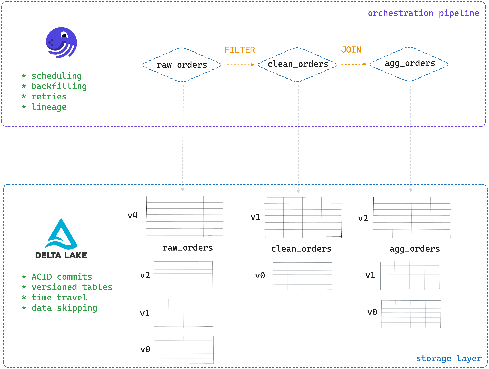

This article will explain how and when to use Delta Lake and Dagster to achieve high-performance modern orchestration pipelines.

Delta Lake is an efficient and user-friendly open table format for your structured data. It stores data in Parquet and adds a transaction log for ACID writes, time travel, schema enforcement, and fast reads with data skipping. Dagster is an orchestration framework built around assets. It gives you schedules, retries, backfills, lineage, and a clean way to express dependencies with simple Python.

Using them together gives you reliable writes, repeatable runs, and easy debugging. Your jobs stay simple while your ETL pipelines stay safe and performant.

## Why should I use Delta Lake for Dagster pipelines?

Orchestration pipelines are all about reliability. You need each step in your pipeline to complete cleanly, even when a job dies mid-run. You also want quick reads, painless updates, and easy debugging. Using Delta Lake and Dagster together gives you all of these features out of the box.

Here are some specific reasons to use Delta Lake and Dagster together:

- **You get reliable tables.** Delta Lake gives you ACID transactions, snapshot reads, and version history. Your data updates are atomic and do not leave behind partial writes. Multiple readers see consistent data. And you can always roll back your dataset and audit or debug with confidence. This is much more reliable than using other formats like CSV or Parquet.
- **You get a Python-native stack.** With [delta-rs](#link-when-live), you read and write Delta tables without Spark or the JVM. It uses Apache Arrow under the hood, so it plays nicely with pandas, Polars, DuckDB, and the rest of your Python toolbox. That keeps your pipelines light, portable, and fast to iterate.
- **You get efficiency and simplicity.** Dagster models your tables as assets, so it can pick the minimal set of downstream assets to materialize and execute them in the right order. This gives you faster pipelines, lower spend, and predictable results, along with lineage and automatic retries built-in.
- **You get end-to-end hygiene.** Delta Lake gives you schema enforcement, safe upserts, and time travel. Dagster gives you orchestration, coordination, and observability. Together, you can ship stable BI tables built on flexible OSS tooling without awkward glue code or platform lock-in.
- **It's all open-source.** Delta Lake and Dagster are OSS, run great locally, and scale to object storage without lock-in. You keep control of your stack and your costs.

## How do Delta Lake and Dagster work together?

Let's take a quick look at how Delta Lake and Dagster work together to provide performance and reliability for your orchestration pipelines.



At the storage layer, datasets live as **Delta tables**, either on local disk or in cloud platforms like [S3](https://delta.io/blog/delta-lake-s3/), [GCP](https://delta.io/blog/delta-lake-gcp/), or [Azure](https://delta.io/blog/delta-lake-azure-data-lake-storage/). Delta Lake adds the [open table format mechanics](https://delta.io/blog/open-table-formats/) on top of Parquet to give you ACID commits, a [transaction log](#link-when-live), version history, and [advanced data skipping](#link-when-live). This guarantees that each data operation completes atomically and that each read sees a consistent snapshot, even across multiple concurrent engines.

Dagster then sits on top of this as the orchestration layer. Pipelines are expressed as assets with explicit dependencies (for example: `raw_orders` → `clean_orders` → `aggregated_orders`). Dagster's asset graph drives scheduling, backfills, and retries. When an upstream asset changes, it computes the minimal set of downstream assets to materialize and runs them in a safe order. Lineage and run metadata are captured automatically in the UI.

Dagster calls asset code that reads and writes Delta tables using Arrow-compatible DataFrames (pandas/Polars/DuckDB). This asset code is defined by writing simple Python functions and decorating them with the `@asset` decorator.

Here's an example from the Dagster documentation that shows how you can create Dagster Assets and create dependency chains:

```
    @dagster.asset
    def hello(context: dg.AssetExecutionContext):
       context.log.info("Hello!")

    @dagster.asset(deps=[hello])
    def world(context: dg.AssetExecutionContext):
       context.log.info("World!")
```

A small bit of configuration (a Dagster IO manager) holds the Delta base URI and credentials so assets can resolve table locations and access them consistently. Each asset run reads an immutable snapshot of its inputs and produces exactly one commit to its output table. On failure, the commit never appears, and retries remain safe.

Delta Lake provides reliable storage semantics and Dagster provides dependency-aware orchestration, observability, and deployment hygiene. The same code runs locally or against an OSS-friendly cloud.

## Delta Lake and Dagster: Performance

Delta Lake gives you some great features to improve your pipeline performance.

Delta Lake speeds up your queries by skipping files you don't need. It stores min/max stats and paths for your entire table in the transaction log, so engines can prune whole files before scanning. Regular Parquet lacks that central index, which means you often list folders and touch far more data than necessary. This will slow down your work significantly, especially if your data is stored in the cloud where file listing is slow.

<p id="gdcalert2" ><span style="color: red; font-weight: bold">>>>>>  gd2md-html alert: inline image link here (to images/image2.png). Store image on your image server and adjust path/filename/extension if necessary. </span><br>(<a href="#">Back to top</a>)(<a href="#gdcalert3">Next alert</a>)<br><span style="color: red; font-weight: bold">>>>>> </span></p>


Delta Lake also helps you avoid heavy rewrites. With Delta you can **append, update, and upsert** instead of replacing entire datasets. Dagster's asset graph then materializes only what's downstream of the change, which guarantees minimal extra work. Together, you get faster reads, smaller scans, safer writes, and quicker recovery when something goes wrong.

## Delta Lake and Dagster: Reliability

Performance is also about failing early and failing cleanly. Delta Lake and Dagster both have powerful features to guarantee pipeline reliability and avoid costly mistakes.

Delta Lake's ACID commits mean that no partial writes ever land on disk. If a step fails, the table stays unchanged and downstream reads keep working. [Schema enforcement](https://delta.io/blog/2022-11-16-delta-lake-schema-enforcement/) and [schema evolution](https://delta.io/blog/2023-02-08-delta-lake-schema-evolution/) give you the tools to secure your table's consistency and update it as your data evolves.

Dagster adds deterministic orchestration, giving you explicit dependencies, dependable retries, and clear run states. Assets materialize in the correct order, failed steps don't contaminate downstream tables, and you can re-run only the pieces that broke. All of this means you don't waste time chasing silent corruption or re-running whole pipelines when a simple update is enough.

Finally, Delta Lake and Dagster work together to make reliability visible. Delta keeps table history in the transaction log and Dagster records asset lineage and metadata (such as row counts, versions, timestamps). When something looks off, you can trace what changed and recover fast.

## Delta Lake and Dagster example

Let's build an end-to-end code example together to show how Delta Lake and Dagster work together to power efficient and reliable orchestration pipelines.

In this example, will build [an ETL pipeline](https://delta.io/blog/delta-lake-etl/). you will define three assets:

- `raw_orders`: small raw dataset (with one duplicate and one missing value)
- `clean_orders`: filters bad rows and deduplicates
- `agg_orders`: joins to a lookup table and aggregates totals per day & category \

We will build a simple Dagster pipeline to orchestrate the assets. We will use the Delta Lake IO Manager built by Dagster to automatically read/write Delta tables for each asset. This IO Manager handles storage paths and read/writes for you in an easy and reliable way. This means that you can just return DataFrames in your code and the IO Manager persists them as Delta Lake tables on disk.

Follow along with the code below to build this example step-by-step. We will use `pandas` as the query engine for this example.

### Set up the Dagster CLI (one time)

The easiest way to run and manage Dagster pipelines on your local machine is by using the Dagster CLI tool. Follow the [instructions in the official Dagster documentation](https://docs.dagster.io/getting-started/quickstart) to install this tool.

Make sure to:

- Install the CLI command tool
- Create a virtual environment and activate it
- Install your project as an editable package

After completing the Quickstart steps in the Dagster documentation, create a new project using the following command. Make sure to run it in the directory where you want to create your project folder:

```
    create-dagster project dagsterdelta_demo
```

Your new Dagster project should have the following structure:

```
    .
    └── dagsterdelta_demo
       ├── pyproject.toml
       ├── src
       │   └── dagster_quickstart
       │       ├── __init__.py
       │       ├── definitions.py
       │       └── defs
       │           └── __init__.py
       └── tests
          └── __init__.py
```

Install the following extra packages into your virtual environment:

```
pip install dagster dagster-webserver dagster-dg-cli
```

Navigate into your project directory and run this next command to generate the required <code>[assets.py](assets.py)</code> file:

```
dg scaffold defs dagster.asset assets.py
```

This will add a new <code>[assets.py](assets.py)</code> file to the `defs` directory:

```
    src
    └── dagsterdelta_demo
       ├── __init__.py
       └── defs
          ├── __init__.py
          └── assets.py
```

### Build ETL Pipeline with Dagster and Delta Lake

Now let's start building our ETL pipeline!

We will walk through our pipeline step by step and the compile it into one single Python script that will go into the <code>[assets.py](assets.py)</code> script that we've just created.

We will need the `dagster-deltalake` and `dagster-deltalake-pandas` libraries to build our pipeline. Install them into your virtual environment using:

```
    pip install dagster-deltalake dagster-deltalake-pandas
```

#### **Configure the Delta Lake IO Manager**

Start by configuring a single IO Manager that writes all data output to Delta tables stored under `tmp/dagster_delta_pandas_demo`. Downstream assets automatically read from those tables. This means you don't need to worry about storage paths, access credentials or manual read/writes.

Here's how to configure the Delta Lake IO Manager when using `pandas`:

```
    from __future__ import annotations
    import os

    from dagster import Definitions
    from dagster_deltalake import LocalConfig
    from dagster_deltalake_pandas import DeltaLakePandasIOManager

    from dagsterdelta_demo.assets import raw_orders, clean_orders, agg_orders

    ROOT_URI = os.environ.get(
        "DELTA_ROOT_URI",
        f"tmp/dagster_delta_pandas_demo",
    )

    io_manager = DeltaLakePandasIOManager(
        root_uri=ROOT_URI,
        storage_options=LocalConfig(),  # local FS; swap for S3/etc. later
        schema="orders_demo",           # optional; default is "public"
    )

    definitions = Definitions(
        assets=[raw_orders, clean_orders, agg_orders],
        resources={"io_manager": io_manager},  # note: assets use io_manager_key="io_manager"
    )
```

Store this code snippet in the <code>[assets.py](definitions.py)</code> file inside your Dagster project.

With this configuration, when you materialize an asset (e.g. an asset called called `raw_orders`), then the Delta Lake I/O manager will automatically store output data within the specified `schema` folder under the provided root directory, e.g. `path/to/deltalake/order_etl/raw_orders`.

#### Define your assets

Next, let's define our assets. These are the three tables that form our simple ETL pipeline:

1. `raw_orders`: returns a pandas DataFrame with a duplicate order and a missing value.
2. `clean_orders`: drops rows with required-field NULLs, keeps the earliest record for duplicated order_id.
3. `agg_orders`: joins a small in-memory lookup (product_id → category), derives order_date, then aggregates totals by day and category.

Here's how we will generate our `raw_orders` table. We are hard-coding the data here for simplicity. In real-world scenarios you would probably ingest this data from an external source.

```
    df = pd.DataFrame(
        {
            "order_id":    ["A1", "A2", "A2", "A3"],   # duplicate A2
            "customer_id": ["c1", "c2", "c2", None],   # missing value
            "product_id":  ["p1", "p2", "p2", "p3"],
            "qty":         [1, 2, 2, 1],
            "price":       [10.0, 5.0, 7.5, 7.5],
            "order_ts":    [
                "2025-08-01T10:01:00",
                "2025-08-01T10:05:00",
                "2025-08-01T10:05:30",
                "2025-08-01T10:10:00",
            ],
        }
    )
    df["amount"] = df["qty"] * df["price"]
```

The `raw_orders` table contains two intentionally faulty rows: one duplicate and one with a missing value (`None`).

```
 order_id customer_id product_id  qty  price             order_ts  amount
0       A1          c1         p1    1   10.0  2025-08-01T10:01:00    10.0
1       A2          c2         p2    2    5.0  2025-08-01T10:05:00    10.0
2       A2          c2         p2    2    7.5  2025-08-01T10:05:30    15.0
3       A3        None         p3    1    7.5  2025-08-01T10:10:00     7.5
```

The next step will be to clean this raw data in order to get our `clean_orders` table:

```
    df_clean = df.dropna(subset=["order_id", "customer_id", "product_id"]).copy()
    df_clean["order_ts_dt"] = pd.to_datetime(df_clean["order_ts"])
    df_clean = df_clean.sort_values(["order_id", "order_ts_dt"]).drop_duplicates(
        subset=["order_id"], keep="first"
    )
    df_clean = df_clean.drop(columns=["order_ts_dt"]).reset_index(drop=True)
```

Our cleaned table has no missing value and no duplicate records:

```
     order_id customer_id product_id  qty  price             order_ts  amount
    0       A1          c1         p1    1   10.0  2025-08-01T10:01:00    10.0
    1       A2          c2         p2    2    5.0  2025-08-01T10:05:00    10.0
```

Finally, let's join our cleaned orders to a lookup table that contains information about the product category:

```
    product_lookup = pd.DataFrame(
        {"product_id": ["p1", "p2", "p3"], "category": ["widgets", "gadgets", "gadgets"]}
    )
    df = clean_orders.merge(product_lookup, on="product_id", how="left").copy()
    df["order_date"] = pd.to_datetime(df["order_ts"]).dt.date
    out = (
        df.groupby(["order_date", "category"], as_index=False)
          .agg(orders=("order_id", "count"), total_amount=("amount", "sum"))
          .sort_values(["order_date", "category"])
          .reset_index(drop=True)
    )
```

This gives us an aggregated table of sales per product category:

```
      order_date category  orders  total_amount
    0  2025-08-01  gadgets       1          10.0
    1  2025-08-01  widgets       1          10.0
```

#### Build Dagster Pipeline

Now that we have our ETL code, it's time to turn this into Dagster assets.

Dagster assets are simply Python functions decorated with the `@assets` decorator. So we will take each step in our pipeline and turn it into a Python function.

We first generate our `raw_orders` asset:

```
    @asset(io_manager_key="io_manager")
    def raw_orders() -> pd.DataFrame:
       df = pd.DataFrame(
           {
               "order_id": ["A1", "A2", "A2", "A3"],  # duplicate A2
               "customer_id": ["c1", "c2", "c2", None],  # missing value
               "product_id": ["p1", "p2", "p2", "p3"],
               "qty": [1, 2, 2, 1],
               "price": [10.0, 5.0, 7.5, 7.5],
               "order_ts": [
                   "2025-08-01T10:01:00",
                   "2025-08-01T10:05:00",
                   "2025-08-01T10:05:30",
                   "2025-08-01T10:10:00",
               ],
           }
       )
       df["amount"] = df["qty"] * df["price"]
       return df
```

Notice how we:

1. Create a simple Python function
2. Decorate it with the `@asset` decorator
3. Add the `io_manager` configuration
4. Output a simple DataFrame

The Delta Lake IO Manager will take care of writing this DataFrame to a Delta Lake table at the `ROOT_URI` defined in our Definitions object. You don't have to worry about any of that.

Next let's filter this raw data to create our `clean_orders` asset:

```
    @asset(io_manager_key="io_manager")
    def clean_orders(raw_orders: pd.DataFrame) -> pd.DataFrame:
       df = raw_orders.dropna(subset=["order_id", "customer_id", "product_id"]).copy()
       df["order_ts_dt"] = pd.to_datetime(df["order_ts"])
       df = df.sort_values(["order_id", "order_ts_dt"]).drop_duplicates(
           subset=["order_id"], keep="first"
       )
       df = df.drop(columns=["order_ts_dt"]).reset_index(drop=True)
       return df
```

Notice how we:

1. Simply reference the `raw_orders` table by its asset name
2. Output a simple DataFrame.

Again, we don't need to worry about loading the underlying Delta table. This is handled by the IO Manager.

Finally, we join our cleaned rows to the lookup table to create our `agg_orders` asset:

```
    @asset(io_manager_key="io_manager")
    def agg_orders(clean_orders: pd.DataFrame) -> pd.DataFrame:
       product_lookup = pd.DataFrame(
           {
               "product_id": ["p1", "p2", "p3"],
               "category": ["widgets", "gadgets", "gadgets"],
           }
       )
       df = clean_orders.merge(product_lookup, on="product_id", how="left").copy()
       df["order_date"] = pd.to_datetime(df["order_ts"]).dt.date
       out = (
           df.groupby(["order_date", "category"], as_index=False)
           .agg(orders=("order_id", "count"), total_amount=("amount", "sum"))
           .sort_values(["order_date", "category"])
           .reset_index(drop=True)
       )
       return out
```

Great work. Now let's stitch it all together.

Here is the complete script that you can paste into your project's <code>[assets.py](assets.py)</code> file:

```
    from __future__ import annotations
    from __future__ import annotations
    import os

    import pandas as pd

    from dagster import Definitions, asset
    from dagster_deltalake import LocalConfig
    from dagster_deltalake_pandas import DeltaLakePandasIOManager

    ROOT_URI = os.environ.get(
        "DELTA_ROOT_URI",
        f"tmp/dagster_delta_pandas_demo",
    )

    io_manager = DeltaLakePandasIOManager(
        root_uri=ROOT_URI,
        storage_options=LocalConfig(),  # local FS; swap for S3/etc. later
        schema="orders_demo",           # optional; default is "public"
    )

    definitions = Definitions(
        assets=[raw_orders, clean_orders, agg_orders],
        resources={"io_manager": io_manager},  # note: assets use io_manager_key="io_manager"
    )

    @asset(io_manager_key="io_manager")
    def raw_orders() -> pd.DataFrame:
       df = pd.DataFrame(
           {
               "order_id": ["A1", "A2", "A2", "A3"],  # duplicate A2
               "customer_id": ["c1", "c2", "c2", None],  # missing value
               "product_id": ["p1", "p2", "p2", "p3"],
               "qty": [1, 2, 2, 1],
               "price": [10.0, 5.0, 7.5, 7.5],
               "order_ts": [
                   "2025-08-01T10:01:00",
                   "2025-08-01T10:05:00",
                   "2025-08-01T10:05:30",
                   "2025-08-01T10:10:00",
               ],
           }
       )
       df["amount"] = df["qty"] * df["price"]
       return df

    @asset(io_manager_key="io_manager")
    def clean_orders(raw_orders: pd.DataFrame) -> pd.DataFrame:
       df = raw_orders.dropna(subset=["order_id", "customer_id", "product_id"]).copy()
       df["order_ts_dt"] = pd.to_datetime(df["order_ts"])
       df = df.sort_values(["order_id", "order_ts_dt"]).drop_duplicates(
           subset=["order_id"], keep="first"
       )
       df = df.drop(columns=["order_ts_dt"]).reset_index(drop=True)
       return df

    @asset(io_manager_key="io_manager")
    def agg_orders(clean_orders: pd.DataFrame) -> pd.DataFrame:
       product_lookup = pd.DataFrame(
           {
               "product_id": ["p1", "p2", "p3"],
               "category": ["widgets", "gadgets", "gadgets"],
           }
       )
       df = clean_orders.merge(product_lookup, on="product_id", how="left").copy()
       df["order_date"] = pd.to_datetime(df["order_ts"]).dt.date
       out = (
           df.groupby(["order_date", "category"], as_index=False)
           .agg(orders=("order_id", "count"), total_amount=("amount", "sum"))
           .sort_values(["order_date", "category"])
           .reset_index(drop=True)
       )
       return out
```

#### **Run your Pipeline**

Now we're all set to run our ETL pipeline.

Run `dagster dev` from the project root. You can access the Dagster web UI at <code>[http://127.0.0.1:3000/](http://127.0.0.1:3000/)</code>:

<p id="gdcalert3" ><span style="color: red; font-weight: bold">>>>>>  gd2md-html alert: inline image link here (to images/image3.png). Store image on your image server and adjust path/filename/extension if necessary. </span><br>(<a href="#">Back to top</a>)(<a href="#gdcalert4">Next alert</a>)<br><span style="color: red; font-weight: bold">>>>>> </span></p>


Click on `Materialize an asset`:

<p id="gdcalert4" ><span style="color: red; font-weight: bold">>>>>>  gd2md-html alert: inline image link here (to images/image4.png). Store image on your image server and adjust path/filename/extension if necessary. </span><br>(<a href="#">Back to top</a>)(<a href="#gdcalert5">Next alert</a>)<br><span style="color: red; font-weight: bold">>>>>> </span></p>


Click on `Materialize all` and then navigate to `Runs` to see your completed pipeline:

<p id="gdcalert5" ><span style="color: red; font-weight: bold">>>>>>  gd2md-html alert: inline image link here (to images/image5.png). Store image on your image server and adjust path/filename/extension if necessary. </span><br>(<a href="#">Back to top</a>)(<a href="#gdcalert6">Next alert</a>)<br><span style="color: red; font-weight: bold">>>>>> </span></p>


You can then inspect information about each Asset in more detail, for example here's the `agg_orders` Asset:

<p id="gdcalert6" ><span style="color: red; font-weight: bold">>>>>>  gd2md-html alert: inline image link here (to images/image6.png). Store image on your image server and adjust path/filename/extension if necessary. </span><br>(<a href="#">Back to top</a>)(<a href="#gdcalert7">Next alert</a>)<br><span style="color: red; font-weight: bold">>>>>> </span></p>


Well done!

## Can I use Delta Lake and Dagster with other query engines?

Yes, you can use the Delta Lake and Dagster integration with other query engines. Take a look at [the Delta Lake documentation](https://delta-io.github.io/delta-rs/integrations/delta-lake-dagster/#using-delta-lake-and-dagster-with-pandas) for instructions on how to run queries with Polars.

## A Note on the IO Manager

I/O managers are a helpful tool in many common usage situations. But when you need lower-level access, the I/O Manager might not be the right tool to use. In these cases you may want to use the Delta Lake Table Resource.

The Delta Lake Table Resource is a low-level access method to the table object. It gives you more fine-grained control and allows for modeling of more complex data. You can also use the Table Resource to run optimization and vacuuming jobs.

## When should I use Delta Lake with Dagster?

You should consider using Delta Lake and Dagster if:

- **You care about clean, reliable ETL runs.** Delta gives ACID writes and snapshot reads. Dagster gives retries, backfills, and lineage.
- **You want easy CRUD + upserts.** Use SQL-like operations on Delta tables without brittle rewrite jobs.
- **You need clear history.** Time travel and table history help you debug and audit changes.
- **You have multiple runs or writers.** Optimistic concurrency keeps parallel pipelines safe.
- **You prefer DataFrames, not storage code.** The Delta Lake IO Manager lets you return DataFrames and automatically stored them to disk as Delta. \

If your pipelines are tiny, one-off, and never updated, plain Parquet with ad-hoc scripts might be enough. For anything shared, scheduled, or audited, Delta + Dagster is a great fit.
