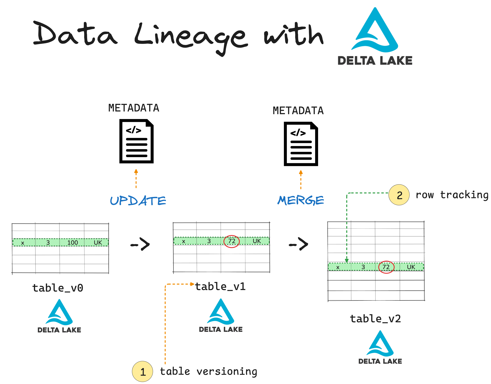
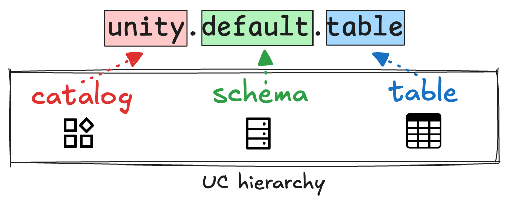
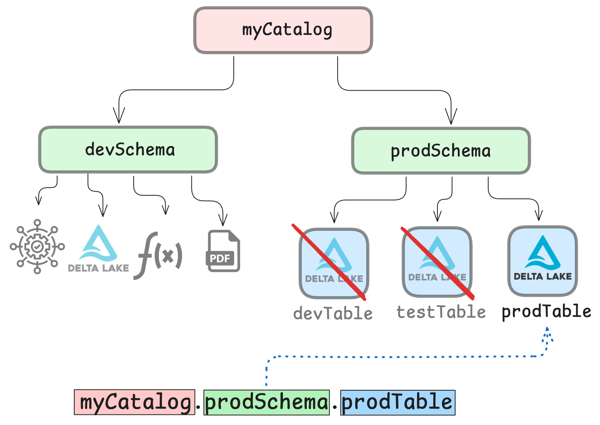

This article explains how Delta Lake helps you create clear and reliable data lineage.

Data lineage is crucial for any modern data pipeline. You need to know where data came from, who made which changes and when, and where the final datasets are stored. This information helps you guarantee data quality and makes it much easier to guarantee compliance and meet auditing requirements.

This article will show you:

- What data lineage is
- How Delta Lake helps you track lineage through time travel and row tracking
- How to use these features in PySpark

Let's jump in.

## What is Data Lineage?

Data lineage is the practice of tracking how data is created, moved and manipulated as it flows through an organization. This makes it possible to trace every step of the data journey from original source to end user.

Proper data lineage makes your life easier by:

- Helping you quickly trace and fix broken pipelines
- Making audits and compliance checks faster and less stressful
- Showing exactly how data changes over time
- Giving your team confidence to trust data sources

For example in e-commerce pipelines, data lineage makes it possible to track a single customer order from the website, through payment, into inventory, and all the way to shipping. This kind of visibility helps you debug faster when an order goes missing, supports smooth auditing, and gives business leaders more confidence to trust your results.

All data lineage tools use [metadata]((#link-when-live) to track changes to your data.



## Data Lineage tools

There are many different ways that you can track data lineage. They can be divided into four main groups:

1.  **Observability platforms**

    These tools monitor your data pipelines and give you a visual map of how data moves across systems. They alert you if something breaks or changes unexpectedly.

    Examples: Monte Carlo, Databand, Metaplane

2.  **Metadata catalogs**
    These tools track technical metadata like table schemas, column names, and query logs. They often include a user-friendly UI to browse lineage and add business context.

    Examples: Unity Catalog, DataHub, Atlan, Collibra

3.  **Pipeline orchestrators**
    Tools like Dagster, Airflow, and dbt let you define pipelines as code. Many of them now automatically track lineage as part of your pipeline runs.

    Examples: Dagster, Apache Airflow, dbt Cloud

4.  **Open table formats**

    These are not separate tools in the traditional sense but can still give you rich lineage information. [Open table formats](https://delta.io/blog/open-table-formats/) store detailed metadata as part of the table itself. This includes schema versions, file-level stats, and commit histories. This means that data lineage is baked right into the storage layer and you get time travel, audit trails, and rollback for free without using any external platform.

    Examples: Delta Lake, Apache Iceberg, Apache Hudi

## How does Delta Lake support data lineage?

Delta Lake is a storage format with [built-in superpowers](https://delta.io/blog/delta-lake-vs-data-lake/). One of those superpowers is data lineage.

[Unlike Parquet](https://delta.io/blog/delta-lake-vs-parquet-comparison/), JSON or CSV, which need external tools to reconstruct lineage, Delta Lake tracks data lineage out of the box. It does this using two powerful features:

- **Time travel**: You can see what your table looked like at any point in time.
- **Row tracking**: You can follow how individual rows were created, changed, or deleted.

This means if you're storing your data in Delta format, you're already capturing data lineage without writing a single extra line of code.

Let's take a closer look at each Delta Lake data lineage feature.

## Delta Lake for Data Lineage: Time Travel

Time travel lets you query your data as it was in a past version or timestamp. This feature is powered by the full commit history stored in the [Delta Lake transaction log](#link-when-live).

Let's say you have a Delta table called `orders` that stores all your customer orders. You can use the Time Travel feature to inspect previous versions of this table whenever you need to. You can refer to previous versions by version number (every overwrite creates a new version) or by timestamp.

### PySpark Example

Here's how to do that in PySpark:

```python
    # read the latest version
    spark.read.format("delta").load("tables/orders").show()

    # travel to version 0
    spark.read.format("delta") \
      .option("versionAsOf", 0) \
      .load("tables/orders") \
      .show()

    # or travel by timestamp
    spark.read.format("delta") \
      .option("timestampAsOf", "2025-07-01T00:00:00") \
      .load("tables/orders") \
      .show()
```

Time travel helps you recover bad writes, audit snapshots, and reproduce experiments. Just make sure to correctly set your retention policy, because running a [table optimization operation](https://delta.io/blog/delta-lake-optimize/) on your table may limit how far back in time you can travel.

## Delta Lake for Data Lineage: Row Tracking

Row tracking brings data lineage to the level of each individual row. By giving each row a unique ID and a `commit_version` column, this Delta Lake feature lets you track how each row changes over time.

If a row is updated or deleted, the change is tied to the unique ID. This means you can compare versions of the table and understand how the data evolved at the row-level.

Here's how you can create a new table with the Row Tracking feature enabled:

```python
    spark.sql("""
    CREATE TABLE sales (
      order_id STRING,
      amount DOUBLE,
      country STRING
    )

    USING DELTA
    TBLPROPERTIES (
      'delta.enableRowTracking' = 'true'
    )
    """)
```

You can also enable row tracking on an existing table:

```python
    spark.sql("""
    ALTER TABLE sales
    SET TBLPROPERTIES (
      'delta.enableRowTracking' = 'true'
    )
    """)
```

This works as long as your table uses Delta format and supports Delta Lake version 3.1.0 or higher. Note that row tracking must be enabled explicitly.

Read more in the dedicated [Delta Lake Row Tracking tutorial](#link-when-live).

## When should I use Delta Lake for Data Lineage?

Delta Lake gives you powerful lineage tools for all changes that directly affect your Delta tables.

Consider using Delta Lake for data lineage if:

- You need file-level or row-level audit trails.
- You want lineage baked into your data storage.
- You work with structured data.
- You care about time travel.

It's important to remember that Delta Lake does not track external data sources (e.g. Kafka, Flink) and does not capture upstream transformations unless they write into your Delta tables. In these cases, you may need to use external data lineage tools to get the visibility you need.

Delta Lake is great for _in-table_ lineage. If you need _pipeline-wide_ lineage, or work with messy, unstructured formats, you will probably want to pair it with the right observability or catalog layer.

## Delta Lake and Unity Catalog for Data Lineage

A great way to achieve data lineage for your entire pipeline is to use Delta Lake together with [Unity Catalog](https://www.unitycatalog.io/).

Unity Catalog is a unified governance layer for data and AI. It works with Delta Lake and adds centralized controls for access, ownership, and data lineage. It organizes your data using a simple 3-level namespace:



This structure helps you:

- Track where tables live and who owns them
- Store metadata in a central location for discovery and auditing
- Regulate access and authorization



By using Delta Lake and Unity Catalog together, you get traceability across the full chain, with minimal effort:

- Delta Lake logs every change to the table in the transaction log
- Unity Catalog adds structure and metadata for lineage tracking across all data assets

For a working code example, check out [the Delta Lake tutorial](https://www.unitycatalog.io/blogs/unity-catalog-spark-delta-lake) on the Unity Catalog blog.

## Using Delta Lake for Data Lineage

Data lineage is essential for trustworthy data pipelines that are easy to debug and audit for compliance. Delta Lake supports this by giving you two built-in data lineage tools: **time travel** and **row tracking**. These features give you full visibility on your table-wide data lineage.

You can combine Delta Lake with Unity Catalog for complete visibility over your entire pipeline, including upstream data sources and unstructured data.
