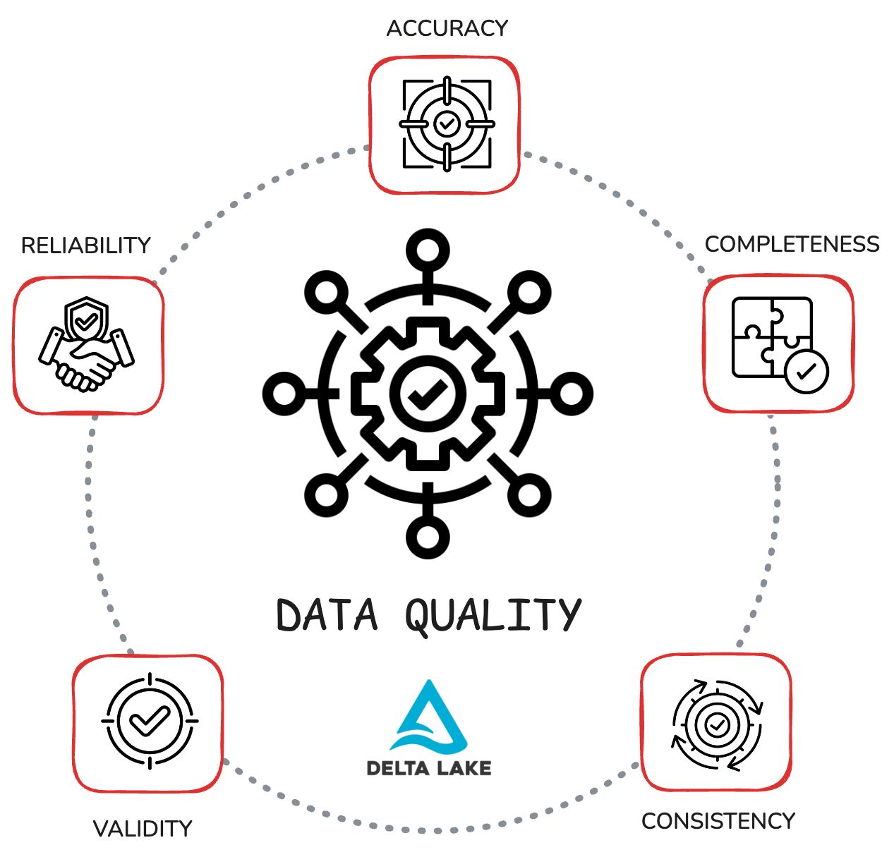

Problems with data quality can cost you precious time, money and trust. This guide shows you how to use Delta Lake to raise data quality across all of your pipelines.

We'll use one running example: a customer orders dataset. You'll learn how to protect your data quality with core Delta Lake features like ACID transactions, schema enforcement, constraints, time travel, row tracking, and Change Data Feed. Each feature maps to a fundamental data quality dimension: accuracy, completeness, consistency, validity, and reliability.

If you're looking to build pipelines that can handle production-grade pressure (such as audits, retries, late data, concurrent writes), then you're in the right place.

Let's dive in and see how Delta Lake makes your tables reliable, debuggable, and easy to trust 🦾

## What is data quality?

Data quality means your data is correct, complete, consistent, valid and reliable. If any of these fail, your performance will suffer and trust in your pipelines drops.



Let's take a look at what each dimension means. We'll use the example of a customer orders dataset to demonstrate throughout this article.

### Accuracy

Accuracy means the values in your dataset are correct and reflect the reality they represent.

In a customer orders table, you don't want to see any negative amounts, future order dates, or customer IDs that don't exist. Implementing checks like `amount > 0` and `order_date= current_date()` can help you make sure that no accidental mistakes are slipping into your dataset. When things do drift unintentionally, you want to be able to compare versions and track changes to find the root cause.

### Completeness

Completeness means all the required and expected data is present.

For a customer orders table, this means no missing `customer_id` and no null `order_date`, for example. You also want to be able to make sure that all the expected records arrived for the time window you're processing. If yesterday had 1M orders and today has 200, something is probably wrong. You can use hard-coded checks to fail fast when key fields have unexpected values.

### Consistency

Consistency means data doesn't conflict across tables or runs.

The same customer key should always refer to the same customer everywhere, even when data is being accessed with a different query engine or by a different organization. In your pipelines, you want idempotent writes and safe upserts so you don't create duplicates. This supports reliable workflows that you and your business partners can trust.

### Validity

Validity means data fits the schema and your rules. Data types and formats should match and values should fall within allowed sets.

For example, for the orders in your customer orders dataset: `amount` should always be a positive integer, `status` should be either `pending`, `paid`, or `refunded`, and `country` matches standard ISO codes.

### Reliability

Reliability means your data and pipelines behave predictably. The same input always produces the same output.

Jobs succeed or fail cleanly, without leaving partial files behind. This allows you to perform reruns safely, audit changes, and recover fast when something breaks. Reliable data builds trust and keeps your SLAs and dashboards steady.

## How does Delta Lake improve data quality?

Delta Lake has powerful features that help you safeguard your data quality. Let's take a look at how Delta Lake supports each dimension of data quality. We'll walk through step-by-step code examples in the next section.

**Accuracy Features: check constraints, time travel, row tracking**

- Delta Lake enables you to use [CHECK constraints](https://delta.io/blog/2022-11-21-delta-lake-contraints-check/) to prevent bad values. For example you can implement checks that your `amount` column is always greater than 0 and that status codes always match one of the predefined statuses.
- When mistakes do happen or logic changes, you can use the Delta Lake [time travel](https://delta.io/blog/2023-02-01-delta-lake-time-travel/) feature to compare versions and recover previous states when necessary.
- You can also turn on [row tracking](#link-when-live) to see exactly how specific rows have changed over time.

**Completeness Features: NOT NULL, schema enforcement, CDF**

- You can use Delta Lake to mark required columns as `NOT NULL` in your schema. Delta Lake's [schema enforcement](https://delta.io/blog/2022-11-16-delta-lake-schema-enforcement/) feature will then automatically block writes that contain `NULL` values for this column. This way you will never accidentally append `NULL` values to your table.
- You can also enable the Delta Lake [Change Data Feed (CDF)](https://delta.io/blog/2023-07-14-delta-lake-change-data-feed-cdf/) feature to detect late or missing records downstream and backfill safely.

**Consistency Features: ACID transactions, optimistic concurrency, MERGE**

- Delta Lake has strong [ACID transaction](#link-when-live) guarantees in place to prevent partial writes and accidental data corruption. Every change to the data has to pass through the schema enforcement checks and is recorded in the transaction log, so you can always be sure that your data is consistent and traceable.
- Delta Lake implements [optimistic concurrency control](https://docs.delta.io/latest/concurrency-control.html) to streamline concurrent writes to the same table. This means that multiple engines and/or users can write to a table simultaneously without clobbering the files.
- You can use the Delta Lake MERGE command for [idempotent upserts](https://delta.io/blog/delta-lake-upsert/) so retries don't create duplicates or leave behind partial writes.

**Validity Features: strong types, generated columns, controlled evolution**

- Use Delta Lake's schema enforcement to define a strong schema with the right data types.
- Add [generated columns](https://delta.io/blog/2023-04-12-delta-lake-generated-columns/) to enforce derived rules (e.g., normalized dates, lowercase emails).
- When the model grows, use [schema evolution](https://delta.io/blog/2023-02-08-delta-lake-schema-evolution/) with [type widening](#link-when-live) to add columns or expand ranges without breaking readers.

**Reliability Features: transactions, versioning, reproducibility**

- Delta Lake stores every write as a transaction in the [transaction log](#link-when-live). This gives you atomicity guarantees: your write either completes with all changes or it fails completely. There will never be any partial writes that will reduce data quality downstream.
- The transaction log gives you full version history. This makes it easy to reproduce experiments, facilitate audits and debug mistakes. Your pipelines become predictable and reliable.
- When mistakes do happen or logic changes, you can use the Delta Lake [time travel](https://delta.io/blog/2023-02-01-delta-lake-time-travel/) feature to compare versions and recover previous states when necessary.

## Delta Lake for Data Quality in Action

Let's build an end-to-end code example to demonstrate all of these Delta Lake features that help you improve your data quality. We'll use PySpark to build a toy customer orders dataset and demo the features.

Start by initializing a PySpark session with Delta Lake:

```python
import pyspark
from delta import *

builder = pyspark.sql.SparkSession.builder.master("local[1]").appName("DeltaArch") \
    .config("spark.sql.extensions", "io.delta.sql.DeltaSparkSessionExtension") \
    .config("spark.sql.catalog.spark_catalog", "org.apache.spark.sql.delta.catalog.DeltaCatalog")

spark = configure_spark_with_delta_pip(builder).getOrCreate()
```

Then create your `Orders` table with the row tracking and change data feed features already enabled. Use the `NOT NULL` constraint to ensure completeness:

```python
spark.sql("""
CREATE TABLE IF NOT EXISTS orders (
  order_id    STRING  NOT NULL,
  customer_id STRING  NOT NULL,
  order_date  DATE    NOT NULL,
  amount      DECIMAL(12,2) NOT NULL,
  status      STRING  NOT NULL,
  last_update TIMESTAMP NOT NULL
) USING DELTA
TBLPROPERTIES (
  'delta.enableRowTracking' = 'true',
  'delta.enableChangeDataFeed' = 'true'
)
""")
```

Now add check constraints to ensure accuracy: values in the `amount` column should always be greater than 0 and values for `status` should always match one of the predefined values:

```python
# Add CHECK constraints
spark.sql("""
ALTER TABLE orders ADD CONSTRAINT amount_positive CHECK (amount > 0)
""")

spark.sql("""
ALTER TABLE orders ADD CONSTRAINT valid_status CHECK (status IN ('pending','paid','refunded'))
""")
```

Let's insert some rows of sample data:

```python
spark.sql("""
INSERT INTO orders VALUES
('o1','c1', DATE'2025-08-01', 39.99, 'paid',     TIMESTAMP'2025-08-01 10:00:00'),
('o2','c2', DATE'2025-08-01', 12.50, 'pending',  TIMESTAMP'2025-08-01 09:00:00')
""")
```

These rows are valid (they pass the constraint checks) and will therefore be added to the table. You can confirm with a quick check:

```python
> spark.sql("SELECT * FROM orders ORDER BY order_id").show()
```

```
+--------+-----------+----------+------+-------+-------------------+
|order_id|customer_id|order_date|amount| status|        last_update|
+--------+-----------+----------+------+-------+-------------------+
|      o1|         c1|2025-08-01| 39.99|   paid|2025-08-01 10:00:00|
|      o2|         c2|2025-08-01| 12.50|pending|2025-08-01 09:00:00|
+--------+-----------+----------+------+-------+-------------------+
```

Next let's try to add some rows that should not pass the constraint checks. First let's try to append a row with a negative value for the `amount` column:

```python
spark.sql("""
INSERT INTO orders VALUES
('o3','c3', DATE'2025-08-01', -5.00, 'paid', TIMESTAMP'2025-08-01 11:00:00')
""")
```

This will throw a constraint check error: `[DELTA_VIOLATE_CONSTRAINT_WITH_VALUES] CHECK constraint amount_positive (amount > 0) violated`. The accuracy and validity checks are working as expected.

Next let's try to add a row that contains a `NULL` value. Remember that all columns were created with a `NOT NULL` constraint:

```python
spark.sql("""
INSERT INTO orders VALUES
(NULL,'c4', DATE'2025-08-01', 19.99, 'paid', TIMESTAMP'2025-08-01 12:00:00')
""")
```

This will error out with the following error: `[DELTA_NOT_NULL_CONSTRAINT_VIOLATED] NOT NULL constraint violated for column: order_id`. Your completeness checks are operating as expected.

Let's confirm that the table is unchanged:

```python
> spark.sql("SELECT * FROM orders ORDER BY order_id").show()
```

```
+--------+-----------+----------+------+-------+-------------------+
|order_id|customer_id|order_date|amount| status|        last_update|
+--------+-----------+----------+------+-------+-------------------+
|      o1|         c1|2025-08-01| 39.99|   paid|2025-08-01 10:00:00|
|      o2|         c2|2025-08-01| 12.50|pending|2025-08-01 09:00:00|
+--------+-----------+----------+------+-------+-------------------+
```

For the next step, let's say some new records have arrived and you want to add them to your existing dataset. We will use the `MERGE` command to create an idempotent upsert that inserts any news rows and only updates existing rows when the timestamp is later than the existing timestamp.

Here are the update rows:

```python
spark.sql("""
CREATE OR REPLACE TEMP VIEW updates AS
SELECT * FROM VALUES
  ('o1','c1', DATE'2025-08-01', 41.25, 'paid',    TIMESTAMP'2025-08-01 11:00:00'),
  ('o3','c3', DATE'2025-08-01', 20.00, 'pending', TIMESTAMP'2025-08-01 11:05:00')
AS updates(order_id, customer_id, order_date, amount, status, event_time)
""")
```

As you can see, this `o1` has a later timestamp than the `o1` in our existing table. `o3` is completely new.

Perform an upsert to merge the new/updated rows into the existing table. We will implement a conditional clause (`s.event_time > t.last_update`) to ensure that only newer updates are getting merged.

```python
spark.sql("""
MERGE INTO orders AS t
USING updates AS s
ON t.order_id = s.order_id
WHEN MATCHED AND s.event_time > t.last_update THEN
  UPDATE SET
    t.customer_id = s.customer_id,
    t.order_date  = s.order_date,
    t.amount      = s.amount,
    t.status      = s.status,
    t.last_update = s.event_time
WHEN NOT MATCHED THEN
  INSERT (order_id, customer_id, order_date, amount, status, last_update)
  VALUES (s.order_id, s.customer_id, s.order_date, s.amount, s.status, s.event_time)
""")
```

Let's take a look at our `orders` table now:

```python
> spark.sql("SELECT * FROM orders ORDER BY order_id").show()
```

```
+--------+-----------+----------+------+-------+-------------------+
|order_id|customer_id|order_date|amount| status|        last_update|
+--------+-----------+----------+------+-------+-------------------+
|      o1|         c1|2025-08-01| 41.25|   paid|2025-08-01 11:00:00|
|      o2|         c2|2025-08-01| 12.50|pending|2025-08-01 09:00:00|
|      o3|         c3|2025-08-01| 20.00|pending|2025-08-01 11:05:00|
+--------+-----------+----------+------+-------+-------------------+
```

`o1` has been correctly updated and `o3` has been appended to the table. This is looking good!

This upsert strategy has some great benefits for your data quality:

- it's **idempotent:** if you run the same `MERGE` command again, the table won't change.
- it's **atomic:** there is only one complete commit, and no partial files get left behind if the task fails. \

You can use the time travel feature to inspect your table history:

```python
> spark.sql("DESCRIBE HISTORY orders").show(truncate=True)
```

```
+-------+--------------------+------+--------+--------------+--------------------+----+--------+---------+-----------+--------------+-------------+--------------------+------------+--------------------+

|version| timestamp|userId|userName| operation| operationParameters| job|notebook|clusterId|readVersion|isolationLevel|isBlindAppend| operationMetrics|userMetadata| engineInfo|

+-------+--------------------+------+--------+--------------+--------------------+----+--------+---------+-----------+--------------+-------------+--------------------+------------+--------------------+

| 4|2025-08-18 12:08:...| NULL| NULL| MERGE|{predicate -> ["(...|NULL| NULL| NULL| 3| Serializable| false|{numTargetRowsCop...| NULL|Apache-Spark/3.5....|

| 3|2025-08-18 11:43:...| NULL| NULL| WRITE|{mode -> Append, ...|NULL| NULL| NULL| 2| Serializable| true|{numFiles -> 1, n...| NULL|Apache-Spark/3.5....|

| 2|2025-08-18 11:38:...| NULL| NULL|ADD CONSTRAINT|{name -> valid_st...|NULL| NULL| NULL| 1| Serializable| false| {}| NULL|Apache-Spark/3.5....|

| 1|2025-08-18 11:38:...| NULL| NULL|ADD CONSTRAINT|{name -> amount_p...|NULL| NULL| NULL| 0| Serializable| false| {}| NULL|Apache-Spark/3.5....|

| 0|2025-08-18 11:38:...| NULL| NULL| CREATE TABLE|{partitionBy -> [...|NULL| NULL| NULL| NULL| Serializable| true| {}| NULL|Apache-Spark/3.5....|

+-------+--------------------+------+--------+--------------+--------------------+----+--------+---------+-----------+--------------+-------------+--------------------+------------+--------------------+
```

You can also compare different versions of your table using the `VERSION AS OF` clause to travel back to previous states:

```python
> spark.sql("SELECT \* FROM orders VERSION AS OF 0 ORDER BY order_id").show()
```

```
+--------+-----------+----------+------+------+-----------+

|order_id|customer_id|order_date|amount|status|last_update|

+--------+-----------+----------+------+------+-----------+

+--------+-----------+----------+------+------+-----------+
```

The first three versions will be empty since the first commits were:

1. Create empty table with columns (`VERSION 0`)
2. Add first constraint check (`VERSION 1`)
3. Add second constraint check (`VERSION 2`)

Compare version 3 and 4 to see different table states:

```python
> spark.sql("SELECT * FROM orders VERSION AS OF 3 ORDER BY order_id").show()
```

```
+--------+-----------+----------+------+-------+-------------------+
|order_id|customer_id|order_date|amount| status|        last_update|
+--------+-----------+----------+------+-------+-------------------+
|      o1|         c1|2025-08-01| 39.99|   paid|2025-08-01 10:00:00|
|      o2|         c2|2025-08-01| 12.50|pending|2025-08-01 09:00:00|
+--------+-----------+----------+------+-------+-------------------+
```

```python
> spark.sql("SELECT * FROM orders VERSION AS OF 4 ORDER BY order_id").show()
```

```
+--------+-----------+----------+------+-------+-------------------+
|order_id|customer_id|order_date|amount| status|        last_update|
+--------+-----------+----------+------+-------+-------------------+
|      o1|         c1|2025-08-01| 41.25|   paid|2025-08-01 11:00:00|
|      o2|         c2|2025-08-01| 12.50|pending|2025-08-01 09:00:00|
|      o3|         c3|2025-08-01| 20.00|pending|2025-08-01 11:05:00|
+--------+-----------+----------+------+-------+-------------------+
```

As a final step, let's demonstrate the row tracking feature. This feature lets you track how and when individual rows have changed over time.

The row tracking metadata is stored in two hidden columns: `_metadata.row_id` contains a unique immutable identifier for each row, and `_metadata.row_version` tracks the table version in which the row was last changed.

Let's take a closer look:

```python
> spark.sql("""
SELECT
  _metadata.row_id              AS rid,
  _metadata.row_commit_version  AS v,
  order_id, amount, status, last_update
FROM orders
ORDER BY order_id
""").show(truncate=False)
```

```
+---+---+--------+------+-------+-------------------+
|rid|v  |order_id|amount|status |last_update        |
+---+---+--------+------+-------+-------------------+
|0  |4  |o1      |41.25 |paid   |2025-08-01 11:00:00|
|1  |3  |o2      |12.50 |pending|2025-08-01 09:00:00|
|4  |4  |o3      |20.00 |pending|2025-08-01 11:05:00|
+---+---+--------+------+-------+-------------------+
```

We can clearly see each unique row ID. We can also confirm that rows `0` and `4` were last changed in the most recent table version (table version `4`) while row `1` is older: it was last changed in the previous table version `3`. Read more about using row tracking in the dedicated [Delta Lake Row Tracking tutorial](#link-when-live).

As the final step, let's use the Change Data Feed to summarize all changes since version 0 in order to validate completeness. We will then also show how to push incremental updates to a derived table without having to

Use the following snippet to summarize all the changes made to your table. This will help you check whether you are getting the expected number of rows per day and per change type? For example, if yesterday's run added 1M orders and today shows 200 inserts, you know that there is probably something wrong somewhere.

```python
> # Count inserts/updates/deletes by day
spark.sql("""
SELECT
  date(_commit_timestamp) AS dt,
  _change_type,                       -- insert | delete | update_preimage | update_postimage
  count(*) AS rows_changed
FROM table_changes('orders', 0)
GROUP BY 1, 2
ORDER BY 1, 2
""").show(truncate=False)
```

```
+----------+----------------+------------+
|dt        |_change_type    |rows_changed|
+----------+----------------+------------+
|2025-08-18|insert          |3           |
|2025-08-18|update_postimage|1           |
|2025-08-18|update_preimage |1           |
+----------+----------------+------------+
```

Excellent. With this set of Delta Lake features you have been able to safeguard your data quality across all dimensions: accuracy, completeness, consistency, validity, and reliability.

## Delta Lake vs Parquet for Data Quality

Parquet is a great columnar file format. But it's just a collection of files and does not offer transactions, no auditable history and no central metadata beyond each file's footer. Delta Lake adds a powerful metadata layer on top of Parquet that boosts data quality through your entire pipeline.

Here's what you get with Delta that you won't get from Parquet:

- **Atomic writes (ACID):** Jobs succeed or fail as one unit, no half-written files. Parquet alone can leave partial data if a task dies mid-write.

- **Schema enforcement + constraints:** Block bad rows with NOT NULL and CHECK constraints. Parquet doesn't enforce schemas across a dataset, which can cause data corruption as datasets drift.

- **Versioned history (time travel):** Query any past state to audit, debug, or roll back. Parquet has no built-in versioning.

- **Detailed data lineage:** Use row tracking and Change Data Feed for diffs and incremental processing. Parquet is immutable and doesn't support upserts. Every change to a Parquet dataset requires a full rewrite.

Performance is important as well. Slow or flaky reads lead to timeouts, retries, and duplicate data. Delta's log avoids expensive file listing on cloud object stores and enables efficient file skipping, so pipelines are faster and more predictable than scanning raw Parquet folders.

Bottom line: Parquet gives you efficient storage for files. Delta Lake gives you trustworthy tables for production-grade pipelines. Delta Lake gives you ACID guarantees, schema enforcement, history, and rich metadata, so your data quality holds up in real-world use cases.

Read more in the [Delta Lake vs Data Lake tutorial](https://delta.io/blog/delta-lake-vs-data-lake/).

## Safeguard Data Quality with Delta Lake

Improving your data quality becomes easier with Delta Lake's built-in features. Delta Lake gives you data quality controls built in at the table layer:

- Check constraints + schema enforcement
- ACID writes
- Time travel
- Change Data Feed
- Row tracking
- Concurrency controls

These features help you safeguard all the different dimensions of data quality: accuracy, completeness, consistency, validity, and reliability. Use Delta Lake to create predictable, debuggable, and reliable pipelines.
