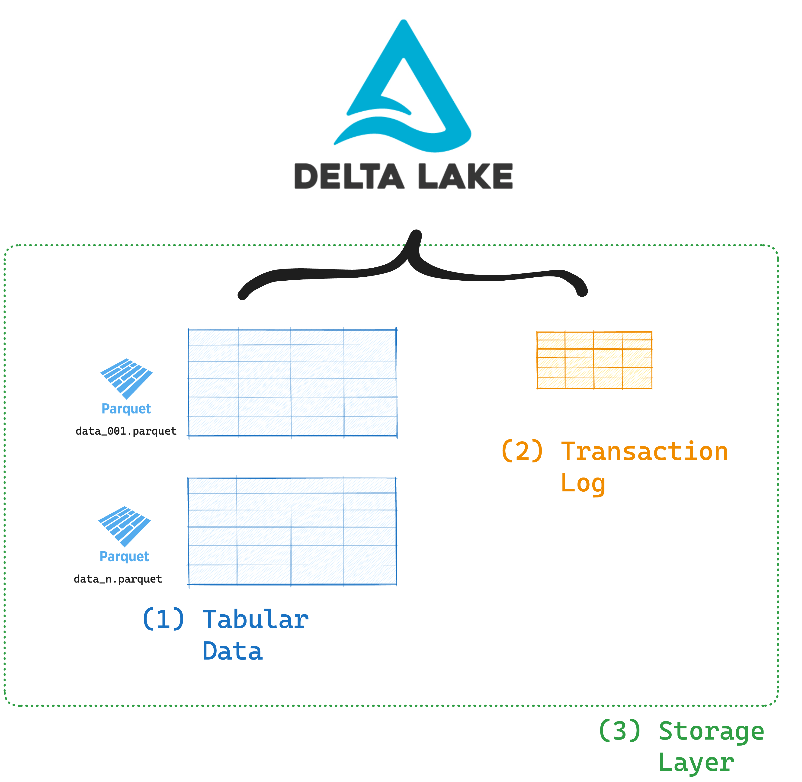

This article explains how to use Delta Lake with DuckDB and shows the benefits of using Delta Lake compared to other data formats like Parquet or CSV.

DuckDB is a popular SQL-based database system which runs fast analytical queries on tabular data. It is designed as an in-process analytical engine, optimized for reading and aggregating data at scale.

Delta Lake is a lakehouse storage protocol that brings strong reliability guarantees and highly-optimized performance to your structured data. It enables powerful features for your data queries like time travel, schema enforcement, ACID guarantees and advanced data skipping.

Using Delta Lake with DuckDB will speed up your analytical queries and secure your workflows from accidental data corruption.

Let's jump into some code to see how this works.

## Install Delta Lake and DuckDB

The easiest way to install Delta Lake with DuckDB is using `pip`:

```
pip install duckdb deltalake pandas
```

`pandas` is installed here as a dependency of `duckdb`. We will not need to use it directly.

You can also use other Python package managers like conda or poetry to install the required libraries.

## Create Delta Table with DuckDB

Here's how you can create a Delta table with DuckDB.

Start by importing the necessary libraries:

```python
import duckdb
import pandas as pd
from deltalake import DeltaTable, write_deltalake
```

Launch a DuckDB server:

```python
con = duckdb.connect()
```

Create a DuckDB with some sample data about ducks:

```python
# Create a table and insert sample data
con.execute("""
    CREATE TABLE duck_data (
        id INTEGER,
        name VARCHAR,
        duck_species VARCHAR,
        weight_kg FLOAT,
    );
""")

con.execute("""
    INSERT INTO duck_data VALUES
        (1, 'Alice', 'mallard', 4.31),
        (2, 'Bob', 'canvasback', 5.11),
        (3, 'Charlie', 'mallard', 3.97),
        (4, 'Dorothy', 'golden cascade', 6.03);
""")
```

This DataFrame contains 4 rows and 4 columns of sample data about duck `id`, `name`, `species` and `weight`:

```python
> df
   id     name    duck_species  weight_kg
0   1    Alice         mallard       4.31
1   2      Bob      canvasback       5.11
2   3  Charlie         mallard       3.97
3   4  Dorothy  golden cascade       6.03
```

Now you can turn this DataFrame into a Delta table using the `write_deltalake` function from the `deltalake` library:

```python
write_deltalake(f"./my_delta_table", df)
```

## Read Delta Lake Table with DuckDB

Use the `delta_scan` function to read data from a Delta table with DuckDB:

```SQL
SELECT * FROM delta_scan('./my_delta_table')
ORDER BY name ;

┌───────┬─────────┬────────────────┬───────────┐
│  id   │  name   │  duck_species  │ weight_kg │
│ int32 │ varchar │    varchar     │   float   │
├───────┼─────────┼────────────────┼───────────┤
│     1 │ Alice   │ mallard        │      4.31 │
│     2 │ Bob     │ canvasback     │      5.11 │
│     3 │ Charlie │ mallard        │      3.97 │
│     4 │ Dorothy │ golden cascade │      6.03 │
└───────┴─────────┴────────────────┴───────────┘
```

The `delta_scan` module is a core DuckDB extension, which means DuckDB can automatically load the module without an explicit manual install. When you call `delta_scan` for the first time, DuckDB will install and load the Delta extension for you.

### Reading Delta tables from S3 with DuckDB

You can use the same `delta_scan` function to read Delta tables from S3 cloud storage. You will just need to create a DuckDB secret first to ensure access with your S3 credentials.

If your S3 credentials are already stored in an environment variable or `~/.aws/credentials` file then you can create your secret by running:

```SQL
CREATE SECRET delta_secret (
    TYPE S3,
    PROVIDER CREDENTIAL_CHAIN
)
```

You can also create the secret by manually entering the S3 credentials:

```SQL
CREATE SECRET delta_secret (
    TYPE S3,
    KEY_ID <your-S3-key>,
    SECRET <your-S3-secret>,
    REGION <S3-region>'
)
```

Once you've configured your secret, you can run `delta_scan` pointing to your S3 path:

```SQL
SELECT * FROM delta_scan('s3://your/bucket/path/to/delta');
```

## How Delta Lake helps DuckDB users

Delta Lake has many great features that help DuckDB users achieve faster queries and more reliable workflows.

Delta Lake is an [open table format](https://delta.io/blog/open-table-formats/) that stores your data in Parquet files, together with important metadata in the transaction log.



Here's what your Delta Lake data looks like on disk:

```
> tree delta_table_duckdb

delta_table_duckdb
├── _delta_log
│   └── 00000000000000000000.json
└── part-00001-...01.snappy.parquet
```

The Parquet files store the data that was written. The `_delta_log` directory stores metadata about the transactions in lightweight JSON files. In this example there is only 1 Parquet file because the data is still. In practice you will almost always have multiple Parquet files with data.

### Delta Lake Transaction Log

The transaction log records every operation that changes the data in your Delta table. This enables Delta Lake's great features like:

- Advanced data skipping
- Time travel
- Schema enforcement and schema evolution
- ACID transactions

Delta Lake gives you the flexibility and cheap storage of a traditional data lake as well as the reliability and performance of a data warehouse: the best of both worlds. Read an in-depth explanation of Delta Lake's features vs. other file formats in the [Delta Lake vs Data Lake](https://delta.io/blog/delta-lake-vs-data-lake/) post.

### Advanced Data Skipping

Data skipping lets your query engine skip irrelevant rows in your dataset. It is a feature of your data storage format: some storage formats offer very little opportunity for data skipping (like CSV) while others support some optimization (like Parquet).

Delta Lake supports advanced data skipping by storing all metadata in a separate transaction log. This is better than the kind of data skipping offered by Parquet.

Parquet readers need to fetch metadata from the footer of every Parquet file. This takes multiple operations and can get expensive when you have many files. Delta readers, on the other hand, can achieve this with a single I/O request to the transaction log.


Delta readers can also skip entire files, while Parquet readers are limited to skipping only row groups. This makes data skipping with Delta Lake much more performant.

### ACID Guarantees

Data pipelines often experience interruptions and failures. Delta Lake's ACID transactions guarantee that:

- Your data is always consistent.
- Partial writes or failures don't corrupt the data.
- Multiple engines can read/write the same table simultaneously without errors.

Read more in the [Delta Lake vs Data Lake](https://delta.io/blog/delta-lake-vs-data-lake/) post.

### Time Travel

Delta Lake records all operations on your data in the transaction log. This means that you can always go back to a previous version of your data. If someone in your team makes a mistake or corrupted data is added to the table, you can use the time travel feature to revert your data to a previous state.

Read more in the [Delta Lake time travel](https://delta.io/blog/2023-02-01-delta-lake-time-travel/) article.

### Schema Enforcement and Evolution

Delta Lake ensures data consistency by enforcing schema validation. Only data that conforms with the predefined schema will be accepted for appending. Any data updates that do not match the table's schema will be rejected. Read more in the [Delta Lake schema enforcement](https://delta.io/blog/2022-11-16-delta-lake-schema-enforcement/) post.

Sometimes your schema needs to change over time, due to changes in business logic, technical systems, or other factors. For these situations, Delta Lake offers support for manual schema evolution. This allows you to modify the schema programmatically in real time. Read more in the [Delta Lake schema evolution](https://delta.io/blog/2023-02-08-delta-lake-schema-evolution/) post.

## How the Delta Extension works

The Delta extension for DuckDB builds on the Delta Kernel project. [Delta Kernel](https://delta.io/blog/delta-kernel/) makes it easier for developers to build integrations with Delta Lake. It exposes a simple API that external developers can use to build their integrations without having to know all the details of how the Delta Lake protocol works internally.


## Active Development

The Delta extension in DuckDB is in active development. Here are some of the many features and optimizations that are already supported:

- multithreaded scans and Parquet metadata reading
- data skipping/filter pushdown
  - skipping row-groups in file (based on Parquet metadata)
  - skipping complete files (based on Delta partition information)
- projection pushdown
- scanning tables with deletion vectors
- all primitive types
- structs

There are also some important limitations to be aware of:

- The delta extension requires DuckDB version 0.10.3 or newer.
- The delta extension currently only supports the following platforms:
  - Linux AMD64 (x86_64 and ARM64): linux_amd64, linux_amd64_gcc4, and linux_arm64
  - macOS Intel and Apple Silicon: osx_amd64 and osx_arm64
  - Windows AMD64: windows_amd64

And there are lots of exciting features on the roadmap, such as:

- Write support
- Column mapping
- Time travel
- Variant, RowIds
- WASM support

## Using Delta Lake with other query engines

Delta Lake is also compatible with many different query engines. Some of these integrations are built on the Delta Kernel project, others are implemented differently.

Check out the [Delta Lake without Spark](https://delta.io/blog/delta-lake-without-spark/) guide for examples of working with Delta Lake and other query engines, such as Trino, Daft, Flink, Snowflake, Dask and Polars.

## Use Delta Lake with DuckDB

The official Delta extension for DuckDB makes it easy and efficient to read Delta tables with DuckDB. The project builds on the new Delta Kernel project to provide smooth integration and is in active development. Expect more features to arrive as users adopt this integration.
