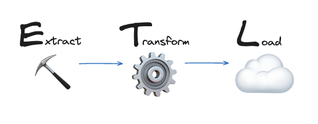
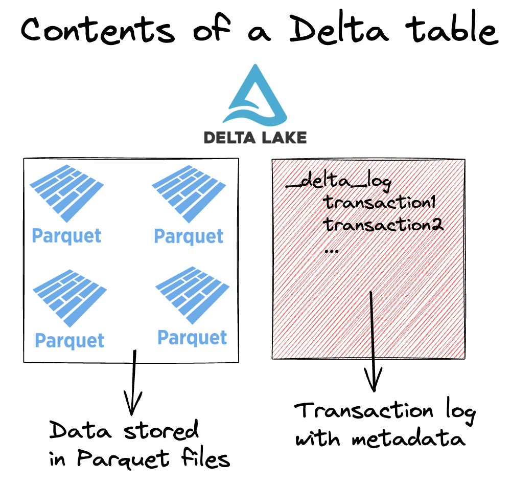
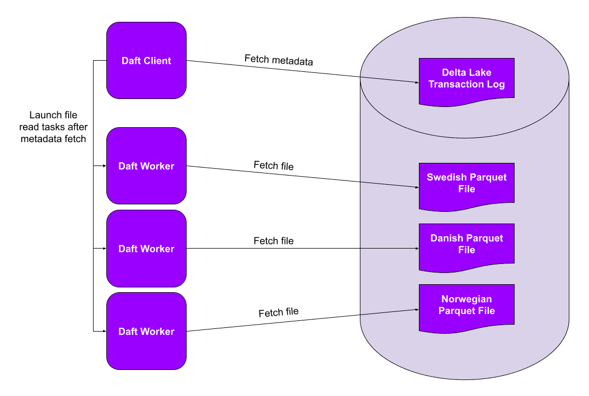
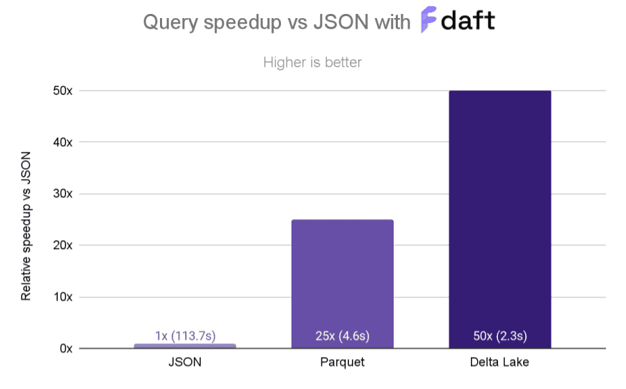
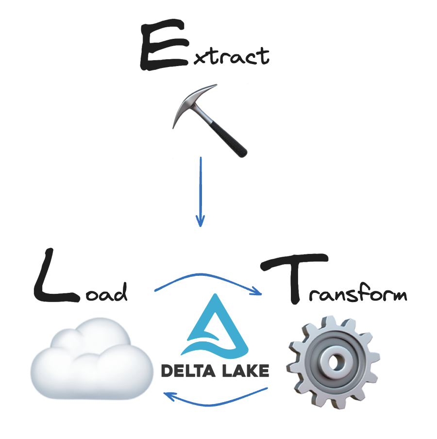

This article shows you how to use Delta Lake for ETL workloads.

Delta Lake has some great features that can make your ETL workloads faster and more reliable. These features are especially relevant for ETL workloads in production and at scale.

Let's take a look at how Delta Lake can help you run better ETL workloads.

## What is ETL?

ETL stands for “Extract-Transform-Load” and refers to data projects that **E**xtract raw data, **T**ransform it into a more useful format and then **L**oad the data for storage and further analysis.



This article uses the term “ETL” to refer to any data workload that involves extracting, transforming and loading data, _in whichever order_ you might perform those operations. Most data projects are not perfectly linear anyway, see the "ETL vs ELT" section below. You may need to go back and forth between transforming and loading a few times. Delta Lake makes this easy and reliable.

## What is Delta Lake?

Delta Lake is an open-source table format for data storage. Delta Lake improves data storage by supporting ACID transactions, high-performance query optimizations, schema enforcement and evolution, data versioning and many other features.

A Delta table consists of two main components:

1. Parquet files that contain data, and
2. a transaction log that stores metadata about the transactions.



The transaction log enables Delta Lake to optimize your queries, ensure reliable reads and writes, and to store a record of all data transformations. Take a look at the [Delta Lake vs Parquet](https://delta.io/blog/delta-lake-vs-parquet-comparison/) and [Delta Lake vs Data Lake](https://delta.io/blog/delta-lake-vs-data-lake/) posts for more detail.

Delta Lake supports both ETL and ELT workloads. After extracting your data, you can store the raw data using Delta Lake and then query it for transformation (ELT) **_or_** you can transform the data in-memory first and then write the processed data to Delta Lake and query it downstream for further analysis (ETL). Either way you will benefit from Delta Lake’s great optimization and reliability features.

Let's take a look at some of the reasons why Delta Lake can be a great choice for ETL workloads.

## Why should I use Delta Lake for ETL?

Delta Lake is great for ETL because of its performance and reliability.

Here are some Delta features that will improve your ETL workloads:

1. **Query Optimization**: Data access is optimized for fast data retrieval and analysis.
2. **Scalability**: Delta Lake can handle large volumes of data efficiently.
3. **Reliability**: ACID transactions ensure that the data is loaded correctly and consistently.
4. **Schema Enforcement and Evolution**: Delta Lake ensures that the data adheres to a defined schema and can evolve as needed.
5. **Time Travel**: All data transformations are recorded in the transaction log and older versions of the data can be accessed at any time.

Let's take a closer look at how Delta Lake can improve your ETL query performance.

## Delta Lake for ETL: Query Performance

Delta Lake has a lot of features that optimize your query performance.

Delta Lake makes your data transformations faster by:

1. Storing file paths and metadata in the transaction log
2. Executing partial reads via file-skipping
3. Co-locating similar data to allow for better file skipping

**Transaction logs**: Delta Lake stores all file paths, metadata and data transformation operations in a dedicated transaction log. This makes file listing faster and enables partial data reads.

**File-skipping:** Delta Lake stores metadata at the file-level in a single transaction log. This way query engines can figure out which data can be skipped using a single network request. Entire files can be skipped this way.

**Co-locating similar data:** Delta Lake can store similar data close together to improve your query performance, using [Z-Ordering](https://delta.io/blog/2023-06-03-delta-lake-z-order/) or [Liquid Clustering](https://docs.delta.io/3.1.0/delta-clustering.html).

### Query Performance Example

Suppose you are building a BI dashboard for your colleagues in Analytics. You have some raw data that you’ve just ingested but you actually only need a subset of this data for your final dashboard. It makes sense to run a selective filter query on the raw data before you run your analysis.

You could transform the raw data in-memory (ETL) with pseudo-code like this:

```
    # extract data
    df = fetch_raw_data()

    # transform
    df_subset = df.where(df.col > value)
```

You could also use Delta Lake as an intermediate storage layer before transforming (ELT):

```
    # extract data
    df = fetch_raw_data()

    # load to Delta table
    df.write.format("delta").save("delta/table")

    # transform
    df_subset = df.read.format("delta").load("delta/table").where(df.col > value)
```

Using Delta Lake to store your data _before transforming it_ can give you significant performance gains because of the features we’ve just mentioned. This will depend on the type of data you are ingesting, the scale of your data and the type of transformation you are running.

If multiple teams need access to the same raw data for different types of queries, then it often makes sense to load the raw data as-is and transform it later. In this case, you and your colleagues can all benefit from the great performance optimizations that Delta Lake offers.

Let's look at a code example.

Suppose you have 16 million rows of fresh data sitting in a CSV file sink. The dataset contains information about all sorts of people living in the US. Your colleagues are only interested in data for high-income individuals (>=50K a year). Processing all of the data would be wasteful.

You could extract the data from the sink and transform it before storing it, for example like this:

```
    # read in 16M rows
    df = spark.read.csv("data/census_16M.csv", header=True)

	%%time
	# subset relevant data
    df.where(df.income == "=>50K").collect()

    CPU times: user 5.52 ms, sys: 3.69 ms, total: 9.21 ms
    Wall time: 21.2 s
```

But it would be faster to store the raw data as a Delta table partitioned on the `income` column and then run the data transform operation on the Delta table, benefiting from its query optimizations:

```
    # read in 16M rows
    df = spark.read.csv("data/census_16M.csv", header=True)

    # load data to Delta table
    df.write.format("delta").partitionBy("income").save("data/delta_census")

    %%time
    # query relevant data
    df = spark.read.format("delta").load("data/delta_census")
    df.where(df.income == "=>50K").collect()

    CPU times: user 2.95 ms, sys: 1.99 ms, total: 4.94 ms
    Wall time: 8.5 s
```

This is much faster. The code was run on an M1 Mac with 16GB using 4 cores. The dataset is a synthetic version of the US Census dataset.

Read more about Delta Lake performance gains in the [Delta Lake vs Data Lake post](https://delta.io/blog/delta-lake-vs-data-lake/#:~:text=Delta%20Lake%20vs%20Data%20Lake%3A%20Performance).

## Delta Lake for ETL: Reliability

Delta Lake makes your ETL workloads more reliable by enforcing ACID transactions. Transactions prevent your data from being corrupted or lost.

Data storage formats without transaction support (like CSV or Parquet) can easily be corrupted. For example, if you're writing a large amount of data and your cluster dies then you'll have several partially written files in your table. These partial files will cause downstream read operations to crash.

Delta Lake transactions give you 4 important guarantees:

1. **No more failed partial writes:** Every write operation either completes entirely or else it fails entirely and no data gets changed.
2. **No more corrupted tables:** If a transaction is going to break any of the pre-defined constraints, the entire transaction is rejected and will not complete.
3. **No more conflicting data versions:** Concurrent processes happen in isolation from each other and cannot access each other's intermediate states.
4. **No more unintended data loss:** All data changes are guaranteed to never be lost, even in the event of system failures or power outages.

One important part of Delta Lake's reliability guarantees is schema enforcement and evolution.

## Delta Lake for ETL: Schema Enforcement and Evolution

To prevent accidental data corruption, Delta Lake provides schema enforcement.

You cannot write new data to a Delta table if it doesn't match the existing table's schema. It will error out with an `AnalysisException`.

For example, let's create a Delta table with a simple schema:

```
    df = spark.createDataFrame([("bob", 47), ("li", 23), ("leonard", 51)]).toDF(
        "first_name", "age"
    )

    df.write.format("delta").save("data/toy_data")
```

Now, let's try to write data with a different schema to this same Delta table:

```
    df = spark.createDataFrame([("frank", 68, "usa"), ("jordana", 26, "brasil")]).toDF(
        "first_name", "age", "country"
    )

    df.write.format("delta").mode("append").save("data/toy_data")
```

Here's the complete error:

```
    AnalysisException: [_LEGACY_ERROR_TEMP_DELTA_0007] A schema mismatch detected when writing to the Delta table

    Table schema:
    root
    -- first_name: string (nullable = true)
    -- age: long (nullable = true)

    Data schema:
    root
    -- first_name: string (nullable = true)
    -- age: long (nullable = true)
    -- country: string (nullable = true)
```

Delta Lake does not allow you to append data with mismatched schema by default. Read the [Delta Lake schema enforcement](https://delta.io/blog/2022-11-16-delta-lake-schema-enforcement/) post to learn more.

### Schema Evolution

Of course, ETL workloads evolve over time. Input data may change or your downstream analysis might need a new column. When you need more flexibility in your schema, Delta Lake also supports Schema Evolution.

To update the schema of your Delta table, you can write data with the `mergeSchema` option. Let's try this for the example that we just saw above:

```
    df.write.option("mergeSchema", "true").mode("append").format("delta").save(
        "data/toy_data"
    )
```

Here are the contents of your Delta table after the write:

```
    spark.read.format("delta").load("data/toy_data").show()

    +----------+---+-------+
    |first_name|age|country|
    +----------+---+-------+
    |   jordana| 26| brasil| # new
    |     frank| 68|    usa| # new
    |   leonard| 51|   null|
    |       bob| 47|   null|
    |        li| 23|   null|
    +----------+---+-------+
```

The Delta table now has three columns. It previously only had two columns. Rows that don't have any data for the new column will be marked as null when new columns are added.

You can also set Schema Evolution by default. Read more in the [Delta Lake Schema Evolution](https://delta.io/blog/2023-02-08-delta-lake-schema-evolution/) blog post.

## Delta Lake for ETL: Time Travel

Nobody is perfect. And no ETL pipeline is perfect, either.

When mistakes happen, you want to be able to roll back your data to a previous version before the mistake. Doing this manually is painful and takes a lot of time. Delta Lake makes this easy by supporting time travel functionality.

Because all of the transactions are stored in the transaction log, Delta Lake can always travel back to earlier states of your table. Not unlike reverting your Git repository to a previous commit.

Let's build on our example with US Census data from above.

Remember that you've the data as a Delta table partitioned on the `income` table.

```
    # read in 16M rows of raw data
    df= spark.read.csv("data/census_16M.csv", header=True)

    # load data to partitioned Delta table
    df.write.format("delta").partitionBy("income").save("data/delta_census")
```

Now suppose your colleague wants to run some queries on the `age` column. She reads in your partitioned Delta table, repartitions it on the `age` column and overwrites the table.

```
    # colleague reads in income-partitioned delta
    df = spark.read.format("delta").load("data/delta_census")

    # colleague does a repartition overwrite
    df.write.format("delta").mode("overwrite").partitionBy("age").option("overwriteSchema", "true").save("data/delta_census")

    # colleague runs query on new partition column
    df = spark.read.format("delta").load("data/delta_census")
    df.where(df.age == 25)
```

Now your queries on the `income` column will be slower. You don't want slow queries.

You could do what your colleague did: access the data, repartition it on your column of interest and overwrite the table again.

```
    # read in age-partitioned delta
    df = spark.read.format("delta").load("data/delta_census")

    # repartition overwrite again
    df.write.format("delta").mode("overwrite").partitionBy("income").option("overwriteSchema", "true").save("data/delta_census")

    # run query on new partition column
    df = spark.read.format("delta").load("data/delta_census")
    df.where(df.age == 25)
```

But this requires reading and writing the entire dataset again. This is expensive and not necessary.

Instead, you can use time travel to access the earlier version of the data, partitioned on the `income` column.

```
    # read previous version
    df = spark.read.format("delta").option("versionAsOf", 0).load("data/delta_census")

    # run query on income partition column
    df.where(df.income == "=>50K")
```

Read more about time travel in the [Delta Lake Time Travel](https://delta.io/blog/2023-02-01-delta-lake-time-travel/) post.

Let's look at Delta Lake's scalability support next.

## Delta Lake for ETL: Scalability

ETL workloads often scale up as more data becomes available. Delta Lake supports both small and very large data workloads.

Delta Lake makes it easier and faster to process large workloads by:

- Partitioning your data
- Clustering your data
- Supporting many different query engines

### Partitioning

File partitioning makes it faster to work with data at scale.

In the Query Optimization example we saw above, we used a smart partitioning strategy to make our query run faster. When you partition a table on a certain column, Delta Lake stores all records with the same column value in the same file. This way it can skip entire files when certain column values are not needed.

Partitioning is especially efficient with parallel query engines. In this case, each process (or “worker”) can read its own partitions in parallel. This speeds up your queries and lets you process more data in less time.



The diagram above is taken from the [Delta Lake with Daft](https://delta.io/blog/daft-delta-lake-integration/) blog post, but the same benefits apply to any query engine that supports parallel processing, like [Spark](https://docs.delta.io/latest/quick-start.html#set-up-apache-spark-with-delta-lake), [polars](https://delta-io.github.io/delta-rs/integrations/delta-lake-polars/), [Dask](https://delta-io.github.io/delta-rs/integrations/delta-lake-dask/), [Daft](https://delta-io.github.io/delta-rs/integrations/delta-lake-daft/) and others.

### Data Clustering

Delta Lake lets you store similar data close together via [Liquid Clustering](https://docs.delta.io/latest/delta-clustering.html), [Z-ordering](https://delta.io/blog/2023-06-03-delta-lake-z-order/) and [Hive-style partitioning](https://delta.io/blog/pros-cons-hive-style-partionining/). Liquid Clustering is the newest and most performant technique of the three.

Your ETL workload will likely benefit from clustering if:

- You often need to filter by high cardinality columns.
- Your data has significant skew in data distribution.
- Your tables grow quickly and require maintenance and tuning effort.
- Your data access patterns change over time.

Z-ordering is particularly important when you are querying multiple columns. Z-ordering can give you nice performance gains, as you can see in [this great example](https://delta.io/blog/daft-delta-lake-integration/) from the Delta Lake community. The diagram below shows query performance speedups of a Z-ordered Delta table vs Parquet and JSON.



### Query engine support

Delta Lake makes it easy to work with lots of different query engines.

You might start working locally with a single-node processing library like polars:

```
    # load data
    df = pl.DataFrame(data)

    # perform some data operations
    ...

    # write to delta table
    df.write_delta("data/delta_table")
```

When your data volume increases, you can switch to a distributed query engine like Spark:

```
    # load delta table created with polars
    df = spark.read.format("delta").load("data/delta_table")

    # join to much larger dataset
    big_df = df.join(new_df, …)

    # run big data operations
    …

    # write to delta table
    big_df.write.format("delta").mode("append").option("overwriteSchema", "True").save("data/delta_table")
```

Delta Lake has great interoperability with many query engines. Take a look at the [Delta Lake without Spark post](https://delta.io/blog/delta-lake-without-spark/) for some more examples.

## ETL vs ELT

There is a lot of debate and some confusion around the difference between ETL and ELT workloads. The difference between these two terms is about choosing _when_ to transform your data: before or after loading it to storage.

- **ETL workloads** transform data before loading it into the target system.
- **ELT workloads** load raw data into storage first and then transform it.

The term “ETL” originates from traditional data warehouses. These warehouses require data to be in very specific formats before loading it into storage: you _need_ to transform your raw, messy data into a format the warehouse can accept before you can use it.

Modern data lakes and data lake-houses have changed this. These technologies allow you to store raw data without strict proprietary format requirements. This means you can load your raw data as-is and then transform it later, if you want to. This can be helpful when multiple teams need to access the same raw dataset for different types of queries.

Of course, you can also transform your data first and then load it. It's really up to you and what works best for your use case. This is the great thing about lakehouse architectures: they give you reliability, performance _and_ flexibility at the same time. In all cases you will benefit from Delta Lake's great performance and reliability features.



## When should I use Delta Lake for ETL?

You can use Delta Lake to make your ETL workloads faster and more reliable.

Delta Lake can be a great choice for your ETL workloads if:

- You are working with big datasets and want to improve performance
- You care about reliability and not having corrupted data
- You want to be able to easily travel back to earlier versions of your data
- You want flexibility in how and when you transform/load your data

Delta Lake improves ETL workloads with features like query optimization, ACID transactions, schema enforcement and evolution, scalability and time travel. Delta Lake supports both ETL and ELT processes, allowing data storage and transformation to occur efficiently at whichever stage you choose.
