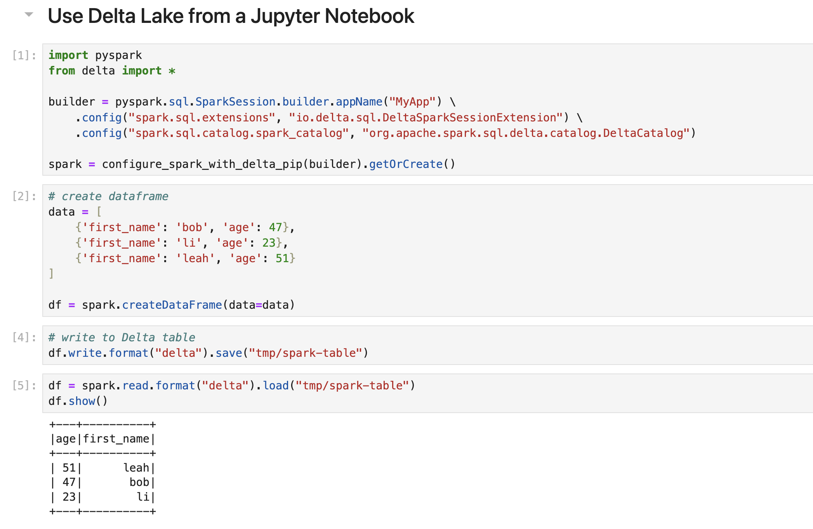
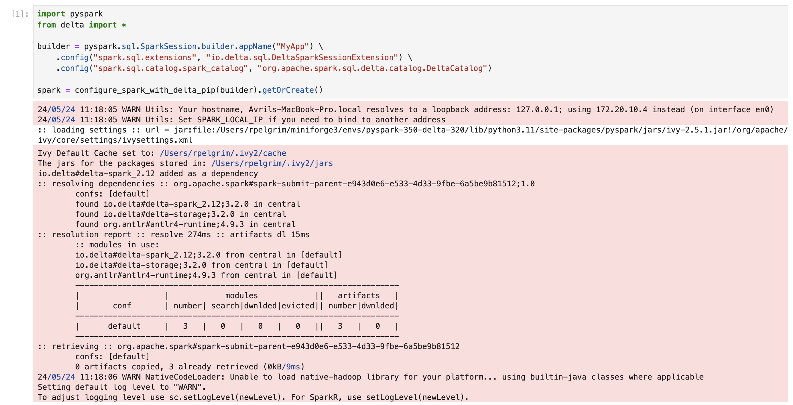
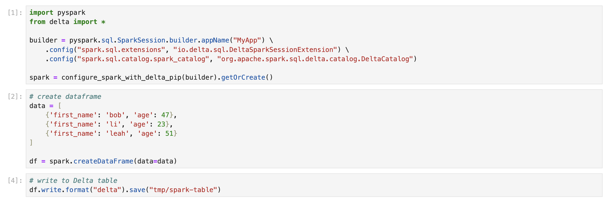
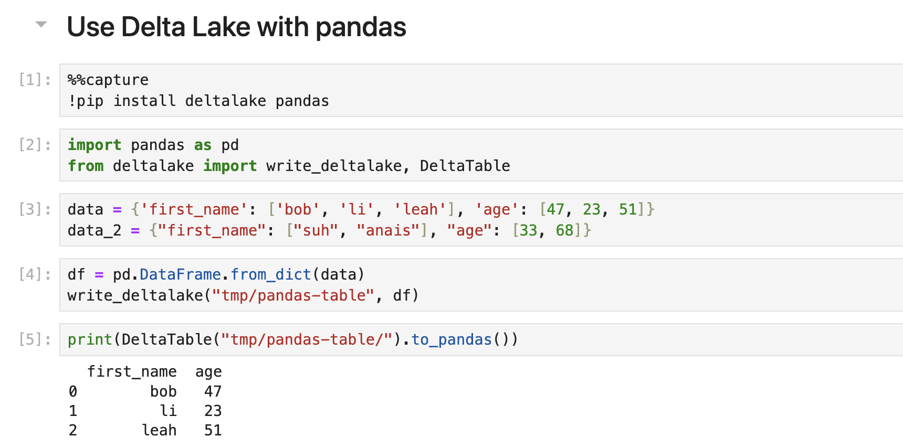

This post shows you how to use Delta Lake in Jupyter Notebooks.

Jupyter notebooks are a great tool for data analysis in Python. They are easy to use and give you an intuitive, interactive interface to process and visualize your data.

Many Python data professionals use Delta Lake from a Jupyter Notebook. This is a great setup for running exploratory data analysis, for collaborating across teams and organizations, and for tasks that require interactive code execution.

This post will show you how you can use Delta Lake from a Jupyter Notebook.



## Delta Lake from a Jupyter Notebook

There are 2 ways to use Delta Lake from a Jupyter Notebook:

1. Use [delta-spark](https://pypi.org/project/delta-spark/) with PySpark
2. Use Python deltalake (aka [delta-rs](https://pypi.org/project/deltalake/)) with other query engines like pandas or polars

Use delta-spark if you are using the Spark query engine. If you are not using Spark yet, you may still want to use delta-spark if you have large enough workloads that would benefit from Spark’s distributed computing.

Use delta-rs if you are more familiar with Python data processing engines like pandas, polars, Dask, Daft and Datafusion.

Let’s dive into using Delta Lake from a Jupyter Notebook with Spark.

## Delta Lake from a Jupyter Notebook with Spark

You can use Delta Lake from a Jupyter notebook with PySpark.

Here is a toy example that shows how you can write and read a Delta Lake table with PySpark.

```
# create a dataframe
data = [
    {'first_name': 'bob', 'age': 47},
    {'first_name': 'li', 'age': 23},
    {'first_name': 'leah', 'age': 51}
]

df = spark.createDataFrame(data=data)

# write data to delta table
df.write.format("delta").save("/tmp/spark-delta-table")

# read delta table
df = spark.read.format("delta").load("/tmp/spark-delta-table")
df.show()

+------------+---------------+
|         age|     first_name|
+------------+---------------+
|[47, 23, 51]|[bob, li, leah]|
|    [33, 68]|   [suh, anais]|
|    [33, 68]|   [suh, anais]|
+------------+---------------+
```

When using Delta Lake with PySpark, you need to make sure that you are using compatible versions. This is a common pain point for users, but it is easily solved.

There are 3 ways to make sure you have the right Delta Lake and PySpark versions:

1. Create a virtual environment that pins the right versions, e.g. with conda.
2. Use the official [Delta Lake Docker image](https://github.com/delta-io/delta-docker).
3. Consult the [compatibility matrix](https://docs.delta.io/latest/releases.html) and install the right versions manually.

### Virtual Environment

The easiest way to ensure you have the right versions of Delta-spark and PySpark is to create a virtual Python environment with Conda. [Conda](https://docs.conda.io/projects/conda/en/stable/#) is a package manager for Python.

To create a conda environment with the latest compatible versions of PySpark and delta-spark, follow the steps below:

1. Create a .yml file with the following contents and name it `pyspark-350-delta-320.yml`:

   ```
   name: pyspark-350-delta-320
   channels:
    - conda-forge
    - defaults
   dependencies:
    - python=3.11
    - ipykernel
    - jupyterlab
    - jupyterlab_code_formatter
    - isort
    - black
    - pyspark=3.5.0
    - pip
    - pip:
      - delta-spark==3.2.0
   ```

   _Note: This creates an environment with the latest PySpark and Delta-spark versions. You can create environments with older compatible versions using the .yml files in the [Delta Examples repository](https://github.com/delta-io/delta-examples/tree/master/envs)._

2. Make sure you have [installed Conda](https://conda.io/projects/conda/en/latest/user-guide/install/index.html).

3. Open a terminal window and create a new conda virtual environment from the .yml file using the following:

   `conda env create -f pyspark-350-delta-310.yml`

4. Activate the environment to use it:

   `conda activate pyspark-350-delta-310.yml`

5. Launch a Jupyter notebook by running `jupyter lab` from the command line. You can select an existing notebook or launch a new one from `File > New > Notebook`.

6. Use Delta Lake with PySpark

Let’s work through a simple example of using Delta Lake with PySpark in a Jupyter notebook.

Start by importing PySpark and Delta Lake and initializing your Spark session:

    ```
    import pyspark
    from delta import *

    builder = (
        pyspark.sql.SparkSession.builder.appName("MyApp")
        .config("spark.sql.extensions", "io.delta.sql.DeltaSparkSessionExtension")
        .config(
            "spark.sql.catalog.spark_catalog",
            "org.apache.spark.sql.delta.catalog.DeltaCatalog",
        )
    )

    spark = configure_spark_with_delta_pip(builder).getOrCreate()
    ```

Next, let’s create some toy data to work with:

    ```
    data = [
        {"first_name": "bob", "age": 47},
        {"first_name": "li", "age": 23},
        {"first_name": "leah", "age": 51},
    ]

    df = spark.createDataFrame(data=data)
    ```

And write this DataFrame out to a Delta Lake table on disk:

    `df.write.format("delta").save("/tmp/spark-delta-table")`

You can read this Delta table back into your Spark session like this:

    ```
    df = spark.read.format("delta").load("/tmp/spark-delta-table")
    df.show()

    +------------+---------------+
    |         age|     first_name|
    +------------+---------------+
    |[47, 23, 51]|[bob, li, leah]|
    |    [33, 68]|   [suh, anais]|
    |    [33, 68]|   [suh, anais]|
    +------------+---------------+
    ```

Now suppose you want to add more data to this Delta table. You can use the “append” write mode:

    ```
    data2 = [
        {'first_name': 'suh', 'age': 33},
        {'first_name': 'anais', 'age': 68},
    ]

    df2 = spark.createDataFrame(data=data2)
    df2.write.format("delta").mode("append").save("/tmp/spark-delta-table/")
    ```

Confirm by reading the Delta table:

    ```
    df = spark.read.format("delta").load("/tmp/spark-delta-table")
    df.show()

    +---+----------+
    |age|first_name|
    +---+----------+
    | 68|     anais|
    | 51|      leah|
    | 33|       suh|
    | 47|       bob|
    | 23|        li|
    +---+----------+
    ```

You can also time travel between different versions of your Delta Lake table with the versionAsOf option. Below we read in version 0, before the append operation:

    ```
    df = (
    spark.read.format("delta")
    .option("versionAsOf",0)
    .load("/tmp/spark-delta-table")
    )
    df.show()

    +---+----------+
    |age|first_name|
    +---+----------+
    | 51|      leah|
    | 47|       bob|
    | 23|        li|
    +---+----------+
    ```

Great work.

Note that you can also create virtual environments with other tools like [poetry](https://python-poetry.org/) or [venv](https://docs.python.org/3/library/venv.htmlhttps://docs.python.org/3/library/venv.html).

### Delta Lake Docker Image

You can also use the official [Delta Lake Docker image](https://github.com/delta-io/delta-docker) to use Delta Lake with PySpark. You will need to have [Docker installed](https://docs.docker.com/get-docker/) on your machine.

To use Delta Lake from a Jupyter Notebook with this Docker image, follow the steps below to build a Docker Image with Apache Spark and Delta Lake installed:

1. Clone the [delta-docker](https://github.com/delta-io/delta-docker) repo to your machine
2. Navigate to the cloned folder
3. Open a terminal window
4. Execute the following from the cloned repo folder:

   `docker build -t delta_quickstart -f Dockerfile_delta_quickstart`

5. Run a container from the image with a JuypterLab entry point

   `docker run --name delta_quickstart --rm -it -p 8888-8889:8888-8889 delta_quickstart`

Alternatively, you can also download the image from DockerHub at Delta Lake DockerHub:

1. `docker pull deltaio/delta-docker:latest` for the standard Linux docker
2. `docker pull deltaio/delta-docker:latest_arm64` for running this optimally on your Mac M1

### Manual Implementation

The final option to run Delta Lake with PySpark is to check the [Compatibility Matrix](https://docs.delta.io/latest/releases.html) in the Delta Lake documentation. You can then manually install compatible PySpark and Delta Lake versions, for example using pip.

This method is fine for quick testing. It is not recommended for production environments that require robust reliability and reproducible notebooks.

## Delta Lake from a Jupyter Notebook with delta-rs

You don’t need to know Spark to use Delta Lake. You can also use Delta Lake from many other Python or SQL query engines, including:

- pandas
- polars
- Dask
- Daft
- Datafusion
- DuckDB

Use [delta-rs](https://delta-io.github.io/delta-rs/) to run analyses with these query engines on Delta Lake tables.

There are no compatibility issues with running delta-rs. To get started, simply `pip install deltalake` along with your favorite query engine.

#### Disabling Logging Output

By default, running PySpark in Jupyter Notebooks can output logging information that is displayed as red lines. This is due to a change in [ipykernel 6.0.0](https://github.com/ipython/ipykernel/releases/tag/6.0.0) which forwards low-level output to your notebook display.
The logging data is purely informational and does not mean anything is wrong with your code.

This can look like something this:



You can disable this logging with the [capture fd output](https://ipython.readthedocs.io/en/stable/config/options/kernel.html#configtrait-IPKernelApp.capture_fd_output) flag in your iPython profile config.

To do so:

1. Run `ipython profile create` from a terminal window
2. Add the following line to your `~/.ipython/profile_default/ipython_config.py` file:
   `c.IPKernelApp.capture_fd_output = False`
3. Important: Clear your browser cache
4. Restart your notebook kernel if you already had it running

Your cell outputs should now look like this:



### Delta Lake from a Jupyter Notebook with pandas

Let’s look at an example with `pandas`.

Open a new notebook and run:

    `!pip install deltalake pandas`

Import pandas and deltalake:

    ```
    import pandas as pd
    from deltalake import write_deltalake, DeltaTable
    ```

Define data dictionaries:

    ```
    data = {'first_name': ['bob', 'li', 'leah'], 'age': [47, 23, 51]}
    data_2 = {"first_name": ["suh", "anais"], "age": [33, 68]}
    ```

Create a DataFrame with the first dictionary and write it to a Delta Lake table:

    ```
    df = pd.DataFrame.from_dict(data)
    write_deltalake("tmp/pandas-table", df)
    ```

Load the Delta table to check the results:

    ```
    DeltaTable("tmp/pandas-table/").to_pandas()

    first_name  age
    0        bob   47
    1         li   23
    2       leah   51
    ```

Let’s append the rest of the data:

    ```
    df2 = pd.DataFrame(data_2)
    write_deltalake("tmp/pandas-table", df2, mode="append")
    ```

Read it back in to double-check:

    ```
    DeltaTable("tmp/pandas-table/").to_pandas()

    first_name  age
    0        bob   47
    1         li   23
    2       leah   51
    3        suh   33
    4      anais   68
    ```

You can time travel to a previous version using the version keyword:

    ```
    DeltaTable("tmp/pandas-table/", version=0).to_pandas()

    first_name  age
    0        bob   47
    1         li   23
    2       leah   51
    ```



Refer to the [Integrations page](https://delta-io.github.io/delta-rs/integrations/delta-lake-arrow/) in the Delta-rs documentation for more information on using Delta Lake with other query engines like [polars](https://delta-io.github.io/delta-rs/integrations/delta-lake-polars/), [Dask](https://delta-io.github.io/delta-rs/integrations/delta-lake-dask/), [Daft](https://delta-io.github.io/delta-rs/integrations/delta-lake-daft/) and others.

### Using a Virtual Environment

While `pip install` works, it is not recommended for production-grade workloads that require reliability and reproducible notebooks. In these cases, it is better to define a virtual environment. You can do so with conda and a .yml file containing the following:

    ```
    name: deltalake-minimal

    channels:
    - conda-forge
    - defaults
    dependencies:
    - python=3.11
    - ipykernel
    - pandas
    - polars
    - jupyterlab
    - deltalake
    ```

Follow the steps in the PySpark section above to create a Conda environment with this .yml file, activate it, and run a Jupyter notebook.

## Running Delta Lake from a Jupyter Notebook

There are many ways to run Delta Lake from a Jupyter Notebook.

If you’re using Spark, use delta-spark with a conda virtual environment to ensure compatible PySpark and delta-spark versions. Alternatively, you can also use the official Docker image.

If you’re not using Spark, use delta-rs with your favorite query engine. You can simply pip install these libraries, but the recommended approach is to build a virtual environment.

We welcome contributions to the [Delta Examples](https://github.com/delta-io/delta-examples) repository with Jupyter notebooks that showcase Delta Lake features that would benefit the community!
