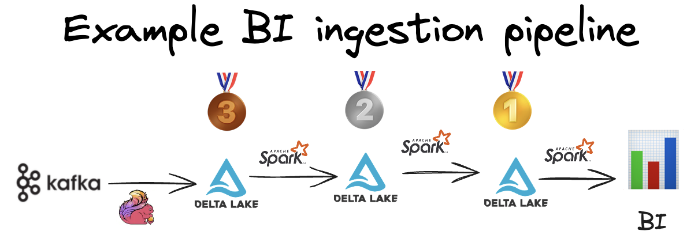
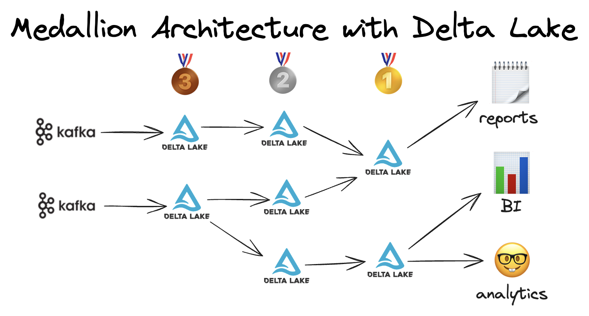

This post explains how to build ETL pipelines with the Medallion architecture using Delta Lake tables.

The Medallion architecture organizes data flow into three stages of data tables:

* Bronze: raw ingested data  
* Silver: cleaned/joined datasets  
* Gold: business-level aggregates

The Medallion architecture is a great framework for solving many business use cases, such as BI, reporting, AI, and ML. This post explains when to leverage the Medallion architecture and its flexible nature.

Delta Lake is a great open table format for building pipelines with the Medallion architecture because it supports reliable transactions, is suitable for small and large datasets, and has many built-in features that speed up processing time.

Let’s see how to build a Medallion architecture like this:  



## Medallion architecture example

Suppose you're building a BI interface for an e-commerce company's accounting department. The department would like to track total sales and revenue for a given product over different time periods.

The company ingests 1 GB of transaction data every minute on average.  Transaction volume varies throughout the day: it's lower while people are asleep in the US time zone, and much higher during special sales like Cyber Monday.  Scaling compute and storing the data in “right-sized” files is challenging because the data ingestion volume is volatile.

The team would like the dashboard to load quickly.  The dashboard should be updated with data every hour, but the computations don't have to be exact (a small margin of error is OK on the dashboard to lower the time it takes to load the dashboard).

The team has decided to architect the pipeline as follows:

* Use Kafka and Flink to ingest transaction data into bronze Delta tables.  
* Use Spark to join datasets, clean the data, and create silver Delta tables.  At the silver level, the transactions are deduplicated and the raw transactions are joined with the customer table.  
* Use Spark to compute HyperLogLog (HLL) sketches with customer-level aggregates that are persisted in gold Delta tables.  The HLL sketches are a good way to allow for low-latency queries with approximate results.  The dashboard tool can quickly compute various customer insights based on these gold tables.  
* Use a BI tool that queries the gold Delta tables to build dashboards. This will give the business updated insights into customer behavior and allow it to easily query different time periods.

Here's a visual representation of the architecture:



The Medallion architecture is a great conceptual framework to architect this data pipeline and add business value.

Let's look at some of the Delta Lake features that are useful for this Medallion architecture pipeline.

## Delta features that help with the Medallion architecture

There are many Delta Lake features that can help this Medallion architecture-based pipeline run efficiently.

[**Reliable transactions**](https://delta-io.github.io/delta-rs/how-delta-lake-works/delta-lake-acid-transactions/)

Delta Lake supports reliable transactions that have ACID properties.

Data lakes don’t support transactions and are less reliable. They lack consistency (built-in schema enforcement/column constraints), atomicity (either the transaction fully completes or fully fails), and isolation (guarantees sequential transactions).

Data ingestion pipelines that use data lakes are easily corrupted because they don’t support reliable transactions.

[**Small file compaction**](https://delta.io/blog/2023-01-25-delta-lake-small-file-compaction-optimize/)

This data ingestion pipeline writes data from Kafka to a Delta table every minute, which can create many small files. Data engines work best for “right-sized files”—files that are too small have excessive I/O overhead, and files that are too big aren’t optimized for file-skipping.

[**Change Data Feed**](https://delta.io/blog/2023-07-14-delta-lake-change-data-feed-cdf/)

Enabling the Change Data Feed allows downstream systems to perform efficient incremental updates.  For example, you can enable the CDF on the silver table and use it to intelligently increment the business aggregates in the gold table, without doing a full refresh every time the pipeline is run.

Incremental updates and much faster and cost-efficient than full refreshes.

[**Deletion vectors**](https://delta.io/blog/2023-07-05-deletion-vectors/)

Deletion vectors allow delete, update, and merge operations (“DML operations”) to run faster with Delta Lake than with data lakes.

The Medallion architecture can benefit from fast DML operations.  For example, you may wish to ingest data into the bronze table and then clean some messy records and deduplicate rows.  This ELT design pattern is possible with Delta Lake and isn’t possible with a data lake.

**Liquid clustering**

Delta Lake offers Liquid clustering to colocate similar data in the same files so downstream queries can run faster. Hive-style partitioning and Z-ordering are other ways to group similar data, but they have downsides.

Liquid clustering is great for the gold tables in this example, so the BI tool can provide a low-latency end-user experience.

**Multi-engine support**

Delta Lake supports Spark and [many other engines](https://delta.io/blog/delta-lake-without-spark/).  When you use Delta Lake to build your Medallion architecture pipeline, you have the flexibility to pick and choose the best engine for each stage of the pipeline.  This is critical, especially as the data sizes and query latency needs vary greatly across different pipeline stages.

**And many more…**

Delta Lake has many other features that are useful for building robust ETL pipelines.  We can’t list all the features here, but check out the other Delta Lake key features to learn more.

## Medallion architecture with Unity Catalog

Unity Catalog has a three-level namespace useful for organizing your Medallion architecture tables. Let’s see how Unity Catalog namespaces organize the data from our example application.

Here is how Unity Catalog namespaces tables: catalog\_name.schema\_name.table\_name.

Let’s look at how an organization can namespace tables for the Medallion architecture:

```
something_cool  
  bronze  
    raw_transactions  
    table_b  
  silver  
    user_transactions  
    table_b  
  gold  
    user_transactions  
    users
```
  
When you see something\_cool.bronze.raw\_transactions, you can easily identify that the table contains raw ingested data.

something\_cool.gold.user\_transactions gives the clear message that the table contains business-level aggregates.

Unity Catalog provides a convenient way to namespace tables with the Medallion architecture.

## When to deviate from the Medallion architecture

The medallion architecture is just a name for a "tier"-based architecture. Thinking about your data flow in stages, you can arbitrarily combine those states to suit your needs.

Organizations that adopt the Medallion architecture should follow it in a flexible manner.  

For example, you can build a gold table by joining a bronze table and a silver table. You don’t need to consume only silver tables when constructing gold tables.

Other ways to architect a data platform, like dimensional data modeling, should also be considered. To build the best data architecture, you need to consider the query patterns, data distribution, and end-user needs.

As Simon mentions in this excellent video, you don’t have to build your data architecture with the Medallion model or use the “Medallion nomenclature” like bronze, silver, and gold:

[https://www.youtube.com/watch?v=fz4tax6nKZM](https://www.youtube.com/watch?v=fz4tax6nKZM)

Use whatever architecture makes the most sense for your business.

## Medallion architecture in team environments

The Medallion architecture is also great for collaborating between many teams in an organization.  For example, the data engineering team may be responsible for ingesting the data and building the bronze, silver, and gold tables.

The data scientists may simply consume the gold tables with engines like PyTorch and Ray to perform advanced analytics.

The data analysts may also simply query the gold tables to generate their reports. It’s possible that they simply query tables and don’t need to create any tables.

Properly abstracting tables with the Medallion architecture allows you to better apply data governance with tools like Unity Catalog.

## Conclusion

The Medallion architecture is a good conceptual framework for building ETL pipelines, separating work across teams, and solving business problems like BI, reporting, and advanced analytics.

It’s best viewed as an optional, flexible framework.  Feel free to adapt it to the needs of your business or select an entire architecture altogether if that makes more sense.

Delta Lake is a great open table format for building the Medallion architecture because it supports reliable transactions, is interoperable with multiple engines, and has features that are useful for each stage of the ETL pipeline.
