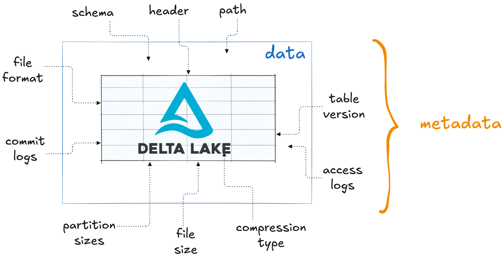
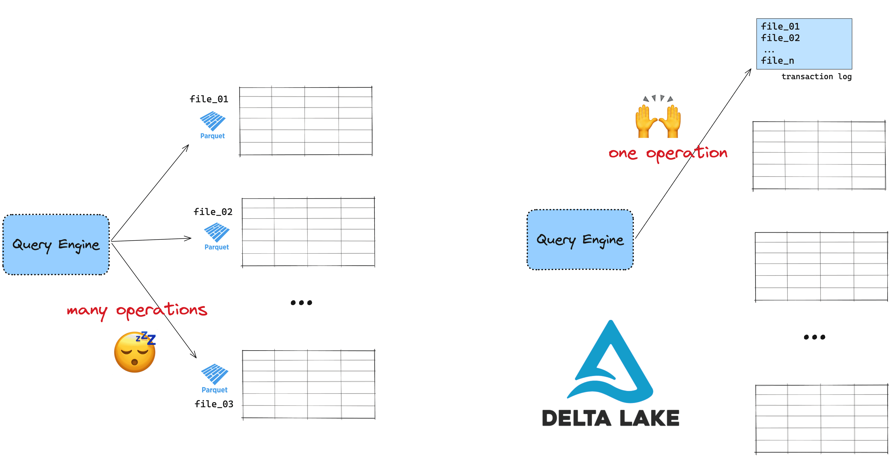

This article explains how Delta Lake handles metadata to make your computations faster and more secure. It gives an overview of metadata management and explains why an [open table format](https://delta.io/blog/open-table-formats/) like Delta Lake is better than conventional file formats that have more limited metadata handling capability.

To get the most value from your data it needs to be in a format that can be analyzed as quickly as possible with a minimum amount of data conflicts or errors. Good metadata management in Delta Lake makes this possible by allowing for efficient data skipping, reliable ACID transactions and other great features like time travel, schema enforcement and schema evolution.

As we'll see in this article, Delta Lake's metadata management will make your workflows faster and more reliable compared to traditional file formats like CSV, JSON and Parquet.

Let's jump in to take a closer look.

## What is metadata?

Metadata is information that describes your data. It includes details like file size and path, column names, statistics, and more – basically, anything that describes the characteristics of your dataset.



Different file formats handle metadata in different ways. Some file formats store only basic information, while others store more detailed metadata. More advanced metadata usually supports faster and more reliable data processing through data skipping and transaction guarantees.

How metadata is stored also affects query performance. For example, Parquet stores metadata in the row group footer, while open table formats like Delta Lake store it in a dedicated directory. This affects the efficiency, security, and performance of your data storage and workloads. You should always choose the right format and platform based on your metadata needs.

## Why is metadata important?

Metadata is important because it can enable many powerful data processing features that can speed up your data queries and make your workflows more secure and reliable.

Advanced metadata management supports features like:

- [Advanced data skipping](#add-link-when-live)
- [ACID transactions](#add-link-when-live)
- [Time travel](https://delta.io/blog/2023-02-01-delta-lake-time-travel/)
- [Schema enforcement](https://delta.io/blog/2022-11-16-delta-lake-schema-enforcement/)
- [Schema evolution](https://delta.io/blog/2023-02-08-delta-lake-schema-evolution/)
- CRUD operations

The power of good metadata becomes very clear when we take a look at different file formats. The following sections compare metadata handling for CSV, JSON, Parquet and Delta Lake.

## Metadata in CSV

CSV (Comma-Separated Values) files store data in a simple text format. Each row is a line of text, and values are separated by commas. This makes CSV files easy to create and share.

But CSV files do not store extra information about the data. There is no built-in way to save details like column types, min/max values, or how the data should be interpreted. The only primitive form of metadata that is included is the column names in the file header. This means that:

- Your query engine cannot check column types automatically
- There is no information about missing or null values
- The file does not store any statistics to help with data skipping

Because of this, working with large CSV files can be slow. Query engines have to read the entire file from top to bottom and infer data types. They cannot quickly find the data you need. If you run complex queries often, CSV is not the best choice.

## Metadata in JSON

JSON is a popular file format for storing and exchanging data. It organizes data into key-value pairs, making it both human-readable and easy for machines to parse.

JSON includes some basic metadata because of its key-value format. Just like CSV, it registers the column names using the key names. On top of this it also includes information about data types. For example:

```JSON
{
  "name": "Alice",
  "age": 30,
  "isMember": true
}
```

In this example, the keys `name`, `age`, and `isMember` are the column names and the data types are easily inferred from the values: “Alice” (`string`), 30 (`integer`) and true (`boolean`).

As you can see, JSON's metadata capabilities are still quite basic. JSON can describe simple relationships (e.g., key-value pairs) but it lacks the built-in support for complex metadata handling like min/max values, null counts, or statistics for optimizing queries. There are extensions like JSON Schema that allow for more detailed data descriptions, but these are not natively part of JSON and require additional implementation.

## Metadata in Parquet

Apache Parquet is a columnar storage format built to handle big data efficiently. It is designed specifically to store metadata alongside the data which helps to speed up queries and improve performance.

Parquet stores your metadata in the file footer of each partition. It stores metadata for each column and row group in your data. This includes:

- **Min/Max values** for each column
- **Null counts** to know how many missing values there are
- **Distinct counts** to estimate how many unique values exist

This metadata helps query engines quickly figure out if a column's data is relevant to your query. For example, if you query for records where `"age > 30"`, the engine can check the min and max values for the column and skip entire row groups if they don't match the condition. This is called predicate pushdown, and it speeds up your queries.

```python
# Read a large Parquet file
df = spark.read.format("parquet").load("transactions.parquet")

# Query with a filter using predicate pushdown
filtered_df = df.filter("amount > 10000")
```

Parquet offers much better metadata management than basic formats like CSV and JSON. But the optimizations with Parquet are limited by the fact that the metadata are stored in the file footer of each partition. Your query engine has to read each file's footer to get statistics. If you have many files, this can slow down queries because the engine must open each file to check the metadata.

Delta Lake builds on Parquet to improve data query performance and reliability even further.

## How Delta Lake handles metadata

Delta Lake is an [open table format](https://delta.io/blog/open-table-formats/) that stores your data along with valuable metadata in an advanced storage framework.

Delta Lake tables consist of:

1. Your tabular data stored using a best-in-class file format (Parquet)
2. Metadata stored in a separate transaction log


The Delta Lake transaction log supports powerful features like ACID transactions, time travel and more advanced data skipping. Read the [Delta Lake vs Data Lake](https://delta.io/blog/delta-lake-vs-data-lake/) article for a full discussion of each of these features.

While Parquet stores metadata in the footer of each partition file, Delta Lake instead stores all metadata in a single centralized transaction log. This is smarter because when you run a query, your engine can directly check this log with a single request, instead of checking each file footer in the case of Parquet. This makes your queries run much faster.



Because Delta Lake stores metadata at the file-level, query engines can skip entire files. This is more efficient than Parquet data skipping, which needs to iterate over multiple row groups within each file.

## Delta Lake Metadata example

Here's what data stored with Delta Lake looks like on disk:

```
your-delta-table			<-- your delta directory
├── _delta_log			        <-- the transaction log
│   └── 00000000000000000000.json
│   └── 00000000000000000001.json
└── part-00001.snappy.parquet	        <-- partitioned data
└── part-00002.snappy.parquet
```

The Parquet files store the data that was written. The `_delta_log` directory stores metadata about the transactions in lightweight JSON files.

Here's an example of a transaction log file:

```
[
  {
    "commitInfo": {
      "timestamp": 1732724288380,
      "operation": "WRITE",
      "operationParameters": {
        "mode": "ErrorIfExists",
        "partitionBy": "[]"
      },
      "isolationLevel": "Serializable",
      "isBlindAppend": true,
      "operationMetrics": {
        "numFiles": "1",
        "numOutputRows": "2",
        "numOutputBytes": "728"
      },
      "engineInfo": "Apache-Spark/3.5.1 Delta-Lake/3.2.0",
      "txnId": "1d77c975-36ec-4478-acea-8238d9a48621"
    }
  },
  {
    "metaData": {
      "id": "bb096c5c-6024-48fc-a380-aefa9e0f1c18",
      "format": {
        "provider": "parquet",
        "options": {}
      },
      "schemaString": "{\"type\":\"struct\",\"fields\":[{\"name\":\"name\",\"type\":\"string\",\"nullable\":true,\"metadata\":{}},{\"name\":\"Age\",\"type\":\"long\",\"nullable\":true,\"metadata\":{}}]}",
      "partitionColumns": [],
      "configuration": {},
      "createdTime": 1732724288236
    }
  },
  {
    "protocol": {
      "minReaderVersion": 1,
      "minWriterVersion": 2
    }
  },
  {
    "add": {
      "path": "part-00000-39306d80-39cf-489d-ab99-0066f21aa0d6-c000.snappy.parquet",
      "partitionValues": {},
      "size": 728,
      "modificationTime": 1732724288370,
      "dataChange": true,
      "stats": "{\"numRecords\":2,\"minValues\":{\"name\":\"Aysha\",\"Age\":27},\"maxValues\":{\"name\":\"Jasper\",\"Age\":44},\"nullCount\":{\"name\":0,\"Age\":0}}"
    }
  }
]
```

You don't need to know exactly what all of this means. What's important to note is that the transaction log file contains the following information:

- the files added to the Delta table (under `"add"`)
- schema of the data (`schemaString`)
- column level metadata including the min/max value for each file (`minValues` and `maxValues`)
- other metadata stats like timestamps, write mode, engine info etc.

To learn more about how the transaction log works, check out the detailed [Delta Lake Architecture](#add-when-live) post.

## Modern Metadata Handling for Better Data Workflows

Good metadata management can make your data processing much faster and more reliable. Formats like CSV and JSON provide only basic metadata, which can slow down queries. Parquet improves on this with better metadata storage, but it still has limitations. Delta Lake takes performance gains and data security further by storing metadata in a centralized log, making queries faster and giving reliability guarantees through ACID transactions. Whenever possible, you should choose a data storage format with the most advanced metadata support to improve your data workflows.
