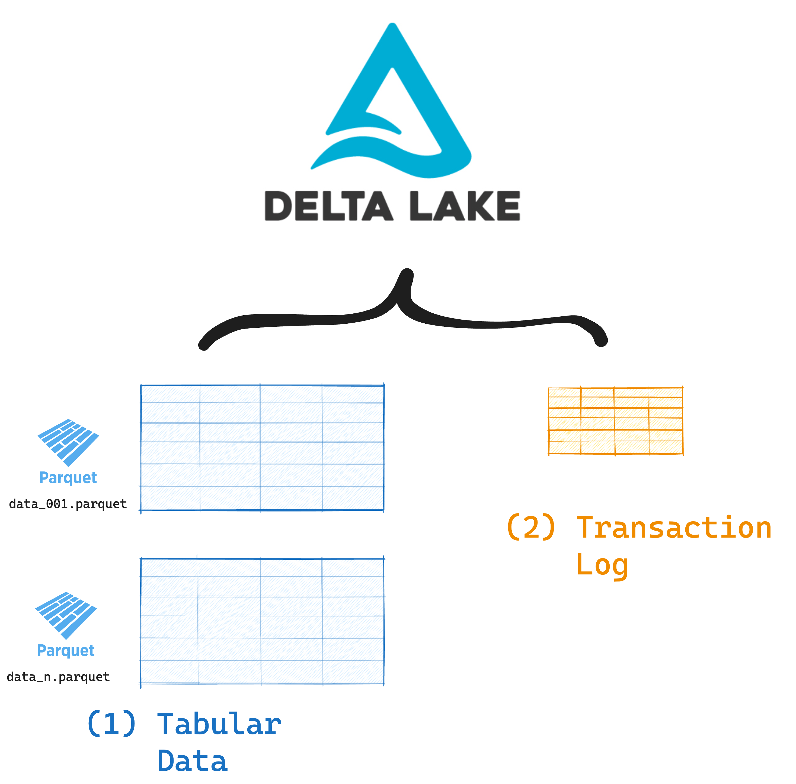

This post explains how you can build orchestration pipelines with Delta Lake.

Data orchestration is the process of automating, deploying, and monitoring your data workflows. Using orchestration lets you build repeatable data transformation pipelines that are easy to schedule, observe and debug. Popular open-source orchestration tools include Apache Airflow, Dagster, Prefect, and many others.

Delta Lake is an open-source storage framework that has great features to make your orchestration pipelines faster, more reliable and error-proof. This article will explain why Delta Lake is a great storage format for orchestration pipelines. We will work through a hands-on example with Dagster.

Let's jump in.

## What is Delta Lake?

Delta Lake is an open-source storage framework built on top of Apache Parquet. By adding a transaction log to regular Parquet files, Delta Lake adds powerful features like ACID transactions, schema enforcement, time travel, and more. It turns your [data lake into a Lakehouse](https://delta.io/blog/delta-lake-vs-data-lake/).

A Delta Lake table consists of two components:

1. Your **tabular data** stored in Parquet files
2. A **record of all changes** to the data stored in the transaction log



Delta Lake was first developed to work with Apache Spark. There are also many great ways to use [Delta Lake without Spark](https://delta.io/blog/delta-lake-without-spark/), using engines like pandas, polars, Trino, Presto and many others.

## Why should I use Delta Lake for orchestration pipelines?

Orchestration pipelines are all about reliability. You need to know that every step runs safely, even if something fails halfway through. You typically also want fast reads, easy updates, and the ability to debug issues.

Delta Lake gives you:

- **Atomic writes:** Avoid partial or broken data.
- **Versioned data:** Roll back or audit anytime.
- **Schema control:** Prevent data corruption.
- **Interoperability:** Read/write from different query engines and programming languages.

You can plug Delta Lake into your orchestration system to optimize your performance and safeguard your data quality.

## Delta Lake for orchestration: Performance

Delta Lake is designed to speed up your queries and data transformations.

It gives you:

- **Fast metadata access:** Delta Lake keeps track of file paths, schema details, and operations in a centralized transaction log. This avoids expensive directory scans and rewrites and lets your queries run faster.
- **Smart data skipping:** Instead of scanning every file, Delta Lake checks file-level metadata to figure out which files to read. This cuts down I/O and boosts speed, especially for large datasets.
- **Organized storage:** Delta can group related data together using techniques like [Z-Ordering](https://delta.io/blog/2023-06-03-delta-lake-z-order/) and [Liquid Clustering](https://delta.io/blog/liquid-clustering/). This improves filtering and makes data skipping more efficient.

Imagine an orchestration pipeline that consumes event data from Kafka every 5 minutes. Each batch of events is processed and stored for reporting. If you're writing to an immutable file format like Parquet, each batch creates a new file. You'll end up with hundreds or even thousands of files. Querying all the data means scanning and stitching together every one of those files, which slows things down.

With Delta Lake, you can write each batch directly into a single Delta table. That table keeps track of all versions, so you can inspect changes or roll back if something breaks. It also makes querying easy. You can just run a single query against the table and Delta Lake will take care of skipping the files you don't need.

## Delta Lake for orchestration: Reliability

Delta Lake uses ACID transactions to make your data pipelines more reliable. This means every write is all-or-nothing: it either gets completed or fails. You don't have to worry about partial files or broken tables.

Other formats like CSV or Parquet don't have this. If your job crashes halfway through a write, you'll be left with incomplete files. Those files can break your downstream reads by corrupting your tables. This can be a real pain for orchestration pipelines, where one broken step can ruin the whole flow.

Delta Lake protects you by guaranteeing:

- **No partial writes:** A job either writes everything or nothing at all.
- **No corrupted tables:** If your write breaks any schema rules, Delta Lake blocks it.
- **No conflicting updates:** Delta supports safe parallel jobs to avoid clashes.
- **No silent data loss:** Every change is logged safely, even if your cluster fails.

Let's say you have a multi-step pipeline that processes incoming orders every hour. One task filters bad records, another task joins data, and the final step writes clean records to a table. If you use Parquet and the final step fails halfway, you'll end up with broken output. The next job might read bad files or miss important data. With Delta Lake, that last step is one atomic transaction. If it fails halfway, no data is written. Your pipeline stays clean, and your team won't waste hours debugging.

## Delta Lake orchestration example with Dagster

[Dagster](https://dagster.io/) is a modern orchestration tool that lets you build and manage pipelines in Python. You define units of logic as Assets and Dagster takes care of efficient and error-prone orchestration. Delta Lake integrates with Dagster through the[ dagster-delta library](https://delta-io.github.io/delta-rs/integrations/delta-lake-dagster/). This library uses the Rust-based[ delta-rs](https://github.com/delta-io/delta-rs) engine under the hood.

Let's say you're building a Dagster pipeline to process daily customer sign-ups. New data arrives each day via a REST API and gets written to a Delta Lake table after some basic cleaning and validation.

Here's a simple pseudo-code example of what the pipeline might look like:

```python
from dagster import asset
from deltalake.writer import write_deltalake
import pandas as pd
import requests
import datetime

@asset
def fetch_customer_data() -> pd.DataFrame:
    # Simulate an API call
    response = requests.get("https://my.api/customers")
    data = response.json()
    return pd.DataFrame(data)

@asset
def clean_data(fetch_customer_data: pd.DataFrame) -> pd.DataFrame:
    df = fetch_customer_data.copy()
    df = df.dropna(subset=["email"])
    df["signup_date"] = pd.to_datetime(df["signup_date"])
    return df

@asset
def write_to_delta(clean_data: pd.DataFrame):
    today = datetime.date.today().isoformat()
    path = f"data/customers"

    # Use Delta Lake writer to append today's clean records
    write_deltalake(
        path,
        clean_data,
        mode="append", # Append new data
        overwrite_schema=False,  # Enforce schema consistency
    )
```

Using Delta Lake means that we can append new data to a single table. The `overwrite_schema=False` guarantees schema consistency and avoids data corruption. Downstream systems can now query the Delta Lake table and use the query optimizations features like advanced data skipping to read relevant data quickly.

Take a look at the [dagster-delta documentation](https://delta-io.github.io/delta-rs/integrations/delta-lake-dagster/) for more information.

## When should I use Delta Lake for orchestration pipelines?

You can use Delta Lake to make your orchestration pipelines faster and more reliable.

Delta Lake is a great fit for orchestration workflows if:

- You're working with large datasets and want better performance
- You care about data reliability and avoiding corruption
- You want to track and roll back changes easily
- You don't want to deal with lots of small files

Delta Lake supports orchestration pipelines with features like fast reads, ACID transactions, schema enforcement, and time travel. It also works well with many different query engines, so you can mix and match your pipeline tools as needed.
