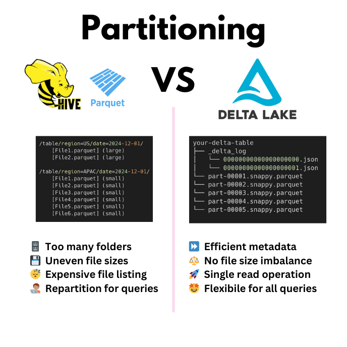

Partitioning can be a good way to organize your data for faster query speeds. If you’re using Delta Lake, it’s important to understand how partitioning works and when you should use it. This article will break it down for you.

Here are the main takeaways:

1. **You generally don’t need to partition your Delta Lake tables** unless:

   - Your table exceeds 1TB in size
   - You need to retain compatibility with legacy-systems like Hive-style partitioned data lakes.

2. **Liquid clustering will give you the best performance** out-of-the-box for most use cases. Liquid clustering is not compatible with partitioning.
3. If you’re going to partition, **use partitions of at least 1GB each**. Tables with fewer, larger partitions tend to outperform tables with many smaller partitions.
4. If you can’t use liquid clustering, **you can use partitioning and Z-ordering together** for better optimization

This article will show you the reasoning behind these main takeaways. We will cover:

- What table partitioning is
- How to create a Delta table with partitions
- What partitioning looks like on disk.
- How Delta Lake partitioning compares to other systems like Hive.
- How Hive-style partitioning compares to Delta Lake features like Z-Ordering and Liquid Clustering

Let’s dive in!

## What is table partitioning?

When you partition a table, you split your data into smaller chunks based on the values in a specific column. Each chunk gets its own folder in the table’s storage.

This is a common strategy to improve query speeds. When a query filters on the partitioned column, your query engine only has to access the folder for that column. This strategy is often called Hive-style partitioning. Apache Spark implements this kind of partitioning by default when writing Parquet files.

Here’s what a Hive-style partitioned table might look like on disk:

```bash
spark-warehouse/sales_data
├── region=East
│   ├── part-00001.snappy.parquet
│   └── part-00002.snappy.parquet
└── region=North
    └── part-00003.snappy.parquet
└── region=South
    └── part-00003.snappy.parquet
    └── part-00004.snappy.parquet
    └── part-00005.snappy.parquet
└── region=West
    └── part-00006.snappy.parquet
```

The partitions are stored as separate directories on disk and is therefore also called “physical partitioning”.

## How to create a Delta table with partitions

Delta Lake supports physical table partitioning.

Let’s demonstrate with some toy data. Create a DataFrame containing sample sales data with columns `customer`, `order_date`, `region`, and `sales`.

```python
# Sample data
data = [
    ("Epic Shop", "2023-12-01", "East", 100),
    ("Some Office", "2023-12-01", "West", 200),
    ("Family Business", "2023-12-02", "East", 150)
]
columns = ["customer", "order_date", "region", "sales"]
df = spark.createDataFrame(data, columns)
```

You can partition this table by the `region` column using the `.partitionBy(<column_name>)`option. Delta Lake will create folders for each region. Inside each folder, you’ll find Parquet files containing the data for that region.

```python
# Write with partitioning
(
    df.write.format("delta")
    .partitionBy("region")
    .saveAsTable("sales_data")
)
```

Future queries on the `region` column will now run faster.

After running the table partitioning command, your storage will look like this:

```bash
├── _delta_log
│   ├── 00000000000000000000.json
│   └── _commits
├── region=East
│   ├── part-00001.snappy.parquet
│   └── part-00002.snappy.parquet
└── region=West
    └── part-00003.snappy.parquet
```

Each folder has Parquet files holding the data for that region.

## Delta Lake doesn’t rely on physical partitioning

Delta Lake doesn’t rely on physical partitioning to improve query performance. It keeps all partition information as metadata in the transaction log. This makes query planning faster because Delta Lake can skip globbing nested directory trees and performing expensive file-listing operations. Read more about the transaction log in the [Delta Lake Architecture]() post.


## Why Delta Lake is better than Hive-style partitioning

Hive-style partitioning uses the physical directory structure to organize your partitions. This means that query engines need to perform file listing operations to find files in a partition.

File-listing operations can be slow when:

1. Your data is stored in cloud object storage, which use key-value systems
2. You have many small partitions, leading to the Small File Problem

Delta tables don’t have problems with slow file listing because they store partitioning information as metadata in the transaction log. This means that a Delta reader can access the transaction log directly to identify the files it needs for your query. Your query engine doesn’t need to look at the filesystem and perform expensive file listing operations.



## Why Delta Lake maintains physical partitioning

Delta Lake only maintains the Hive-style directory structure to support compatibility with legacy systems. You can easily [convert a partitioned Parquet dataset to Delta Lake](https://delta.io/blog/2022-09-23-convert-parquet-to-delta/) – or the other way around – because Delta Lake uses the Hive-style partitioning structure.

Technically speaking, this directory structure is unnecessary for Delta Lake’s performance. Query engines only need to access the Delta Lake transaction log to see if and how the table is partitioned and where it can find the files it needs to run the requested query.

### How to convert Delta Lake to Parquet data lake

It’s easy to convert a Delta table into a Parquet data lake with Hive-style partitions. Because Delta Lake maintains the option to perform physical partitioning, all you need to do is:

1. Run the VACUUM command with a retention period of 0 hours. This will delete all data files that do not belong to the latest version of the table.
2. Delete the `_delta_log` directory to remove the transaction log.

You usually don’t want to do convert from Delta Lake to Parquet if you can avoid it. Delta Lake is almost always faster and more reliable than a Parquet data lake. Read a detailed comparison in the [Delta Lake vs Data Lake](https://delta.io/blog/delta-lake-vs-data-lake/) post.

Sometimes you will have to convert Delta tables to Parquet anyway to support compatibility with older systems. In those cases, you can follow the code below:

```python
# disable vacuum safety check
spark.conf.set(
    "spark.databricks.delta.retentionDurationCheck.enabled", "false"
)
# vacuum old data
spark.sql("VACUUM sales_data RETAIN 0 HOURS")

# remove _delta_log
! rm -r spark-warehouse/sales_data/_delta_log/
```

Note that you need to disable the default `retentionDurationCheck` first. Otherwise your VACUUM command with a 0 HOURS interval will error out.

Your files on disk should now look like this:

```bash
spark-warehouse/sales_data
├── region=East
│   ├── part-00001.snappy.parquet
│   └── part-00002.snappy.parquet
└── region=West
    └── part-00003.snappy.parquet
```

This is a regular Parquet data like with Hive-style partitions. Read more about using the vacuum command in [this blog post](https://delta.io/blog/2023-01-03-delta-lake-vacuum-command/).

## When should I partition my Delta table?

You generally don’t need to physically partition your Delta table if you’re working with tables under 1TB in size. Query engines read the transaction log to find the paths to underlying files and physical partitioning does not speed this process up.

The only situations in which you might want to partition your Delta table are when:

- Your table **exceeds 1TB in size**, or
- You need to **retain compatibility** with Hive-style partitioned data lakes.

If your data might need to be converted to a Parquet data lake downstream, then physical partitioning allows for easy conversion using the code strategy demonstrated in the previous section. If your table is larger than 1TB, then physical partitioning can sometimes speed up your queries. Most performance gains from partitioning only benefit very large tables (100TB and above).

## Delta Lake Partitioning and Z-Ordering

Z-Ordering is a Delta feature that groups related rows together in the same files. It uses a clustering technique to sort your data in multiple dimensions. For example, rows with similar values for `region` and `date` will end up close together. This will make your queries on either or both of those columns run faster.

In short:

- **Partitioning** reduces the data scanned by skipping entire folders. It’s great for predictable filtering on a single column.
- **Z-Ordering** reduces the data scanned within each folder. It’s better for filtering on multiple columns, especially non-partitioned ones.

Z-ordering gives you more flexibility than Hive-style partitioning because you don’t need to optimize for a single column. You can also use Z-ordering and physical partitioning together: partition first, then Z-Order inside those partitions.

Here’s how to use partitioning and Z-ordering together:

```python
# Partition by region
df.write.format("delta") \
    .partitionBy("region") \
    .save("/path/to/partitioned-table")

# Apply Z-Ordering
spark.sql("OPTIMIZE '/path/to/partitioned-table' ZORDER BY (order_date)")
```

Now, your queries on both `region` and `order_date` will be much faster. Read more about how to work with z-ordering in the [Delta Lake Z-Order](https://delta.io/blog/2023-06-03-delta-lake-z-order/) post.

## Delta Lake Partitioning vs Liquid Clustering

For Delta Lake 3.1.0 and above, the Liquid Clustering feature is the recommended optimization technique to organize your data for best query performance.

While partitioning and Z-ordering are still supported, liquid clustering is generally faster and gives you flexibility to redefine your clustering columns without having to rewrite any existing data. This allows your data layout to evolve smoothly in parallel with downstream query patterns.

You have to enable liquid clustering to use this feature. Note that liquid clustering is not compatible with physical partitioning or Z-ordering.

```python
# Create an empty table with liquid clustering enabled
DeltaTable.create()
  .tableName("table1")
  .addColumn("col0", dataType = "INT")
  .addColumn("col1", dataType = "STRING")
  .clusterBy("col0")
  .execute()
```

Read more about how to use the liquid clustering feature in the [Delta Lake documentation](https://docs.delta.io/latest/delta-clustering).

Once liquid clustering is enabled, run OPTIMIZE jobs as normal to incrementally cluster data. Read more about optimizing your Delta tables in the [Delta Lake Optimize](https://delta.io/blog/delta-lake-optimize/) post.

Liquid Clustering is almost always better than physical partitioning because it:

- Removes the need to manually predefine partition columns
- Adapts to changing query patterns over time
- Avoids expensive file rewrites
- Balances file sizes to avoid the small file problem

## Using Partitions with Delta Lake

In this article you have learned how to physically partition a Delta Lake table and how this strategy works to improve query speeds. You have also learned that physical partitioning is a legacy strategy that has some important drawbacks when it comes to flexibility, file-listing and the small file problem.

While Delta Lake continues to support physical table partitioning to enable compatibility with older systems, newer features like Liquid Clustering are going to give you much better performance gains.