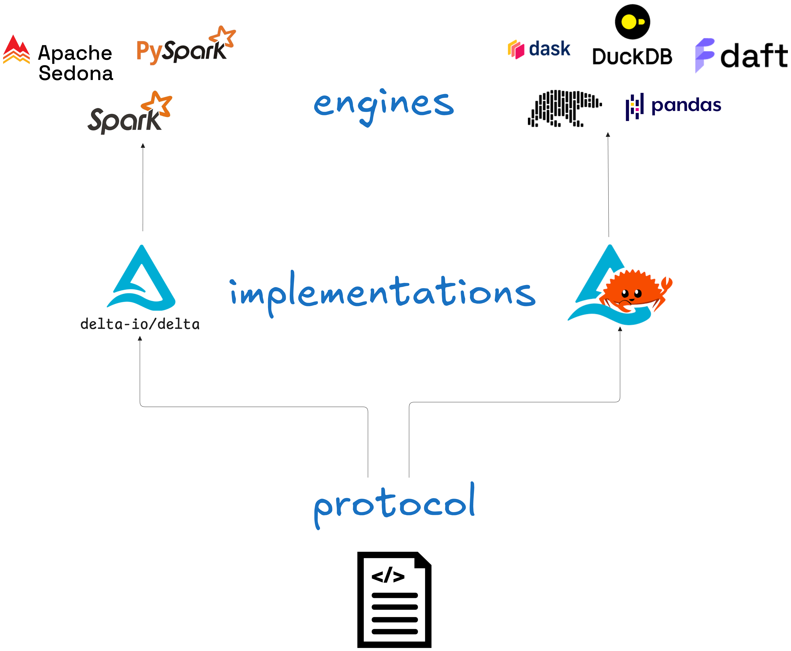

This article will explain how to use Delta Lake in Python. You can choose to use Delta Lake in Python with or without using Spark. This article will show you both approaches using `delta-rs` and PySpark.

Many Python data engineers use Apache Parquet to store their tabular datasets. Parquet is a great format but has some big disadvantages when it comes to updating large datasets, using multiple concurrent writers, and avoiding accidental deletes or partial overwrites. This is because Parquet is an immutable data format that does not support ACID transactions.

Delta Lake gives you a lot more flexibility, faster queries and has strong guarantees in place to avoid data corruption. If you're running Python-based data workflows in production, Delta Lake is almost always the better choice.

Let's take a look at the Delta Lake architecture and how you can use its great features in Python.

## What is Delta Lake?

Delta Lake is an open-source data storage framework for storing and crunching data safely and efficiently at scale. It is also called an [open table format](https://delta.io/blog/open-table-formats/).

Delta Lake stores your data in Parquet files and adds a transaction log to give you powerful features like:

- **ACID transactions**: Safe, atomic writes. No more half-written data.
- **Query optimization**: Smart filtering and file skipping make reads fast.
- **Time travel**: Easily roll back to previous versions of your data.
- **Schema enforcement**: Keep your tables clean and consistent.
- **Flexible operations**: Delete rows, rename columns, update values - without rewriting everything.


Delta Lake runs on top of your current storage–whether that's local or in the cloud. And you can use it with your favorite query engines. This setup is also called the Lakehouse architecture. If you haven't read [the Lakehouse paper](https://www.cidrdb.org/cidr2021/papers/cidr2021_paper17.pdf), it's a great place to start.

## How can I use Delta Lake in Python?

There are two main ways to use Delta Lake in Python:

1. PySpark
2. the delta-rs implementation with a supported engine of your choice (e.g. pandas, Polars, DuckDB)

The choice depends mainly on whether or not you want to use Spark and introduce Java dependencies into your workflow.

Many Python developers are using Python because it is lightweight and does not depend on the JVM. If that's you, then you will want to use the `delta-rs` implementation. If you are familiar with Spark and don't mind the Java dependencies, then using Delta Lake with PySpark might be a good option.

## What is delta-rs?

Delta-rs is a Rust-based implementation of the Delta Lake protocol. It works in both Rust and Python, and it skips the JVM entirely. Under the hood, it uses Apache Arrow, which means it integrates well with modern Python query engines.

If you're working in Python and don't want to spin up a Spark cluster just to use Delta Lake, use `delta-rs`.

With `delta-rs`, you can:

- Read and write Delta tables
- Inspect table versions
- Use Delta with pandas, Polars, DuckDB, and more
- Work locally, in the cloud, or anywhere Python runs

Install `delta-rs` for Python using `pip`:

```
pip install deltalake
```

You can now use this library to perform Delta Lake operations, such as [reading](https://delta-io.github.io/delta-rs/usage/loading-table/) and [writing](https://delta-io.github.io/delta-rs/usage/create-delta-lake-table/).

Some engines like Polars have created their own dedicated Delta Lake methods that use this `deltalake` package under the hood. This makes it easier for you by not having to import an extra external package.

Let's take a look at how to read and write Delta Lake tables in Python with Polars.

## Write Delta Lake in Python

Here's how you can use `delta-rs` to write Delta Lake tables in Python using Polars:

```python
    import polars as pl

    # define sample data
    data = {
        'first_name': ['bob', 'li', 'leah'],
        'age': [47, 23, 51]
    }

    # create dataframe
    df = pl.DataFrame(data)

    # write dataframe to Delta Lake
    df.write_delta("tmp/polars_table")
```

Notice that we don't need to import the `deltalake` package explicitly here. Polars does that for us under the hood.

You can also use PySpark:

```python
    # Write to Delta Lake
    df.write.format("delta").mode("overwrite").save("tmp/spark_table")
```

## Read Delta Lake in Python

Here's how you can use the `delta-rs` library to read Delta Lake tables in Python using Polars:

```python
    > data = pl.read_delta("tmp/delta_table")
    > print(data)

    ┌────────────┬─────┐
    │ first_name ┆ age │
    │ ---        ┆ --- │
    │ str        ┆ i64 │
    ╞════════════╪═════╡
    │ bob        ┆ 47  │
    │ li         ┆ 23  │
    │ leah       ┆ 51  │
    └────────────┴─────┘
```

You can also use PySpark:

```python
    df = spark.read.format("delta").load("tmp/delta_table")
```

## Delta Lake Time Travel in Python

Let's take a look at how you can use the `delta-rs` library to travel back to previous versions of a Delta Lake table in Python using Polars.

First, let's append some new data to our existing Delta Lake:

```python
    # create more sample data
    data_2 = {
        "first_name": ["suh", "anais"],
        "age": [33, 68]
    }
    df = pl.DataFrame(data_2)

    # append new data to existing delta lake
    df.write_delta("tmp/delta_table", mode="append")
```

Note that if you were using an immutable file format like Parquet, this would require a complete overwrite. That's fine for small toy examples like this, but it will become a pain when you're working at scale. Instead, Delta Lake simply adds the new data and updates the transaction log so that future queries will reference the appended data as well.

Now let's read the Delta table back in:

```python
    > new_data = pl.read_delta("tmp/polars_table")
    > print(new_data)

    ┌────────────┬─────┐
    │ first_name ┆ age │
    │ ---        ┆ --- │
    │ str        ┆ i64 │
    ╞════════════╪═════╡
    │ suh        ┆ 33  │
    │ anais      ┆ 68  │
    │ bob        ┆ 47  │
    │ li         ┆ 23  │
    │ leah       ┆ 51  │
    └────────────┴─────┘
```

This shows us the complete dataset, including the appended data.

Now let's imagine the data update was a mistake and you need to go back to the version before the data was corrupted. You can use the [Delta Lake time travel](https://delta.io/blog/2023-02-01-delta-lake-time-travel/) feature by specifying the version of your table:

```python
    > clean_data = pl.read_delta("tmp/polars_table", version=0)
    > print(clean_data)

    ┌────────────┬─────┐
    │ first_name ┆ age │
    │ ---        ┆ --- │
    │ str        ┆ i64 │
    ╞════════════╪═════╡
    │ bob        ┆ 47  │
    │ li         ┆ 23  │
    │ leah       ┆ 51  │
    └────────────┴─────┘
```

There you go! You're back at your clean data without any corrupted entries.

To travel back to a specific version of your Delta Lake with PySpark use the `versionAsOf` option:

```python
    df = spark.read.format("delta") \
        .option("versionAsOf", 0) \
        .load("tmp/polars_table")
```

## Which Python query engine can I use with delta-rs?

You can use any Python-based engine that can work with Arrow data.

Some engines that work today:

- Pandas
- Polars
- DuckDB
- Datafusion
- Daft
- Dask

Not all features are available in every engine. Some may support only reading, or only specific table operations. But the ecosystem is growing fast.

Polars is probably the most popular and well-maintained choice for high-performance workloads.

Take a look at the [Delta Lake without Spark](https://delta.io/blog/delta-lake-without-spark/) article for code examples. You can also check the [Integrations](https://delta-io.github.io/delta-rs/integrations/object-storage/adls/) page in the delta-rs docs.

## Why are there different Delta Lake implementations?

Delta Lake is a [protocol](https://delta.io/blog/2023-07-07-delta-lake-transaction-log-protocol/): a standardized specification of how to store data and perform read/write operations. You can take a look at the specification (“spec”) [here on Github](https://github.com/delta-io/delta/blob/master/PROTOCOL.md).

The original Delta Lake project (`delta-io/delta`) was built in Scala and designed to run on Apache Spark. That's still the **reference implementation**. It's mature and used at scale.



But not everyone wants to run Java or manage Spark clusters. And some users want to add additional functionality that falls outside of the scope of the main Delta Lake project.

That's why there are different _implementations_ of the core Delta Lake protocol.

Delta-rs is one example: built on Rust and compatible with Python engines. This implementation is maintained by a different set of open-source contributors. It is designed for developers who don't want to introduce any Spark or Java dependencies into their workflow, or who are more comfortable in a Python/Rust environment.

There are also closed-source implementations of Delta Lake, such as the Microsoft Fabric Delta Lake implementation and the Databricks Runtime Delta Lake. These may have specific features only available to paying customers.
| Implementation | Language Support | Spark Required? | Open Source? | Good For |
|----------------------------------|--------------------------------|-----------------|--------------|---------------------------------|
| `delta-io/delta` | Scala, Java, R, Python (via PySpark) | ✅ Yes | ✅ Yes | Spark users |
| `delta-rs` | Rust, Python | ❌ No | ✅ Yes | Python users |
| `Delta Lake Databricks Runtime` | Python, SQL, Scala, R, Java | ✅ Yes | ❌ No | Managed Delta Lake on Databricks |
| `Delta Lake Microsoft Fabric` | Python, SQL, .NET (C#), Spark | ❌ No | ❌ No | Delta on Microsoft Fabric stack |
| `dask-deltatable` | Python | ❌ No | ✅ Yes | Dask-based workflows |
| `deltaray` | Python | ❌ No | ✅ Yes | Ray-native workloads |

Different implementations of Delta Lake support different features that are outside the scope of the Delta Lake transaction log protocol. To read more about the different implementations and feature supports, check out the [Delta Lake Transaction Log Protocol](https://delta.io/blog/2023-07-07-delta-lake-transaction-log-protocol/) article.

## Why not just use Parquet?

Delta Lake gives you many powerful data storage, querying and performance features that are not available with Apache Parquet. For a detailed comparison, check out the [Delta Lake vs Data Lake](https://delta.io/blog/delta-lake-vs-data-lake/) post.

## Using Delta Lake in Python

Delta Lake is a great choice for data analysts and engineers working in Python. You can choose to use Delta Lake with PySpark or using any of the engines that support the Rust implementation of the Delta Lake protocol, such as Polars, pandas, Datafusion and others.
