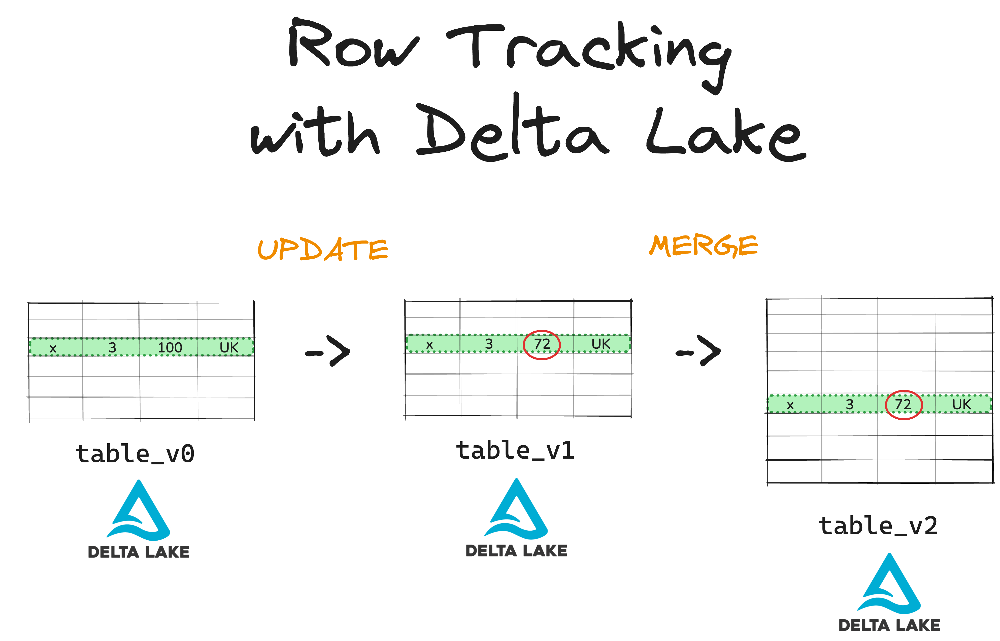

This article explains the Row Tracking feature in Delta Lake and how you can use it to improve your data quality management and auditing.

Row tracking is a powerful Delta Lake feature that gives you full visibility into how each row has changed over time. It works out of the box, and you don't need to write any extra logic. Row tracking is availablein Delta Lake 3.2.0 and above.

Let's jump in to see how this works.

## What is Delta Lake Row Tracking?

Row tracking is a feature that gives each row in your Delta table a unique identifier. This ID stays the same, even when you make changes to the data stored in the row.

Delta Lake uses the unique row ID to track changes over time. If a row is updated or deleted, the change is tied to the same ID. This means you can compare versions of the table and understand how the data evolved at the row-level.



## Why Delta Lake Row Tracking Matters

Row tracking takes regular data versioning a step further. It gives you in-depth visibility of data lineage at the row-level.

This means that:

- You can track data history at the row level
- You can identify changed rows between any two versions
- You don't have to write your own diff logic

This kind of fine-grained insight is helpful for quality control, compliance, auditing, and debugging.

## Delta Lake Row Tracking vs Parquet

Row tracking is one of the many reasons why Delta Lake is a powerful choice for your data storage format. Let's take a moment to compare it to another popular file format like Apache Parquet.

Because Parquet is an immutable file format that only stores metadata in the footer of each Parquet partition file, the possibilities for data lineage tracking are limited. Parquet also lacks a separate transaction log that records all commits and supports ACID transactions.

Here's an overview:

| Feature                         | Parquet                 | Delta Lake                          |
| ------------------------------- | ----------------------- | ----------------------------------- |
| Row-level versioning            | ❌ Not supported        | ✅ Built-in via row tracking        |
| ACID transactions               | ❌ No                   | ✅ Yes                              |
| Change history                  | ❌ None                 | ✅ Full commit log + row tracking   |
| Easy rollback to previous state | ❌ Manual & error-prone | ✅ One line of code (`versionAsOf`) |
| Metadata tracking               | ⚠️ File-level only      | ✅ Row-level granularity            |

Parquet is just a file format. It's great for efficient storage and reads. But it can't track precisely what's changed, when it changed, or who changed it. That means:

- You can't reliably reconstruct the history of your data.
- You can't trace a downstream row back to the original source record.
- You can't debug bad outputs unless you manually manage logs or audit tables.

Delta Lake solves all that.

Row tracking gives you a direct link between input and output rows. When combined with Delta's transaction log, you get a complete audit trail. With Parquet, you'd have to add an external lineage tool to even get close.

Read the [Delta Lake vs Parquet tutorial](https://delta.io/blog/delta-lake-vs-parquet-comparison/) to learn more.

## How does Delta Lake Row Tracking work?

When you enable row tracking on a Delta Lake table, two new metadata fields are added to the table:

- **Row IDs** give a unique identifier to each row in your table. A row keeps the same ID whenever it is modified.
- **Row commit versions** record the last version of the table in which the row was modified. A row is assigned a new version whenever it is modified.

## How to Enable Delta Lake Row Tracking

To use the Delta Lake Row Tracking feature, you need to enable it on your table. You can turn on row tracking when creating a new Delta table or add the feature to an existing table.

Here's how to do both in PySpark:

### 1. Create a Table With Row Tracking

Use the `CREATE TABLE` command with the `delta.enableRowTracking` table property set to `true`:

```python
    spark.sql("""
    CREATE TABLE sales (
      order_id STRING,
      amount DOUBLE,
      country STRING
    )

    USING DELTA
    TBLPROPERTIES (
      'delta.enableRowTracking' = 'true'
    )
    """)
```

That's it. From now on, every row in this table will be assigned a unique row ID and row commit version under the hood. This data is stored in two hidden metadata columns.

Note that the row IDs and commit versions are not automatically included when reading the table. If you want to read this metadata, you will have to select them manually from the hidden `_metadata` column, like this:

```python
    spark.read.table("table_name") \
      .select("_metadata.row_id", "_metadata.row_commit_version", "*")
```

### 2. Enable Row Tracking on an Existing Table

You can enable row tracking on an existing table like this:

```python
    spark.sql("""
    ALTER TABLE sales
    SET TBLPROPERTIES (
      'delta.enableRowTracking' = 'true'
    )
    """)
```

Note that enabling row tracking on an existing Delta table will automatically assign row ids and row commit versions to all existing rows in the table. This may create new versions of the table and may take a while to process if your table is large. It's best to enable row tracking as early as possible.

#### Row tracking storage

Row tracking can increase the size of the table. Delta Lake stores row tracking metadata fields in hidden metadata columns in the data files. Insert-only operations do not use these hidden columns and instead track the row ids and row commit versions using metadata in the Delta Lake log.

Data reorganization operations such as `OPTIMIZE` cause the row ids and row commit versions to be tracked using the hidden metadata column, even when they were stored using metadata. Read the [Delta Lake Optimize](https://delta.io/blog/delta-lake-optimize/) tutorial to learn more.

## Disable row tracking

Row tracking can be disabled to reduce the storage overhead of the metadata fields:

```SQL
ALTER TABLE table_name SET TBLPROPERTIES (delta.enableRowTracking = false);
```

Note that disabling row tracking does not remove the corresponding table feature. You can only fully remove the feature by recreating the table.

## Important Notes

Here are a few important notes to keep in mind when you're working with the Row Tracking feature:

- Row tracking is optional. You have to turn it on explicitly.
- Tracked rows get an internal ID, but it won't show up in regular queries unless you ask for it.
- You can't fully disable row tracking once it's enabled. (This avoids breaking downstream lineage.)
- You can still time travel between versions using VERSION AS OF.
- Because cloning a Delta Lake table creates a separate history, the row ids and row commit versions on cloned tables do not match that of the original table.

## When to Use Row Tracking

You should consider using row tracking if:

- You work in regulated industries (finance, healthcare, etc.)
- You need to build audit trails for governance
- You run pipelines that rely on detecting data changes
- You want to make rollbacks and debugging safer and easier \

Delta Lake Row Tracking is the easiest way to get row-level history and integrity, without having to change anything about how you write your data.
