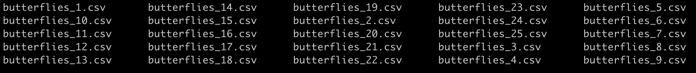
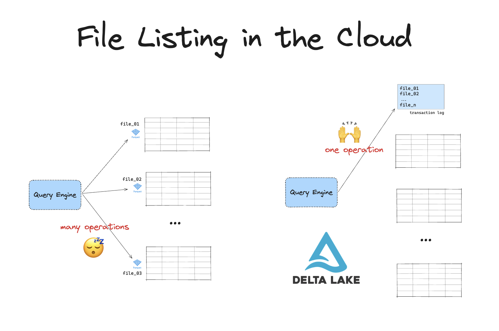
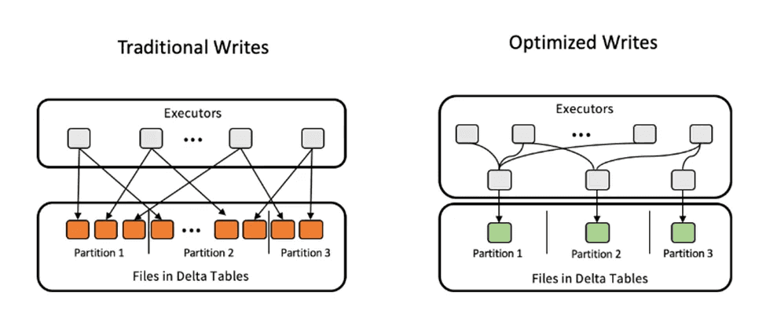
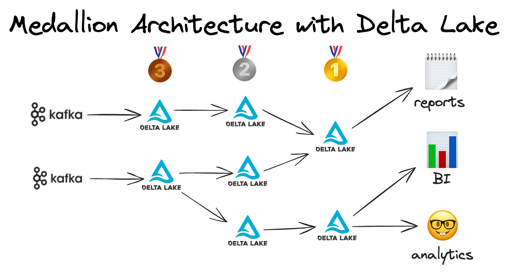

Streaming workflows are complex and deal with messy, real-world data. Many solutions struggle to provide the high performance and reliability that are required for these kinds of workloads.

Delta Lake has many powerful features that will improve your real-time streaming projects. It gives you exactly-once processing guarantees (great for concurrent jobs), handles discovering which files in a stream are new, and can automatically consolidate small files produced by low latency ingestion.

This article will show you how to use Delta Lake for streaming applications. We will work through a code example using Spark Structured Streaming to learn how to use Delta Lake as both streaming source and streaming sink.

Let's get started!

## How to use a Delta table as a streaming sink

Let's build a sample script that uses Delta Lake to store data coming from a streaming source. We'll keep things simple and use Spark to stream data from a local directory of CSV files. You can of course also use Delta Lake to store data from [other streaming sources](https://delta.io/blog/delta-lake-without-spark/) like Kafka, Flink, etc.

### Generate sample data

First, let's generate some sample data to stream. We'll generate 25 CSV files of different sizes, each containing between 1,000 and 10,000 rows of data about butterflies. You can run the script to generate the data yourself by fetching it from [this public Github gist](https://gist.github.com/avriiil/e14baad70ab6bc999c961f88c167a7fd).

After running the script, you should have 25 files on disk:

```
> ls
```



Each CSV file contains data like this:

```python
> df = spark.read.csv("path/to/butterflies")
> df.show(3)

+----------------+--------------+--------+----------+
|         species|native_habitat|age_days|main_color|
+----------------+--------------+--------+----------+
|Vanessa atalanta|        Europe|      47|    orange|
| Papilio machaon|        Europe|      19|    yellow|
| Morpho menelaus| South America|      52|    orange|
+----------------+--------------+--------+----------+
```

### Stream to Delta Lake with Spark

Now that we have some data to stream, let's set up Delta Lake as a streaming sink with Spark.

Start with the required imports and launching a Spark session:

```python
import pyspark
from pyspark.sql.types import StructType, StringType, IntegerType

from delta import *

conf = (
   pyspark.conf.SparkConf()
   .setAppName("deltaStreaming")
   .set(
       "spark.sql.catalog.spark_catalog",
       "org.apache.spark.sql.delta.catalog.DeltaCatalog",
   )
   .set("spark.sql.extensions", "io.delta.sql.DeltaSparkSessionExtension")
   .setMaster("local[*]")
)

builder = pyspark.sql.SparkSession.builder.config(conf=conf)
spark = configure_spark_with_delta_pip(
   builder,
).getOrCreate()
```

Next, we need to define the schema of the data that will be streamed into our Delta table:

```python
schema = (
   StructType()
   .add("species", StringType())
   .add("native_habitat", StringType())
   .add("age_days", IntegerType())
   .add("main_color", StringType())
)
```

Now set up the streaming source. For this example, we will stream data from CSV files in a local directory by using `spark.readStream`:

```python
input_path = "/Users/rpelgrim/Documents/git/delta-playground/butterflies/*.csv"
streaming_input_df = (
   spark.readStream.format("csv")
   .schema(schema)
   .option("header", "true")
   .load(input_path)
)
```

The `spark.readStream` API is part of Spark Structured Streaming. Read [the official documentation](https://spark.apache.org/docs/latest/structured-streaming-programming-guide.html) for working with other streaming sources.

Let's write this stream of data to Delta Lake. You'll need to define an output path as well as a directory for storing the streaming checkpoints. Use a directory name that starts with “\_” (underscore) to avoid accidental deletes during [Vacuum](https://delta.io/blog/efficient-delta-vacuum/) operations.

```python
output_path = "your/delta/path"  # Replace with your Delta table directory path
checkpoint_path = "your/checkpoint/_path"  # Replace with your checkpoint directory path

streaming_query = (
   streaming_input_df.writeStream.format("delta")
   .outputMode("append")
   .option("checkpointLocation", checkpoint_path)
   .start(output_path)
)
```

Checkpoints record the state of the data processing pipeline at a given point in time. This enables Delta Lake to make sure that data is processed exactly once, even in the event of failures. It also enables the system to continue processing from the correct position if something goes wrong.

Now end with the following line to keep the stream open until terminated:

```python
streaming_query.awaitTermination()
```

Save all this to a Python script and give it a name, for example: `delta-stream-sink.py`

### Run your Delta Lake stream

To see this in action:

1. Run the `generate_butterflies.py` script to populate your input directory
2. Run the `delta-stream-sink.py` script to write the streaming data to Delta Lake, for example using Spark Submit:

   ```
   spark-submit --packages io.delta:delta-spark_2.12:3.2.0 delta-stream-sink.py
   ```

You can now inspect your stream data using Delta Lake:

```python
> delta_df = spark.read.format("delta").load("your/delta/path")
> delta_df.show(3)

+----------------+--------------+--------+----------+
|         species|native_habitat|age_days|main_color|
+----------------+--------------+--------+----------+
|    Pieris rapae|          Asia|       6|    yellow|
|Danaus plexippus| North America|      51|    orange|
|Vanessa atalanta|        Europe|      16|    orange|
+----------------+--------------+--------+----------+
```

Great work, your streaming data has successfully been written to Delta Lake. You can inspect your files on disk to confirm that your data is now stored in Parquet files, together with the Delta Lake transaction log and streaming checkpoints:

```
> tree delta-stream-path

delta-stream-test
├── _checkpoints
│   ├── commits
│   │   └── 0
│   ├── metadata
│   ├── offsets
│   │   └── 0
│   └── sources
│       └── 0
│           └── 0
├── _delta_log
│   ├── 00000000000000000000.json
│   └── _commits
├── part-00000…c000.snappy.parquet
├── part-00001…c000.snappy.parquet
├── part-00002…c000.snappy.parquet
├── part-00003…c000.snappy.parquet
├── part-00004…c000.snappy.parquet
├── part-00005…c000.snappy.parquet
└── part…c000.snappy.parquet
```

The Delta Lake transaction log guarantees exactly-once processing, even when there are other streams or batch queries on the same table running at the same time. The transaction log also gives you access to great Delta Lake features like time travel, ACID guarantees and advanced data skipping.

### Append vs complete mode

By default, streaming to a Delta Lake table with Spark Structured Streaming will run in `append` mode. This will add any new incoming data to the end of your Delta table.

We explicitly defined this in the following line above:

```python
streaming_query = (
   streaming_input_df.writeStream.format("delta")
   .outputMode("append")
   .option("checkpointLocation", checkpoint_path)
   .start(output_path)
)
```

You can also run Spark Structured Streaming in `complete` mode. This will completely replace existing data with any new incoming streaming data. This mode can be helpful when you want to continuously update a summary or other aggregation.

To stream in `complete` mode and overwrite existing data, simple set:

```python
.outputMode("complete")
```

## How to use a Delta table as a streaming source

You can also use Delta Lake tables as a streaming source.

To do so, use the `readStream()` API:

```python
streaming_df = spark.readStream.format("delta").load(delta_table_path)
```

Then use the `writeStream()` API to stream the data from your Delta table to a streaming sink. To keep things simple, let's write out to the console for now:

```python
streaming_query = (
   streaming_df.writeStream.format("console").outputMode("append").start()
)
```

Read the Spark Structured Streaming documentation for more information on how to work with [other output sinks](https://spark.apache.org/docs/3.5.4/structured-streaming-programming-guide.html#output-sinks).

## Why Delta Lake is great for streaming projects

Delta Lake supports both batch and streaming use cases. Here are some of the reasons why Delta Lake is a great choice for streaming projects:

### ACID Transactions

Streaming pipelines often experience interruptions and failures. Delta Lake's ACID transactions guarantee that:

- Your data is always consistent.
- Partial writes or failures don't corrupt the data.

Read more in the [Delta Lake vs Data Lake](https://delta.io/blog/delta-lake-vs-data-lake/) post.

### Time Travel and Data Versioning

Streaming workflows are complex and handle lots of messy, real-world data. This means that accidental writes or system failures are bound to happen. When they do, you need to be able to retrace your steps to identify the error and roll back your data to an uncorrupted state.

Delta Lake's time travel feature allows you to:

- Query previous versions of the data.
- Roll back changes if something goes wrong.

You can use Delta Lake's time travel feature to travel back to earlier states of your table using either the version number or the timestamp of the commit. Check out the [Delta Lake Time Travel](https://delta.io/blog/2023-02-01-delta-lake-time-travel/) article for more information.

### Schema Enforcement and Evolution

Data consistency is important when you're working with streaming data in production. You don't want data with inconsistent schemas to be written to your table.

Delta Lake guarantees data consistency by supporting schema enforcement. Only data that strictly conforms to the predefined schema will be successfully appended. Data updates that do not match the schema will fail.

For situations when the schema changes over time (due to a change in business logic, technical system, etc.), Delta Lake also support manual schema evolution. This feature allows you to programmatically update the schema in real-time.

Check out the [Delta Lake schema enforcement](https://delta.io/blog/2022-11-16-delta-lake-schema-enforcement/) and the [Delta Lake schema evolution](https://delta.io/blog/2023-02-08-delta-lake-schema-evolution/) posts to learn more.

### Great integration with other tools

Delta Lake integrates with popular cloud platforms like [AWS S3](https://delta.io/blog/delta-lake-s3/), [Azure Data Lake Storage](https://delta.io/blog/delta-lake-azure-data-lake-storage/) and [Google Cloud Storage](https://delta.io/blog/delta-lake-gcp/). This means you can stream your data into and out of the cloud with Delta Lake.

Delta Lake is a great choice for cloud-based workloads because it solves [the expensive file-listing problem](https://delta.io/blog/delta-lake-vs-data-lake/). Older data storage formats like Parquet and CSV require expensive file-listing operations when stored in the cloud. Delta Lake solves this by storing all metadata in a separate transaction log.



You can also use Delta Lake with other streaming platforms like Apache Flink, Kafka, Kinesis, etc.

## Delta Lake streaming: Compaction and Optimization

Streaming workloads almost always involve lots of small updates to your table. New data is constantly being written to your table either individually or in microbatches, as it arrives at high velocity. Over time, this will result in your table consisting of many small files on disk. This is known as the Small File Problem and can significantly slow down read and write operations.

Delta Lake handles the small file problem with compaction and optimization. These features merge all the small files into larger files, reducing the total file count and improving query performance. For streaming workloads, you can trigger compaction periodically or based on conditions (e.g., number of files or table size).



Read more about how to configure these optimizations in the [Delta Lake Optimize](https://delta.io/blog/delta-lake-optimize/) post.

## Delta Lake streaming: Liquid Clustering

Liquid clustering is another great Delta Lake feature that can improve your streaming workflows. Liquid clustering automatically colocates similar data on disk using an advanced clustering algorithm.

This achieves two performance improvements:

1. reduces the I/O costs for common query patterns, resulting in faster query execution
2. avoids performance bottlenecks due to the small file problem by automatically consolidating data into bigger clusters

Read more about this in the [Delta Lake Liquid Clustering](https://delta.io/blog/liquid-clustering/) post.

## Delta Lake streaming and the medallion architecture

Delta Lake's medallion architecture is a great strategy for maintaining clean and reliable streaming data pipelines that serve various business use cases.

You can apply the medallion architecture to streaming workloads as follows:

Bronze:

- This is where the raw data stream is ingested into our system.
- The main purpose of the bronze layer is to have the data in a tabular format and to unlock Delta Lake features.

Silver:

- This is where raw data is transformed, e.g. cleaning, aggregating, etc.
- The main purpose of the silver layer is to apply business logic to raw data.

Gold:

- This is where transformed data is optimized for read performance
- The main purpose of the gold layer is to serve consumption-ready data to user/downstream systems.



Read more in the [Building the medallion architecture with Delta Lake](https://delta.io/blog/delta-lake-medallion-architecture/) post.

## How to use Delta Lake with other streaming sources

This article shows code examples of how to use Delta Lake with Spark Structured Streaming. You can also use many other streaming platforms to stream data in and out of Delta tables, such as Apache Kafka, Apache Flink, and others. Take a look at the [Delta Lake without Spark](https://delta.io/blog/delta-lake-without-spark/) article for an overview.

## Delta Lake for streaming workflows

Delta Lake is built to support both batch and streaming workflows. You have seen examples of using Delta Lake for streaming applications with Spark Structured Streaming, including how to set up Delta Lake as both streaming sink and streaming source. You have also learned about some of the great features that make Delta Lake a solid choice for streaming pipelines.
