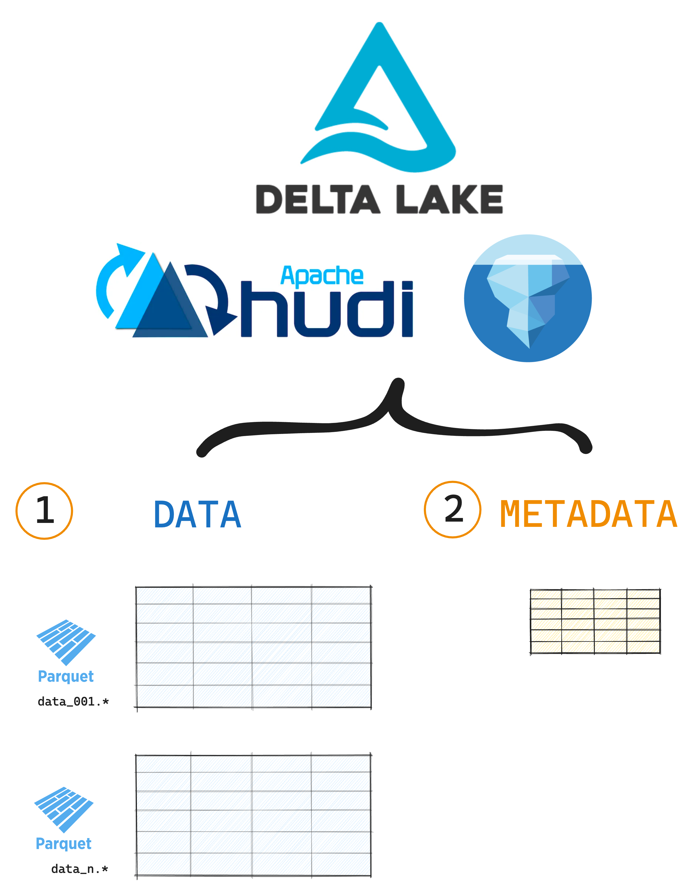
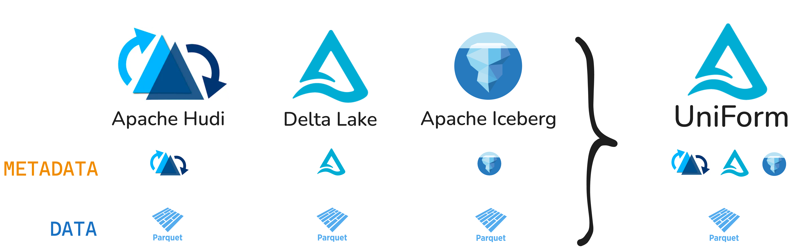
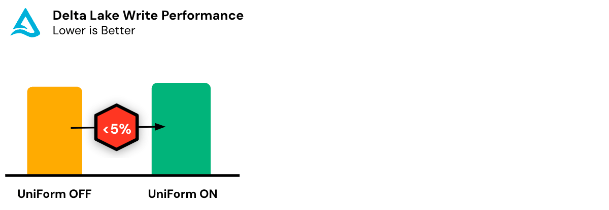

This article explains how you can use Delta Lake UniForm to read Delta tables from Apache Iceberg and Apache Hudi. Delta Lake, Apache Iceberg and Apache Hudi are all open table formats.

[Open table formats](https://delta.io/blog/open-table-formats/) are a more efficient and more reliable format for storing data than file formats like CSV and Parquet. Open table formats support ACID transactions, advanced data skipping, time travel functionality and other great features that will make your data work faster and more secure.

UniForm is a great Delta Lake feature because it provides access to clients of all open table formats with a single copy of the data files.

Let's jump in to see how it works.

## Open Table Format Architecture

The three most popular open table formats (Delta Lake, Hudi and Iceberg) all share a common architecture. They all contain: (1) data stored in Parquet files, and (2) a metadata layer.



Here's what that looks like on disk for data stored with Delta Lake:

```
> tree my_delta_table

delta_table_duckdb
├── _delta_log
│ └── 00000000000000000000.json
└── part-00001-...01.snappy.parquet
└── part-00001-...02.snappy.parquet
└── part-00001-...03.snappy.parquet
```

The Parquet files store your tabular data. The `_delta_log` directory stores all the metadata about the transactions in lightweight JSON files.

While Hudi and Iceberg store metadata differently, the overall architecture is the same. This similarity makes it easier to implement interoperability. All that is needed is for the metadata layer to be converted into a format that can be read by all three open table format readers.



## Create a Delta Lake UniForm table

Creating a Delta Lake UniForm table is straightforward. You can do this during table creation by enabling the required table properties.

To use Delta Lake UniForm you will need:

- To install the [delta-iceberg JAR](https://docs.delta.io/latest/delta-uniform.html#enable-delta-lake-uniform) to generate Iceberg metadata
- To install the [delta-hudi JAR](https://docs.delta.io/latest/delta-uniform.html#enable-delta-lake-uniform) to generate Hudi metadata
- To enable [column mapping](https://docs.delta.io/latest/delta-column-mapping.html#delta-column-mapping)

Let's take a look at how to enable UniForm support for each open table format.

### Delta Lake UniForm with Iceberg Support

Here's how you can create a Delta Lake UniForm table with Iceberg metadata:

```python
spark.sql("""
CREATE TABLE my_uniForm_table (
    id INT,
    name STRING,
    age INT
) USING DELTA TBLPROPERTIES (
    'delta.enableIcebergCompatV2' = 'true',
    'delta.universalFormat.enabledFormats' = 'iceberg',
    'delta.columnMapping.mode' = 'name'
)
""")
```

### Delta Lake UniForm with Hudi Support

Here's how you can create a Delta Lake UniForm table that can be loaded by Hudi readers:

```python
spark.sql("""
CREATE TABLE my_uniForm_table (
    id INT,
    name STRING,
    age INT
) USING DELTA TBLPROPERTIES (
    'delta.universalFormat.enabledFormats' = 'hudi',
    'delta.columnMapping.mode' = 'name'
)
""")
```

### Delta Lake UniForm with Iceberg and Hudi Support

You can also create a Delta Lake UniForm table that can be loaded by both Iceberg and Hudi readers:

```python
spark.sql("""
CREATE TABLE my_uniForm_table (
    id INT,
    name STRING,
    age INT
) USING DELTA TBLPROPERTIES (
    'delta.enableIcebergCompatV2' = 'true',
    'delta.universalFormat.enabledFormats' = 'iceberg, hudi',
    'delta.columnMapping.mode' = 'name'
)
""")
```

## Convert an existing Delta table to UniForm

You can also convert an existing Delta table to add UniForm support. Use the `ALTER TABLE` command to upgrade the table properties. You will need to run Delta Lake 3.3.0+.

**For Iceberg:**

```SQL
ALTER TABLE my_delta_table SET TBLPROPERTIES(
  'delta.enableIcebergCompatV2' = 'true',
  'delta.universalFormat.enabledFormats' = 'iceberg');
```

**For Hudi:**

```SQL
ALTER TABLE table_name SET TBLPROPERTIES(
'delta.universalFormat.enabledFormats' = 'hudi');
```

## How does UniForm work?

Delta Lake UniForm works by generating metadata for the other open table formats you want to support. The underlying data files are not impacted, Delta Lake only converts the metadata into a format that the Iceberg or Hudi reader can understand.

Delta Lake triggers this metadata generation asynchronously after new data is written to the Delta table. This will cause minor and negligible write overhead as metadata is usually small. You can continue operating on the table while the metadata is being converted. Note that the metadata generation should be complete before external clients can begin to read the UniForm table, e.g. from Iceberg or Hudi.



In many cases, Iceberg and Hudi can have significantly higher write latencies than Delta Lake. This is why UniForm may group multiple Delta commits into a single Iceberg or Hudi commit to improve performance.

## Using Time Travel with UniForm

All open table formats support [time travel](https://delta.io/blog/2023-02-01-delta-lake-time-travel/). This means you can specify which version of the data you want to load or query, either using a version ID or a timestamp.

However, the version implementations of each format do not always align. Specifically:

- Delta Lake and Iceberg's version IDs and timestamps do not match.
- Delta Lake and Hudi's timestamps match but their version IDs don't.

This is why UniForm implements two additional table properties for the converted Iceberg/Hudi metadata: `converted_delta_version` and `converted_delta_timestamp`. Check these table properties to find out the version of your original Delta table that corresponds to your new Iceberg/Hudi table.

## Disabling Delta Lake UniForm

You can turn off UniForm by switching off the `delta.universalFormat.enabledFormats` table property. This will not turn off column mapping, which cannot be disables once it has been enabled. Any upgrades to the Delta Lake reader and writer protocol versions that happened while enabling UniForm cannot be reversed.

## Limitations

You should be aware of the following limitations when using Delta Lake UniForm:

- UniForm does not work on tables with [deletion vectors](https://delta.io/blog/2023-07-05-deletion-vectors/) enabled.
- Delta tables with UniForm enabled do not support `VOID` type.
- Iceberg/Hudi clients can only read from UniForm. Writes are not supported.
- Iceberg/Hudi reader clients might have individual limitations, regardless of UniForm. See documentation for your target client.

The following Delta Lake features work for Delta clients when UniForm is enabled, but do not have support in Iceberg:

- [Change Data Feed](https://delta.io/blog/2023-07-14-delta-lake-change-data-feed-cdf/)
- Delta Sharing

## Delta Lake UniForm and Open Table Formats

This article has explained how you can use Delta Lake UniForm to support interoperability between the 3 most popular open table formats: Delta Lake, Hudi and Iceberg.

Delta Lake UniForm is a great technology because it offers interoperability support with zero data duplication and at almost no additional compute cost.

While there are important differences between the formats, projects like UniForm are making these differences less relevant. Interoperability between the formats is going to be the way forward. Read the [Unifying Open Table Formats](https://delta.io/blog/unifying-open-table/) article to learn more.
