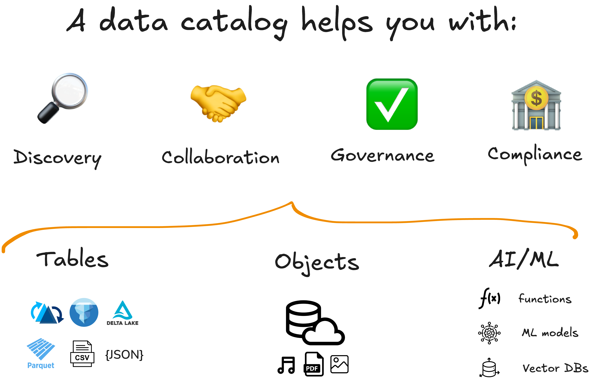
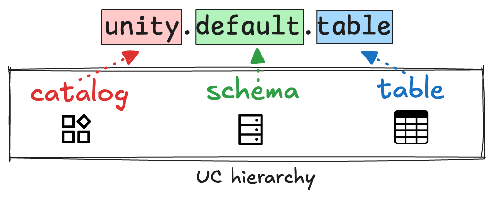
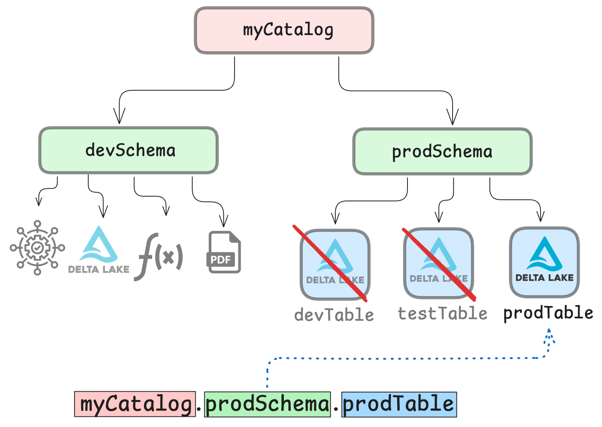

This article explains how you can use Delta Lake with Unity Catalog.

Unity Catalog is an open-source catalog that helps you store, manage, and access all of your data and AI assets in one place. Using Delta Lake with Unity Catalog gives you advanced usability and reliability because you get rock-solid storage and fast queries with Delta Lake, as well as a secure centralized repository for all of your assets with Unity Catalog.

Sometimes Delta Lake alone gives you enough control with its strong schemas, reliable writes, and clear history. But sometimes you need a catalog to build reliable and scalable pipelines. Unity Catalog covers the metadata and advanced access control layer without getting in the way of how you write or read Delta tables.

This article will walk you through how and when to use Delta Lake with Unity Catalog. You'll learn what a data catalog is, why it matters, when to pair it with Delta Lake, and how to set it up in PySpark with copy-paste examples.

Let's jump in.

## What is a data catalog?

A data catalog is a centralized tool for managing storage, access, and governance of your data assets. It tells you what assets you have, where they live, and how they can be accessed.

A data catalog helps you:

1. **Discover** your data easily
2. **Collaborate** smoothly and securely
3. **Govern** access to your data
4. Facilitate **compliance** procedures



You can read more about the origins of data catalogs [on the Unity Catalog blog](https://www.unitycatalog.io/blogs/data-catalog).

## Why do I need a data catalog?

You should consider a catalog when:

- **You manage many datasets** with different formats and locations.
- **You need to grant access** by user or role and keep it tidy.
- **Your data is queried by multiple users** at the same time.
- **You need to meet governance** and regulatory requirements.

Without a data catalog, people spend a lot of time looking for the right assets and creating extra work “just to be safe.” Soon you have duplicates, conflicting versions, and dashboards that disagree.

A catalog replaces these wasteful patterns with one address per table and reliable access control. Users can search for assets once using the stable namespace reference and always get the right table. Administrators can define who can see what, and access always stays consistent. Teams within and across organizations can share the same references, the same docs, and the same rules.

## What is Unity Catalog?

[Unity Catalog](https://unitycatalog.io/) is a modern open-source data catalog that helps you organize and manage all of your data and AI assets. It offers full support for [open table formats](https://delta.io/blog/open-table-formats/) like Delta Lake as well as non-tabular assets like unstructured and semi-structured data, video, audio, ML models, and more.

In Unity Catalog, every asset has a stable address: `catalog.schema.table`. You register a Delta table once and then use that same stable reference across all of your other data tools like Spark, Polars, SQL editors, BI, notebooks, etc. Unity Catalog stores all of the relevant metadata along with your data so it's always easily available.



Unity Catalog also provides features for effective data governance. You define who can see a schema, read a table, or modify it. You apply simple rules at the right level (e.g. catalog, schema, or table) and then access control will be consistent across teams and engines. No more ad-hoc permissions on object storage or one-off spreadsheets of who has what.



## When should I use Delta Lake with Unity Catalog?

Delta Lake gives you many great features that make your data pipelines faster and safer [compared to other popular file formats](https://delta.io/blog/delta-lake-vs-data-lake/) like Parquet. It gives you secure ACID transactions, advanced data skipping and full support for CRUD operations and idempotent upserts.

Here are some things that Delta Lake **does not provide** that may be relevant for you when you are building production-grade data pipelines that need to scale:

- **Access control & identities:** No users, roles, grants, or policy engine.
- **Standardized naming:** No global namespace across teams/tools.
- **Discovery & documentation:** No built-in search, ownership, descriptions, tags, or glossary.
- **Row/column policies:** No row-level security, column masking, or tag-based access rules.
- **Cross-table lineage:** No end-to-end lineage or impact analysis (history is per table only).

This means you should consider using Delta Lake together with Unity Catalog if:

- You have shared data across teams and/or organizations,
- You need to access data from multiple engines,
- You need to meet compliance needs,
- You need (the option) to scale your workloads safely.

Using a data catalog does not change how Delta Lake stores data. It changes how you and your teammates find it, name it, and govern it, and that is often what makes the difference in production. You can think of Unity Catalog as your central data control plane. Delta Lake gives you reliable storage and versioned tables. Unity Catalog gives you names, metadata, search, and permissions that travel with those tables. Together, you get data that's both easy to find and safe to use.

## How to use Delta Lake with Unity Catalog

Let's take a look at how you can access, transform and write your Delta tables with Unity Catalog. We will show examples using PySpark.

### Setup

First of all, you'll need to clone the Unity Catalog repository:

```
git clone git@github.com:unitycatalog/unitycatalog.git
```

Then navigate to the `unitycatalog` directory and run `bin/start-uc-server` to launch a local Unity Catalog server. This local server will come with some sample data pre-loaded.

You should see the following:

```
###################################################################
#  _    _       _ _            _____      _        _              #
# | |  | |     (_) |          / ____|    | |      | |             #
# | |  | |_ __  _| |_ _   _  | |     __ _| |_ __ _| | ___   __ _  #
# | |  | | '_ \| | __| | | | | |    / _` | __/ _` | |/ _ \ / _` | #
# | |__| | | | | | |_| |_| | | |___| (_| | || (_| | | (_) | (_| | #
#  \____/|_| |_|_|\__|\__, |  \_____\__,_|\__\__,_|_|\___/ \__, | #
#                      __/ |                                __/ | #
#                     |___/               v0.3.0           |___/  #
###################################################################
```

To confirm that everything is working, run a test command to list all the tables in the `default` schema of the `unity` catalog. These are pre-loaded into the local server by default.

```
bin/uc table list --catalog unity --schema default
```

This should return:

```
┌─────────────────┬──────────────┬─────┬────────────────────────────────────┐
│      NAME       │ CATALOG_NAME │ ... │              TABLE_ID              │
├─────────────────┼──────────────┼─────┼────────────────────────────────────┤
│marksheet        │unity         │ ... │c389adfa-5c8f-497b-8f70-26c2cca4976d│
├─────────────────┼──────────────┼─────┼────────────────────────────────────┤
│marksheet_uniform│unity         │ ... │9a73eb46-adf0-4457-9bd8-9ab491865e0d│
├─────────────────┼──────────────┼─────┼────────────────────────────────────┤
│numbers          │unity         │ ... │32025924-be53-4d67-ac39-501a86046c01│
├─────────────────┼──────────────┼─────┼────────────────────────────────────┤
│user_countries   │unity         │ ... │26ed93b5-9a18-4726-8ae8-c89dfcfea069│
└─────────────────┴──────────────┴─────┴────────────────────────────────────┘
```

Check out the official [Unity Catalog quickstart](https://docs.unitycatalog.io/quickstart/) guide for more information.

### Access Delta Tables with Unity Catalog

Suppose you are running a Spark job on a Delta table. Granting Spark access to Unity Catalog enables you to query your Delta tables in Unity Catalog just like any other Spark DataFrame.

Here's how it works.

Set up your PySpark environment with the necessary Delta Lake and Unity Catalog packages. You can do this by running the following command:

```
    bin/pyspark --name "local-uc-test" \
        --master "local[*]" \
        --packages "io.delta:delta-spark_2.12:3.2.1,io.unitycatalog:unitycatalog-spark_2.12:0.2.0" \
        --conf "spark.sql.extensions=io.delta.sql.DeltaSparkSessionExtension" \
        --conf "spark.sql.catalog.spark_catalog=io.unitycatalog.spark.UCSingleCatalog" \
        --conf "spark.sql.catalog.unity=io.unitycatalog.spark.UCSingleCatalog" \
        --conf "spark.sql.catalog.unity.uri=http://localhost:8080" \
        --conf "spark.sql.defaultCatalog=unity"
```

Now you can use standard Spark SQL syntax to access, query, and transform your Delta tables.

For example, you can show schemas and tables in schemas like this:

```python
    > # Show schemas (output = default)
    > sql("SHOW SCHEMAS").show()

    > # Show tables
    > sql("SHOW TABLES IN default").show()

    +---------+-----------------+-----------+
    |namespace|        tableName|isTemporary|
    +---------+-----------------+-----------+
    |  default|        marksheet|      false|
    |  default|marksheet_uniform|      false|
    |  default|          numbers|      false|
    |  default|   user_countries|      false|
    +---------+-----------------+-----------+
```

You can query specific rows from a table like this:

```python
    > sql("SELECT * FROM unity.default.marksheet LIMIT 5;").show()

    +---+----------+-----+
    | id|      name|marks|
    +---+----------+-----+
    |  1|nWYHawtqUw|  930|
    |  2|uvOzzthsLV|  166|
    |  3|WIAehuXWkv|  170|
    |  4|wYCSvnJKTo|  709|
    |  5|VsslXsUIDZ|  993|
    +---+----------+-----+
```

Note the use of the Unity Catalog naming reference `unity.default.marksheet` to access the table. This reference is stable across all engines, platforms and users.

Here's how to create a fresh Delta table registered to Unity Catalog:

```python
spark.sql("""
CREATE TABLE IF NOT EXISTS retail.analytics.orders (
  order_id    STRING  NOT NULL,
  customer_id STRING  NOT NULL,
  order_date  DATE    NOT NULL,
  region      STRING  NOT NULL,
  amount      DECIMAL(12,2) NOT NULL,
  status      STRING  NOT NULL,
  last_update TIMESTAMP NOT NULL
) USING DELTA
""")
```

You'll notice that this is exactly the same as a regular Delta `CREATE TABLE` operation, except for the use of the Unity Catalog naming hierarchy. Spark will automatically register this new table to Unity Catalog.

Check out the Unity Catalog documentation for extensive examples on [performing CRUD operations](https://docs.unitycatalog.io/integrations/unity-catalog-spark/#running-crud-operations-on-a-unity-catalog-table) on your Delta tables registered in Unity Catalog.

## Use Delta Lake with Unity Catalog

Delta Lake gives you reliable and performant tables. Unity Catalog gives you easy and reliable access and secure governance. Using Delta Lake and Unity Catalog together makes sense when you have complex workloads across multiple users and engines that need to run reliably in production and can scale smoothly when they need to.

Using these tools together lets you write data once, register it by a standardized name, and then let teams find and use the data without guessing about paths or permissions.
