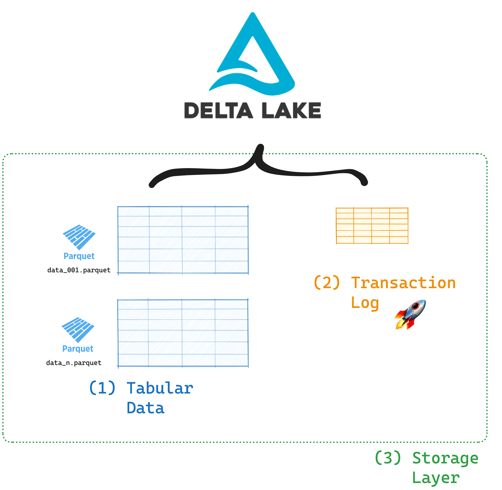
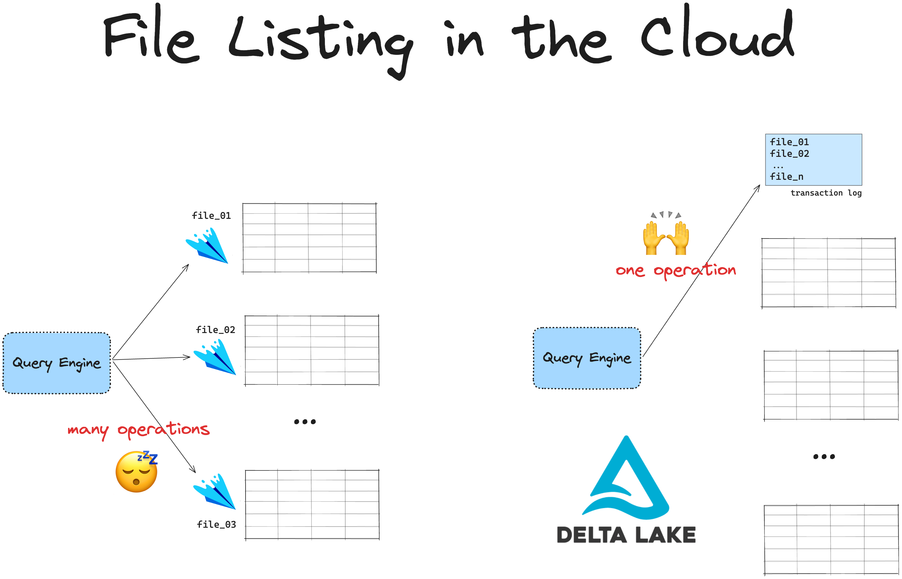
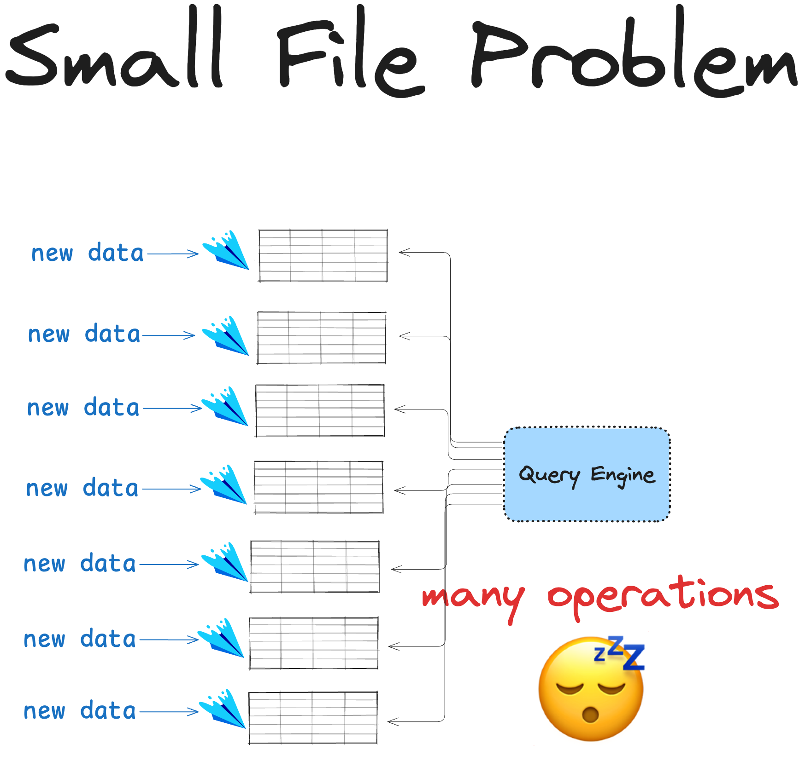

# Delta Lake vs Avro

This article explains the differences between Delta Lake and Apache Avro storage formats.

Apache Avro is a row-based data storage format that is popular for Apache Hadoop workloads and real-time processing. Avro works well for high-throughput streaming use cases where you need fast writes and have to process one full row at a time. Avro does not scale well to heavy analytics workloads and does not support many of the data skipping features, CRUD operations, and consistency guarantees that data engineers need.

Let’s compare the basic structure of Avro files and Delta tables to understand Delta Lake's advantages better.

## Essential Characteristics of Avro Files

[Apache Avro](https://avro.apache.org/) is a row-based data serialization format. It was developed within the Apache Hadoop project and is mostly used in streaming and data interchange workloads. With Avro, you can serialize data in a binary format that’s efficient to write and transfer.

Each Avro file also includes a schema, stored as JSON. Here’s an example of an Avro schema:

```
    {
       "namespace": "example.avro",
       "type": "record",
       "name": "User",
       "fields": [
          {"name": "name", "type": "string"},
          {"name": "favorite_number",  "type": ["null", "int"]},
          {"name": "favorite_color", "type": ["null", "string"]}
       ]
     }
```

Avro is designed to serialize data quickly. It can be a good choice for workloads that require frequent, high-speed writes, such as event logging and sensor data collection. In these use cases, fast ingestion is often more important than read-optimized analytics.

## Basic Structure of Delta Lake

Delta Lake stores your table data in Parquet files and metadata in a separate transaction log. Here are the contents of a Delta table:

```
your_delta_table/                       <-- 	this is the top-level table directory
├── _delta_log                          <-- 	this is the transaction log which tracks
│   ├── 00000000000000000000.json               all the changes to your data
│   ├── 00000000000000000001.json
│   ├── 00000000000000000002.json
│   └── _commits
├── file1.parquet                       <-- 	these are your Delta table partitions,
└── file2.parquet                               ordered for maximum query performance
└── ...
└── fileN.parquet
```

Here’s a visual representation of a Delta table:



You can see the full Delta Lake specification by looking at the [protocol](https://github.com/delta-io/delta/blob/master/PROTOCOL.md).

Storing data in a column-based file format like Parquet gives you efficient query optimizations. Storing metadata in a transaction log makes your queries even faster and more reliable by enabling better data skipping, ACID transactions, and data versioning.

## Row-Based vs. Column-Based Formats for Data Querying

Avro is a row-based file format. This works well for workloads that require frequent, high-speed writes. Avro is not optimized for high-speed data querying.

Here are the main advantages of column-based formats compared to row-based formats for data querying:

- Column-based formats allow query engines to read only the columns that are relevant to a query. For row-based file formats, query engines must read all the columns, even those irrelevant to the query.
- Column-based formats are more compressible than row-based file formats.
- Many column-based formats (like Parquet) store data in row groups. This allows query engines to skip over entire row groups for specific queries.

Delta Lake uses Parquet to store your data, which is a columnar format. On top of these column-based format capabilities, Delta Lake gives you even more great features because of its transaction log.

Let’s dig into each one of the advantages in detail in the next sections.

## Delta Lake vs. Avro: File Skipping

File skipping allows Delta Lake to ignore files that don’t match your query criteria. For example, if you query for records where a column has a specific value, Delta Lake can skip files without that value, reducing the read time significantly.

Delta Lake makes this possible by storing metadata information about the underlying Parquet files in the transaction log. It’s quick to read the transaction log of a Delta table and figure out which files can be skipped.

Avro does not support data skipping. Avro queries will read all rows in scope, even if only a few rows match. Data skipping is a clear advantage of Delta Lake when you need high-speed analytics.

## Delta Lake vs. Avro: ACID Transactions

Delta Lake gives you full ACID (atomicity, consistency, isolation, durability) guarantees through its transaction log. This ensures that your data is always consistent and reliable, even when multiple users access it simultaneously. Delta Lake’s transaction log records every change, so you can rely on it to avoid data corruption and conflicts.

Avro doesn’t include ACID transaction support. Without a transaction log or locking mechanism, Avro doesn’t ensure that concurrent writes or reads are isolated. This makes Delta Lake a better option for complex analytics or multi-user environments.

## Delta Lake vs. Avro: File Listing

Delta Lake’s transaction log also gives you efficient file listing. Instead of scanning directories to find files, Delta Lake uses the log to quickly identify files associated with a table. This speeds up query planning and execution, especially for cloud-based storage systems.



Avro doesn’t include centralized file tracking. File listing in Avro-based systems relies on directory scans. If you’re working with many files, this can slow down performance.

## Delta Lake vs. Avro: The Small File Problem

The small file problem refers to performance issues caused by having too many small files. For example, in order to execute a query against your Delta Lake table, all matching files (after partition pruning and file-skipping) must be read from storage into memory in order to produce a result. The query response time difference between non-optimized tables (with many small files) and optimized tables (with right-sized files) can dramatically improve table performance across the board. Delta Lake handles this with its [compaction and optimization features](https://delta.io/blog/delta-lake-optimize/), which merge small files to reduce the number of metadata entries and optimize performance.



Avro does not solve the small file problem natively. You have to use external tools for Avro file consolidation. This means that Avro can become inefficient with high file counts.

## Delta Lake vs. Avro: Schema Enforcement

Delta Lake offers schema enforcement functionality. Every write is checked against a predefined schema. If new data does not match the existing schema, the write is rejected. This helps you maintain data quality and consistency.

Avro is more flexible. Each file includes its own schema, so you can store data with different structures. However, this flexibility comes at a cost: Avro doesn’t enforce a consistent schema across files automatically, so schema validation needs to be performed manually or managed on the application rather than the storage layer.

See [this post](https://delta.io/blog/2022-11-16-delta-lake-schema-enforcement/) for more information about schema enforcement.

## Delta Lake vs. Avro: Schema Evolution

Delta Lake and Avro both support schema evolution, but in different ways. Delta Lake manages schema changes through its transaction log, tracking modifications to maintain compatibility with previous versions. This approach is ideal if you need to control schema changes across multiple processes.

Avro supports both forward and backward compatibility. This means you can read Avro files with old or new schemas, as long as the changes are compatible.

See [this blog post](https://www.databricks.com/blog/2019/09/24/diving-into-delta-lake-schema-enforcement-evolution.html) for more information about schema evolution.

## Delta Lake vs. Avro: Data Versioning

Delta Lake supports data versioning through its transaction log. Every data change is recorded in this log, giving you a clear history of all transactions for easy reference. Overwrites and deletes are “logical deletes” that update the transaction log. Future reads will not reference the overwritten or deleted data, but the old data is still available for future retrieval.

Avro doesn’t have built-in support for data versioning. Overwriting or deleting data from an Avro file means it is gone forever and you cannot roll back to it. This is known as a “physical delete”.

This becomes a problem when you or a colleague accidentally updates the data. Avro files don’t offer an easy way to undo those changes.

While you can achieve versioning in Avro by storing separate files for each version, this adds complexity and management overhead. For built-in data versioning, Delta Lake has a clear advantage.

## Delta Lake vs. Avro: Time Travel

Time travel is another feature exclusive to Delta Lake. With time travel, you can query data as it was at a specific point in time. This is useful for auditing, debugging, and compliance. By referencing Delta Lake’s transaction log, you can access older data versions or restore data to a previous state.

Avro doesn’t support time travel. You would need to use external version control systems or maintain multiple file versions manually to achieve this functionality. If you need time-travel capabilities, Delta Lake is the better choice.

Read the [Delta Lake Time Travel](https://delta.io/blog/2023-02-01-delta-lake-time-travel/) post for more information about time travel.

## Delta Lake vs. Avro: Streaming and Real-Time Processing

Both Avro and Delta Lake can be used for streaming and real-time processing.

Avro is often used for ingestion of raw streaming data, such as log files, events or sensor data. Because it is a lightweight and row-based format it is ideal for many high-throughput writes. The row-based format lends itself better for initial ingestion, but because it is not a columnar format, there is a higher cost when using avro for analytical stream processing.

With Delta Lake, you get a columnar, analytics-ready format, which gives you faster reads and better query performance. This makes it ideal for streaming-analytics use cases where the goal is to process incoming data streams while also enabling complex queries and reliability.

Delta Lake’s ACID transactions are a great reliability feature when multiple streaming jobs write data simultaneously. Its ability to handle late-arriving data and manage small files is also beneficial for data lakes ingesting high-volume streaming data.

Some data engineers will use both formats: storing raw events in Avro as they stream in and then loading that data into Delta Lake for downstream processing and analysis.

## Other advantages of Delta Lake tables

Delta Lake has many other advantages over Avro files that aren’t discussed in this article. You can check out these posts to learn more:

- [How Delta Lake uses metadata to make certain aggregations much faster](https://delta.io/blog/2023-04-19-faster-aggregations-metadata/)
- [How to clone your Delta Lake](https://delta.io/blog/delta-lake-clone/)
- [Delta Lake Change Data Feed (CDF)](https://delta.io/blog/2023-07-14-delta-lake-change-data-feed-cdf/)

## Conclusion

This post has explained the differences between Delta Lake and Apache Avro.

**Consider using Apache Avro** if you:

- primarily care about fast writes
- need to transfer data between systems or languages often
- are less concerned about fast reads
- don’t need strong data consistency guarantees

**Consider using Delta Lake** if you:

- are working with large analytics datasets stored in the cloud
- need ACID transactions for production-grade reliability in [ETL pipelines](https://delta.io/blog/delta-lake-etl/)
- care about maximum data skipping performance
- need strong schema enforcement and/or data versioning.