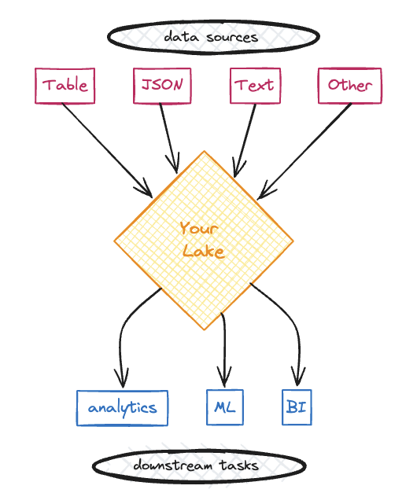
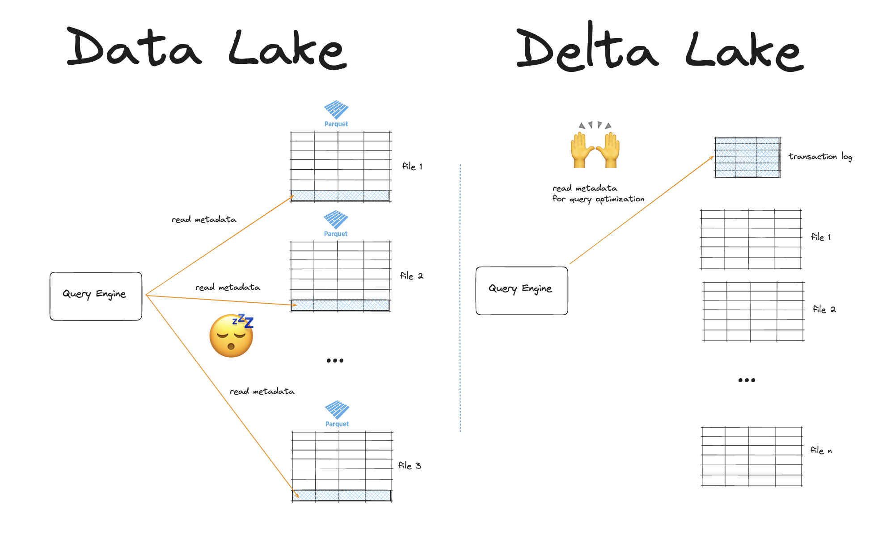

This article defines Delta Lake and Data Lake and explains the differences you should know when deciding how to store your data.

A Data Lake is a central repository to store and process your raw data, no matter the size or format. Data lakes give you flexibility at the cost of performance and reliability.

Delta Lake is an open-source table format for data storage. Delta Lake improves data storage by supporting ACID transactions, high-performance query optimizations, schema evolution, data versioning and many other features.

Data lakes can easily become data swamps. Dumping lots of different file formats and data types together in one location without proper versioning or schema enforcement can get messy very quickly. Delta Lake helps you solve these problems and keep your flexibility without compromising on performance and reliability.

> “Data Lake” is a general term that describes a data storage methodology which can exist anywhere you can store hybrid data formats. For example, you might have a data lake containing Parquet, JSON and unstructured text files located in an AWS S3 bucket.

> “Delta Lake” is a specific open-source technology. You don’t have a Delta Lake; you use Delta Lake to store your data in Delta tables. Delta Lake makes your data lake more secure and performant. This is often referred to as data lakehouse architecture.

Delta Lake is an example of an open table format. This article will compare a data lake with Delta Lake. If your data lake includes non-table data, you will need to bring it into a table (e.g. by vectorizing free text, adding JSON columns, or using DataFrame libraries with multimodal dtype support). If you cannot bring your data into a table format you may need to look at technologies in addition to Delta Lake.

Let’s take a closer look at how this works.

## What is a Data Lake?

Data lakes are central repositories to store and process your raw data, no matter the size or format. The term “Data Lake” comes from the analogy of a lake (“central repository”) which has many different rivers (“data streams”) flowing into it. These data streams all end up in one place and are co-located without strict separation or pre-defined structuring.



Data lakes became popular as a reaction to data warehouses, which require your data to be in a particular structured format. Data warehouses are optimized for performance on specific queries that you define in advance. They give you speed at the cost of flexibility. They also often store your data in proprietary formats, so you run the risk of vendor lock-in.

Instead, data lakes are optimized for flexibility. You can store your data in any format you like and run many different types of analyses on your data without expensive pre-processing.

A Data Lake gives you:

- Free data movement from multiple sources, in its original format, possibly in real-time
- Cataloging and indexing to give you an overview of what kind of data is in your data lake
- Access from different teams and roles for using the data downstream.
- The ability to perform data science and machine learning analyses.

A local directory of Parquet files can be considered a data lake. Or an S3 bucket containing many different file types with data formatted as tables, JSON, free text, images, video, etc.

This is what a data lake of Parquet files can look like on disk:

    ```
    your_data_lake/
    file1.parquet
    file2.parquet
    …
    fileN.parquet
    ```

## Data Lake --> Data Swamp

Data Lakes are great because they give you lots of flexibility and cheap storage. Multiple data formats from multiple sources can all be stored efficiently in a single location.

But when your data scales, this flexibility can become a problem. It can be difficult to keep track of file versions, data schemas or to roll back an accidental data operation. Data lakes are also easily corruptible, which makes them unreadable without manual cleanup.

Your data lake can easily turn into a data swamp. This will cause incorrect analyses and expensive downtime for developers who need to use the data downstream.


## What is Delta Lake?

Delta Lake is an open-source table format for storing data at scale. It improves the reliability, performance and developer experience of regular data lakes by giving you:

- ACID transactions for reliable reads and writes
- High-performance query optimization via file-skipping
- Data versioning and time travel
- Schema enforcement and evolution
- Flexible data operations like dropping/renaming columns, deleting rows and DML operations

Delta Lake gives you the flexibility and low storage costs of a data lake with the reliability and performance of the data warehouse. You can run Delta Lake on top of your existing data lake infrastructure. Delta Lake tables can be used to build the Data Lakehouse architecture, [as described in this paper](https://www.cidrdb.org/cidr2021/papers/cidr2021_paper17.pdf).

Delta Lake stores your data in Parquet files under the hood. Parquet files are a popular file format for data lakes. But Parquet files [do not have functionality](https://delta.io/blog/delta-lake-vs-parquet-comparison/) like transaction logs, Z-ordering and time travel.

Delta Lake takes your existing Parquet data lake and makes it more reliable and performant by:

1. Storing all the metadata in a separate transaction log
2. Tracking all the changes to your data in this transaction log
3. Organizing your data for maximum query performance

Here’s what a Delta Lake directory looks like on disk:

    ```
    your_delta_table/		<-- 	this is the top-level table directory
    _delta_log			    <-- 	this is the transaction log which tracks
        00.json				        all the changes to your data
        01.json
        …
        n.json
    file1.parquet			<-- 	these are your Delta table partitions,
    file2.parquet				    ordered for maximum query performance
    …
    fileN.parquet
    ```

Let’s take a closer look at each of the Delta Lake features mentioned above.

## Delta Lake vs Data Lake: ACID Transactions

Delta Lake supports ACID (Atomicity, Consistency, Isolation and Durability) transactions. ACID transactions make your data writes more reliable, so operations will not corrupt your table. A “transaction” refers to any write operation that changes the table state.

ACID transactions give you 4 important guarantees:

1. Every data transaction is treated as an indivisible unit. Either the entire transaction gets completed or it fails entirely and no data gets changed. This solves the problem of failed partial writes. (Atomicity)
2. Your database is in a valid (un-corrupted) state before and after every transaction. If a transaction is going to break any of the pre-defined constraints, the entire transaction is rejected and will not complete. This solves the problem of table corruption. (Consistency)
3. Concurrent processes happen in isolation from each other and cannot access each other's intermediate states. This solves the problem of conflicting file or data versions across multiple servers or processes. (Isolation)
4. Once a transaction is completed, the changes are guaranteed to never be lost, even in the event of system failures or power outages. Changes made are stored in non-volatile storage. This solves the problem of unintended data loss. (Durability)

Data lakes do not give you any of these guarantees.

For example, suppose you’re writing a large amount of data to an existing data lake of Parquet files. If your cluster dies during the operation, you may be left with partially written Parquet files in your data lake. These partial files will break downstream reads. To fix this, you will need to identify all of the corrupted files and delete them. You will then need to re-run the operation and hope that your cluster won’t die again. Not fun.

This kind of situation is not possible with ACID transactions: the entire write operation will fail and you will be free to retry without having to deal with a corrupted table.

Let’s take a look at Delta Lake vs Data Lake in terms of performance.

## Delta Lake vs Data Lake: Performance

Delta Lake makes your queries run faster than a regular data lake.

Delta Lake optimizes your queries by:

1. Storing file paths in a separate transaction log
2. Storing metadata in the transaction log
3. Prioritizing partial reads via file-skipping
4. Co-locating similar data to allow for better file skipping

### Delta Lake vs Data Lake: File Listing

To read your data from a Parquet data lake, you will first have to list all the files. File-listing operations can be slow and expensive, especially in the cloud. This is because cloud file systems use key-value stores, which are slower at listing operations than UNIX filesystems.

Delta Lake stores the paths to all of the underlying Parquet files in the transaction log. This is a separate file which doesn’t require an expensive listing operation. The more files you have, the faster it will be to read your data with Delta Lake compared to regular Parquet files.

### Delta Lake vs Data Lake: Metadata

Regular Parquet files store metadata about column values in the footer of each file. This metadata contains min/max values of the columns per row group. This means that when you want to read the metadata of your data lake, you will have to read the metadata from each individual Parquet file. This requires fetching each file and grabbing the footer metadata, which is slow when you have lots of Parquet files.

Delta Lake stores metadata at the file-level in a separate transaction log. This means that Delta Lake can quickly read metadata in the transaction log and use to tell your query engine to skip entire files. This is much more efficient.



### Delta Lake vs Data Lake: Data Skipping

Delta Lake can help you optimize your query performance by identifying data that is not relevant to your query. This way your query engine can skip entire files, avoiding reading data unnecessarily.

Parquet files store column statistics for row groups in the metadata footer. This supports query optimizations like column pruning and predicate pushdown.

Delta Lake takes this further. On top of this Parquet functionality, Delta Lake stores metadata at the file-level in a single transaction log. This way query engines can figure out which data can be skipped using a single network request. Entire files can be skipped this way, giving you order-of-magnitude performance gains when reading large tables with a selective filter.

### Delta Lake vs Data Lake: Z-Ordering

As we’ve just seen, regular Parquet data lakes are already optimized for columnar query optimizations and row-group skipping. Delta Lake takes this further by storing similar data close together via [Z-ordering](https://delta.io/blog/2023-06-03-delta-lake-z-order/). Z-ordering is particularly important when you are querying multiple columns.

Z-ordering can give you massive performance gains, as you can see in [this great example](https://delta.io/blog/daft-delta-lake-integration/) from the Delta Lake community.


Delta Lake also supports colocating similar data via [Hive-style partitioning](https://delta.io/blog/pros-cons-hive-style-partionining/) and [Liquid Clustering](https://docs.delta.io/latest/delta-clustering.html).

## Delta Lake vs Data Lake: Data Versioning and Time Travel

Data lakes do not natively support data versioning. This can be a problem when your data scales and it becomes difficult to keep track of when a particular piece of data was accessed or transformed. It is also a problem when you or a colleague makes an accidental data update. Regular data lakes do not give you the possibility to revert this change easily.

Delta Lake supports data versioning via its transaction log. All changes that are ever made to your data are recorded in this log. This means you have all the information about data transformations available for easy reference.

Data versioning means that Delta Lake also supports “time travel” functionality. This means you can easily switch between different versions of your Delta table. This way you can go back to revert any accidental changes or to remember a previous state.

You can load a specific version of your Delta table like this:

```
spark.read.format("delta").option("versionAsOf", version).load("path/to/delta")
```

Read more about time travel in the [Delta Lake Time Travel](https://delta.io/blog/2023-02-01-delta-lake-time-travel/) post.

## Delta Lake vs Data Lake: Schema Enforcement

When writing updates to your data, you usually want to make sure that new data matches the schema of your existing data. This is called “schema enforcement” and ensures the consistency of your dataset: the “C” in ACID that we just saw earlier.

Depending on your data lake infrastructure, ensuring schema enforcement may be easy or difficult to set up. If your data lake has a metastore, then you can define your schema enforcement constraints there. Data lakes with regular Parquet files do not support schema enforcement by default. This means that it’s easy to write data with a different schema to your existing Parquet data lake. This will cause problems downstream when trying to read the data.

Delta Lakes have built-in schema enforcement by default. This saves you from accidentally corrupting your data.

Let’s see this is in action.

We’ll create a Delta table with a predefined schema:

    ```
    df = spark.createDataFrame([("bob", 47), ("li", 23), ("leonard", 51)]).toDF(
        "first_name", "age"
    )

    df.write.format("delta").save("tmp/fun_people")
    ```

Now, let’s try to write data with a different schema to this same Delta table:

    ```
    df = spark.createDataFrame([("frank", 68, "usa"), ("jordana", 26, "brasil")]).toDF(
        "first_name", "age", "country"
    )

    df.write.format("delta").mode("append").save("tmp/fun_people")
    ```

This operation will error out with an `AnalysisException`. Delta Lake does not allow you to append data with mismatched schema by default. Read the [Delta Lake schema enforcement](https://delta.io/blog/2022-11-16-delta-lake-schema-enforcement/) post to learn more.

## Delta Lake vs Data Lake: Schema Evolution

You don’t always know the exact schema of your final dataset. Input data may change over time, or you might want to add a new column for analysis purposes.

When you need more flexibility in your schema, Delta Lake also supports Schema Evolution.

To update the schema of your Delta table, you can write data with the mergeSchema option. Let’s try this for the example that we just saw above:

    ```
    df.write.option("mergeSchema", "true").mode("append").format("delta").save(
        "tmp/fun_people"
    )
    ```

Here are the contents of your Delta table after the write:

    ```
    spark.read.format("delta").load("tmp/fun_people").show()

    +----------+---+-------+
    |first_name|age|country|
    +----------+---+-------+
    |   jordana| 26| brasil| # new
    |     frank| 68|    usa| # new
    |   leonard| 51|   null|
    |       bob| 47|   null|
    |        li| 23|   null|
    +----------+---+-------+
    ```

The Delta table now has three columns. It previously only had two columns. Rows that don’t have any data for the new column will be marked as `null` when new columns are added.

You can also set Schema Evolution by default. Read more in the [Delta Lake Schema Evolution](https://delta.io/blog/2023-02-08-delta-lake-schema-evolution/) blog post.

## Delta Lake vs Data Lake: Data Operations

Many basic data operations are hard or inefficient in data lakes. The only data operation that’s easy in a data lake is appending data. Delta Lake gives you a nicer developer experience by making all data operations easy. Delta Lake supports data operations like dropping columns, renaming columns, deleting rows, and selectively overwriting rows that match a filter condition.

Regular Parquet files are immutable. In order to make changes to your Parquet data lake, you will need to read in the whole file, make the changes, and then rewrite the whole file. This is an expensive operation. Immutability is a feature of Parquet files: it prevents you from accidentally corrupting your data.

Delta Lake gives you both more reliability and more flexibility than regular Parquet files. As we’ve already seen, ACID transactions via the transaction log give you production-grade reliability guarantees. Executing data updates is also much more efficient in Delta Lake because changes are logged to the transaction log. This saves you the computation and cost of reading and writing the entire file.

For example, you can use a [Delta Lake replaceWhere](https://delta.io/blog/delta-lake-replacewhere/) operation to selectively overwrite specific rows in your table:

    ```
    (
        df.write.format("delta")
        .option("replaceWhere", "number > 2")
        .mode("overwrite")
        .save("tmp/my_data")
    )
    ```

Delta Lake writes are “logical operations”. A delete or overwrite operation simply changes the markers in the transaction log to point to a new row or column. The actual data is not deleted. This is different in regular Parquet files which use “physical operations”. When you remove data from a Parquet table, you actually delete it from storage.

Delta Lake makes it easy to run common data operations and executes them performantly under the hood.

## When should I use Delta Lake?

Let’s sum up what we’ve learned in this post:

Data lakes are a good technology that give you flexible and low-cost data storage. Data lakes can be a great choice for you if:

- You have data in multiple formats coming from multiple sources
- You want to use this data in many different downstream tasks, e.g. analytics, data science, machine learning, etc.
- You want flexibility to run many different kinds of queries on your data and do not want to define the questions you want to ask your data in advance
- You don’t want to be locked into a vendor-specific proprietary table format

Data lakes can also get messy because they do not provide reliability guarantees. Data lakes are also not always optimized to give you the fastest query performance.

Delta Lake is almost always more reliable, faster and more developer-friendly than a regular data lake. Delta lake can be a great choice for you because:

- Delta Lake supports transactions and schema enforcement, so it’s much less likely you’ll corrupt your table.
- Delta Lake abstracts the file metadata to a transaction log and supports Z Ordering, so you can run queries faster
- Delta Lakes make it easy to perform common data operations like dropping columns, renaming columns, deleting rows, and DML operations.

This post has given a quick overview of Delta Lake’s main features compared to regular data lakes. To dive deeper, you may want to check out the following posts:

- [Delta Lake performance](https://delta.io/blog/delta-lake-performance/)
- [Delta Lake transaction log protocol](https://delta.io/blog/2023-07-07-delta-lake-transaction-log-protocol/)
- [Delta Lake deletion vectors](https://delta.io/blog/2023-07-05-deletion-vectors/)
