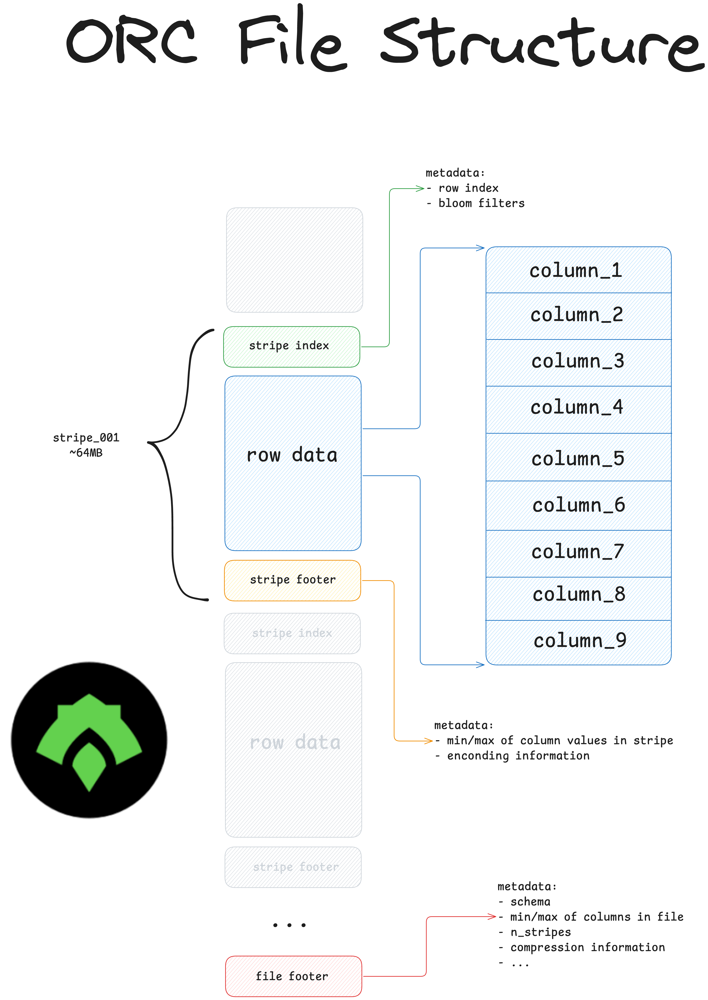
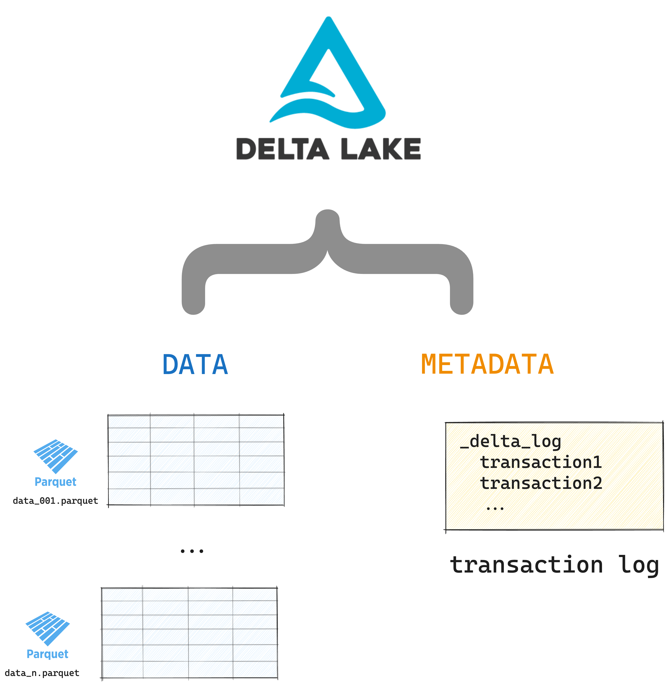
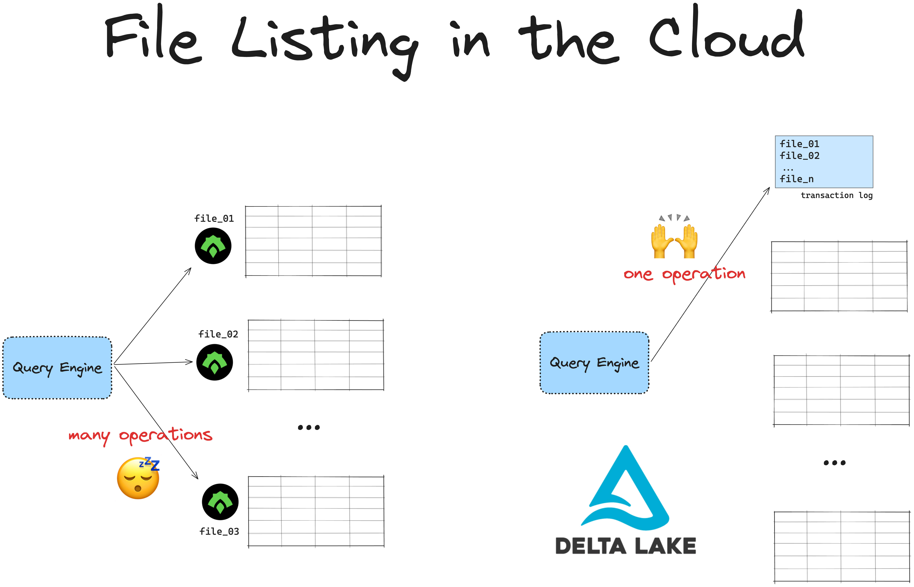
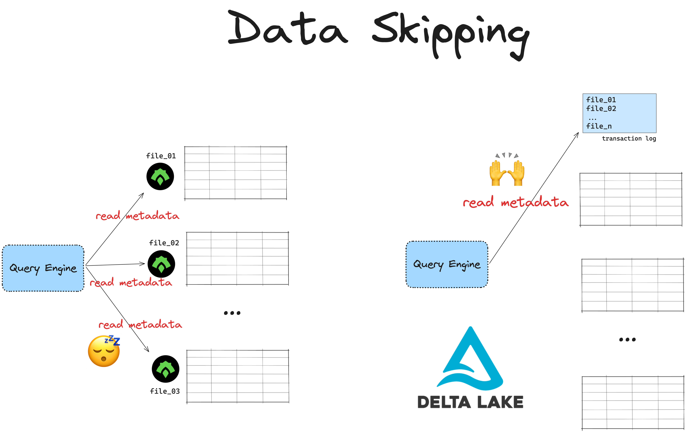
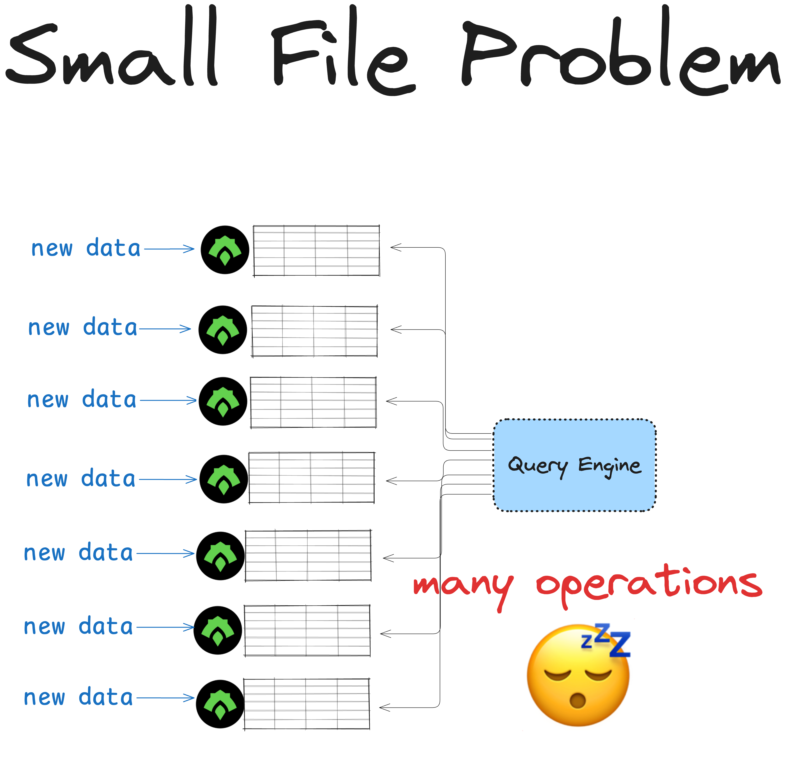

# Delta Lake vs ORC

This article explains the differences between Delta Lake and ORC (Optimized Row Columnar) tables.

ORC is a good file format for Apache Hive projects or when you’re working with small datasets and don’t need strong ACID transactions. ORC tables become slow and hard to manage when data is in many files. Delta Lake makes it easy to manage data in many files without data loss or corruption.

Delta Lake has all the benefits of ORC tables as well as many other critical features for data practitioners.

Let’s compare the basic structure of an ORC table and a Delta table to understand Delta Lake's advantages better.

## ORC: Essential Properties

ORC is an immutable columnar file format for storing structured data.

ORC has some important advantages compared to row-based formats like CSV:

- it’s a **columnar** file format. This means query engines can easily ignore columns that are not relevant to a query. Row-based formats require engines to look through the entire file.
- it **hard-codes schema and metadata** into the file. This means query engines don’t need to infer the schema (error-prone) and users don’t need to manually specify it (time-consuming).
- it offers **great compression** features for better storage optimization.
- it stores **data in chunks** called “stripes”. The file contains metadata for each stripe, which enables query optimization via data skipping.
- it’s an **immutable** file format which reduces the risk of accidental data updates.



ORC was developed to:

- Speed up workloads in Apache Hive
- Improve storage efficiency of Hadoop Distributed File System (HDFS)
- Optimize for large read-heavy data operations

Here is what an ORC directory looks like on disk:

```
    my_data.orc
    _SUCCESS
    part-00000-add4a8a6-feef-4796-b1ec-2134a2d2b03f-c000.snappy.orc
    part-00001-add4a8a6-feef-4796-b1ec-2134a2d2b03f-c000.snappy.orc
    part-00002-add4a8a6-feef-4796-b1ec-2134a2d2b03f-c000.snappy.orc
    part-00003-add4a8a6-feef-4796-b1ec-2134a2d2b03f-c000.snappy.orc
    ...
```

A dataset stored in ORC contains a separate file for each partition. The `_SUCCESS` file is an empty marker file used to indicate that an operation (such as writing or saving data) has completed successfully. This kind of marker file is a common practice in Hadoop Distributed File System (HDFS) and similar storage systems.

## Challenges of working with ORC

Here are some of the challenges of working with ORC

- Limited functionality outside of Apache Hive and Hadoop
- ACID transactions are not natively supported
- File listing overhead (small file problem)
- Expensive footer reads to gather statistics for file skipping
- No data versioning or time travel functionality
- Changing and dropping columns is difficult
- No schema enforcement makes data corruption likely

Let’s take a look at the basic structure of a Delta Lake table to see how its design supports critical features for data practitioners.

## Delta Lake: Basic Structure

Delta Lake stores metadata in a transaction log and table data in Parquet files. Here are the contents of a Delta table:

```
    your_delta_table/	        <-- 	this is the top-level table directory
    _delta_log			<-- 	this is the transaction log which tracks
        00.json			        all the changes to your data
        01.json
        …
        n.json
    file1.parquet	        <-- 	these are your Delta table partitions,
    file2.parquet		        ordered for maximum query performance
    …
    fileN.parquet
```

Here’s a visual representation of a Delta table:



You can see the full Delta Lake specification by looking at the [protocol](https://github.com/delta-io/delta/blob/master/PROTOCOL.md).

Let’s look at how Delta Lake makes file listing operations faster.

## Delta Lake vs ORC: file listing

To read data stored in ORC, you first have to perform a file listing operation. Your ORC reader needs to know the paths to all the files before it can read them.

This is OK for small datasets but becomes slow and expensive when you have more data, especially when you’re reading files from the cloud. Cloud file systems use key/value stores to reference data, which are slower at listing operations than UNIX filesystems.



Cloud object stores are especially slow at listing files that are nested in directories. This is often the case with Hive-style partitioning. Listing files stored in the cloud with Hive-style partitioning can take minutes or hours to compute.

Delta Lake stores the paths to all of the underlying files in the transaction log. This is a separate file which doesn’t require an expensive listing operation. The more files you have, the faster it will be to read your data with Delta Lake compared to ORC files.

## Delta Lake vs ORC: data skipping

ORC includes metadata at the file-level and stripe-level, like the schema, number of stripes and rows, bloom filters and the min/max values of each column. This metadata allows ORC readers to perform efficient query optimizations by skipping irrelevant data.

But ORC stores each partition as its own file. This means that your ORC reader will need to access each partition file independently to fetch the metadata. When you’re working with lots of data spread stored in many partition files this will lead to expensive footer reads.

Delta Lake stores all metadata at the table-level in a separate transaction log. Query engines can access all the metadata with a single read and quickly know which data to skip. This is much faster.



## Delta Lake vs ORC: ACID transaction

Delta Lake prevents operations from corrupting your table by supporting ACID transactions. A transaction is any write operation that changes the table.

ORC does not support ACID transactions.

ORC tables are easier to corrupt because they do not support transactions. If you’re writing a large amount of data to an existing ORC table and your cluster dies, you will be left with a failed partial write. A corrupted table can break a lot of downstream data systems and requires a manual hotfix. This will likely be time-consuming and expensive, and definitely not fun.

This kind of situation is not possible with systems that support ACID transactions: the entire write operation will fail and you will be free to retry without having to deal with a corrupted table.

Transactions also coordinate safe concurrent writes from multiple processes and prevent unintended data loss. You almost always need ACID transactions when you’re working with big data in production environments.

### What about ACID ORC?

ACID ORC refers to a specialized use of the Apache ORC file format together with Apache Hive to support ACID transactions in Hive tables.

This feature is part of Hive's transactional tables functionality. The ACID capabilities are enabled by Hive’s transactional framework, which just uses ORC as the underlying file format for storage.

ORC by itself does not support ACID transactions.

## Delta Lake vs ORC: use your favorite tools

ORC was created to solve specific problems with Apache Hive and Apache Hadoop workloads. Storing files in ORC outside of these environments can still be fast and storage-efficient, but you will not get the full feature experience. Popular Python libraries like Polars and DuckDB currently do not provide full read/write support for ORC files.

Delta Lake can be used from Apache Spark, Python, Rust and [many other popular query engines](https://delta.io/blog/delta-lake-without-spark/). You can also use the [Delta Kernel](https://delta.io/blog/delta-kernel/) project to build your own connectors.

## Delta Lake vs ORC: bloom filters

Bloom filters are a popular feature of ORC files.

A bloom filter is a probabilistic data structure used to determine whether a value _might be present_ in a column or _is definitely not present_. In ORC a bloom filter is built for each column. This allows the ORC reader to check whether a value could be in the column or not.

Bloom filters are stored at the stripe-level for each ORC file. This means that the ORC reader will have to access each stripe in each partition file. As we’ve seen above, this can lead to expensive read operations when you’re working with large datasets stored in many partition files.

Delta Lake stores all the metadata for data skipping at partition and table level in the separate transaction log. The Delta reader can just access the transaction log without having to read all the partition files. This is much faster.

## Delta Lake vs ORC: small file problem

Immutable formats like ORC can lead to having too many small files on disk. This is known as The Small File Problem and can slow down your queries.

Suppose you have a table that needs to be updated many times a day. You store the table in ORC because it has great compression and data skipping features and it's immutable: no one will be able to accidentally overwrite your data.

But because ORC is immutable, every update will create a new file. Over time, queries on this table may suffer from performance slowdown due to the small file problem.



To solve this, you will have to manually merge data into larger files, delete stale files or scale up your compute to improve query speeds. This will probably be expensive.

Delta Lake provides automatic maintenance operations like [automatic compactions and optimized writes](https://delta.io/blog/delta-lake-optimize/) to help you deal with the small file problem. These operations will compact your smaller files into larger, more performant ones.

## Delta Lake vs ORC: Hive-style partitioning

The small file problem happens often in datasets that use Hive-style partitioning.

Hive-style partitioning is the practice of organizing large datasets into hierarchical directories according to the partition column, e.g. date, region, etc. Each directory will contain the data in separate files. This used to be the fastest way to optimize data read performance by making it easier for query engines to skip partitions.

A hive-style partitioned dataset will look something like this:

```
    my_dataset
      year=2024
        month=01
            month01_001.orc
            month01_002.orc
            …
        month=02
            month02_001.orc
            …
        month=03
            month03_001.orc
            …
```

ORC was developed specifically for use in Apache Hive environments and is often used to perform Hive-style partitioning.

Hive-style partitioning is no longer the most efficient way to partition large datasets. It has two main problems:

1. It assumes you know all of the queries you'll run when you partition the data, which can lead to expensive repartitioning when your queries change.
2. It contributes to the small file problem when there are many partition columns

Legacy systems used physical disk (i.e. Hive-style) partitioning for file skipping. Modern systems like Delta Lake use the partition information in the transaction log for file skipping.

Read more in [The Pros and Cons of Hive-style Partitioning](https://delta.io/blog/pros-cons-hive-style-partionining/).

## Delta Lake vs. ORC: renaming columns

ORC files are immutable. This means you cannot directly modify them to rename a column. To change a column name, you must load the data, rename the column, and then save the entire file again. This can be expensive and time-consuming, especially for large datasets.

Delta Lake simplifies this by separating physical and logical column names. The physical column name is what’s stored in the underlying data file. The logical column name is what users interact with.

This way Delta Lake allows you to rename columns quickly by modifying the logical column name, which is a simple metadata change recorded in the Delta transaction log. This operation is fast and doesn't involve rewriting data.

## Delta Lake vs. ORC: dropping columns

Delta Lake makes it easy to drop a column. You can simply add an entry to the Delta transaction log, telling Delta to ignore the column in future operations. This is a fast operation that doesn't require rewriting the data – you’re only changing the metadata.

Dropping a column with ORC tables is more complex. Because ORC is an immutable table format, you must read the entire dataset, use a query engine to remove the column, and then rewrite all the data. This process is computationally expensive, even though the task itself is pretty simple.

See this blog post for more information on [how to drop columns from Delta tables](https://delta.io/blog/2022-08-29-delta-lake-drop-column/).

## Delta Lake vs ORC: schema enforcement

When writing new data to an existing table, you usually want to make sure that the new data follows the same schema as your existing dataset. Otherwise you will end up with mismatched columns that can break downstream systems. This process is known as schema enforcement, which helps maintain dataset consistency.

Regular ORC tables don’t support schema enforcement. This means that it’s possible to corrupt your table by appending data with a mismatched schema.

Delta Lakes have built-in schema enforcement by default. This saves you from accidentally corrupting your data. Let’s see this is in action.

We’ll create a Delta table with a predefined schema:

```
df = spark.createDataFrame([("bob", 47), ("li", 23), ("leonard", 51)]).toDF(
    "first_name", "age"
)
df.write.format("delta").save("tmp/fun_people")
```

Now, let’s try to write data with a different schema to this same Delta table:

```
df = spark.createDataFrame([("frank", 68, "usa"), ("jordana", 26, "brasil")]).toDF(
    "first_name", "age", "country"
)

df.write.format("delta").mode("append").save("tmp/fun_people")
```

This operation will error out with an `AnalysisException`:

```
AnalysisException: A schema mismatch detected when writing to the Delta table (Table ID:...).
```

Delta Lake does not allow you to append data with mismatched schema by default. Read the [Delta Lake schema enforcement](https://delta.io/blog/2022-11-16-delta-lake-schema-enforcement/) post to learn more.

You can also bypass schema enforcement in Delta tables and change the schema of a table over time.

## Delta Lake vs ORC: schema evolution

Sometimes you need some flexibility in your table schema. You might need to add new columns or change the data type.

This is possible with ORC because it doesn't support schema enforcement. There is no explicit control on your table schema by default. This gives you flexibility (you can add any data you like) at the cost of reliability (your downstream table reads might break). Query engines usually infer the schema of an ORC table by looking at the schema of one file and then assuming that all the other files have the same schema. This is error-prone.

Delta Lake supports schema evolution so you can easily and securely update your schema running big computations. It’s another critical feature that’s useful for data practitioners working with big data in production. Read more in the [Delta Lake Schema Evolution](https://delta.io/blog/2023-02-08-delta-lake-schema-evolution/) blog post.

To update the schema of your Delta table, you can write data with the mergeSchema option. Let’s try this for the example that we just saw above:

```
df.write.option("mergeSchema", "true").mode("append").format("delta").save(
    "tmp/fun_people"
)
```

Here are the contents of your Delta table after the write:

```
spark.read.format("delta").load("tmp/fun_people").show()

+----------+---+-------+
|first_name|age|country|
+----------+---+-------+
|   jordana| 26| brasil| # new
|     frank| 68|    usa| # new
|   leonard| 51|   null|
|       bob| 47|   null|
|        li| 23|   null|
+----------+---+-------+
```

The Delta table now has three columns. It previously only had two columns. Rows that don’t have any data for the new column will be marked as null when new columns are added.

Delta Lake schema evolution is better than what’s offered by ORC.

## Delta Lake vs ORC: data versioning

ORC doesn’t have built-in support for data versioning. Overwriting or deleting data from an ORC table means it is gone forever and you cannot roll back to it. This is known as a “physical delete”.

This becomes a problem when you or a colleague accidentally updates the data. ORC tables don’t offer an easy way to undo those changes.

Delta Lake supports data versioning natively through its transaction log. Every change made to the data is recorded in this log, providing a clear history of all transformations for easy reference. Overwrites and deletes are “logical deletes” that update the transaction log. Future reads will not reference the overwritten or deleted data, but the old data is still available for future retrieval.

You can explicitly run physical deletes on stale data using [the VACUUM command](https://delta.io/blog/2023-01-03-delta-lake-vacuum-command/).

## Delta Lake vs ORC: time travel

Data versioning means that Delta Lake also enables time travel. You can easily switch between different versions of your Delta table. This makes it simple to revert accidental changes or review previous states of the data.

You can load a specific version of your Delta table like this:

```
spark.read.format("delta").option("versionAsOf", version).load("path/to/delta")
```

Read more about time travel in the [Delta Lake Time Travel](https://delta.io/blog/2023-02-01-delta-lake-time-travel/) post.

## Delta Lake vs ORC: Apache Hive workloads

ORC is optimized for Apache Hive. The [Hive connector for Delta Lake](https://github.com/delta-io/delta/tree/master/connectors/hive) supports reading Delta tables but does not have native write support.

See the [Delta Lake without Spark](https://delta.io/blog/delta-lake-without-spark/) blog for more details.

## Other advantages of Delta Lake tables

Delta Lake has many other advantages over ORC tables that aren’t discussed in this article. You can check out these posts to learn more:

- [How Delta Lake uses metadata to make certain aggregations much faster](https://delta.io/blog/2023-04-19-faster-aggregations-metadata/)
- [How to clone your Delta Lake](https://delta.io/blog/delta-lake-clone/)
- [Delta Lake Change Data Feed (CDF)](https://delta.io/blog/2023-07-14-delta-lake-change-data-feed-cdf/)

## Conclusion

This article has explained the differences between Delta Lake and ORC. Delta Lake has all of the great features of ORC as well as many other critical features.

Consider using ORC if you:

- have to work in Apache Hive environments
- are working with small datasets
- are running non-production workloads that don’t require ACID transactions

Consider using Delta Lake if you:

- are working with large datasets stored in the cloud
- need ACID transactions for production-grade reliability in [ETL pipelines](https://delta.io/blog/delta-lake-etl/)
- care about maximum data skipping performance
- are working with Python libraries like Polars or DuckDB
