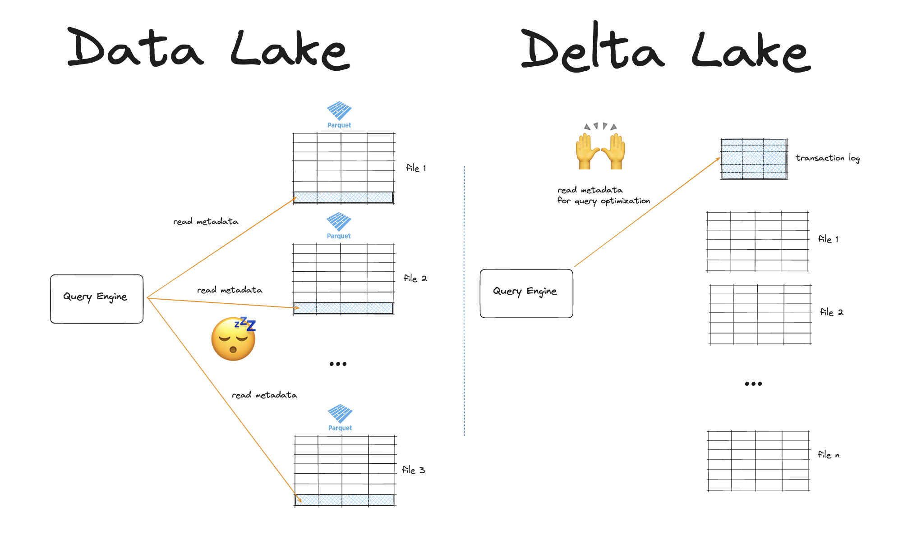

This article shows you how to use Delta Lake in Python and Rust with the `delta-rs` library.

`delta-rs` is a Rust-based implementation of the [Delta Lake protocol](https://delta.io/blog/2023-07-07-delta-lake-transaction-log-protocol/). It is the best way to use [Delta Lake without Spark](https://delta.io/blog/delta-lake-without-spark/) and without any JVM dependencies. It runs on Apache Arrow, so it works smoothly with popular libraries like pandas, Polars, and DuckDB. If you prefer a lightweight, Python/Rust-first stack without Spark or JVM, then `delta-rs` is a great fit.

This guide will show you:

- What delta-rs is and what you can use it for
- How to use Delta Lake in Python
- How to use Delta Lake in Rust
- The features and limitations of the delta-rs implementation

Let's jump in.

## What is Delta Lake?

Delta Lake is an [open table format](https://delta.io/blog/open-table-formats/). It stores your data in Parquet files and adds a transaction log (the `_delta_log` folder) to track how those files change over time. The transaction log turns a folder of files into a real table with versions, commits, and rules.


Here's the core idea:

1. Data is stored in Parquet files
2. Transaction log records every change (add/remove files, schema, properties). Each commit creates a new table version.

From this simple structure you get database-level guarantees to provide fast performance and strong reliability for your data lake:

- ACID transactions & snapshot reads.
- Optimistic concurrency: multiple writers can work in parallel.
- Time travel to read previous versions of your tables.
- Schema enforcement and evolution.
- Full audit table history so you can explain who changed what and when.

With this architecture you keep Parquet's speed and interoperability, while gaining transactions, history, and clear table semantics. And because Delta Lake is a protocol, you can use it from different query engines and programming languages without changing how the table is stored on disk.

## What is delta-rs?

Delta-rs is a Rust implementation of the Delta Lake protocol with first-class bindings for Python. It skips the JVM entirely and uses Apache Arrow under the hood, so it integrates cleanly with pandas, Polars, and DuckDB.

You can use `delta-rs` to:

- read and write Delta tables
- list versions
- time travel
- update table metadata

It runs locally or against common object stores (local disk, S3, ADLS, GCS, others). Feature coverage continues to grow; some advanced operations differ by engine, but the core protocol behavior matches the Delta Lake specification.

In short: `delta-rs` gives Python and Rust users a fast, simple way to use Delta Lake without spinning up Spark clusters.

## Why do we need a separate Delta Lake implementation?

Delta Lake is a [protocol](https://delta.io/blog/2023-07-07-delta-lake-transaction-log-protocol/): a standardized spec for how a table stores data and how readers/writers change it. It describes the core logic and programmatic constraints but does not provide a fixed way to implement this logic. All open table formats (like Apache Hudi and Iceberg) work this way: they define a protocol and leave the implementation up to user preference.


The first implementation (`delta-io/delta`) is written in Scala and tightly integrated with Apache Spark. It's the reference implementation and the most mature, but it also assumes a JVM and a Spark runtime.

This creates real limits for Python and Rust teams. Spinning up Spark for small, service-sized jobs adds overhead and cost. Packaging and deploying JVM dependencies is heavier than shipping a pure-Python wheel or a Rust binary. And while Spark is great for distributed compute, it's not the natural fit for Arrow-native workflows.

Delta-rs solves these gaps. It re-implements the Delta Lake protocol in Rust with a clean Python API: no Spark and no JVM. You get the core table semantics (ACID commits, versions, schema controls) exposed through Arrow-friendly data structures. The result is a lightweight API for Python and Rust that lets you read and write the same Delta tables as other engines.

## Using delta-rs in Python: Code Examples

Let's take a look at how to use delta-rs in Python.

### Install delta-rs in Python

Start by installing the `deltalake` library (the Python bindings for `delta-rs`) and a fast DataFrame engine. We'll use `polars` for this article.

```
pip install deltalake polars pyarrow
```

Polars uses `deltalake` under the hood, so for many tasks you won't need to import `deltalake` directly.

### Write Delta Lake with delta-rs in Python

Let's create a small Polars DataFrame and write it as a Delta table. This creates Parquet files and a `_delta_log` folder at the target path.

```python
    import polars as pl

    # create toy data
    df = pl.DataFrame({
        "first_name": ["bob", "li", "leah"],
        "age": [47, 23, 51],
    })

# write to disk
base_path = f"tmp/people_delta"
    df.write_delta(base_path")
```

The path can be local (as above) or an object-store URI like `s3://bucket/people_delta` once your credentials are configured.

### Read Delta Lake with delta-rs in Python

Now let's load the table back. You're reading the latest snapshot (current version) as a regular Polars DataFrame.

```python
    > data = pl.read_delta(base_path)
    > print(data)

    ┌────────────┬─────┐
    │ first_name ┆ age │
    │ ---        ┆ --- │
    │ str        ┆ i64 │
    ╞════════════╪═════╡
    │ bob        ┆ 47  │
    │ li         ┆ 23  │
    │ leah       ┆ 51  │
    └────────────┴─────┘
```

### Time Travel with delta-rs in Python

Next, let's append a couple of rows to create a new table version, then read an older version to “travel back in time.” This is handy for audits and debugging.

First add some new rows to your existing Delta table:

```python
    new_rows = pl.DataFrame({
        "first_name": ["suh", "anais"],
        "age": [33, 68],
    })
    new_rows.write_delta(base_path, mode="append")
```

Read the latest version:

```python
    > latest = pl.read_delta(base_path)
    > print(latest)

    ┌────────────┬─────┐
    │ first_name ┆ age │
    │ ---        ┆ --- │
    │ str        ┆ i64 │
    ╞════════════╪═════╡
    │ suh        ┆ 33  │
    │ anais      ┆ 68  │
    │ bob        ┆ 47  │
    │ li         ┆ 23  │
    │ leah       ┆ 51  │
    └────────────┴─────┘
```

Now let's go back to version 0 (before the append):

```python
    > v0 = pl.read_delta(base_path, version=0)
    > print(v0)

    ┌────────────┬─────┐
    │ first_name ┆ age │
    │ ---        ┆ --- │
    │ str        ┆ i64 │
    ╞════════════╪═════╡
    │ bob        ┆ 47  │
    │ li         ┆ 23  │
    │ leah       ┆ 51  │
    └────────────┴─────┘
```

Polars is a great first choice for performance and simplicity. You can also use deltalake with [pandas](https://delta.io/blog/2023-04-01-create-append-delta-lake-table-pandas/) or DuckDB and others. There are other ways to use Delta Lake in Python without delta-rs (for example, with PySpark). See the Delta Lake for Python tutorial to learn more.

## Using delta-rs in Rust

Here's how to install `delta-rs` in Rust using cargo:

```
    cargo add deltalake
```

Most Rust-based query engines expose a Python API. Rust gives the performance and security guarantees and Python gives a smoother user experience. Refer to the official delta-rs documentation if you're interested in learning the [Rust API](https://delta-io.github.io/delta-rs/api/).

## Which query engines can I use with delta-rs?

The `deltalake` package exposes Delta tables as Arrow data, so any Python engine that speaks Apache Arrow can work with `delta-rs`.

Engines supported today include:

- Polars
- pandas
- DuckDB
- DataFusion
- Daft
- Dask

Feature coverage varies by engine. Some focus on reads, others also support writes and time travel. The ecosystem is moving quickly, but for high-performance workloads, Polars is a strong, well-maintained choice.

For more examples, see the [Delta Lake without Spark article](https://delta.io/blog/delta-lake-without-spark/) and the [Integrations section](https://delta-io.github.io/delta-rs/integrations/delta-lake-arrow/) in the delta-rs docs.

## Which object stores can I use with delta-rs?

Delta-rs works with local files and the major object stores. The integrations currently include:

- AWS S3
- Azure (Blob / ADLS Gen2)
- Google Cloud Storage (GCS)
- HDFS
- Cloudflare R2 & MinIO (S3-compatible)
- lakeFS (via its S3 Gateway)

Below are two short setups you can copy.

### delta-rs and S3 example

Use standard AWS env vars and an `s3://` URI to source or store Delta tables in AWS S3 with `delta-rs`.

Here's an example using `polars`:

```python
    export AWS_ACCESS_KEY_ID="...your key..."
    export AWS_SECRET_ACCESS_KEY="...your secret..."
    export AWS_REGION="eu-west-1"   # pick your region

    import polars as pl

    table_uri = "s3://my-bucket/delta/people"

    # Write
    df = pl.DataFrame({"first_name": ["bob", "li"], "age": [47, 23]})
    df.write_delta(table_uri, mode="overwrite")  # delta-rs under the hood

    # Read (latest snapshot)
    out = pl.read_delta(table_uri)
    print(out)
```

### delta-rs and lakeFS example

Point delta-rs at the lakeFS S3 Gateway endpoint and use an `s3://{repo}/{branch}/path` URI. Your lakeFS access keys go in the standard AWS env vars.

```python
    # lakeFS S3 Gateway running at http://localhost:8000 (adjust for your setup)
    export AWS_ACCESS_KEY_ID="LAKEFS_ACCESS_KEY"
    export AWS_SECRET_ACCESS_KEY="LAKEFS_SECRET_KEY"
    export AWS_REGION="us-east-1"
    export AWS_ENDPOINT_URL="http://localhost:8000"   # lakeFS S3 Gateway
    export AWS_S3_ALLOW_UNSAFE_RENAME="true"          # commonly needed for local/dev
```

Then accessing your data with `polars` is the same as above:

```python
    import polars as pl

    # Write to a repo/branch/path inside lakeFS
    table_uri = "s3://my-repo/main/delta/people"

    df = pl.DataFrame({"first_name": ["leah", "suh"], "age": [51, 33]})
    df.write_delta(table_uri, mode="overwrite")

    # Read it back
    print(pl.read_delta(table_uri))
```

## Why not just use Parquet?

Parquet is an excellent file format. It's fast, compact, and widely supported. For static exports and one-off data sets, it's a solid choice. But Parquet is immutable and has no concept of transactions. That makes routine table operations (like upserts, deletes and concurrent writes) hard to do safely at scale.

Delta Lake is a table format that sits on top of Parquet. It adds a transaction log, ACID commits, snapshot reads, and version history. With these features you can upsert reliably, run multiple writers without corrupting data, travel back to earlier versions, and both enforce and evolve schemas over time.

If you're maintaining production pipelines in Python or Rust, these features make a big difference. You avoid partial overwrites, stop duplicate records during retries and you get faster reads from smarter file skipping.

`delta-rs` gives you all of these features without Spark or the JVM. For a detailed comparison, check out the [Delta Lake vs Data Lake](https://delta.io/blog/delta-lake-vs-data-lake/) post.



## What about Delta Kernel?

[Delta Kernel](https://delta.io/blog/delta-kernel/) is a low-level toolkit for building your own Delta connector or implementation. Delta Kernel is* not a client library* like `delta-rs`. It's a low-level building block meant for engine authors who want to implement Delta Lake semantics inside their own system. `delta-rs` gives Python/Rust users a ready-to-use API to work with Delta tables. Delta Kernel gives systems builders the primitives to create that API inside a new engine or connector.

Use Delta Kernel when you're building a query engine, database, or ingestion tool and need native Delta support. It offers both a JVM kernel and a Rust kernel. The Rust kernel also exposes C/C++ bindings, so you can embed it from Rust, C/C++, Python, or any runtime that can load those libraries.

If you're just wanting to read and write Delta tables from Rust or Python, use `delta-rs`.

## How can I contribute to delta-rs?

The `delta-rs` project is a fun and friendly environment and a great place to make your mark with open-source contributions.

Here's how to get started:

1. Star and watch the project repo:[ delta-io/delta-rs on GitHub](https://github.com/delta-io/delta-rs).
2. Read the `CONTRIBUTING.md` guidelines
3. If you're new, pick up a starter task from **Good First Issues**:[ open list here](https://github.com/delta-io/delta-rs/labels/good%20first%20issue).
4. Move on to fixing docs, adding tests, or improving an integration—small PRs are perfect.
5. Join discussions, ask questions, and ship your first patch :)
