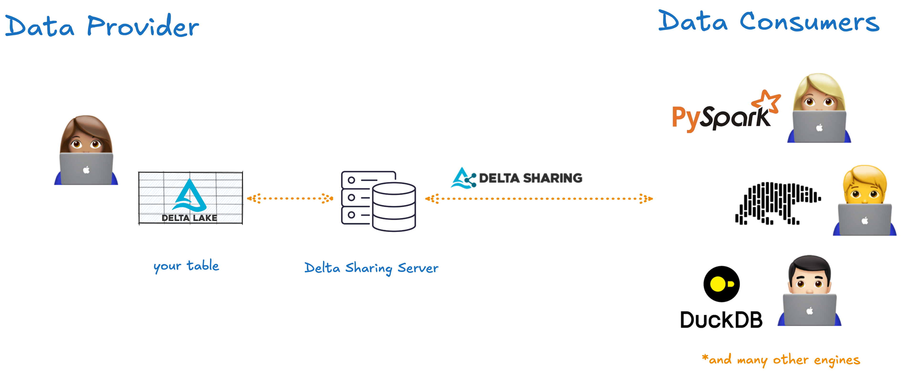

This article explains how to use Delta Sharing to share your Delta Lake tables safely and efficiently with external organizations or collaborators.

Data needs to flow between organizations and departments to be useful. For example, a retail company needs to share information about sales with its suppliers to make sure product stock is always in order. This sharing needs to be done safely and with as little compute as possible.

The problem is that data consumers often use different compute and storage tools for their analyses. This has traditionally required data to be copied and translated across formats, which was painful and expensive.

Delta Sharing solves this problem by making it easy to share large datasets in real-time across organizations and departments without any data duplication. You can use Delta Sharing to make live Delta Lake data available to external data consumers according to secure access control rules.

Let's take a closer look at how Delta Sharing works and how you can use it to share your data.

## What is Delta Sharing?

Delta sharing is an open-source protocol for securely sharing large datasets in real-time. At its core, Delta Sharing is a REST protocol: a standardized format that enables data exchange between systems over HTTP by exposing data resources as URLs.



Here's how it works:

1. You create a Delta Sharing Server which makes an existing Delta Lake table available for consumption. The server defines which parts of the data can be accessed by which recipients.
2. A data recipient can run any query engine that supports the open Delta Sharing REST protocol to access the data that they are authorized to query.
3. The Delta Sharing Server will list the required files needed to complete the recipient's query. This allows the recipient to ask only for a subset of table (e.g. specific items or date) for more efficient computation
4. The Delta Sharing Server will then transfer files to the recipient using short-lived URLs and making use of cloud object store support for parallel computing and performance gains. Only the files required for the query are transferred so you don't need to be constantly streaming the entire dataset to a server.

## Why should I use Delta Sharing?

Delta Sharing has some really great benefits. It is a fast, secure and cheap protocol for sharing live datasets at scale without any data duplication. Data providers can easily share an entire dataset or choose to share only parts of it (e.g. a specific time-stamped version or a filtered query) with external parties. Tables are shared live and can be updated in real-time using Delta Lake's ACID transactions. Any client that can read Parquet files can support reading Delta Sharing.

This makes **data providers** happy because:

- The data can stay in its original location
- They don't have to pay or wait for expensive data duplication
- They have peace of mind that only the right parts of the data are shared externally
- Only data that is actually needed for the query is transferred, avoiding large infrastructure sitting idle

Delta sharing makes **data consumers** happy because:

- They have immediate access to shared data
- They can use their favorite tools to read the data
- They don't need to talk to IT to set up intermediate data warehousing
- Only data that is actually needed for the query is transferred, avoiding expensive transfer fees.

Any client that can read Parquet can support Delta shares. Transfer between provider and consumer is cheap, reliable and parallelizable because it uses the native features of cloud object stores (S3, ADLS, GCS).

## How do I enable Delta Sharing on a Delta table?

To use Delta Sharing you will need to configure the following:

- **A Delta Sharing server**: to be configured and used by the data provider to make their data available for sharing
- **A profile file**: containing credentials, to be downloaded by the data consumer in order to access the server

For this tutorial we will use a preconfigured Delta Sharing server that is being hosted publicly. This is great for trying out the connectors with sample data. The profile file for this server is stored in the `delta-sharing` [Github repository](https://github.com/delta-io/delta-sharing/tree/main).

For your own workloads, you can implement your own Delta Sharing server following the instructions in the [official documentation](https://github.com/delta-io/delta-sharing?tab=readme-ov-file#delta-sharing-reference-server). For an example of a self-hosted OSS Delta Sharing server, read the [Open source self-hosted Delta Sharing server](https://delta.io/blog/2023-04-24-open-source-selfhosted-delta-sharing-server/) tutorial.

## How to run Delta Sharing with pandas

You can use the Python connector to read Delta Sharing tables with pandas.

Install the connector from PyPi:

```shell
pip install delta-sharing
```

Clone the `delta-sharing` Github repository:

```shell
git clone https://github.com/delta-io/delta-sharing.git
```

In a Python script or Jupyter notebook, import the `delta-sharing` library:

```python
import delta_sharing
```

Define the path to the profile file and use it to create a Delta Sharing client:

```python
profile_file = "/path/to/delta-sharing/example/open-datasets.share"
client = delta_sharing.SharingClient(profile_file)
```

You can now use your client to access the shared Delta tables. Let's list all the tables in this share:

```python
> client.list_all_tables()

[Table(name='COVID_19_NYT', share='delta_sharing', schema='default'),
 Table(name='boston-housing', share='delta_sharing', schema='default'),
 Table(name='flight-asa_2008', share='delta_sharing', schema='default'),
 Table(name='lending_club', share='delta_sharing', schema='default'),
 Table(name='nyctaxi_2019', share='delta_sharing', schema='default'),
 Table(name='nyctaxi_2019_part', share='delta_sharing', schema='default'),
 Table(name='owid-covid-data', share='delta_sharing', schema='default')]
```

To work with the data in these tables, you will need to create a table URL to reference it. A table URL consists of the path to your profile file, followed by a `#` and 3 components: `&lt;share-name>.&lt;schema-name>.&lt;table-name>`.

Create the table URL for one of the tables listed in this share:

```python
table_url = profile_file + "#delta_sharing.default.flight-asa_2008"
```

The `delta-sharing` library offers different methods to work with shared Delta data. Use the `load_as_pandas` method to load data into a pandas DataFrame:

```python
df = delta_sharing.load_as_pandas(table_url)
```

If your dataset does not fit into local memory, use the `limit` keyword to specify the number of rows to read:

```python
df = delta_sharing.load_as_pandas(table_url, limit=1000)
```

Now that your data is loaded into a pandas DataFrame you can query and transform it as needed. For example, run a groupby operation:

```python
> df[["Year","DayofMonth"]].groupby("DayofMonth").count()

           	Year
DayofMonth
9            947
10            53
```

### How to query Table Changes

If the table supports history sharing, the connector can query table changes. For example, here's how to load table changes from version 0 to version 5 into a pandas DataFrame.

```python
delta_sharing.load_table_changes_as_pandas(table_url, starting_version=0, ending_version=5)
```

To support history sharing, enable the `tableConfig.cdfEnabled` setting in the OSS Delta Sharing Server.

## How to run Delta Sharing with Apache Spark

You can also use Delta Sharing with Apache Spark. This will make your data available to clients running in SQL, Python, Java, Scala and R.

To run Delta Sharing with Apache Spark, launch a Spark session with the `delta-sharing` Spark connector. For example, in Pyspark:

```shell
pyspark --packages io.delta:delta-sharing-spark_2.12:3.1.0
```

To work with shared Delta tables you will need the profile file with the access credentials to talk to the Delta Sharing server. After downloading the file, you can references shared tables using the following URL format:

```python
table_path = "<profile-file-path>#<share-name>.<schema-name>.<table-name>"
```

Pass this `table_path` to Spark using:

```python
df = spark.read.format("deltaSharing").load(table_path)
```

Your shared Delta table is now loaded into a Spark DataFrame and you can proceed to use Spark to query and/or transform the data.

Read [the official documentation](https://github.com/delta-io/delta-sharing?tab=readme-ov-file#configuring-apache-spark) for instructions on how to launch the Spark connector with Scala or as part of your Maven or SBT projects.

### How to query Change Data Feed with Delta Sharing

You can query the Change Data Feed (CDF) of a Delta table using Delta sharing. For this to work, the data provider needs to enable CDF on the original Delta table. The data consumer can then query the CDF using the `readChangeFeed` option:

```python
table_path = "<profile-file-path>#<share-name>.<schema-name>.<table-name>"

df = (spark.read.format("deltaSharing")
      .option("readChangeFeed", "true")
      .option("startingVersion", "3")
      .load(table_path))
```

Read more about CDF in the [Delta Lake Change Data Feed](https://delta.io/blog/2023-07-14-delta-lake-change-data-feed-cdf/) post. This feature is available with delta-sharing 0.5.0+.

### How to query streaming data with Delta Sharing

Delta Sharing tables can be used as a data source for Spark Structured Streaming workflows. For this to work, the data provider needs to enable table history on the shared table (`tableConfig.cdfEnabled = True`) . The data consumer can then use the `readStream` method to query the data stream:

```python
table_path = "<profile-file-path>#<share-name>.<schema-name>.<table-name>"

df = (spark.readStream.format("deltaSharing")
      .option("startingVersion", "1")
      .option("skipChangeCommits", "true")
      .load(table_path))
```

Read more about streaming in the Delta Lake streaming post. This feature is available with delta-sharing 0.6.0+.

## Important things to keep in mind

There are a few important things to keep in mind when using Delta Sharing:

- Delta Sharing is available for Python 3.8+
- To enable Delta Sharing on tables with Deletion Vectors and Column Mapping, you need to enable integration with Apache Spark DataSourceV2 and Catalog APIs by setting the same configurations as Delta Lake when you create a new SparkSession.
- Delta Sharing only supports reads, not writes.

For secure and efficient sharing of Delta Lake tables that also supports writes, take a look at the [Unity Catalog](https://www.unitycatalog.io/blogs/unity-catalog-oss) project: an open-source data and AI catalog that makes it easy to store, manage and share data assets at scale.

## Share your Delta tables

Delta Sharing is a safe and efficient way to share read-only data with external collaborators. By using the cheap storage and parallel computation features of cloud object stores, the Delta Sharing protocol can deliver optimized sharing without unnecessary data duplication.

Learn more about using Delta Lake with cloud object stores by reading:

- [Delta Lake on AWS S3](https://delta.io/blog/delta-lake-s3/)
- [Delta Lake on Google Cloud Storage](https://delta.io/blog/delta-lake-gcp/)
- [Delta Lake on Azure Data Lake Storage ](https://delta.io/blog/delta-lake-azure-data-lake-storage/)
