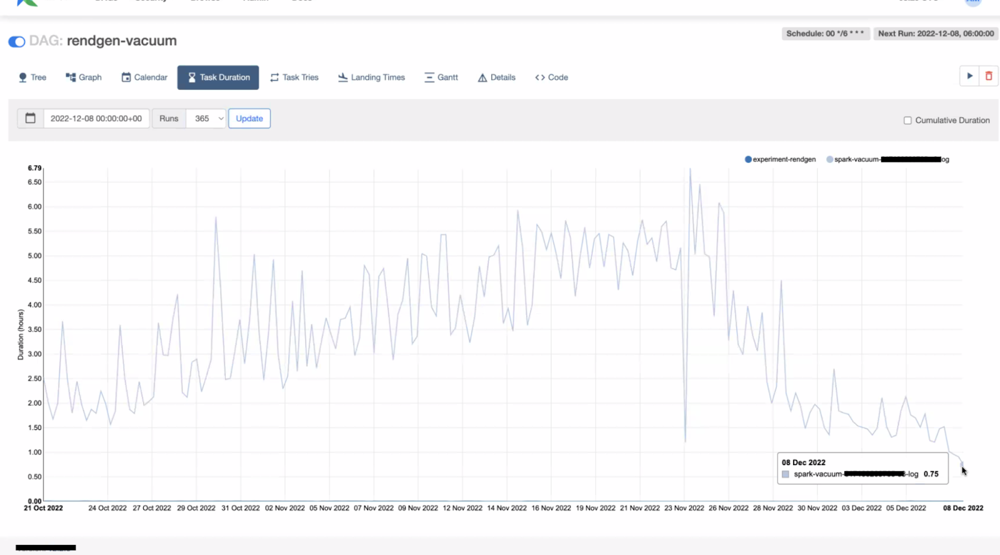
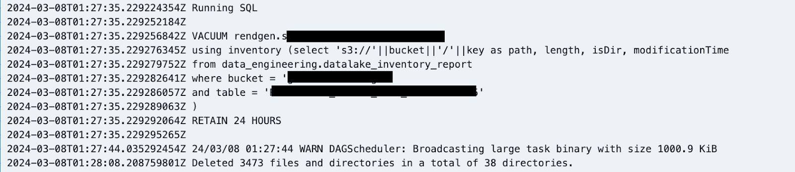
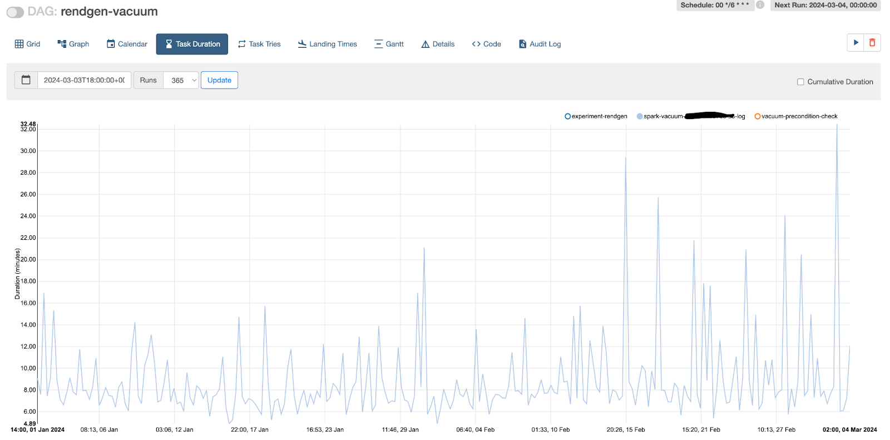
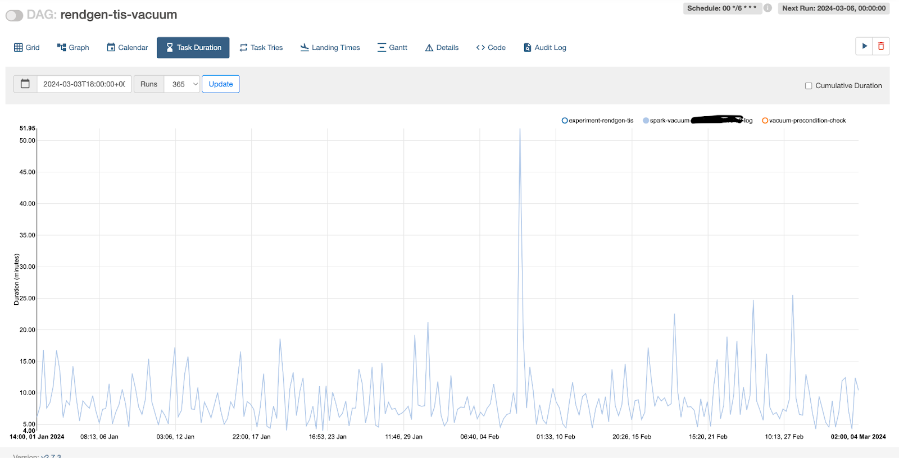
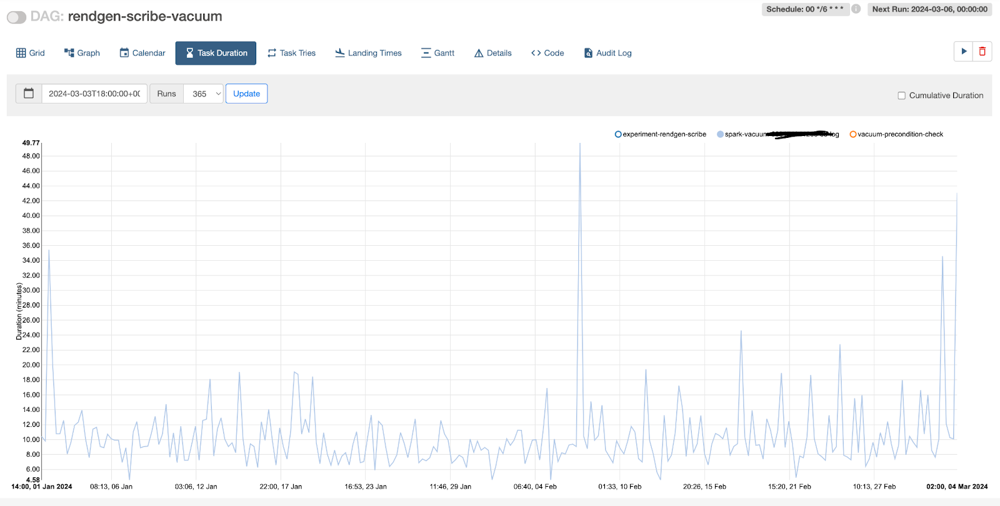
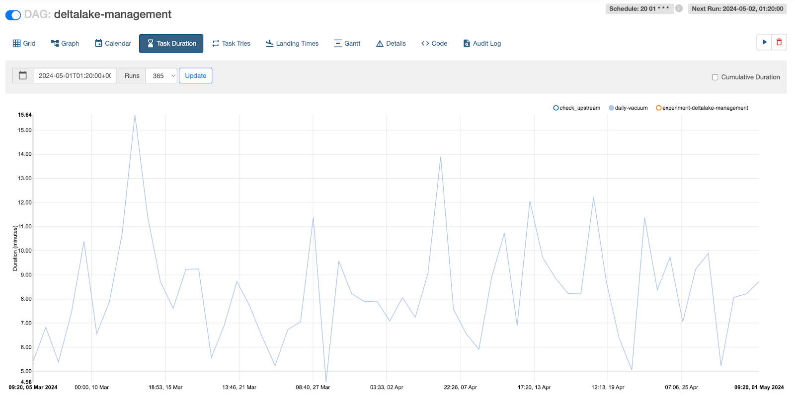

## Background

Today, Delta Lake is rapidly making its mark as a highly popular hybrid data format, earning widespread adoption across various organizations. This popularity extends to those who utilize the Databricks platform as well as those who harness the flexibility of its open-source variant. Here at [Grab](https://www.grab.com/sg/), we embarked on a journey to explore the real-world applications of Delta Lake formats, focusing on dynamic operational and business analytics scenarios.

One such operational case encapsulated the handling and processing of extensive volumes of logs derived from cloud services like AWS S3, aimed for security oversight and monitoring. These logs, delivered by the provider through a 'best effort' approach, would be written into a partitioned Delta table (structured by year, month, day, hour) by our Spark job. The raw log data we deal with on a daily basis - around 16TB, when parsed and saved to a Delta table would consume 2TB of storage. We only retain 1 month of data in the Delta table and anything beyond 1 month is moved to a separate Parquet table where it is archived for more than 6 months.

Given the constant flow and the nature of the logs, along with the log delivery mechanism, this triggered a proliferation of files within our Delta tables - a circumstance that led to a vacuum operation taking an exorbitant amount of time (5-6 hours). Our team opted to implement a series of aggressive optimizations; writing larger file sizes whenever plausible and running a compaction job on relatively older partitions to create even larger files, which minimized the live files referenced in the Delta log. Despite these enhancements, we only managed to trim down the vacuum time to a window of 30-60 minutes.



image:: an example of time taken by a vacuum operation for a large table

From the above graph, we can see that when the Delta table was initially created, the vacuum time increased alarmingly; later, when the team deployed aggressive compaction, optimization, and vacuum operations, we managed to bring down the vacuum time to around 30-60 minutes.

## Why is it Slower?

The standard Delta vacuum operates in three stages. The first stage involves performing a recursive listing of all the files under the Delta Lake table while eliminating certain hidden files and folders. In the second stage, the set of actively referenced files from the Delta log is joined with the file list collected from the first stage. Any files without matching entries in the actively referenced list are earmarked for deletion. Finally, in the third stage, the files identified for deletion are deleted in parallel, or on the Spark driver, based on whether parallel deletion is enabled.

The principal bottleneck presented itself in the form of the recursive file listing operation. The parallelism of this operation was heavily reliant on the cardinality of the first two levels of directories within the Delta Lake table. In our instance, given our Delta Lake table is partitioned by year, month, day, and hour, and has a retention period of one month, we faced a scarcity of effective parallelism. Additionally, one more challenge unfolded. On heavily loaded S3 buckets, making a large number of list API calls was both expensive and time-consuming, subsequently impacting the efficiency of vacuum operations.

With time, the number of partitions grows, but only recent partitions experience changes due to job reruns, corrections, and late-arriving events; the older partitions remain somewhat constant. However, when the Vacuum is activated on large partitioned tables, it initiates a file system - or object store - listing operation across all partitions. The duration needed for the listing operation can vary significantly, extending from mere minutes to several hours, depending on the size and complexity of the partitions. The FileSystem (or object store) scans accounts for the largest fraction of the Vacuum operation for expansive tables. This is predominantly attributable to the limited parallelism permitted by the directory structure, coupled with API throttling on the object stores. As the tables grow, so does the duration of the scan, transforming the Vacuum into a significant overhead, particularly when dealing with hundreds or thousands of such Delta tables

Such a partitioning scheme is an effective strategy for data organization and performance enhancement, though it does create its own challenges in Vacuum. Organizations operating a petabyte-scale lakehouse - comprising hundreds of thousands of objects - would be required to execute millions of list API calls. Such extensive usage would introduce costs related to the APIs themselves as well as the compute resources making these calls. Within the Delta Lake community, several open issues call for a feature that could provide a more targeted vacuum functionality, specifically for large-scale users.

## Introducing Inventory based vacuum

All major object stores like **Amazon S3, Azure ADLS and Google GCS** support a feature called inventory listing ([AWS](https://docs.aws.amazon.com/AmazonS3/latest/userguide/storage-inventory.html) | [Azure](https://learn.microsoft.com/en-us/azure/storage/blobs/blob-inventory) | [GCP](https://cloud.google.com/storage/docs/insights/inventory-reports)), which provides a list of all files/objects in storage along with some metadata. This inventory list can be used with the new vacuum command to bypass the listing operation. This approach is performant, scalable and cost efficient for maintaining large number tables in Lakehouse.

This inventory based vacuum provides a way for users to pass an inventory of files as a delta table or as a spark SQL query (having a predefined schema). This inventory dataframe will be used in place of data frame from file listings effectively making vacuum a 2 stage process of just identifying non-referenced files by comparing with delta log and the actual deletion. The schema for the inventory is as follows:

<table>
  <tr>
    <td>
      <strong>Column</strong>
    </td>
    <td>
      <strong>Data Type</strong>
    </td>
    <td>
      <strong>Remark</strong>
    </td>
  </tr>
  <tr>
    <td>path</td>
    <td>StringType</td>
    <td>Fully qualified URI</td>
  </tr>
  <tr>
    <td>length</td>
    <td>LongType</td>
    <td>Size in bytes</td>
  </tr>
  <tr>
    <td>isDir</td>
    <td>BooleanType</td>
    <td>Is a directory or not</td>
  </tr>
  <tr>
    <td>modificationTime</td>
    <td>LongType</td>
    <td>File creation/modification time in milliseconds</td>
  </tr>
</table>

## How to use it?

Using the optional `USING INVENTORY` clause now users can pass in file inventory as a delta table or as a spark sql subquery.

```
VACUUM table_name [USING INVENTORY <reservoir-delta-table>] [RETAIN num HOURS] [DRY RUN]

eg:
VACUUM my_schema.my_table
using inventory delta.`s3://my-bucket/path/to/inventory_delta_table` RETAIN 24 HOURS


VACUUM table_name [USING INVENTORY (<reservoir-query>)] [RETAIN num HOURS] [DRY RUN]

eg:
VACUUM my_schema.my_table
using inventory (select 's3://'||bucket||'/'||key as path, length, isDir, modificationTime
from inventory.datalake_report
where bucket = 'my-datalake'
and table = 'my_schema.my_table'
)
RETAIN 24 HOURS
```

## How do we use it?

We heavily rely on AWS S3 inventory reports for making crucial operational decisions, such as chargeback and storage cost optimization. Our established pipeline transforms AWS S3 Parquet inventory data into a delta table. Following is the logic behind this conversion process:

```
case class File(key:String, size: Long, MD5checksum: String)
case class Report(sourceBucket : String, destinationBucket: String,
                 version:String, creationTimestamp:String, fileFormat:String, fileSchema:String, files: Array[File])

private def getS3InventoryMetaDataFiles: Seq[String] = {
 val fs = FileSystem.get(new URI("s3://datalake-metadata/inventory/"), spark.sparkContext.hadoopConfiguration)
 buckets.map(bucket => s"s3://datalake-metadata/inventory/${bucket}/${bucket}/**/${date}T01-00Z/manifest.json")
   .filter(p=>{
     val filePaths = FileUtil.stat2Paths(fs.globStatus(new Path(p)))
     if(filePaths.isEmpty) {
       logWarning(s"No inventory files found for $p")
     }
     filePaths.nonEmpty
   })
}


private[jobs] def getS3InventoryDataFiles: Seq[String] = {
 spark.read
   .option("wholetext", true)
   .option("ignoreMissingFiles", "true")
   .text(getS3InventoryMetaDataFiles: _*)
   .flatMap(r => {
     val manifest =
       new Gson().fromJson(r.getAs[String]("value"), classOf[Report])
     manifest.files.map(f =>
       s"""s3://${manifest.destinationBucket
         .replace("arn:aws:s3:::", "")}/${f.key}""")
   })
   .collect()
}


val inventoryData = spark.read
 .option("ignoreMissingFiles", "true")
 .parquet(this.getS3InventoryDataFiles: _*)
 .selectExpr(
   "bucket",
   "key",
   "cast(last_modified_date as long)*1000 as modificationTime", //to millis
   "storage_class",
   "get_table(bucket, key) as table",
   "cast(size as long) as length",
   s"case when cast(size as long)==0 THEN True when cast(size as long) > 0 THEN False ELSE NULL END as isDir",
   "intelligent_tiering_access_tier as intelligent_access_tier",
   "encryption_status",
   s"'$date' as inventory_date"
 )

inventoryData.write
 .format("delta")
 .mode("overwrite")
 .partitionBy("bucket")
 .option("partitionOverwriteMode", "dynamic")
 .saveAsTable(s"${jobArgs.schema}.${jobArgs.table}")
```

This pipeline runs daily and generates the inventory delta table. We have then configured a daily job to run vacuum for select tables using this delta table as the inventory lookup mechanism.



After using inventory based vacuum, we managed to reduce the run time from 30-60 minutes to less than 5 minutes

## Advantages

- Using inventory to obtain a list of all files within the table structure is ~44% cheaper than using List API call (Based on AWS S3 pricing for a million objects)
- Vacuum execution run time reduces drastically as we are using a precomputed list instead of live listing, this translates into savings from compute time as well. In the past we used to run one vacuum job per table every 6 hours, whereas after using this feature we are able to run vacuum across multiple tables efficiently in a single job, with each table only taking 1-2 minutes for file deletion. The frequency also reduced to once a day.

### Before







### After

We run a single job to vacuum all 3 tables and we reduced frequency to 24 hours (from 6)



## Cost Analysis

We are saving around ~$30-40 per day on one specific table which is fairly large where vacuum is run on a daily basis after making this switch. These savings include only compute and EBS costs. There will be additional savings from S3 API costs.

However, due to higher cost of vacuum many other tables had vacuum operation done infrequently. This improvement encourages us to vacuum more frequently and that results in savings from storage and API cost.

## Summary

Using [Delta 3.1](https://delta.io/blog/delta-lake-3-1/), Optimized Writer and Auto Optimize feature, along with inventory based delta vacuum, a feature released in [Delta 3.2](https://github.com/delta-io/delta/releases/tag/v3.2.0), helped us reduce the cost of maintaining large delta tables pipeline significantly.
