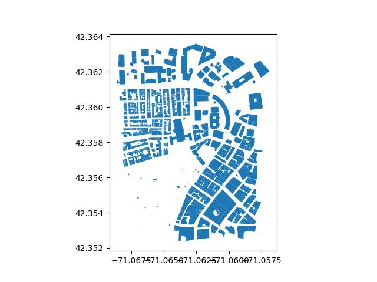

This article shows you how to work with GeoParquet files.

GeoParquet is a special data format for working with tabular geospatial data. You can use Delta Lake to store geospatial data originally stored in GeoParquet. Delta Lake gives you better data skipping and more efficient clustered storage. These features will make your geospatial queries faster with Delta Lake.

Let’s take a closer look at what GeoParquet is and then dive into a practical example of working with GeoParquet and Delta Lake.

## What is GeoParquet?

[GeoParquet](https://geoparquet.org/) is a column-oriented spatial data format used for working with tabular geospatial data. It’s a relatively new file format: its first release was in March 2022.

GeoParquet is great because like Parquet it:

- is optimized for cloud-native queries
- allows efficient querying via column pruning, predicate pushdown etc
- has efficient compression and metadata storage

GeoParquet extends on standard Parquet files by:

- encoding geometries in the dedicated GEOMETRY column
- including geometric metadata, such as the geometries’ Coordinate Reference System

GeoParquet is technically not a separate format but a backwards-compatible _extension_ of Apache Parquet. Any program that can read Parquet is able to read GeoParquet – even if it might not be able to properly read the geometry information.

Let's take a closer look at how GeoParquet extends Parquet for geospatial data.

## Using the Geometry Column

Geographical data is data that includes information on the geospatial location of objects, events or phenomena. This data can be represented as a string in two popular formats:

- **GeoJSON**, e.g. { “geometry”: { “type”: “Polygon”, “coordinates”: [ [ [100.0, 0.0], [101.0, 0.0],[101.0, 1.0],[100.0, 1.0],[100.0, 0.0]] ]} }
- **Well-Known Text (WKT)**, e.g. POLYGON ((100.0 0.0, 101.0 0.0, 101.0 1.0, 100.0 1.0, 100.0 0.0))

In these formats, geographical information can be stored in a string column in a standard Parquet file.

But it’s difficult to perform spatial operations on geographical data stored in a string. Let’s say you want to perform a spatial join to match rows whose geography is located within a certain polygon. You could write some complicated code to turn your strings into geometric information and perform the math yourself, but this would be very time-consuming.

GeoParquet extends standard Parquet files with a dedicated GEOMETRY column. This is a separate data type which query engines can use to properly parse the information and easily perform spatial operations.

For example, using GeoPandas, you can easily map your geospatial data stored as GeoParquet using the `.plot()` method:

```
> df = geopandas.read_parquet("boston.geoparquet")
```



Now let’s take a look at how you can work with GeoParquet data and Delta Lake.

## Working with GeoParquet Data and Delta Lake

In this section we’ll build an example workflow that illustrates how you can work with GeoParquet data and Delta Lake. We will work with [Overture Maps](https://overturemaps.org/), a large open-source geospatial dataset.

### Download GeoParquet files

Start by downloading a subset of the Overture Maps dataset. You will need to install the Overture Maps CLI with:

```
pip install overturemaps
```

Then let’s subset just the Buildings layer and restrict it to the Boston area by specifying a bounding box using the `--bbox` flag.

```
overturemaps download --bbox=-71.068,42.353,-71.058,42.363 -f geoparquet --type=building -o boston.geoparquet
```

See [the Overture Maps documentation](https://docs.overturemaps.org/getting-data/) for other ways to download the data.

### Load GeoParquet files into Spark

Next, spin up a Spark session with Delta Lake to load your data:

```
    import pyspark
    from delta import *

    conf = (
        pyspark.conf.SparkConf()
        .setAppName("MY_APP")
        .set(
            "spark.sql.catalog.spark_catalog",
            "org.apache.spark.sql.delta.catalog.DeltaCatalog",
        )
        .set("spark.sql.extensions", "io.delta.sql.DeltaSparkSessionExtension")
        .set("spark.sql.shuffle.partitions", "4")
        .setMaster(
            "local[*]"
        )
    )

    builder = pyspark.sql.SparkSession.builder.appName("MyApp").config(conf=conf)
    spark = configure_spark_with_delta_pip(
        builder,
    ).getOrCreate()
```

Note that if your files are stored in an AWS S3 bucket you will likely need [some additional configuration](https://delta.io/blog/delta-lake-s3/).

Now you can read the GeoParquet files using the standard Spark Parquet reader:

```
df = spark.read.parquet("/Users/rpelgrim/Desktop/unity-data/boston.geoparquet")
```

Let’s take a look at the first 3 rows, truncated for legibility:

```
+--------------------+-----------+-----+-----+------+----------+--------------------+
|                  id|    subtype|names|level|height|num_floors|            geometry|
+--------------------+-----------+-----+-----+------+----------+--------------------+
|08b2a30663865fff0...|outbuilding| NULL| NULL|   2.0|      NULL|[00 00 00 00 03 0...|
|08b2a3066386cfff0...|    service| NULL| NULL|  NULL|      NULL|[00 00 00 00 03 0...|
|08b2a3066394afff0...|outbuilding| NULL| NULL|   2.0|      NULL|[00 00 00 00 03 0...|
+--------------------+-----------+-----+-----+------+----------+--------------------+
```

The data is loaded in as expected. Spark does not natively interpret the geometric data in the GEOMETRY column but instead stores it as a binary `bytearray`.

Let’s count the number of buildings in our dataset:

```
> df.count()

920
```

### Transform geospatial data

Suppose you are working for a real estate company and you are interested in exploring patterns in the residential buildings only.

You can use Spark to filter out only the residential buildings by filtering on the `subtype` column:

```
df_res = df.where(df.subtype == "residential")
```

Let’s see how many residential buildings are in our dataset now:

```
> df_res.count()

223
```

### Write to Delta Lake

Now let’s write out the filtered data to a Delta Lake table:

```
df_res.write.format("delta").save("tmp/boston-residential")
```

You can then read in the cleaned data downstream using Spark:

```
df = spark.read.format("delta").load("data/boston-residential")
```

## Benefits of Storing GeoParquet as Delta Lake

Delta Lake gives you advanced data skipping and clustering features compared to GeoParquet. [Liquid clustering](https://docs.delta.io/latest/delta-clustering.html) is especially useful for geospatial indexing as it stores spatially related data close together. This will greatly speed up your spatial queries and avoids the need for complex and time-consuming manual partitioning strategies.

## Delta Lake vs GeoParquet

Delta Lake offers important features that will improve your geospatial processing pipeline. Here are some of the things that Delta Lake offers which GeoParquet doesn’t:

- ACID transactions for production-grade reliability
- More efficient DML transactions
- Faster query optimizations
- Change data feed
- More efficient metadata handling
- Possible to make small data changes (e.g. renaming or dropping a column) without rewriting the whole table

Read the [Delta Lake vs Parquet](https://delta.io/blog/delta-lake-vs-parquet-comparison/) post for more detail. Since GeoParquet is an extension of Parquet, the same advantages of Delta Lake apply.

## Working with GeoParquet and Delta Lake

Delta Lake is a great choice for working with geospatial data initially stored in GeoParquet files. By storing GeoParquet data in Delta Lake, you get faster queries thanks to Delta’s data skipping and clustering features, along with the reliability of ACID transactions. This setup makes it easy and performant to work with geospatial data at scale.
