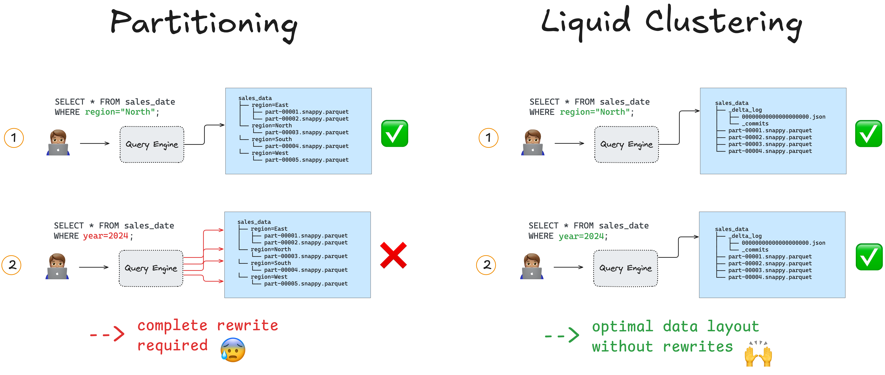

This article explains how you can use the liquid clustering feature in Delta Lake.

Liquid clustering is the fastest and most efficient way to store your Delta Lake data on disk. It is more flexible and requires less compute than Z-ordering and Hive-style partitioning. Liquid clustering automatically clusters your data in the most efficient layout based on your query patterns, without having to rewrite existing data files.

Let’s take a look at how liquid clustering works and how you can implement it to read and write Delta Lake tables more efficiently.

> Note that liquid clustering is available for Delta Lake 3.1.0 and above.

## What is Liquid Clustering?

Liquid clustering is a Delta Lake feature for optimizing your data layout on disk. It automatically makes sure that your data is stored as efficiently as possible for the queries you want to run.

Good data layout can have a huge impact on the performance of your queries.

Let’s say you have a large sales dataset stored on disk as a single Parquet file.

The traditional way to deal with this problem is to partition your data on a partitioning column. This is often called Hive-style partitioning. You split your data into smaller chunks based on the values in a specific column and each chunk gets its own folder on disk. Here’s what a Hive-style partitioned table might look like on disk:

```
    spark-warehouse/sales_data
    ├── region=East
    │   ├── part-00001.snappy.parquet
    │   └── part-00002.snappy.parquet
    └── region=North
        └── part-00003.snappy.parquet
    └── region=South
        └── part-00003.snappy.parquet
        └── part-00004.snappy.parquet
        └── part-00005.snappy.parquet
    └── region=West
        └── part-00006.snappy.parquet
```

Queries on the partition column `region` will now run faster.

On top of this, you could also [Z-order](https://delta.io/blog/2023-06-03-delta-lake-z-order/) your data inside the partitions. Z-Ordering is a Delta feature that groups related rows together in the same files and can sort your data in multiple dimensions. For example, rows with similar values for `region` and `date` will end up close together. This will make your queries on either or both of those columns run faster.

The problem with partitioning and Z-ordering is that they are not flexible. You have to decide on your partitioning columns ahead of time and if your query patterns change (one day your colleague needs to run a query on the `customer` column), you will have to rewrite the entire dataset to optimize it for that new query.

Liquid clustering gives you flexibility. With liquid clustering enabled, you can redefine your clustering columns without having to rewrite any existing data. This allows your data layout to evolve in parallel with changing query patterns.

> Note that liquid clustering is not compatible with partitioning and Z-ordering.

## How does Liquid Clustering work?

Liquid clustering uses a tree-based algorithm to optimize your data layout. The algorithm optimizes for a balanced data layout, which means uniform file size and an appropriate number of files for the size of the dataset. This automatically takes care of cardinality, data skew and the small file problem.



Liquid clustering is stateful. It uses the metadata stored in the Delta Lake transaction logs to keep track of the data layout as your dataset evolves. This makes incremental clustering possible: any new data that you add to the dataset is clustered without having to recompute the layout for the existing data. Because of this, liquid clustering is much more efficient than traditional partitioning and Z-ordering.

All of these features boost data skipping. Query engines can just look at the Delta Lake transaction log to find the files they need. And because of liquid clustering, these files will be arranged for optimal efficiency, even with changing query patterns.

## When should I use Liquid Clustering?

Liquid clustering is the most efficient data layout technique. If you’re looking for faster query speeds and more efficient data storage then you will want to consider using liquid clustering for all new Delta tables.

Liquid clustering is especially useful when:

- Data is skewed
- Filtering columns have different cardinalities
- Tables regularly ingest lots of new data
- System needs to support concurrent writes
- Query patterns change over time
- Data might lead to the small file problem if traditionally partitioned

Liquid clustering is not compatible with Hive-style partitioning and Z-ordering. You may want to avoid liquid clustering if downstream systems require Hive-style partitioning. Read more about partitioning considerations in the [Delta Lake partition](#add-when-live) article.

## How can I use Liquid Clustering?

You have to enable the liquid clustering feature to use its benefits.

From Delta Lake 3.2 and above, you can use SQL or the DeltaTable API in Python or Scala to enable liquid clustering. Using the Python [DeltaTableBuilder API](https://docs.delta.io/latest/api/python/spark/index.html#delta.tables.DeltaTableBuilder) you can do so like this:

```python
(
    DeltaTable.create()
    .tableName("sales")
    .addColumn("customer", dataType = "STRING")
    .addColumn("sales", dataType = "INT")
    .clusterBy("customer")
    .execute()
)
```

Or using SQL syntax:

```SQL
CREATE TABLE table1(customer string, sales int) USING DELTA CLUSTER BY (customer);
```

This creates a new Delta table with 2 columns (`customer` and `sales`), with liquid clustered enabled on the `customer` column.

You can also create a new table with liquid clustering from an existing table using a `CTAS` statement:

```SQL
CREATE TABLE sales_clustered CLUSTER BY (customer)
AS SELECT * FROM sales_raw;
```

It’s important to note that:

- You can specify up to 4 clustering columns per Delta table.
- Your clustering columns need to be columns with statistics collected in the Delta logs. By default, the first 32 columns in a Delta table have statistics collected. You can configure the number of columns using the `delta.dataSkippingNumIndexedCols` table property. Read more in the [documentation](https://docs.delta.io/latest/delta-batch.html#table-properties).

## How do I trigger clustering?

You can manually trigger a liquid clustering operation using the `OPTIMIZE` command:

In Python:

```python
from delta.tables import *
    deltaTable = DeltaTable.forPath(spark, "path/to/table")
    deltaTable.optimize().executeCompaction()
```

In SQL:

```SQL
OPTIMIZE table_name;
```

Because liquid clustering is incremental (only new data needs to be clustered), maintaining the best data layout is computationally cheap and won’t take long to run. This incremental clustering also does not interfere with concurrent reads or writes because of Delta Lake’s ACID transaction guarantees.

You can read more about using the OPTIMIZE command in the [Delta Lake Optimize](https://delta.io/blog/delta-lake-optimize/) post.

## How to write a Delta Lake table with Liquid Clustering

Once you’ve enabled liquid clustering on a Delta Table, you can write data to the table as normal. Delta Lake will automatically and incrementally continue clustering the data for you under the hood, or when you manually call the OPTIMIZE command as explained in the previous section.

Liquid clustering is not supported by all Delta writer clients. You must use a Delta writer client that supports the `Clustering` and `DomainMetadata` table features.

## How to read a Delta Lake table with Liquid Clustering

You can read data in a clustered table using any Delta Lake client. For best query results, include the clustering columns in your query filters:

```SQL
    SELECT * FROM table_name WHERE clustering_column_name = "some_value";
```

## How to change your clustering columns

Unlike traditional partitioning and Z-ordering, you can change your liquid clustering columns without having to rewrite all the data. This flexibility is what

Run an ALTER TABLE command, to change the clustering columns:

```SQL
ALTER TABLE table_name CLUSTER BY (new_column1, new_column2);
```

When you change the clustering columns, all new data writes and OPTIMIZE operations will follow the new clustering columns. Existing data is not rewritten.

You can also turn off clustering by setting the columns to `NONE`:

```SQL
ALTER TABLE table_name CLUSTER BY NONE;
```

Setting cluster columns to `NONE` does not rewrite data that has already been clustered. It prevents future `OPTIMIZE` and write operations from using clustering columns to organize your data.

## How to choose your clustering columns

You can define your clustering columns in any order you like.

If you are working with existing data that is already organized using Hive-style partitioning, Z-order or both, use the following table to choose your clustering columns:

<table>
  <tr>
    <td>
      <strong>Current Data Layout</strong>
    </td>
    <td>
      <strong>Which columns to cluster</strong>
    </td>
  </tr>
  <tr>
    <td>Hive-style partitioning</td>
    <td>Use partition columns</td>
  </tr>
  <tr>
    <td>Z-order</td>
    <td>Use ZORDER BY columns</td>
  </tr>
  <tr>
    <td>Hive-style partitioning and Z-order</td>
    <td>Use partition and ZORDER BY columns</td>
  </tr>
  <tr>
    <td>Generated columns to reduce cardinality</td>
    <td>Use original column, don’t create a generated column</td>
  </tr>
</table>

## Using Liquid Clustering with Delta Lake 3.1

There are some special considerations when using liquid clustering with Delta Lake 3.1:

- You need to enable the feature flag `spark.databricks.delta.clusteredTable.enableClusteringTablePreview` to use liquid clustering.
- The following features are not supported in this preview:
  - ZCube based incremental clustering
  - ALTER TABLE ... CLUSTER BY to change clustering columns
  - DESCRIBE DETAIL to inspect the current clustering columns
- The Python and Scala APIs are not available. Use the SQL syntax.

## Liquid Clustering vs Hive Partitioning vs Z-Order

This article has explained how liquid clustering works, why it is the best data layout optimization technique, and how you can use it to optimize your data.

Liquid clustering is the fastest and most efficient way to organize your Delta Lake data on disk. It is more efficient and more flexible than Hive-style partitioning and Z-ordering because it is incremental. New data is automatically clustered without requiring a rewrite of the existing data.

Consider using liquid clustering for all new Delta tables and especially for tables that contain skewed data, that have high-cardinality columns, or that frequently ingest new data. This way, you and your downstream data consumers will be free to change query patterns without having to worry about expensive data rewrites.
