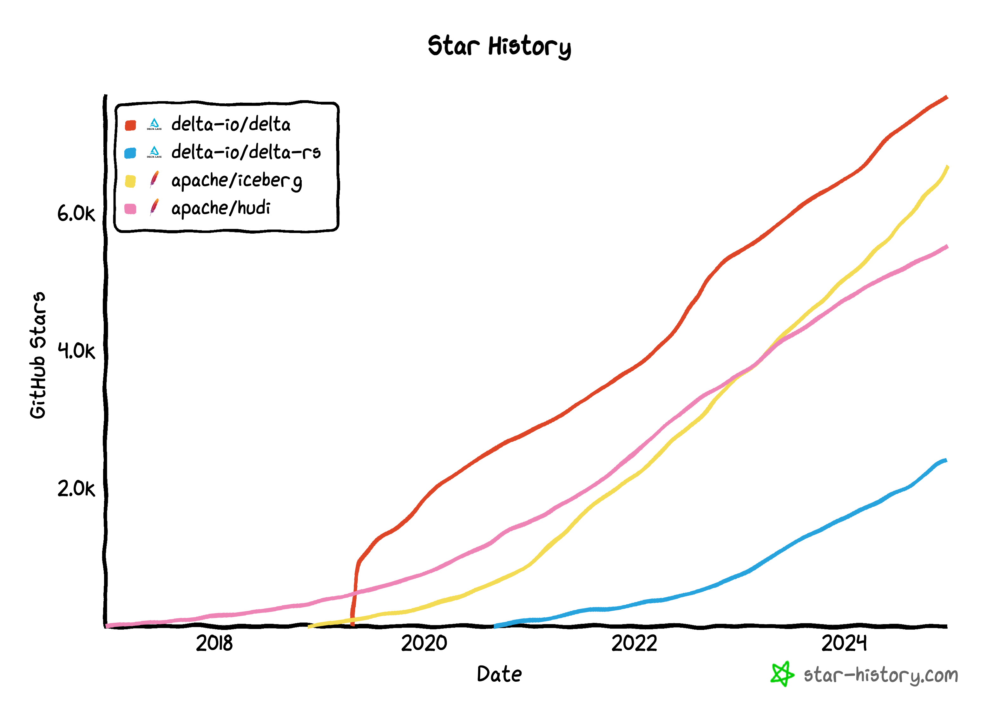
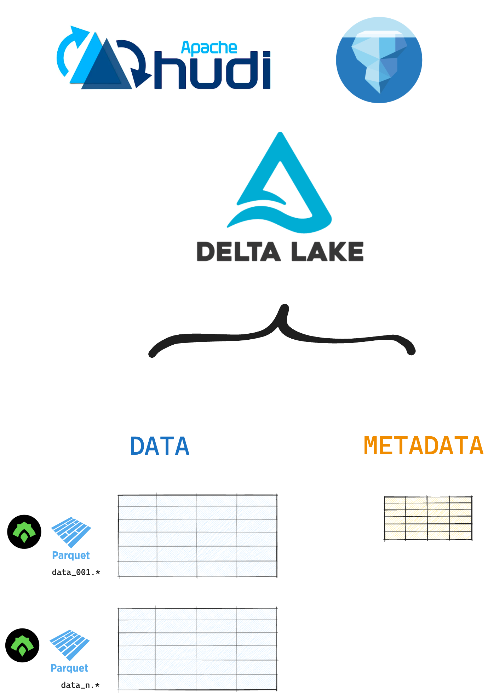
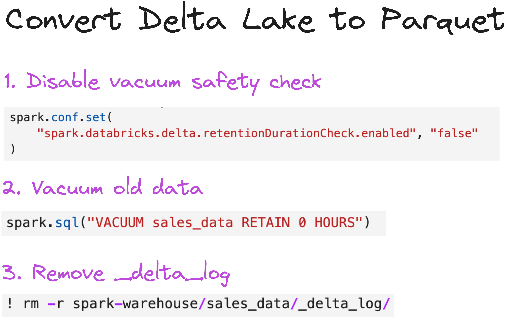

This article explains what open table formats are and why they are a great choice for storing your tabular data.

You will learn about the benefits of using open table formats vs. legacy data storage techniques. You will also understand the different types of open table formats and how projects like Delta Lake Uniform, XTable and Unity Catalog let you interoperate with any table format.

Open table formats are more efficient and more reliable than storing data in file formats like CSV and Parquet. Open table formats support ACID transactions, more advanced data skipping, time travel functionality and other great features that will make your data work faster and safer.

Delta Lake is a popular open table format. There are also other open table formats, like Apache Iceberg and Apache Hudi.



While there are differences between the different open table formats, these differences are becoming less important as technologies emerge to support interoperability. Projects like Delta Lake UniForm and Unity Catalog are bridging the gap between open table formats. We’ll cover these projects at the end of the article.

First, let’s jump into understanding what open table formats are and why they are so awesome 😀

## What is an open table format?

Open table formats are an open-source technology for storing tabular data that builds on top of existing _file formats_ like Parquet and ORC. An open table format stores your tabular data in files _and_ stores metadata (about your data and operations) in a separate file or directory. This metadata is used to enable many of the great features of open table formats: faster query speeds, more reliable transactions and lower risk of data corruption.

The three main open table formats are [Delta Lake](https://delta.io/), [Apache Hudi](https://hudi.apache.org/) and [Apache Iceberg](https://iceberg.apache.org/).



## Why should I use an open table format?

Open table formats solve performance and reliability problems with traditional data lakes. By storing metadata along with your tabular data, open table formats give you great features like:

1. Reliable ACID transactions
2. Advanced data skipping
3. Time travel
4. Schema enforcement and evolution
5. Full CRUD operations

Let’s explore each feature in the sections below.

### Open Table Formats: Reliable ACID Transactions

Open table formats were developed to bring ACID guarantees to the data lake ecosystem. ACID transactions make your data writes more reliable, so operations will not corrupt your table. A “transaction” refers to any write operation that changes the table state.

With ACID transactions you can be sure to avoid:

- Failed partial writes that break downstream queries
- Accidental data corruption
- Conflicting concurrent processes or data versions
- Unintended data loss

Read more in the [Delta Lake vs Data Lake](https://delta.io/blog/delta-lake-vs-data-lake/#:~:text=Delta%20Lake%20vs%20Data%20Lake%3A%20ACID%20Transactions) article.

### Open Table Formats: Advanced Data Skipping

Open table formats offer advanced data skipping over file formats like Parquet and CSV. Because they store metadata in a centralized metadata directory, query engines can easily find relevant data for a selective query.

Delta Lake supports advanced data skipping through (1) efficient metadata storage in the centralized transaction log and (2) optimized data layout via [Z-ordering](https://delta.io/blog/2023-06-03-delta-lake-z-order/) or [Liquid Clustering](https://delta.io/blog/liquid-clustering/). These strategies will make your queries run much faster.

Read more in the [Data Skipping guide] (#add-when-live).

### Open Table Formats: Time Travel

Open table formats support time travel. This means you can easily inspect earlier versions of your dataset and revert back to them if needed.

Delta Lake supports data versioning through its transaction log. All of the changes you make to your data are recorded in this log. This means you can easily look at previous versions and fix an accidental mistake if needed.

You can load a specific version of your Delta table like this:

```python
spark.read.format("delta").option("versionAsOf", version).load("path/to/delta")
```

Read more in the [Delta Lake Time Travel](https://delta.io/blog/2023-02-01-delta-lake-time-travel/) post.

### Open Table Formats: Schema Enforcement and Evolution

To ensure data consistency and avoid corruption, you usually want to make sure that new data matches the existing schema. This is called schema enforcement.

Many standard file formats like Parquet and CSV do not support schema enforcement by default. This means you can easily write data with a different schema to your existing Parquet data lake, for example. This will cause problems downstream when trying to read the data.

Open table formats have built-in schema enforcement by default. This prevents you from accidentally corrupting your data.

Let’s see this is in action with Delta Lake.

Create a Delta table with two columns: `first_name` and `age`:

```python
df = spark.createDataFrame([("bob", 47), ("li", 23), ("leonard", 51)]).toDF(
    "first_name", "age"
)

df.write.format("delta").save("tmp/fun_people")
```

Now, try to write data with a different schema to this table:

```python
df = spark.createDataFrame([("frank", 68, "usa"), ("jordana", 26, "brasil")]).toDF(
    "first_name", "age", "country"
)

df.write.format("delta").mode("append").save("tmp/fun_people")
```

This operation will error out with an AnalysisException.

Delta Lake does not allow you to append data with mismatched schema by default. In situations when you intentionally want to update the schema, you can use the `mergeSchema` option.

```python
df.write.option("mergeSchema", "true").mode("append").format("delta").save(
    "tmp/fun_people"
)
```

Read the [Delta Lake schema enforcement](https://delta.io/blog/2022-11-16-delta-lake-schema-enforcement/) and [Delta Lake Schema Evolution](https://delta.io/blog/2023-02-08-delta-lake-schema-evolution/) posts to learn more.

### Open Table Formats: Full CRUD Operations

Regular Parquet files are immutable. The only way you can change a Parquet file is to overwrite it completely. This is a feature: it prevents you from accidentally corrupting your data.

Open table formats like Delta Lake give you both more reliability and more flexibility than regular Parquet files. You can use open table formats to perform CRUD (Create Read Update Delete) operations on subsets of your data.

For example, you can use a [Delta Lake replaceWhere](https://delta.io/blog/delta-lake-replacewhere/) operation to selectively overwrite specific rows in your table:

```python
(
    df.write.format("delta")
    .option("replaceWhere", "number > 2")
    .mode("overwrite")
    .save("tmp/my_data")
)
```

Open table formats handle these kinds of partial data updates as “logical operations”. A delete or overwrite operation simply changes the markers in the transaction log to point to a new row or column. The actual data is not affected. This way you can safely make partial changes to your data without having to perform expensive rewrites.

## Can I use different open table formats together?

Yes, you can use different open table formats together, but it requires careful planning. Open table formats like Delta Lake, Apache Iceberg, and Apache Hudi are originally designed to manage datasets independently. Each format has its own metadata structure, transaction management, and API. This can make interoperability tricky.

Projects like [Delta Lake Uniform](https://docs.delta.io/latest/delta-uniform.html) and [Apache XTable](https://xtable.apache.org/) are working to unify workflows across open table formats. For example, you can use Delta Lake for [your ETL workload](https://delta.io/blog/delta-lake-etl/) and then use UniForm to read your data as Iceberg tables in downstream BI and analytics systems.

[Unity Catalog](https://docs.unitycatalog.io/) is another project that is working to improve open table format interoperability. With Unity Catalog you can store, manage and access tabular data in both Delta Lake and Iceberg formats.

Read the [Unifying Open Table Formats](https://delta.io/blog/unifying-open-table/) article to learn more.

## Can I convert an open table format to a file format like Parquet?

Yes, in most cases you can convert a table stored in an open table format (e.g. Delta Lake) into its underlying file format (e.g Parquet).

For example, to convert a Delta table into a Parquet data lake with Hive-style partitions, you just need to:

1. [Vacuum](https://delta.io/blog/remove-files-delta-lake-vacuum-command/) any stale files
2. Remove the transaction log directory



From a pure performance perspective, you usually don’t want to convert from Delta Lake to Parquet if you can avoid it. Delta Lake is almost always faster and more reliable. Only do this if you’re sure you no longer need features like versioning or transaction management.

## When should I use an open table format?

Open table formats are almost always faster, safer and more developer-friendly than data lakes with file formats like Parquet, CSV or JSON. Open table formats like Delta lake can be a great choice for you because they:

- support transactions and schema enforcement, so it’s much less likely you’ll corrupt your table.
- abstract the file metadata to a transaction log and supports advanced clustering and data skipping, so you can run queries faster
- make it easy to perform common data operations like dropping columns, renaming columns, deleting rows, and DML operations.

If you’re running important tabular data workflows in production, open table formats are likely going to be the best choice for you.
