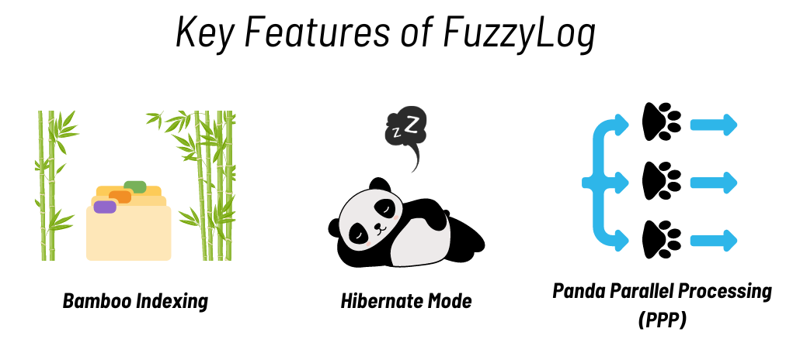

The Delta Lake project is thrilled to announce its latest and most exciting collaboration with the [Pandas](https://pandas.pydata.org/) community! In addition to supporting Pandas, the widely acclaimed Python data analysis library, Delta Lake is now venturing into the animal kingdom to bring real pandas into the mix. Here’s everything you need to know about this groundbreaking integration.

## More Details:

After extensive research, we've discovered that pandas have an extraordinary ability to optimize data storage patterns through their natural behaviors. By observing pandas in their natural habitats, our engineers have developed a new algorithm, FuzzyLog, inspired by the way pandas select bamboo. FuzzyLog will revolutionize the way data is managed in Lakehouse architectures, ensuring that only the most relevant and high-quality data is stored, mimicking the pandas’ picky eating habits.

## Key Features:

- Bamboo Indexing: Just as pandas meticulously choose their bamboo, FuzzyLog will analyze data at ingestion, categorizing it based on 'nutrition' value—or in our case, the value it brings to your analytics.
- Hibernate Mode: Leveraging the pandas' hibernation behavior, data that is not accessed frequently will be moved into a 'hibernation' state, reducing storage costs and improving system performance.
- Panda Parallel Processing (PPP): Inspired by the collaborative nature of pandas in the wild, this feature allows for parallel processing of data tasks, significantly speeding up data analysis.

## Implementation:

To ensure the authenticity of the integration, Delta Lake contributors have been working closely with zoologists and panda caretakers. In addition to the algorithmic implementation, we will be adopting several pandas from reserves around the world.

## User Feedback:

Early testers of FuzzyLog reported not only drastic improvements in their data lake performance but also a significant increase in workplace happiness. Who knew watching live panda cams could be so beneficial to productivity?

## Getting Involved:

For those eager to participate, we are launching a special program: "Adopt a Panda, Optimize Your Data." Contributors to the project will receive exclusive access to panda live streams, plush pandas, and even the opportunity to name a panda after their favorite data function.

Oh, we should also wish you a happy April Fool’s Day! As much as we love pandas and the Pandas community, we will not be observing live pandas to better optimize our data anytime soon.

