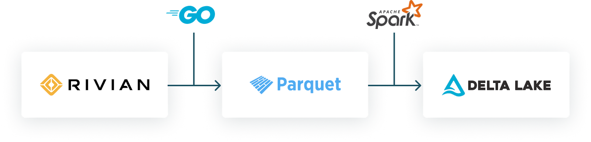
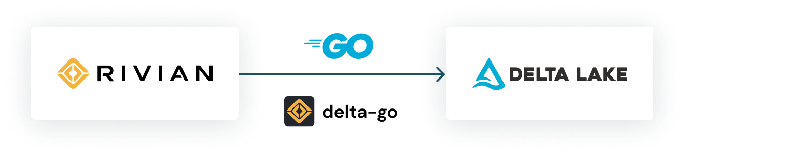

**Real-time data ingestion for high-volume transactions, now available in open source**

Today, we are excited to announce the availability of the new [open-source Delta-Go connector](https://github.com/rivian/delta-go) - a key component of Rivian's architecture to ingest high volumes of real-time data in an efficient and cost-effective way. We are very excited to bring this connector to the community, hope you can benefit from it as well, and welcome contributions to help grow this project further!

## Background

At Rivian, our commitment to sustainability and cutting-edge technology drives us to explore new horizons. Imagine handling terabytes of data generated by over 80,000 connected vehicles every day. Through the efficient ingestion and analysis of this data, we can enable new features such as predictive maintenance, improved performance and reliability, safety enhancements, and customization.

In this blog, we’ll peel back the layers and share insights into our data ingestion journey. We’ll explore the challenges faced, how we worked around them by building the Delta-Go connector, and lessons learned. So let's dive in.

## Framework choices

In our pursuit of handling massive data volumes—9.8 million records per second— we faced early on the challenge of ingesting streaming IoT workloads at scale. While investing in different architectures and file formats, the open source format Delta Lake appeared as the best choice for the following reasons:

- **Atomic transactions:** Given that [PCAP (packet data captured from the network interface)](https://en.wikipedia.org/wiki/Pcap) data arrives concurrently from diverse sources—sensors, devices, and vehicles—each contributing its unique stream, a storage framework supporting atomic transactions is essential.
- **Optimized queries:** Using Delta metadata enables query optimization, resulting in a cost-effective solution.
- **Data Integrity and Quality**: Our ML Engineers and Data Scientists must trust data inputs when managing their model development and deployment workflow.

Additionally, selecting a suitable programming language to better manage concurrent data streams from diverse sources was also crucial. Go (Golang) emerged as an ideal choice due to its inherent features:

- **Performance:** Golang, being a compiled language, undergoes conversion into machine code before execution, resulting in highly efficient programs.
- **Concurrency:** With built-in support for concurrency, Golang simplifies the creation of programs capable of leveraging multiple cores, a boon for high-traffic applications.
- **Simplicity:** Golang boasts a straightforward syntax, making it an excellent option for both novices and seasoned developers seeking ease of learning.
- **Tooling:** Golang offers a robust suite of development and deployment tools, encompassing a compiler, debugger, linker, and packager, facilitating seamless application development.

In summary, Go provides the best of both worlds: performance, concurrency handling, and streamlined development. It’s a powerful tool for modern applications dealing with high data volumes.

## Technical challenges

Our initial approach involved writing all PCAP data into Parquet files, excluding Delta metadata. We then used Auto Loader for the Spark jobs to ingest these Parquet files into a Delta table. However, this approach had its drawbacks:

- **Challenge #1: Storage overhead:** Storing data in both Parquet and Delta formats resulted in redundancy and increased storage requirements.
- **Challenge #2: Processing overhead:** The constant conversion between formats and rewriting of data incurred significant processing costs during read and write operations. We ended up with 20 Spark workers running nonstop to ingest these parquet files into our Delta table.



_Earlier architecture with data redundancy and extra processing workload_

We realized that writing in Delta Lake format directly from Go would be a more efficient solution, avoiding the need for dual storage formats and reducing processing complexity

## Delta Lake + Go Connector

To mitigate this overhead, we looked into developing a Delta-Go connector, with the goal to enable direct PCAP data written into Delta tables.



_A new architecture featuring our Delta-Go connector to ingest data from the Edge directly into Delta Lake._

With the first implementation of the Delta-Go connector, Spark and Delta-Go's simultaneous writes caused race conditions that incorrectly overwrote table versions. To solve this, we introduced a DynamoDB-backed logstore within Delta-Go, ensuring compatibility with Spark's existing implementation and preventing race conditions by having both engines utilize the same logstore backend.

We employ an SQS queue to receive data notifications, and our data parser, a Go application utilizing delta-go, operates on Kubernetes. Thanks to Go's concurrency support, each Kubernetes node can independently handle multiple incoming messages concurrently. Scaling processing within a node is achieved by increasing the number of processing goroutines, while scaling the overall system is easily achieved by adding more Kubernetes nodes.

The [Delta-Go connector](https://github.com/rivian/delta-go) effortlessly managed to write 10 commits per second to our delta lake table. Subsequently, we optimized our code by consolidating delta transactions into larger logs, enhancing downstream processing efficiency.

Here’s an example of how to add data directly into Delta Lake using the Delta-Go connector:

```
logStore, _ := dynamodblogstore.New(
  dynamodblogstore.Options{
    Client: dynamoDBClient,
    TableName: sharedLogStoreTableName,
  })
table := delta.NewTableWithLogStore(store, lock, logStore)
transaction := table.CreateTransaction(delta.NewTransactionOptions())
add, _, _ := delta.NewAdd(store, storage.NewPath(filePath), partitionValues)
transaction.AddAction(add)
transaction.CommitLogStore()
```

## Benefits

Delta Lake is a performance game changer due to its additional layer of metadata, which allows atomic transactions and improves query performance. Without this layer, querying Parquet files would be significantly less efficient. By eliminating the non-stop Spark process, we estimate daily savings of $500 compared to our previous approach. Efficiency and economy go hand in hand.

The Delta-Go connector seamlessly integrates with Spark, thanks to the shared Delta Lake logstore. This common logstore prevents concurrency issues, allowing you to confidently use Spark Optimize alongside Delta-Go.

## Taking Delta-Go to the next level

We're passionate about Go, valuing its simplicity, concurrency management, and efficiency. Inspired by Delta-rs, we're motivated to further enhance the user experience for Go developers, striving to provide comparable simplicity and functionality in the ecosystem. Additionally, we appreciate the robust features that the open source Delta Lake format provides, enabling us to handle massive amounts of data effectively.

As strong proponents of open source, we proudly offer our [Delta-Go connector](https://github.com/rivian/delta-go) to help your company boost efficiency and save costs. However, it’s important to note that the connector’s current capabilities are tailored to our specific business needs. There’s ample room for expansion and contributions. Join us by cloning [our repository](https://github.com/rivian/delta-go) and collaborating on enhancing the Delta-Go connector together!
