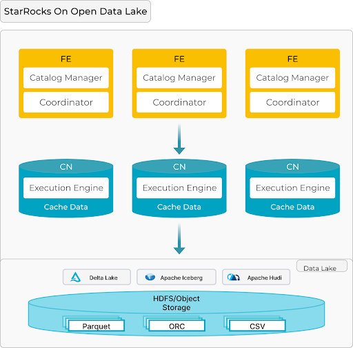
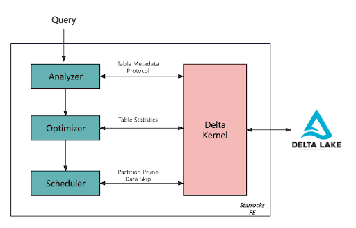
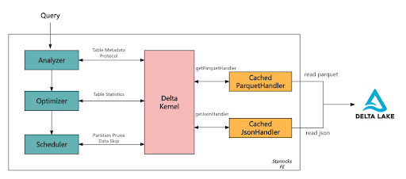

Delta Lake provides a robust foundation for managing data with ACID compliance, schema evolution,
and transactional consistency. It enables organizations to create a unified analytics platform with
a single source of truth, improving governance, and reducing operational overhead.

However, some workloads are particularly challenging to port to a data lake environment due to their
demanding performance requirements. **Customer-facing analytics** is one such workload, requiring
sub-second query responses and high concurrency. In this blog, we’ll explore how to leverage Delta Kernel
and the open-source query engine StarRocks to quickly integrate with Delta Lake and make customer-facing
analytics directly on open data formats possible.

## The Challenge: Integrating With Delta Lake

Delta Lake is powerful, but integrating with it with a query engine presents significant challenges:

### Complex Protocols

Delta Lake’s transaction log and metadata format are intricate. A query engine must interpret
the Delta log to read or write data correctly, which tracks changes, schema, and partition
information. With new features like **Deletion Vectors** or **Column Mapping**, keeping up with
protocol updates becomes increasingly complex.

### Optimizing Performance

Efficiently querying Delta Lake requires more than just reading Parquet files. The integration
must optimize I/O operations, handle metadata caching, and leverage partition pruning to minimize
data scans. Without these optimizations, query performance can degrade significantly, especially at scale.

### Connector Fragmentation

Delta Lake’s rapid innovation and introduction of features like
[**Deletion Vectors**](https://delta.io/blog/2023-07-05-deletion-vectors/)
and [**Liquid Clustering**](https://delta.io/blog/liquid-clustering/) have significantly
enhanced performance and flexibility. However, this pace of innovation presents challenges for connectors.

Each new feature requires connectors to update their implementations, leading to fragmentation.
It becomes less predictable for customers to know which features are supported by which connectors,
creating inconsistencies in the user experience. This delay in adoption can hinder customers’ ability
to fully leverage Delta Lake’s latest advancements across their ecosystem.

## Enter Delta Kernel

**Delta Kernel** is a game-changer. Built as a lightweight library, it abstracts the complexities of
interacting with Delta Lake, providing APIs for metadata handling, schema reading, and transaction
log processing. Delta Kernel provides **stable APIs** that streamline essential operations such as:

- **Metadata Handling**: Access and interpret table schema, partitions, and protocol details seamlessly.
- **Statistics Collection:** Extract file-level statistics, enabling query optimizers to make informeddecisions for efficient query planning.
- **Transaction Log Processing**: Replay Delta's atomic transaction logs to compute the latest snapshot of the table for consistency and correctness.

## How StarRocks Integrates Delta Lake Through Delta Kernel

If you're not yet familiar with StarRocks, here's what you need to know. Designed with a distributed
architecture optimized for running customer-facing workloads on open data lakehouses, StarRocks' core components include:

- **Frontend (FE)**:

  - Responsible for query parsing, plan generation, and metadata management.
    It acts as the brain, orchestrating query execution across multiple nodes.

- **Compute Node (CN):**

  - Handles data caching, retrieval, and execution of distributed query plans.
    It is the muscle that delivers fast and scalable data processing.

This **FE + CN MPP** architecture is simple yet effective, allowing StarRocks
to scale easily while delivering high performance, ideal for analytics on large data volumes.

### Core Functions of Delta Kernel in StarRocks FE

StarRocks integrates with Delta Lake primarily through its **Frontend (FE)**,
where **Delta Kernel** plays a critical role in handling metadata, optimizing queries, and managing scan ranges.

#### Metadata and Protocol Retrieval

Delta Kernel retrieves the table's **metadata**, including schema, partition columns, and configurations,
and ensures compatibility with Delta Lake's evolving feature set. As part of this process, it reads the Delta Lake protocol to determine:

- `minReaderVersion`: The minimum reader version required to correctly interpret the table.
- `readerFeatures`: The specific features that must be supported for proper data processing.

#### Statistics Retrieval for Query Optimization

Delta Kernel provides file-level statistics, which help StarRocks' **Cost-Based Optimizer (CBO)** select the most efficient query execution plan.

#### Scan Range Management

Delta Kernel is key to simplifying scan range generation in StarRocks' FE,
effectively abstracting the complexities of Delta Lake’s table format.

- **Partition Pruning**: Using partition predicates to exclude unnecessary partitions.
- **Data Skipping**: Leveraging file-level metadata to skip irrelevant data files.
- **Incremental Scheduling**: The scheduler in FE uses Delta Kernel’s iterator to
  fetch scan ranges in batches and incrementally distribute them to CN nodes for execution.

This design means that the downstream Compute Nodes (CNs) do not need to be aware of the table format or its specific implementation.

### **Optimizations for Customer-Facing Analytics**

Delta Kernel provides a set of **Engine APIs** to facilitate data access and support custom functionality.
These APIs include default implementations for:

- Reading **JSON** and **Parquet** files.
- Evaluating expressions over the data read by these APIs.

StarRocks builds on these defaults to better serve **customer-facing analytics**,
introducing caching mechanisms that minimize redundant file reads:

#### Custom Handlers for Cached Reads:

- **CachedParquetHandler** and **CachedJsonHandler** are implemented to check a cache before reading Parquet or JSON files.
  - If a file exists in the cache, its data is returned directly, avoiding the need to access and reprocess the file.
  - If the file is not in the cache, it is fetched from the Delta log, processed, and stored in the cache for future queries.
- The cache operates with an eviction policy based on timeout settings and FE memory constraints,
  ensuring efficient use of resources while keeping frequently accessed data readily available.

These optimizations reduce query latency by avoiding redundant reads of Parquet/JSON files and
minimize metadata-related overhead in the FE, ensuring responsiveness for high-concurrency workloads.

## Current Capabilities

Today, StarRocks’ Delta Lake connector supports:

1. **Wide Data Type Coverage**:
   1. Handles core data types like INT, STRING, and FLOAT, with ongoing development for complex types like MAP and STRUCT.

2. **Data Skipping**:
   1. Efficiently skips irrelevant data based on Parquet file statistics and Delta transaction logs, drastically reducing scan times.

3. **Advanced Table Features**:
   1. Supports transactional consistency, and partitioned tables.
   2. Supports Delete Vectors.

## Try StarRocks and Delta Lake Today

**StarRocks + Delta Lake** offers a powerful combination for customer-facing analytics on a lakehouse,
with key benefits such as:

- **High-performance query execution**: StarRocks, written in C++ with SIMD optimizations,
  consistently delivers sub-second query latency and supports high concurrency for demanding workloads.
- **Seamless integration with open formats**: Using Delta Kernel, StarRocks enables fast,
  reliable analytics directly on Delta Lake, eliminating data ingestion and improving data governance.

Combining Delta Lake’s powerful data management capabilities with StarRocks’ high-performance query engine,
this architecture delivers the best of both worlds—unified data governance and exceptional performance for **customer-facing analytics**. 

If you’re looking to maximize the value of your lakehouse for demanding workloads, **StarRocks + Delta Lake**
is the solution to consider. Join the [Delta Lake Slack](https://go.delta.io/slack)
and the [StarRocks Slack](https://starrocks.io/redirecting-to-slack) today to learn more.
