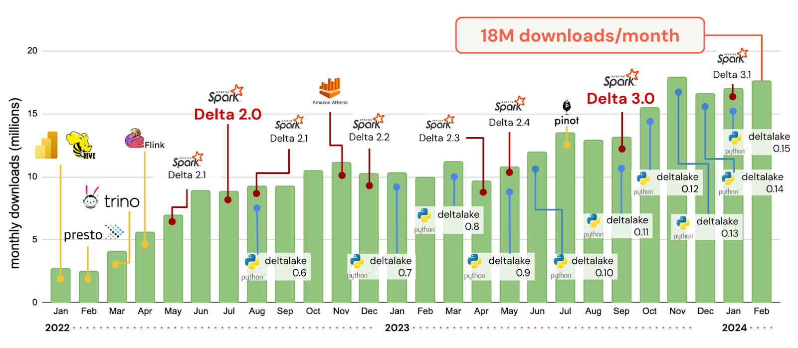
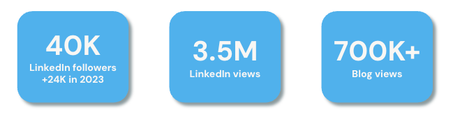

Delta Lake, a project hosted under The Linux Foundation, has been growing by leaps and bounds. To celebrate the achievements of the project, we’re publishing a 2-part series on Delta Lake. Delta Lake is greater than the sum of its parts, so instead of providing a highlight reel from each release version, we’ve organized this review along common themes that are core to the project. In this first blog post, we’ll discuss the community, ecosystem, and feature innovations that the project has released. In part two, we’ll go deeper into two key areas that the project has focused on - interoperability and the out-of-the-box performance of Delta Lake.

We’re proud of the progress this project is making and want to highlight some of the key achievements within the project, the community, and the ecosystem. Delta Lake is now up to 18M monthly downloads!

## Community

Contributors to the Delta Lake project have put a lot of energy into developing and maintaining a healthy community and engagement across multiple platforms. Unlike many single-repo projects, Delta Lake comprises more than [4+ mainstream projects](https://github.com/delta-io/), [7+ projects in incubation](https://github.com/delta-incubator), with 500+ contributors developing code across all of them.

### Social media and community engagement

The Delta Lake community on LinkedIn grew to over 40,000 followers, adding over 24,000 followers alone in 2023. Our LinkedIn presence has become a hub for sharing insights, connecting professionals, and fostering discussions and has earned over 3.5 million impressions. This shows the reach and influence of our content, reflecting the growing interest in Lakehouse architecture and Delta Lake's role in shaping this domain.

Similarly, our community Slack channel has become an active community for peer-to-peer support, knowledge sharing, and fostering connections across users and contributors worldwide. In the last 12 months, the Slack channel grew to over 9,300 users.

### Live events

In the last year, Delta Lake hosted twelve live events for community members to connect, learn, and share their experiences. These events ranged from technical workshops to industry discussions, each fostering a sense of community and collaboration. Throughout the year, the live series Delta Lake Discussions with Denny Lee, D3L2, featured data experts and their journeys using Delta Lake. View the series [here](https://www.youtube.com/watch?v=CpNVRj13Asw&list=PLzxP01GQMpjfcwFdzBpnZrQIUHxhOddq7).

In 2023, Delta Lake hosted its first Community Meetup where community members received the latest project updates from project maintainers and core contributors. The virtual meetup allowed for open discussion among community members and presented opportunities to get more involved with Delta Lake. Check out the [Community Meetup on YouTube](https://www.youtube.com/watch?v=khnl21zYyx8). A monthly series was also launched - Delta Lake Deep Dives, where Delta Lake maintainers, contributors, or users spotlight a Delta Lake feature or integration. Watch the series [here](https://www.youtube.com/playlist?list=PLzxP01GQMpjeCBRoqIN5T4ZcLTtM1oF4e).

### Industry conferences

Delta Lake participated in multiple open source conferences:

- Open Source Summit North America
  - [Getting Started with Delta Lake](https://www.youtube.com/watch?v=wfa_cyM9f8c&list=PLbzoR-pLrL6osxY8Ao02UdjFIYux9I-Qi&index=4) presented by Guenia Izquierdo Delgado and Sajith Appukuttan
- Open Source Summit Europe
  - [Integrating a Data Warehouse and a Data Lake](https://thenewstack.io/integrating-a-data-warehouse-and-a-data-lake/) presented by Florian Valeye
- Data+AI Summit
  - [Delta-rs, Apache Arrow, Polars, WASM: Is Rust the Future of Analytics?](https://www.youtube.com/watch?v=VedepVXiql4)
  - [Delta Kernel: Simplifying Building Connectors for Delta](https://www.youtube.com/watch?v=KVUMFv7470I&list=PLzxP01GQMpjfRV9cPZ3PDR4-952fCrDRq&index=2)
  - [Introducing Universal Format: Iceberg and Hudi Support in Delta Lake](https://www.youtube.com/watch?v=gsxJVrNT2FQ&list=PLzxP01GQMpjfRV9cPZ3PDR4-952fCrDRq&index=4)
  - [Writing Data-Sharing Apps Using Node.js and Delta Sharing](https://www.youtube.com/watch?v=6IGbvCfUpc8&list=PLzxP01GQMpjfRV9cPZ3PDR4-952fCrDRq&index=5)
  - [Processing Delta Lake Tables on AWS Using AWS Glue, Amazon Athena, and Amazon Redshift](https://www.youtube.com/watch?v=o6Wd84-lxCI&list=PLzxP01GQMpjfRV9cPZ3PDR4-952fCrDRq&index=2)
  - [Why Delta Lake is the Best Storage Format for Pandas Analyses](https://www.youtube.com/watch?v=A8bvJlG6phk)

### In print

Delta Lake: The Definitive Guide serves as a great resource for both newcomers and experienced practitioners in the Delta Lake community. The early release 4 of O'Reilly's [Delta Lake: The Definitive Guide Early Release](https://delta.io/pdfs/DLTDG_ER4.pdf) by [Denny Lee](https://www.linkedin.com/in/dennyglee/), [Prashanth Babu](https://www.linkedin.com/in/ACoAAAMuLI0BKOwMxQJsXGAOWexEOfyowGNv1fY), [Tristen Wentling](https://www.linkedin.com/in/ACoAAAfdYJUB6mWTDR7RbgyPRMBGFzs_6B0xFHQ), and [Scott Haines](https://www.linkedin.com/in/ACoAAAEAp5ABJfddCJ09yvzOUDMAfTeQ5h8wjeE) is available for review. The full book will be available later in 2024.

### Other media coverage

Thanks to support from The Linux Foundation and Delta Lake corporate project contributors, Delta Lake has been featured in [Business Insider](https://markets.businessinsider.com/news/stocks/the-linux-foundation-announces-general-availability-of-delta-lake-3-0-1032717912), [Yahoo Finance](https://finance.yahoo.com/news/linux-foundation-announces-general-availability-160000390.html), and [VentureBeat](https://venturebeat.com/data-infrastructure/databricks-reinforces-commitment-to-open-data-lakehouses-with-delta-lake-3-0/).

### Community engagement in 2024

We will be hosting quarterly virtual Community Meetups for community members to learn about the project, get updates on the upcoming roadmap, and get involved in contributing to the project. To learn more and stay connected, visit [Delta Lake Community](https://delta.io/community).

## Feature Innovation

Let's first start with fundamental innovation in the Delta Lake format (that is, the [Delta protocol](https://github.com/delta-io/delta/blob/master/PROTOCOL.md)).

### [Deletion Vectors](https://docs.delta.io/latest/delta-deletion-vectors.html) (DV)

This feature introduces the merge-on-read (MOR) paradigm to Delta. When updating or deleting rows, instead of eagerly rewriting the Parquet data files containing to-be-deleted rows, we simply mark those rows to be ignored while reading. This read-time filtering based on a simple bitmap/vector (that is, a "deletion" vector) can be very fast. With deletion vectors enabled on a table, delete, update, and merge operations can be up to 10x faster, without making subsequent reads any slower. This breaks the conventional trend in the performance tradeoffs that other formats make between write-optimized "merge-on-read" and read-optimized "copy-on-write" approaches. Now you can have the fastest update performance without sacrificing read performance. Although DVs were first proposed in 2022, in 2023 we updated the DELETE ([Delta 2.4](https://github.com/delta-io/delta/releases/tag/v2.4.0)), UPDATE ([Delta 3.0](https://github.com/delta-io/delta/releases/tag/v3.0.0)), and MERGE ([Delta 3.1](https://github.com/delta-io/delta/releases/tag/v3.1.0)) operations to use deletion vectors. See the [issue and design](https://github.com/delta-io/delta/issues/1367) for a more in-depth understanding, and the [documentation](https://docs.delta.io/latest/delta-deletion-vectors.html) for how to use it.

### [Liquid clustering](https://docs.delta.io/latest/delta-clustering.html)

[Hive-style partitioning](https://delta.io/blog/pros-cons-hive-style-partionining/) is commonly used to increase read performance in data lakes, but it can cause maintenance and performance headaches if you have columns with high cardinality, have a lot of data skew, or if your data changes fairly frequently. In 2022, [Delta Lake 2.0](https://github.com/delta-io/delta/releases/tag/v2.0.0) introduced the command `OPTIMIZE ZORDER` which allows better data layouts with multi-dimensional clustering. However, it required reclustering data many times, resulting in higher write amplification. In 2023, we introduced a new approach called [Liquid clustering](https://docs.delta.io/latest/delta-clustering.html) which can solve the limitations of Zorder. It has (i) better data layout with [Hilbert curves](https://en.wikipedia.org/wiki/Hilbert_curve), with more data skipped on read than with [Z-order curves](https://en.wikipedia.org/wiki/Z-order), (ii) Z-cubes to make clustering incremental and reduce write amplification, and (iii) pluggability for you to plug in your data layout policy that works best for your data. While it's still in preview, you can kick the tires with [Delta 3.1](https://github.com/delta-io/delta/releases/tag/v3.1.0).

### V2 checkpoints and minor log compactions

The transaction log in Delta was designed from the beginning to treat the metadata as "big data". Any transaction having millions of files (that is, 100 TBs of data) can be processed in a distributed manner. The demands of data continue to grow further and require tables to scale further to PBs. The transaction log (that is, table metadata) itself can exceed 10 GBs. [V2 checkpoints](https://github.com/delta-io/delta/issues/1793) and [minor log compactions](https://github.com/delta-io/delta/issues/2072) are two new log optimizations (introduced in [Delta 3.0](https://github.com/delta-io/delta/releases/tag/v3.0.0)) that allow the logs to be updated incrementally and read faster, thus allowing a single table to reliably contain 100M+ files (that is, 100 PB+ data).

### Row tracking

While [Change Data Feed (CDF](https://docs.delta.io/latest/delta-change-data-feed.html)) provides the ability to query row-level differences between versions, it requires additional resources during writes to explicitly save the row-level change information. This higher overhead is the reason why CDF needs to be explicitly enabled by the user. [Row Tracking](https://github.com/delta-io/delta/issues/2111) is a new feature that gives each data row a unique identifier. This allows each row to be tracked precisely as it gets rewritten during updates and merges from one file to another with very little overhead. This allows row-level changes to be identified with no cost to write performance.

### [Column Defaults](https://docs.delta.io/latest/delta-default-columns.html)

Similar to the popular feature [Generated Columns](https://delta.io/blog/2023-04-12-delta-lake-generated-columns/), this new feature introduced in [Delta 3.1](https://github.com/delta-io/delta/releases/tag/v3.1.0) allows default values to be automatically inserted when data writes / updates do not explicitly provide values for the columns. This expands Delta's capabilities to allow more data warehousing workloads than ever before.

### Table features

While not a user-facing feature in itself, it is a revolutionary internal mechanism in the protocol that powers all the above innovations. In the past, we (just like other formats) used protocol versions, and each version _bundled_ multiple new functionalities together. It was not possible to upgrade Delta tables to enable one capability at a time in order to minimize compatibility issues between various engines reading the same table. "[Table features](https://delta.io/blog/2023-07-27-delta-lake-table-features/)" refines this rigid "version" approach into a more flexible approach - each table can enable/disable individual capabilities (that is, "features" like deletion vectors) as needed and engines can add support for each feature incrementally.

Delta on Spark already supports creating, writing, and reading tables with the above features, and support for engines is coming via the Delta Kernel project (to be discussed further in part 2 of this blog post). In addition, there have been major improvements in the user interfaces and operations in the last 12 months.

- **Most advanced MERGE API ever** - Since the inception of [MERGE support in Delta 0.3](https://github.com/delta-io/delta/releases/tag/v0.3.0) in 2019, we have always pushed the boundary of MERGE capabilities. We were the first open-source format to introduce support for the following:

  - Automatic schema evolution with `INSERT *` and `UPDATE SET * `([Delta 0.6](https://github.com/delta-io/delta/releases/tag/v0.6.0))
  - Unlimited conditional `WHEN MATCHED` and `WHEN NOT MATCHED` clauses ([Delta 1.0](https://github.com/delta-io/delta/releases/tag/v1.0.0))
  - Complex types support ([Delta 0.8](https://github.com/delta-io/delta/releases/tag/v0.8.0) and [Delta 1.1](https://github.com/delta-io/delta/releases/tag/v1.1.0))

- Over the last year, we have been improving APIs and improving performance

  - <code>
      [WHEN NOT MATCHED BY SOURCE
      clause](https://docs.delta.io/2.3.0/delta-update.html#modify-all-unmatched-rows-using-merge)
    </code> (Scala in [Delta 2.3](https://github.com/delta-io/delta/releases/tag/v2.3.0)
    and SQL in [Delta 2.4](https://github.com/delta-io/delta/releases/tag/v2.4.0)),
    which allows you to perform more complicated data updates in a single MERGE operation
    (instead of multiple <code>UPDATE/DELETE/MERGE</code> operations).
  - Arbitrary column support in automatic schema evolution ([Delta 2.3](https://github.com/delta-io/delta/releases/tag/v2.3.0))
  - [Idempotency in MERGE ](https://docs.delta.io/2.3.0/delta-batch.html#idempotent-writes)for ensuring failures in periodic jobs are handled gracefully ([Delta 2.3](https://github.com/delta-io/delta/releases/tag/v2.3.0))
  - 2x faster merge even without deletion vectors ([Delta 3.0](https://github.com/delta-io/delta/releases/tag/v3.0.0))

- <strong>
    [Delta Uniform](https://docs.delta.io/latest/delta-uniform.html)
  </strong> (introduced in [Delta 3.0](https://github.com/delta-io/delta/releases/tag/v3.0.0)
  and expanded in [Delta 3.1](https://github.com/delta-io/delta/releases/tag/v3.1.0))
  - Read Delta tables as Iceberg tables. More on this in part 2 of this blog post.
- <strong>
    [Table
    cloning](https://docs.delta.io/latest/delta-utility.html#shallow-clone-a-delta-table){" "}
  </strong>
  ([Delta 2.3](https://github.com/delta-io/delta/releases/tag/v2.3.0))- This
  allows you to do a quick "shallow copy" a Delta, Parquet or Iceberg table into
  a new table for experimentation. That is, only the transaction log will be
  copied to a new table location; the new log will refer to the data files in
  the original table location. Any modifications to the data in the new table
  will create new data files in the new table location, and the original table
  will stay untouched.
- <strong>Timestamp without timezone support</strong> ([Delta 2.4.0](https://github.com/delta-io/delta/releases/tag/v2.4.0))
  - Support for new data type supported in Spark 3.3.
- <strong>SQL function to query change data</strong> ([Delta 2.3](https://github.com/delta-io/delta/releases/tag/v2.3.0))
  - A new SQL function <code>
    [tables_changes()](https://docs.delta.io/2.3.0/delta-change-data-feed.html#read-changes-in-batch-queries)
  </code> that returns the row-level diff between two versions of a table when Change
  Data Feed is enabled on the table.

See [all the release notes](https://github.com/delta-io/delta/releases) for more information.

## What next?

Innovation is core to the Delta Lake project, and more updates are coming, as you can see in our [roadmap](https://delta.io/roadmap/). The [Delta Incubator](https://github.com/delta-incubator/) continues to incubate new projects and promote them into core Delta Lake, and we welcome further contributions to the ecosystem.

Stay tuned for State of the Project part 2, to learn more about Delta Lake’s approach to interoperability and performance.
