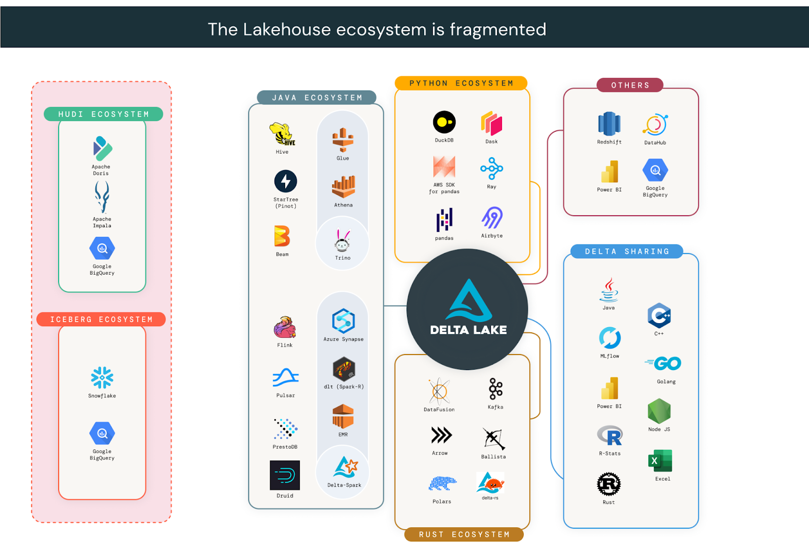
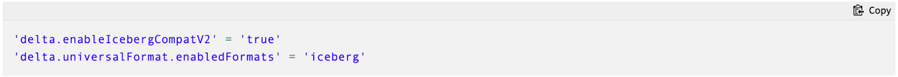
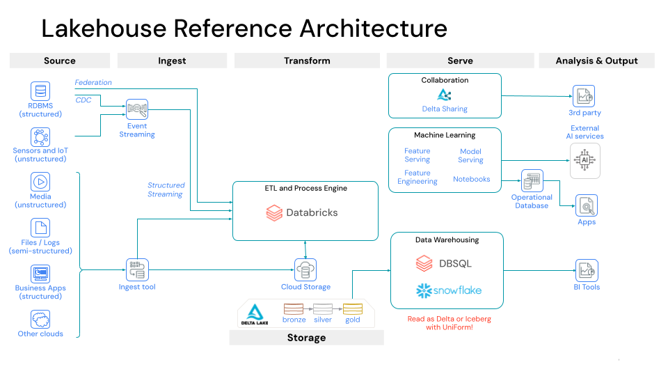
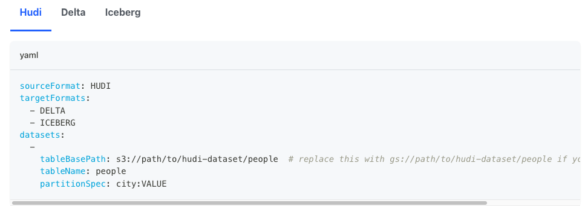
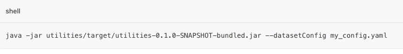
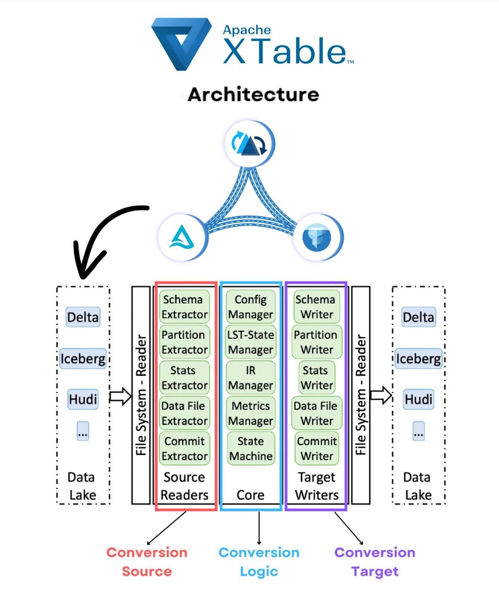

[Delta Lake Universal Format](https://docs.delta.io/latest/delta-uniform.html) (UniForm) and [Apache XTable™](https://xtable.apache.org/) (Incubating) have proven customers can build an open data lakehouse agnostic to table format. Both fully open-sourced tools enable customers to write a single copy of data and make it accessible to any engine downstream. Clients can read UniForm as [Delta Lake](https://delta.io/), [Apache Iceberg](https://iceberg.apache.org/), and now through partnership with XTable, [Apache Hudi](https://hudi.apache.org/). With universal support, you can seamlessly interoperate across all 3 open table format ecosystems, providing the data flexibility to choose the right tool for your ETL, ML, BI, and analytics workloads. In this blog, we cover:

- Why customers are choosing to interoperate
- Building a format-agnostic lakehouse with UniForm and XTable
- How the Delta Lake and XTable communities collaborate

## Unlock all 3 open ecosystems

Companies have fully adopted the open data lakehouse architecture. In a global study with C-suite executives, the [MIT Technology Review](https://www.databricks.com/resources/analyst-papers/laying-foundation-data-and-ai-led-growth) found that **74% have adopted a lakehouse architecture**. Delta Lake alone is used by over 10,000 companies in production, including more than **60% of the Fortune 500**. Organizations are choosing open table formats because they offer the freedom to use any engine on a single copy of data. Although all open table formats provide greater flexibility than proprietary formats, the lakehouse ecosystem is fragmented. For organizations whose architecture spans across more than one ecosystem, choosing a single format is often unrealistic.

UniForm and XTable are actively collaborating to help organizations build architectures that are not constrained to any single ecosystem. These tools take advantage of the fact that Delta Lake, Iceberg, and Hudi all consist of a metadata layer built on [Apache Parquet](https://parquet.apache.org/) data files. [Backed by Microsoft and Google](https://venturebeat.com/data-infrastructure/exclusive-microsoft-and-google-join-forces-on-onetable-an-open-source-solution-for-data-lake-challenges/), XTable translates metadata between a source and target format, maintaining a single copy of the data files. With shared goals, [XTable members merged a PR](https://github.com/delta-io/delta/issues/2312) in the Delta Lake repository to add Hudi support to UniForm. By partnering across open source communities, Delta Lake tables are **now readable by clients in all 3 ecosystems**! This next section showcases common use cases organizations have with UniForm and XTable.

## Lakehouse on Delta Lake UniForm and XTable

Since its [launch in Delta 3.0](https://delta.io/blog/delta-lake-3-0/), UniForm has proven compatibility with popular Iceberg reader clients. A common UniForm use case is to use Databricks for ETL and connect downstream to Snowflake for BI and analytics workloads. Previously, organizations had to duplicate Delta Lake tables written by Databricks into Snowflake’s internal format. With UniForm, you can read Delta as if it were Iceberg in Snowflake. First, enable Iceberg support on a Delta Lake table by setting the following table properties:

Once UniForm is enabled, when you write to a Delta Lake table, Iceberg metadata is automatically generated alongside the DeltaLog, colocated with the Parquet files. In Snowflake, you can read UniForm using an [Iceberg catalog integration](https://docs.snowflake.com/en/user-guide/tables-iceberg-create#create-an-iceberg-table-with-a-catalog-integration).

XTable, since its [Apache incubation](https://cwiki.apache.org/confluence/display/INCUBATOR/XTable+Proposal) in December, has amassed [over 700 GitHub stars](https://x.com/apachextable/status/1725247462280196465?s=20) and attracted an impressive set of contributors, mentors, and users including Microsoft, Google, Onehouse, Databricks, Snowflake, Walmart, Dremio, Adobe, and Cloudera. With Apache XTable, you can write from any format and translate it to any other format in an omni-directional way. No matter if you choose Delta Lake, Iceberg, or Hudi as your primary format, you can seamlessly interoperate across them all. A common use case in the XTable community is users who choose Apache Hudi for low-latency writes using its [unique record-level-index](https://www.onehouse.ai/blog/introducing-multi-modal-index-for-the-lakehouse-in-apache-hudi), but still want to read in Snowflake, which only supports Iceberg.

Under the hood, Apache XTable performs a lightweight incremental metadata conversion in a similar way to Delta Lake UniForm. No actual data files are read or rewritten, only metadata. XTable offers a portable runtime for flexibility in deployment and operation. See the docs for [a full walkthrough](https://xtable.apache.org/docs/how-to), but in short, it is as simple as this 2-step process:

1. Set a config.yaml file with the source and target formats and the file location of the table.

2. Execute a JAR command to issue the conversion:

Ideas for how you can execute the conversion include:

1. Configure XTable to run from your Spark writer after every commit
2. Schedule XTable to run asynchronously on a time interval with a tool like Airflow
3. Deploy a Lambda function or similar service to invoke an XTable conversion on demand

For full details into the internal architecture for Apache XTable, read the [Github readme](https://github.com/apache/incubator-xtable?tab=readme-ov-file#overview-of-the-sync-process). Below is a diagram to help summarize the core components:

## Choose openness not storage wars

Although there are several competing open lakehouse projects, it is important that all work together to support the collective data community. As more organizations adopt a Lakehouse architecture, the Delta Lake, Apache Hudi, and Apache Iceberg communities will continue to grow and attract users and contributors with their own unique needs and preferences. With a rising need for organizations to use multiple table formats, it is important to build bridges of interoperability. This will ensure division does not slow innovation for the developer community as a whole.

Our teams recognize the strength in sharing code and believe that our projects should support each other in interoperability. Come engage with and contribute to the Delta Lake and XTable communities:

<table>
  <tr>
    <td></td>
    <td>
      <strong>Apache XTable</strong>
    </td>
    <td>
      <strong>Delta Lake</strong>
    </td>
  </tr>
  <tr>
    <td>
      <strong>Github</strong>
    </td>
    <td>
      <a href="https://github.com/apache/incubator-xtable">
        apache/incubator-xtable
      </a>
    </td>
    <td>
      <a href="https://github.com/delta-io/delta">delta-io/delta</a>
    </td>
  </tr>
  <tr>
    <td>
      <strong>Website</strong>
    </td>
    <td>
      <a href="https://xtable.apache.org">xtable.apache.org</a>
    </td>
    <td>
      <a href="https://delta.io">delta.io</a>
    </td>
  </tr>
  <tr>
    <td>
      <strong>Docs</strong>
    </td>
    <td>
      <a href="https://xtable.apache.org/docs/setup/">XTable</a>
    </td>
    <td>
      <a href="https://docs.delta.io/latest/index.html">Delta Lake</a>
    </td>
  </tr>
  <tr>
    <td>
      <strong>Community Lists</strong>
    </td>
    <td>
      <a href="http://dev-subscribe@xtable.apache.org">Dev Mailing List</a>
    </td>
    <td>
      <a href="https://groups.google.com/g/delta-users">Google Group</a>,{" "}
      <a href="https://delta-users.slack.com/join/shared_invite/zt-2is7d09as-GFC2bhOUOGjmUTLAF9kOOw#/shared-invite/email">
        Slack
      </a>
    </td>
  </tr>
  <tr>
    <td>
      <strong>Socials</strong>
    </td>
    <td>
      <a href="https://www.linkedin.com/company/apache-xtable/">Linkedin</a>,{" "}
      <a href="https://twitter.com/apachextable">Twitter</a>
    </td>
    <td>
      <a href="https://www.linkedin.com/company/deltalake/">Linkedin</a>,{" "}
      <a href="https://www.youtube.com/c/deltalake">YouTube</a>,{" "}
      <a href="https://open.spotify.com/show/6YvPDkILtWfnJNTzJ9HsmW?si=282ba8186896469a&nd=1">
        Spotify
      </a>
    </td>
  </tr>
</table>
