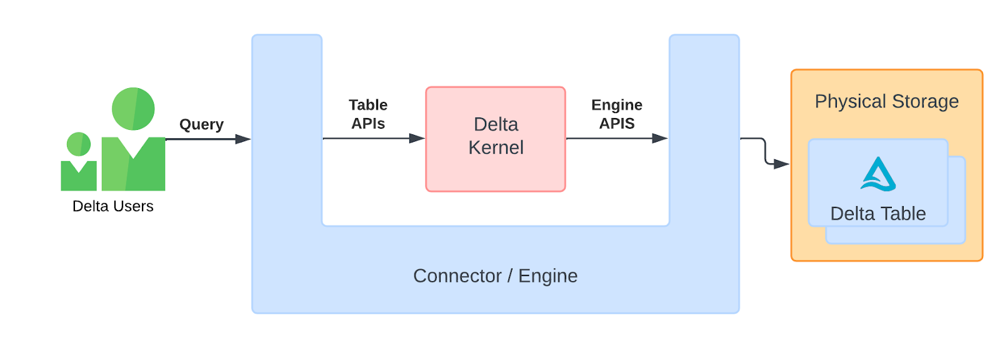
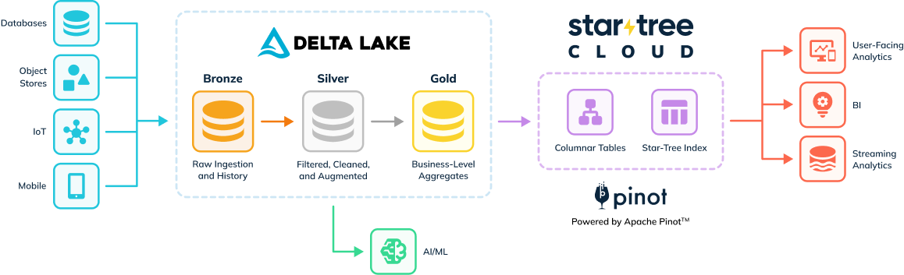

In the rapidly evolving landscape of data management, staying up-to-date with the latest advancements is key to maintaining a competitive edge. With the recent updates in Delta Lake, many of our customers have expressed a strong interest in harnessing these new features. To meet this demand, we are excited to introduce a brand-new connector built on the [Delta Kernel library](https://github.com/delta-io/delta/tree/master/kernel/), which offers seamless integration and enhanced capabilities for users of StarTree's managed Apache Pinot service.

This exciting development is the result of a close collaboration between the StarTree team and the open-source Delta Lake community. Our shared goal has been to deliver a powerful and flexible connector that meets the evolving needs of our customers. With this connector, businesses can effectively build a robust analytics framework for both data processing and real-time queries while ensuring data consistency and availability. Users can leverage the combined power of Apache Pinot and Delta Lake to respond to dynamic market conditions and drive innovation through real-time analytics. This partnership underscores our commitment to continuous improvement and innovation, ensuring that our users have access to the best tools available in the data management ecosystem.

## Exciting new features in Delta Lake 3.0+

If you're using Delta Lake or thinking about trying it out, there's a lot to be excited about with the latest features since the release of Delta Lake 3.0. Here are some of the coolest new additions:

- **Delta Lake UniForm ([3.1](https://delta.io/blog/delta-lake-3-1/))**: Delta UniForm makes it easy to use different data formats like Apache Iceberg and Apache Hudi alongside Delta Lake, all from the same Parquet data. It gives everyone a live view of the data without needing extra copies or conversions.
- **Delta Kernel (updated in [3.2](https://delta.io/blog/delta-lake-3-2/))**: The Delta Kernel simplifies working with Delta Lake by providing easy-to-use APIs. Developers can build connectors with simple API calls, and the Kernel handles all the complex details to give you the correct data.
- **Deletion Vectors ([3.2](https://delta.io/blog/delta-lake-3-2/))**: Deletion Vectors are a smart way to handle deleted data. Instead of rewriting the entire Parquet file, it marks rows for deletion. This makes delete, update, and merge operations faster and more efficient.
- **Liquid Clustering (preview in [3.1](https://delta.io/blog/delta-lake-3-1/))**: Liquid Clustering improves how data is organized for faster queries. It allows you to change how data is clustered without rewriting everything, making it easier to keep your data layout optimized as your analysis needs change.

But that's not all! Delta Lake 3.0 and later versions also come with big performance improvements for merge, update, and delete operations. These enhancements make data processing faster and more efficient, which is great news for anyone using Delta Lake.

One feature that is currently not supported in the StarTree connector is Column Mapping. In case of schema changes including changes in column name, customers will be able to leverage the backfilling capabilities in StarTree to rebuild the table to reflect the correct schema.

## What is Delta Kernel?

Delta Kernel is a new set of libraries designed to simplify building Delta connectors. With Delta Kernel, developers can read from and write to Delta tables without needing to understand the complex Delta protocol details. Instead, they can use stable API calls, and the Kernel handles all the protocol-specific logic to deliver the correct row data.

Before Delta Kernel, developers had to manage the log files and data files themselves and figure out how the data had changed over time. Now, Delta Kernel takes care of all this complexity internally, making it much easier and faster to build reliable Delta connectors.

For a detailed write up on the origins of the Delta Kernel project, check out the [What Is the Delta Kernel blog](https://delta.io/blog/delta-kernel/).

## StarTree: The Real-Time Serving Layer for User-Facing Analytics

While Apache Spark™ excels at data processing and ad hoc analytics, it is not the ideal choice for [user-facing analytics](https://startree.ai/resources/what-is-user-facing-analytics) use cases. User-facing analytics demand extremely low query latencies and very high queries per second (QPS), which can be challenging to achieve using an object-store-based data platform.

For example, a financial services company may collect transactional, behavioral, and customer data. Subsequently, they would follow the [medallion architecture](https://www.databricks.com/glossary/medallion-architecture) to create Bronze, Silver, and Gold Delta Lake tables. Even with the Gold table, this data is typically available only to a select few analysts due to concerns about responsiveness and the high cost associated with allowing more users to query this data.

StarTree, powered by Apache Pinot, is designed to provide low-latency, high-throughput querying capabilities on large-scale datasets. It is widely used for use cases requiring real-time analytics and fast data exploration, where low latency at high QPS rates is critical. StarTree enables businesses to create user-facing analytics applications that serve tens of thousands of users with extremely low latency queries by leveraging columnar storage, pluggable indexing, and distributed processing techniques, such as to do [query-time joins](https://startree.ai/blog/query-time-joins-in-apache-pinot-1-0) using the multi-stage query engine.

### Why use the new connector for StarTree and Delta Lake?

Customers using StarTree for user-facing analytics can effortlessly integrate their Delta Lake Gold tables into StarTree using the managed connector. This robust integration ensures that data flows smoothly between Delta Lake and StarTree, supporting a wide range of data operations. Whether it's the addition of new data, updates to existing data, or deletions, these changes are automatically and seamlessly reflected in StarTree. This automatic synchronization eliminates the need for manual intervention, allowing businesses to maintain real-time data accuracy and integrity in their user-facing analytics applications.

In addition to seamless integration, StarTree provides a comprehensive backfilling solution to update the tables in Apache Pinot whenever there are changes in the data pipeline. This includes handling schema evolution, which is crucial for maintaining the consistency and accuracy of analytics as data structures evolve over time. The backfilling solution ensures that any modifications to the data pipeline are automatically applied to the existing tables in Apache Pinot.

This capability is particularly valuable in dynamic data environments where data models frequently change to accommodate new business requirements or to improve data quality. With StarTree's backfilling solution, businesses can ensure that their real-time analytics remain up-to-date and reflective of the latest data, without the need for complex manual updates or extensive downtime. This allows organizations to maintain continuous, reliable analytics performance, even as their data pipelines evolve.

Users can now confidently rely on tables in StarTree to power user-facing analytics applications and other use cases that require low-latency at very high concurrency. This means that applications demanding real-time data access and rapid query responses can perform exceptionally well using StarTree's robust infrastructure. Whether it’s an interactive dashboard for financial analysis, a customer-facing analytics portal, or any application that needs to handle thousands of queries per second with minimal delay, StarTree is up to the task.

Meanwhile, AI/ML workloads and ad-hoc data exploration tasks will continue to run efficiently on the copies of raw and processed data stored in Delta Lake. This separation of concerns allows each system to excel at what it does best: Delta Lake for comprehensive data processing and transformation, and StarTree for delivering rapid, real-time analytics.

This architecture is designed to be flexible and non-disruptive, enabling users to integrate StarTree into their existing data pipelines effortlessly. By plugging StarTree into the current setup, users can enhance their data infrastructure with capabilities for extremely low-latency queries and high throughput without needing to overhaul their entire system. This integration allows businesses to maintain their existing workflows and data processing routines while significantly boosting the performance of their user-facing applications.

## Conclusions

Integrating StarTree with Delta Lake results in a formidable analytics solution that caters to both data processing and real-time analytics needs. Delta Lake is renowned for its robust data processing capabilities and support for ad-hoc analytics, making it ideal for handling large volumes of historical data. On the other hand, Apache Pinot is designed to deliver low-latency, high-throughput query performance, essential for real-time analytics applications.

This seamless integration ensures that data remains consistent and readily available, empowering businesses to capitalize on the strengths of both platforms. With Delta Lake managing extensive data processing tasks and Apache Pinot handling real-time queries, organizations can achieve a comprehensive analytics framework that addresses a wide range of use cases.

"The Delta Kernel project is intended to speed up integration into the Delta Lake ecosystem. I'm excited to see StarTree use Delta Kernel for their real-time analytics solution." – Tathagata Das, Tech lead for Delta Lake at Databricks

By leveraging the combined power of Apache Pinot and Delta Lake, businesses can unlock the full potential of their data, enhancing their ability to respond to dynamic market conditions and drive innovation through real-time analytics.
