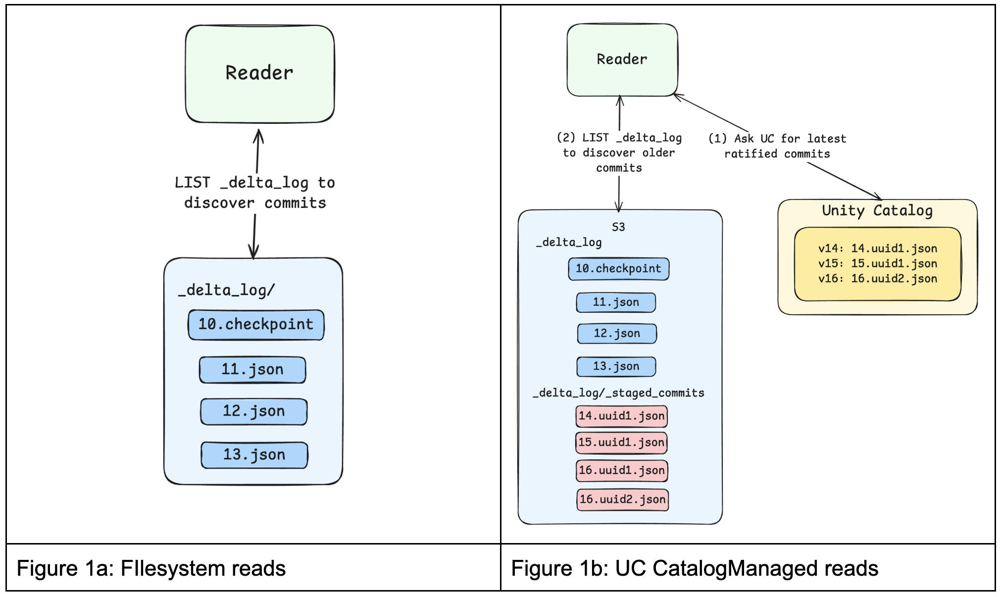
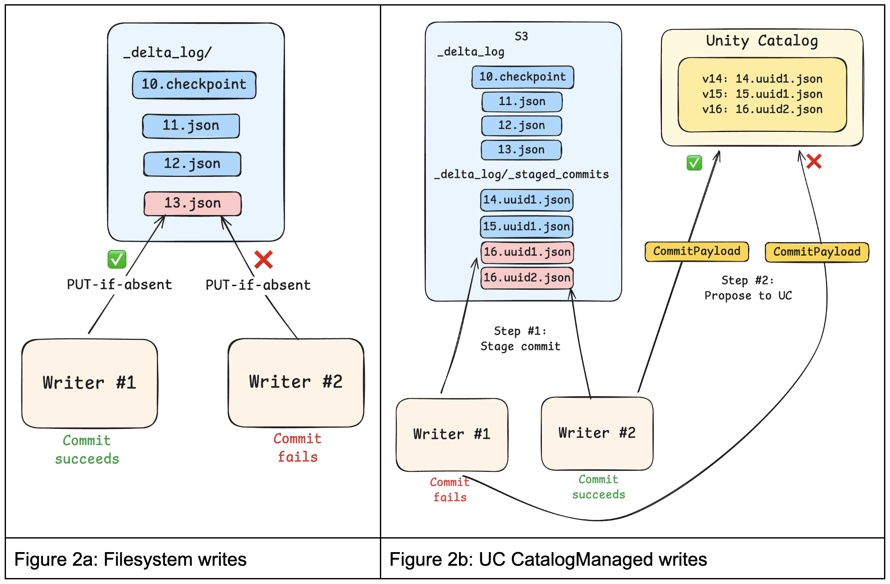

The data ecosystem is moving toward a catalog-centric model for managing open table formats. As open catalogs gain adoption, the catalog has emerged as the system of record for table identity, discovery, and authorization.

With [Delta Lake 4.0.1](https://github.com/delta-io/delta/releases/tag/v4.0.1), Delta introduces catalog-managed tables, bringing the catalog directly into commit coordination. This simplifies how tables are discovered and secured, enables consistent governance across engines, and unlocks faster performance. The design also aligns Delta with the catalog-managed model pioneered by Iceberg, creating a shared foundation for interoperable, high-performance lakehouse tables. [Unity Catalog](https://github.com/unitycatalog/unitycatalog/releases/tag/v0.3.1) is the first lakehouse catalog to support catalog-managed tables, extending unified governance across any format.

## What are Catalog-Managed Tables?

Catalog-Managed Tables is a Delta table feature that allows a catalog to manage the table. Once enabled, the catalog brokers table access as well as stores the table’s latest metadata and commits. Clients reference the table by name, not by path, and use the catalog to resolve the table's storage location. The catalog also manages concurrency control for proposed writes to a table. Writers leverage the catalog, not object store APIs, for atomic commits.

For more details, see the Delta protocol [RFC on Github here](https://github.com/delta-io/delta/blob/master/protocol_rfcs/catalog-managed.md). See how Unity Catalog implements support for the Catalog-Managed Tables specification <span style="color:red">here</span>.

## Benefits of Catalog-Managed Tables

Before catalog-managed tables, the filesystem – not the catalog – was the primary authority for table access and changes to table state. Catalog-managed tables change this by involving the catalog in read and write coordination, which unlocks:

1. <ins>Standardized table discovery and authorization</ins>: Historically, Delta clients needed to know the exact path of the table that they needed to read and credentials needed to be provisioned directly from the storage system. This made data discoverability very difficult and introduced risky coarse-grained authorization. For catalog-managed tables, the catalog facilitates access through logical table identifiers (e.g. Unity Catalog’s three-level namespace) and dynamically vends credentials scoped by the catalog’s policies. Ultimately, catalog-managed tables dramatically simplify how engines discover and access tables in a governed manner.<br/><br/>

2. <ins>Enforceable constraints</ins>: Path-based schema writes that bypass the catalog can’t be rejected. When writes go directly to object storage, storage credentials are not fine-grained enough to differentiate between clients who only have permission to write data vs. clients who have permission to modify table metadata. As a result, path-based writes can result in schema changes that break downstream workloads. For catalog-managed tables, the catalog can authoritatively validate or reject invalid schema or constraint changes.<br/><br/>

3. <ins>Faster query planning and faster writes</ins>: Delta engines have historically relied on the filesystem to replay the log, discover the latest table version or schema, and perform put-if-absent operations for commits. Each of these filesystem-imposed bottlenecks can add 100+ms to query execution. For catalog-managed tables, the catalog can directly inform the engine of this table-level metadata. This skips cloud storage entirely and removes a major source of metadata latency. This feature also opens the door for “inline commits” where the (metadata) content of the commit is sent directly to the catalog.<br/><br/>

These capabilities of catalog-managed Delta tables improve read and write performance while streamlining governance. Table state updates are flushed to the filesystem, reinforcing Delta’s openness and portability.

## How do Catalog-Managed Tables work?

The Catalog-Managed Tables Delta feature fundamentally changes how Delta tables are discovered, read, and committed to.

### Table Discovery

For catalog-managed tables, Delta tables are discovered and accessed through the catalog, not by filesystem paths. Engines must first resolve a table by name via the catalog, establishing table identity, location, and access credentials. This resolution step occurs before the Delta client interacts with the filesystem and determines the rules the client must follow for subsequent reads and writes.

### Reads

A catalog-managed table may have commits that have been ratified by the catalog but not yet flushed, or “published”, to the filesystem. Reads therefore begin by getting these latest commits from the catalog, typically via a <span style="color:#d63384">get_catalog_commits</span> API exposed by the catalog.

If additional history is required, such as older published commits or checkpoints, Delta clients can <span style="color:#d63384">LIST</span> the filesystem and merge those published commits with the catalog-provided commits to construct a complete snapshot. This split view allows catalogs to always provide the most recent table state while offloading long-term commit storage to the filesystem.



### Writes

Previously, writing to a Delta table involved calling filesystem “PUT-if-absent” APIs to perform atomic writes with mutual exclusion. In this model, the filesystem determined which writes win. While simple and scalable, this approach treated commits as opaque blobs: the filesystem could not inspect commit contents, enforce constraints, or coordinate writes across tables.

For catalog-managed tables, clients propose commits to the catalog, typically by first staging commits in the filesystem’s <span style="color:#d63384"><table_path>/\_delta_log/\_staged_commits</span> directory and then requesting ratification. Staging ensures that readers never observe unapproved commits. The protocol also allows for “inline” commits, where the contents of the commit are sent directly to the catalog, skipping the 100ms+ filesystem write. Staged commits are still performed using optimistic concurrency control to provide transactional guarantees.

Catalogs can also define their own commit APIs, allowing them to accept richer commit payloads, inspect actions and metadata, enforce constraints, and apply catalog-level policies before ratifying a commit.

To unburden catalogs from having to store these ratified commits indefinitely, ratified commits can be periodically “published” to the <span style="color:#d63384">\_delta_log</span> in the filesystem. Once published, catalogs no longer need to retain or serve those commits because clients can easily discover them by listing.



## Evolving open table formats

Catalog-managed Delta tables represent an important evolution in how Delta tables are governed and accessed. As an added benefit, this catalog-oriented design closely resembles that of Iceberg tables. Ultimately, this makes it simpler for practitioners to discover and govern data consistently, regardless of table format.

We are excited to continue collaborating with the ecosystem to evolve open table formats so that they deliver performant commits, efficient metadata management, multi-engine interoperability, and unified governance.

## How to get started

Get started today with catalog-managed tables by downloading [Delta Spark 4.0.1](https://github.com/delta-io/delta/releases/tag/v4.0.1) and [Unity Catalog 0.3.1](https://github.com/unitycatalog/unitycatalog/releases/tag/v0.3.1). Unity Catalog supports both static token authentication as well as OAuth with automatic token credential refresh.

Below is an example of configuring Spark-SQL to work with UnityCatalog on S3. For this setup, you will need to know your UC <span style="color:#d63384">ENDPOINT</span> as well as PAT <span style="color:#d63384">TOKEN</span>. Then, configure the <span style="color:#d63384">CATALOG</span> to be the catalog identifier of your three part [namespace](https://docs.unitycatalog.io/quickstart/#unity-catalog-structure).

```bash
bin/spark-sql \
  --master "local[*]" \
  --packages "io.delta:delta-spark_2.13:4.0.1,io.unitycatalog:unitycatalog-spark_2.13:0.3.1,org.apache.hadoop:hadoop-aws:3.4.1" \
  --conf "spark.sql.extensions=io.delta.sql.DeltaSparkSessionExtension" \
  --conf "spark.hadoop.fs.s3.impl=org.apache.hadoop.fs.s3a.S3AFileSystem" \
  --conf "spark.sql.catalog.spark_catalog=org.apache.spark.sql.delta.catalog.DeltaCatalog" \
  --conf "spark.sql.catalog.<CATALOG>=io.unitycatalog.spark.UCSingleCatalog" \
  --conf "spark.sql.catalog.<CATALOG>.uri=<ENDPOINT>" \
  --conf "spark.sql.catalog.<CATALOG>.token=<TOKEN>"
```

Then you can create a catalog-managed table:

```sql
CREATE TABLE main.default.foo TBLPROPERTIES ('delta.feature.catalogManaged' = 'supported')
```
