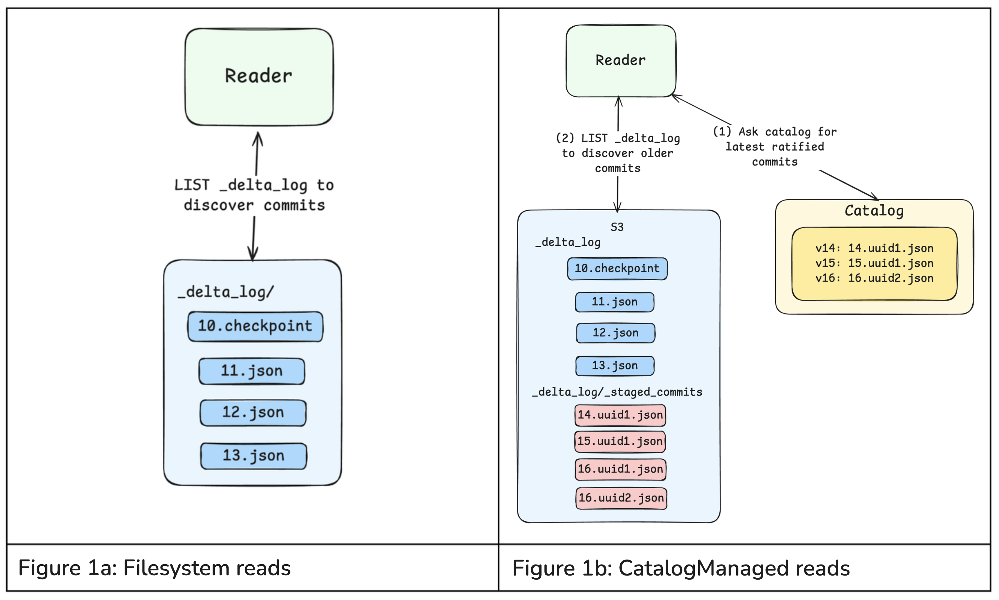
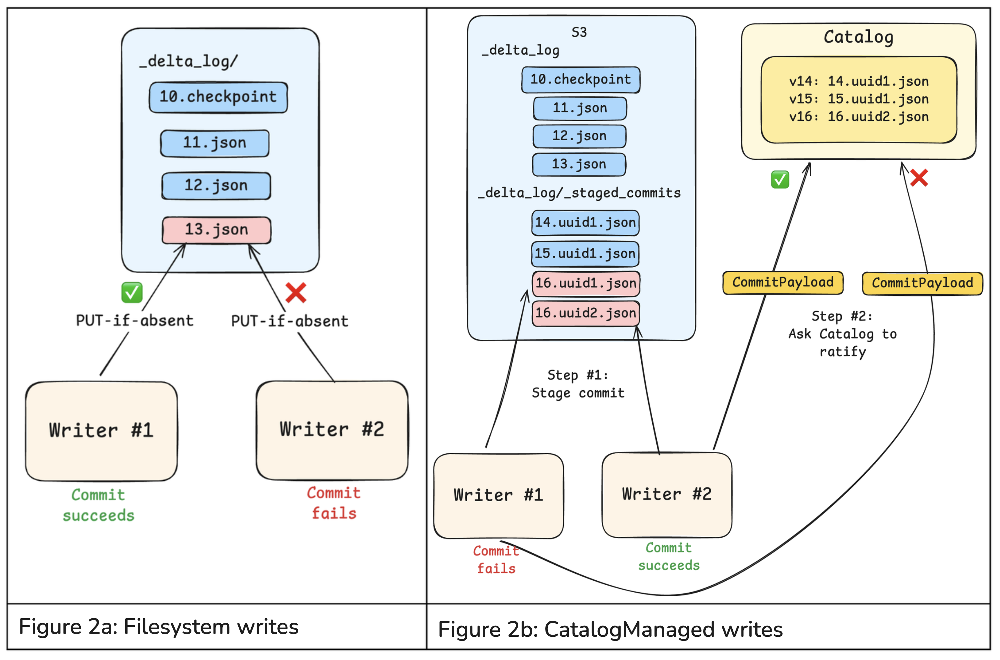

The data ecosystem is moving toward a catalog-centric model for managing open table formats. As open catalogs gain
adoption, the catalog has emerged as the system of record for table identity, discovery, and authorization.

With [Delta Lake 4.1.0](https://github.com/delta-io/delta/releases/tag/v4.1.0), Delta introduces
**catalog-managed tables**, which establish the catalog as the coordinator of table access and source of truth for
table state. This simplifies how tables are discovered and secured, enables consistent governance across engines, and
unlocks faster performance. The design also aligns Delta with the catalog-managed model pioneered by Iceberg, creating
a shared foundation for interoperable, high-performance lakehouse tables.

[Unity Catalog](https://github.com/unitycatalog/unitycatalog/releases/tag/v0.4.0) is the first open lakehouse catalog
to support catalog-managed tables, extending unified governance across any format.

## What are Catalog-Managed Tables?

Catalog-managed tables are tables for which the catalog brokers table access as well as stores the table’s latest
metadata and commits. Clients reference the table by name, not by path, and use the catalog to resolve the table’s
storage location. The catalog also manages concurrency control for proposed writes to a table. Writers leverage the
catalog, not object store APIs, for atomic commits.

For more details, see the Delta protocol [RFC on Github here](https://github.com/delta-io/delta/blob/master/PROTOCOL.md#catalog-managed-tables).
See how Unity Catalog implements support for the [Catalog-Managed Tables specification here](https://github.com/unitycatalog/unitycatalog/blob/main/spec/protocols/ManagedTablesSpec.md).

## Before: Challenges with Delta tables that were managed by the filesystem

Before catalog-managed tables, the filesystem – not the catalog – was the primary authority for table access and
changes to table state.

To access filesystem-managed Delta tables, Delta clients first look at the transaction log (`_delta_log`) stored with
the table to determine the latest version. Clients then reconstruct the current state of the table by replaying the log
entries, which describe the table’s schema and data files that belong to the table. Once the table state is known, the
system reads the relevant data files to answer the query. When writing to the table, clients write new data files to
storage and then atomically commit a new transaction log entry via filesystem APIs to advance the table to a new
version.

Historically, data teams have faced the following challenges with filesystem-managed Delta tables:

1. **Brittle path-based access**: Delta clients have to know the exact path of the filesystem-managed table they are accessing, and credentials have to be provisioned directly by the storage system. This tightly couples applications to physical storage locations, so routine changes like table relocation, storage reorganization, or credential rotation could break pipelines and queries.
2. **Risky coarse-grained authorization**: Filesystems lack fine-grained access control, so complying with data privacy requirements often requires splitting datasets across multiple tables or storage paths to isolate sensitive fields or records. This leads to duplicated data, fragmented governance, and fragile pipelines.
3. **Unsafe schema changes**: Path-based writes can modify table schemas or metadata without validation, potentially introducing incompatible changes that break downstream workloads. This occurs because storage credentials cannot distinguish between clients authorized to write data and those authorized to modify table metadata.
4. **Bottlenecked performance**: Replaying the Delta transaction log to resolve a table’s latest state requires multiple calls to the filesystem, which can add 100+ ms to query execution.

## Now: Catalog-Managed Delta Tables address these challenges

Catalog-managed tables address the governance and performance challenges by involving the catalog in read, write, and
authorization coordination. This way, teams can unlock:

1. **Standardized table discovery**: The catalog provides stable logical table identifiers (such as [Unity Catalog’s three-level namespace](https://docs.unitycatalog.io/quickstart/#unity-catalog-structure)), eliminating the need for clients to depend on physical storage paths for discovery.
2. **Unified governance**: The catalog is responsible for granting clients access to data, rather than teams needing to manage fragmented access policies across their storage systems. This dramatically simplifies how data teams ensure engines access their data in a governed manner.
3. **Enforceable constraints**: The catalog can authoritatively validate or reject schema and constraint changes, preventing incompatible updates that could compromise data integrity or break downstream workloads.
4. **Faster query planning and faster writes**: If a Delta client is trying to access a table, the catalog can directly inform it of the table-level metadata. This skips cloud storage entirely and removes a major source of metadata latency. This feature also opens the door for “inline commits” where the (metadata) content of the commit is sent directly to the catalog.

Catalog-managed Delta tables dramatically simplify how engines discover and access data under consistent governance,
all while improving read and write performance. Table state updates are flushed to the filesystem, reinforcing Delta’s
openness and portability.

## How do Catalog-Managed Tables work?

The Catalog-Managed Tables Delta feature fundamentally changes how Delta tables are discovered, read, and committed to.

### Table Discovery

For catalog-managed tables, Delta tables are discovered and accessed through the catalog, not by filesystem paths.
Engines must first resolve a table by name via the catalog, establishing table identity, location, and access
credentials. This resolution step occurs before the Delta client interacts with the filesystem and determines the rules
the client must follow for subsequent reads and writes.

### Reads

A catalog-managed table may have commits that have been ratified by the catalog but not yet flushed, or “published”,
to the filesystem. Reads therefore begin by getting these latest commits from the catalog, typically via a
<span style="color:#d63384">get_catalog_commits</span> API exposed by the catalog.

If additional history is required, such as older published commits or checkpoints, Delta clients can
<span style="color:#d63384">LIST</span> the filesystem and merge those published commits with the catalog-provided
commits to construct a complete snapshot. This split view allows catalogs to always provide the most recent table state
while offloading long-term commit storage to the filesystem.



### Writes

Previously, writing to a Delta table involved calling filesystem **“PUT-if-absent”** APIs to perform atomic writes with
mutual exclusion. In this model, the filesystem determined which writes win. While simple and scalable, this approach
treated commits as opaque blobs: the filesystem could not inspect commit contents, enforce constraints, or coordinate
writes across tables.

For catalog-managed tables, clients propose commits to the catalog, typically by first staging commits in the
filesystem’s <span style="color:#d63384"><table_path>/\_delta_log/\_staged_commits</span> directory and then requesting
ratification. Staging ensures that readers never observe unapproved commits. The protocol also allows for “inline”
commits, where the contents of the commit are sent directly to the catalog, skipping the 100ms+ filesystem write.
Staged commits are still performed using optimistic concurrency control to provide transactional guarantees.

Catalogs can also define their own commit APIs, allowing them to accept richer commit payloads, inspect actions and
metadata, enforce constraints, and apply catalog-level policies before ratifying a commit.

To unburden catalogs from having to store these ratified commits indefinitely, ratified commits can be periodically
“published” to the <span style="color:#d63384">\_delta_log</span> in the filesystem. Once published, catalogs no longer
need to retain or serve those commits because clients can easily discover them by listing.



## Evolving open table formats

Catalog-managed Delta tables represent a critical convergence between how data is stored and how it is governed.
Open table formats and open catalogs are evolving together so that governance becomes a native property of the table
itself rather than an external overlay.

As an added benefit, Delta’s new catalog-oriented design closely resembles that of Iceberg tables. Ultimately, this
makes it simpler for practitioners to discover and govern data consistently, regardless of table format.

We are excited to continue collaborating with the ecosystem to evolve Delta with open catalogs so that they deliver
performant commits, efficient metadata management, multi-engine interoperability, and unified governance.

# Getting started with Catalog Managed Tables

To get started with Catalog Managed Tables, you'll need both [Delta Lake 4.1.0](https://github.com/delta-io/delta/releases/tag/v4.1.0) and
[Unity Catalog 0.4.0](https://github.com/unitycatalog/unitycatalog/releases/tag/v0.4.0) installed, and additionally,
you'll need to opt into the catalog-managed feature.

We've simplified this process for you by providing a full docker environment called
[unitycatalog-playground](https://github.com/newfront/unitycatalog-playground/) which can be used as a starting point to
test out this new functionality.

### Enabling Catalog Managed Tables in Unity Catalog

The **server.properties** file of the Unity Catalog server (`/etc/conf/server.properties`) must contain the following:

```text
## Experimental Feature Flags
# Enable MANAGED table (experimental feature)
# Default: false (disabled)
server.managed-table.enabled=true

# Set the UC storage root
storage-root.tables=/path/to/data/dir
```

> Note: This properties file can be viewed in full [here](https://github.com/newfront/unitycatalog-playground/blob/main/etc/conf/server.properties).

> Note: This guide is a truncated version of the [Unity Catalog Playground](https://github.com/newfront/unitycatalog-playground/) guide.

## 1. Configure your Spark Session

This step configures your Spark Session to use the Unity Catalog UCSingleCatalog, enabling the use of the
catalog-managed tables feature.

```python
DELTA_VERSION='4.1.0'
UNITY_CATALOG_VERSION='0.4.0'
unity_catalog_server_url = "http://unitycatalog:8080"

config = {
    "spark.jars.packages": f"io.delta:delta-spark_4.1_2.13:{DELTA_VERSION},io.unitycatalog:unitycatalog-spark_2.13:{UNITY_CATALOG_VERSION}",
    "spark.sql.extensions": "io.delta.sql.DeltaSparkSessionExtension",
    "spark.sql.catalog.spark_catalog": "org.apache.spark.sql.delta.catalog.DeltaCatalog",
    f"spark.sql.catalog.unity": "io.unitycatalog.spark.UCSingleCatalog",
    f"spark.sql.catalog.unity.uri": unity_catalog_server_url,
    f"spark.sql.catalog.unity.token": "",
    "spark.sql.defaultCatalog": catalog,
}

spark_config = (
    SparkConf()
        .setMaster('local[*]')
        .setAppName("DeltaCatalogManagedTables")
)
for k, v in config.items():
    spark_config = spark_config.set(k, v)

# build the session
spark: SparkSession = SparkSession.builder.config(conf=spark_config).getOrCreate()
```

## 2. Create a Schema and your first Catalog Managed Table

With your session running, create a dedicated schema and then define your table using **CREATE TABLE ... USING DELTA**
with the **delta.feature.catalogManaged** table property set to **supported**. This single property is what opts the
table into catalog-managed commits — without it, Delta falls back to standard filesystem-based coordination.

```python
spark.sql("CREATE SCHEMA IF NOT EXISTS unity.sanctuary")

ddl = """
CREATE TABLE IF NOT EXISTS sanctuary.pets (
    uuid    STRING  NOT NULL,
    name    STRING  NOT NULL,
    age     INT     NOT NULL,
    adopted BOOLEAN NOT NULL
)
USING DELTA
TBLPROPERTIES ('delta.feature.catalogManaged' = 'supported')
"""
spark.sql(ddl)
```

## 3. Populate your Table

Now that you have a table, let's add some records to it. We'll be using the `generate_pets` and `pets_to_dataframe`
methods from the [unitycatalog-playground](https://github.com/newfront/unitycatalog-playground/) library to
generate some random data.

```python
# create 100 pets, grouped into litters of 10 pets
pets = generate_pets(batch_size=10, total=100)
litter_one = next(pets, None)
df = pets_to_dataframe(litter_one, spark)

# add the first set of records
df.write.format("delta").mode("append").saveAsTable("sanctuary.pets")

# now continue until we've accounted for all pets
for litter in pets:
    pets_to_dataframe(litter, spark).write.format("delta").mode("append").saveAsTable("sanctuary.pets")
```

## 4. Explore your Table

Let's find all pets who still need to find a home.

```python
spark.sql("select * from sanctuary.pets where NOT adopted").show()
```

Given the randomly generated data, you might have more or less pet's who need to be adopted still. In this case,
there are four pet's left (Otis, Dexter, Bentley, and Fern).

```bash
+--------------------+-------+---+-------+
|                uuid|   name|age|adopted|
+--------------------+-------+---+-------+
|100a76bf-d328-478...|   Otis|  7|  false|
|aeb930bd-d189-46e...| Dexter|  6|  false|
|bae52223-bac0-436...|Bentley| 12|  false|
|0bddb1b0-4cf0-457...|   Fern| 14|  false|
+--------------------+-------+---+-------+
```

Now you might be thinking that this feels the same as any standard Delta Lake workflow with Spark and you'd be correct.
This is the magic of the catalog-managed feature. The catalog is the single source of truth for table state, and you
no longer need to worry about the filesystem.

## 5. View the Catalog Commits

We can view the catalog commit metadata using the Unity Catalog API. To query this API endpoint, we'll need to have the
uuid of our table. We can get that by running the following query.

```python
spark.sql("describe extended sanctuary.pets").show(truncate=False)
```

This will show us the following:

```text
+----------------------------+----------------------------------------------------------------------------------------------+-------+
|col_name                    |data_type                                                                                     |comment|
+----------------------------+----------------------------------------------------------------------------------------------+-------+
|uuid                        |string                                                                                        |NULL   |
|name                        |string                                                                                        |NULL   |
|age                         |int                                                                                           |NULL   |
|adopted                     |boolean                                                                                       |NULL   |
|                            |                                                                                              |       |
|# Detailed Table Information|                                                                                              |       |
|Name                        |unity.sanctuary.pets                                                                          |       |
|Type                        |MANAGED                                                                                       |       |
|Location                    |file:/home/unitycatalog/etc/data/__unitystorage/tables/bfff9405-4b50-43e9-870b-2b25f2210cf2   |       |
|Provider                    |delta                                                                                         |       |
|Is_managed_location         |true                                                                                          |       |
|Table Properties            |[delta.feature.catalogManaged=supported,delta.minReaderVersion=3,delta.minWriterVersion=7,...]|       |
+----------------------------+----------------------------------------------------------------------------------------------+-------+
```

<br>
The important thing to note here is that the **Location** column contains our **table_id**
_bfff9405-4b50-43e9-870b-2b25f2210cf2_, as part of the storage location
_file:/home/unitycatalog/etc/data/__unitystorage/tables/bfff9405-4b50-43e9-870b-2b25f2210cf2_.

We'll use both values to craft a curl request to the **/delta/preview/commits** endpoint.

```bash
curl -X GET "http://localhost:8080/api/2.1/unity-catalog/delta/preview/commits" \
  -H "Content-Type: application/json" \
  -d '{"table_id":"bfff9405-4b50-43e9-870b-2b25f2210cf2", "table_uri":"file:///home/unitycatalog/etc/data/__unitystorage/tables/bfff9405-4b50-43e9-870b-2b25f2210cf2", "start_version":0}' \
| jq .
```

<br>

The results of which show us the following:

<br>

```text
{
  "commits": [
    {
      "version": 10,
      "timestamp": 1772125957803,
      "file_name": "00000000000000000010.a3b3b204-63a4-494d-8244-72824a97e4f2.json",
      "file_size": 3614,
      "file_modification_timestamp": 1772125957807
    }
  ],
  "latest_table_version": 10
}
```

## Wrapping things up

We've learned how to move beyond the filesystem to discover and govern Delta tables using catalog-managed commits. We'd
love your feedback on this feature, and welcome any questions or comments you may have. Please reach out to us on the
[Delta Users Slack channel](https://go.delta.io/slack) or on the [Unity Catalog Slack channel](https://go.unitycatalog.io/slack).
