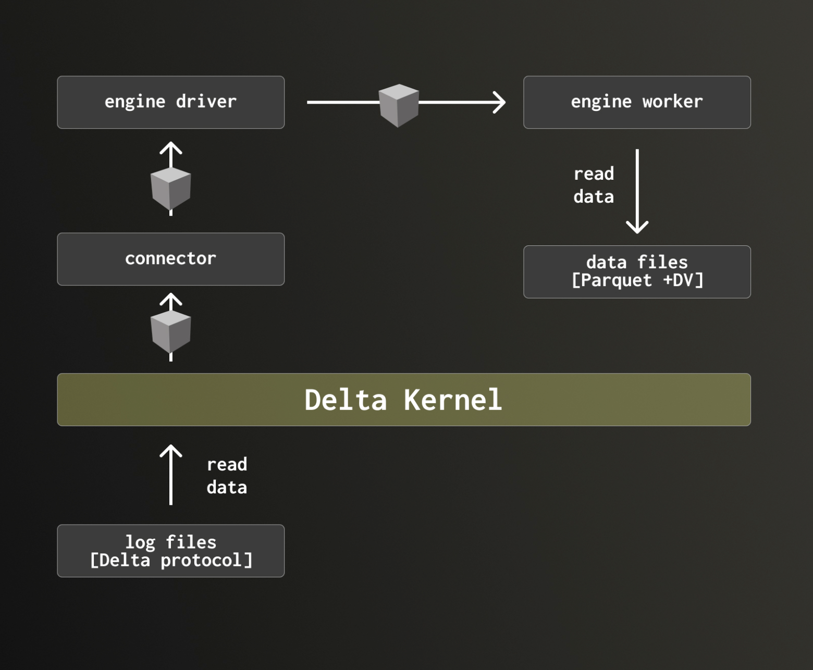
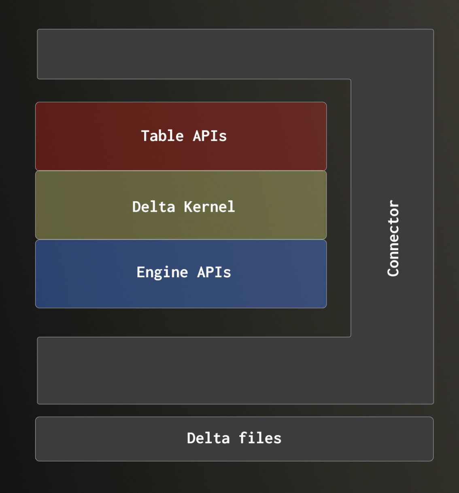

Unless you’ve spent the last few years in a cave without internet access, you’ve probably heard of open table formats like Delta Lake and Iceberg.

The goal is simple: define a data format that any query engine can read and write, as long as it follows the protocol. Over time, these formats have evolved beyond simple interoperability, introducing richer table semantics such as transactional support, schema evolution, and versioned data management directly on top of the underlying data.

Recently, we announced that [ClickHouse is data lake ready](https://clickhouse.com/blog/clickhouse-is-data-lake-ready), with it supporting these table formats as a query engine. As part of that journey, we’ve been working more closely with these formats and, like many others, have run into some of the same challenges.

Adopting these table formats is not trivial. Supporting them requires keeping up with complex and evolving protocols, whether through external libraries or custom implementations. Each query engine remains responsible for maintaining its own integration, often leading to fragmented feature support and increasing maintenance overhead.

In this post, we explore how we addressed this by integrating the Rust Delta Kernel into ClickHouse. This provides a maintained and consistent interface between the table format and ClickHouse’s query engine, enabling us to expose more features while significantly reducing integration complexity.

# What is ClickHouse?

ClickHouse is a high-performance, column-oriented SQL database management system (DBMS) for online analytical processing (OLAP). OLAP refers to SQL queries with complex calculations (e.g., aggregations, string processing, arithmetic) over massive datasets, processing billions and trillions of rows in milliseconds.

For an introduction to ClickHouse, including why it exists and how it delivers its performance, we recommend the [Getting Started Guides](https://clickhouse.com/docs/get-started/quick-start). For a deeper look at the architectural decisions behind its speed, see the ["Why ClickHouse is Fast"](https://clickhouse.com/docs/concepts/why-clickhouse-is-so-fast) series.

For the rest of this post, we’ll focus specifically on ClickHouse’s integration with Delta Lake, exploring how we integrated with the Delta Kernel.

## Working with Delta Lake

One of the key goals in making ClickHouse data lake ready was enabling users to query data directly from open table formats like Delta Lake. Our initial approach involved implementing native support by working directly with the [Delta protocol](https://github.com/delta-io/delta/blob/master/PROTOCOL.md). While this gave us full control, it also exposed the complexity of the format and the ongoing cost of keeping up with an evolving specification.

```sql
SELECT
    cityHash64(URL),
    count() AS cnt
FROM deltaLake('https://datasets-documentation.s3.amazonaws.com/lake_formats/delta_lake/')
GROUP BY cityHash64(URL)
ORDER BY cnt DESC
LIMIT 5
```

Results in the following:

```text
Query id: 99b0ef8a-f8e0-4c27-bb8b-33c99733c0c7

   ┌──────cityHash64(URL)─┬─────cnt─┐
1. │  8128408125044552281 │ 3288173 │ -- 3.29 million
2. │ 17146718649009901992 │ 1625250 │ -- 1.63 million
3. │   935030221159485792 │  791465 │
4. │  6972355099133249997 │  582400 │
5. │ 13961208022208327194 │  514984 │
   └──────────────────────┴─────────┘

5 rows in set. Elapsed: 3.878 sec. Processed 100.00 million rows, 14.82 GB (25.78 million rows/s., 3.82 GB/s.)
Peak memory usage: 9.16 GiB.

```

As support expanded, it became clear that achieving full feature coverage while keeping the integration maintainable would be increasingly difficult. This led us to adopt the Delta Kernel, allowing us to offload protocol handling and focus on what ClickHouse does best: high-performance query execution.

## Introducing the Delta Kernel

The Delta Lake kernel abstracts away much of the complexity of the underlying format, providing a clear boundary between the query engine and the protocol. It handles the processing of Delta files and exposes well-defined interfaces to the engine, allowing ClickHouse to operate on “black box” objects without managing the underlying mechanics.

In contrast to our original approach, where ClickHouse directly implemented the protocol, this reduces both implementation complexity and maintenance overhead while making it easier to keep pace with new features.



The Delta Kernel provides a set of guarantees that make it an attractive foundation for supporting Delta Lake, without requiring the engine to implement the protocol itself. In particular, it takes responsibility for:

- Parsing transaction logs stored as JSON
- Reading and interpreting Delta metadata
- Resolving snapshots and determining the correct set of data files
- Applying data skipping based on metadata

By centralizing this logic, the Kernel removes the need for each query engine to independently implement and maintain support for an evolving protocol.

At the same time, query engines like ClickHouse still need to retain control over performance-critical components, particularly file reading. Significant engineering effort goes into optimizing Parquet readers, and these optimizations are essential to overall query performance.

The Delta Kernel is designed with this balance in mind.



Through its Engine APIs, it allows engines to plug in their own optimized implementations for components such as file access and data reading, providing metadata about data files including statistics and deletion vectors to allow ClickHouse to do efficient downstream filtering and processing. It also informs the query engine of any transformations that need to be applied to the on-disk data to make it match the table's logical format in addition to higher-level interfaces for interacting with snapshots.

## What the Delta Kernel adds

Beyond abstracting the complexity of the Delta protocol, the Delta Kernel unlocks a number of capabilities that would have been more challenging to implement and maintain ourselves. Instead of building and evolving support for each feature independently, we inherit a consistent and well-defined implementation that allows us to expose these features directly in ClickHouse.

In practice, this allowed us to deliver a much broader set of functionality, much faster than would have been feasible with a native implementation.

### Writes

The Delta Kernel provides full support for managing writes to Delta tables at the transactional level, including handling transaction logs and ensuring consistency. Delta Lake guarantees ACID semantics for these operations, preventing partial or conflicting updates and enabling safe concurrent access patterns that are difficult to implement correctly from scratch. The underlying Parquet data files, however, are written by ClickHouse, while the Delta Kernel is responsible solely for coordinating and recording the associated transactional metadata.

### Schema evolution

Delta tables can evolve over time without requiring full rewrites. Columns can be added or modified in a controlled way, with all changes tracked in the transaction log. This allows ClickHouse to interact with datasets whose structure changes over time without breaking queries or pipelines.

To achieve this, the Delta Kernel exposes both the logical schema, which reflects how the table is presented to users, and the physical schema used by the underlying Parquet files. For each data file, it also provides schema transformation metadata, enabling ClickHouse to reconcile differences between file-level schemas and the current table definition. This ensures that data is read consistently and transparently, even as the schema evolves over time.

### Time travel

Every change to a Delta table is versioned, allowing queries against previous snapshots of the data. This enables reproducibility, auditing, and debugging workflows, as users can query historical versions of a dataset without maintaining separate copies.

The Delta Kernel supports flexible, versioned access patterns, allowing users to read a table at a specific snapshot. It also provides row-level change visibility through Change Data Feed (CDF), exposing inserts, updates, and deletes as a stream of events. This makes it straightforward to build incremental pipelines, audit modifications, or synchronize downstream systems. In ClickHouse 25.12, we [exposed Delta Lake’s CDF](https://github.com/ClickHouse/ClickHouse/pull/90431) through the [deltaLake table function](https://clickhouse.com/docs/sql-reference/table-functions/deltalake). This allows users to query row-level changes between table versions using the `delta_lake_snapshot_start_version` and `delta_lake_snapshot_end_version` settings.

```sql
SELECT *
FROM deltaLake('s3://path/to/table')
SETTINGS
    delta_lake_snapshot_start_version = 5,
    delta_lake_snapshot_end_version = 10;
```

Results include metadata columns such as `_change_type`, `_commit_version` and `_commit_timestamp`, allowing users to reason about how data has evolved over time and traverse table history more directly.

> Note: As we discuss later, we plan to use the latter to build Change Data Feed support in ClickPipes.

### Partition pruning

Delta metadata includes partition information that allows engines to skip entire subsets of data during query execution. By exposing this through the Kernel, ClickHouse can avoid scanning irrelevant files and reduce I/O, improving query performance.

### Statistics-based pruning

In addition to partitions, Delta tracks file-level statistics such as min and max values. These can be used for data skipping, allowing queries to ignore files that cannot satisfy a given predicate. This is a key optimization for large datasets, significantly reducing the amount of data that needs to be read.

Taken together, these features represent a substantial surface area of functionality. Implementing them natively would have required not only significant engineering effort, but also ongoing maintenance to keep up with the evolving Delta protocol. By adopting the Delta Kernel, we were able to focus on query execution and performance, while relying on a shared implementation for protocol correctness and feature completeness.

# Using the Delta Kernel in ClickHouse: adding a Rust library to a C++ database

To see how this integration fits into ClickHouse, it’s important to first understand the design of its build system.

## The ClickHouse build system

ClickHouse has a number of design choices that can feel peculiar at first, but often prove to be powerful once understood. A good example is its SQL extensions, such as expression aliases. ClickHouse [allows aliases to be defined](https://clickhouse.com/docs/sql-reference/syntax#expression-aliases) and reused within the same subquery, and even referenced from different parts of a column declaration, not just the final projection. While this may seem surprising initially, it enables more flexible and concise query patterns.

The build system is no exception. Like other parts of ClickHouse, it has its own peculiarities which can seem surprising at first, but are the result of deliberate design decisions. To understand the challenges we encountered when integrating [delta-kernel-rs](https://github.com/delta-io/delta-kernel-rs/), it’s important to first look at these characteristics and how they shape the way code is integrated.

First and foremost, the resulting binary has no external dependencies, with the sole exception of the libc library, at least for now. The default Linux build depends only on a relatively old glibc version, 2.4 for x86_64, nearly 20 years old, or 2.18, around 11 years old, for ARM. It does not rely on libstdc++ or any other external libraries. This ensures the binary runs consistently across environments, with identical behavior regardless of what is installed on the system.

The second peculiarity follows directly from this. Since dynamic loading is not possible, all dependencies must be built into the binary. We achieve this by vendoring them as submodules within the repository under `contrib/`. This greatly simplifies development, removing concerns around system library versions and ensuring all required code is always available. This approach is increasingly common in newer ecosystems like Go and Rust. That said, it does come with trade-offs, particularly from a packaging perspective, where it can lead to larger binaries and concerns around dependency freshness.

These constraints naturally lead to the next design choice. External dependencies are built using the same compiler options and flags as the core codebase, with only minimal exceptions where required. We also maintain our own simplified CMake configurations for each dependency, tailored specifically to our needs.

Treating external code with the same standards as internal code quickly proves its value. By running our sanitizers and fuzzers across all dependencies, we often uncover issues early in the integration process. Fixing these not only improves ClickHouse itself but also contributes back to the broader open source ecosystem.

## Rust inside ClickHouse

Rust [was introduced to ClickHouse](https://github.com/ClickHouse/ClickHouse/pull/33435) as a way to add minor functionality, such as new functions, to the database engine. The initial demonstration introduced the [BLAKE3](https://github.com/BLAKE3-team/BLAKE3) crate to provide the `blake3` function, using some hand-written C wrappers and [Corrosion](https://github.com/corrosion-rs/corrosion) to handle the `cmake` targets.

Although this original library was later removed (replaced by LLVM's C++ implementation), other libraries were added and are still present:

- [prql](https://github.com/PRQL/prql): to support the PRQL dialect
- [skim](https://github.com/skim-rs/skim): to support fuzzy search in the client
- [chcache](https://github.com/ClickHouse/ClickHouse/tree/4baea3af01456dfd4c64c87f07657836c55014e7/rust/chcache): An experimental tool meant to replace sccache for ClickHouse development
- [chdig](https://github.com/azat/chdig): not strictly a library but a cool Terminal User Interface (TUI) for debugging ClickHouse like top.

But while evolving our Rust integration, or just simply developing other features, we noticed some drawbacks of the initial implementation that we had to address.

First, supporting [sanitizers](https://doc.rust-lang.org/beta/unstable-book/compiler-flags/sanitizer.html). All code in ClickHouse is built and tested with sanitizers. ASAN, MSAN, TSAN and UBSAN builds are run for every commit and PR, so Rust code needed to meet the same standard.

After some initial issues, we chose to enable sanitizers directly within Rust rather than relying on external tooling. However, Rust’s sanitizer support currently depends on unstable compiler features, which are only available on the nightly toolchain. As a result, adopting sanitizers for Rust means we are required to use a nightly Rust release for all builds involving Rust code.

A second issue we encountered was intermittent network failures when Cargo or GitHub attempted to fetch crates, which conflicted with our broader policy of avoiding reliance on external services during the build process.

At our scale, this became more than a minor inconvenience. We run thousands of builds per day, so even a low failure rate translates into a steady stream of disruptions that require investigation and remediation. This pushed us to treat dependency fetching as an infrastructure concern rather than a transient edge case.

To address this, we [vendored all crates](https://github.com/ClickHouse/ClickHouse/pull/62297) and their dependencies into a submodule using [cargo-local-registry](https://github.com/dhovart/cargo-local-registry), along with custom config.toml settings and flags to:

1. disable online fetching of dependencies
2. use the vendored sources instead

One consequence of this approach is that some dependencies are tied to specific `rustc` versions, particularly for sanitizer builds. As a result, we are constrained to use a compiler version that matches the vendored dependency set.

As part of this effort to vendor dependencies, we introduced a workspace encompassing all crates. This allowed us to unify dependency resolution while simplifying configuration and build management.

You can find a summary of the year or so of us dealing with Rust [in this other blog post](https://clickhouse.com/blog/rust).

## Integrating Delta Lake

Although we had iterated on and improved the Rust integration multiple times, the simplified approach that had previously covered all use cases did not work out of the box for integrating [delta-kernel-rs](https://github.com/delta-io/delta-kernel-rs).

### Building the crate

To integrate delta-kernel-rs, we had to move away from our previous approach and build it as a standalone package, or more accurately, as its own workspace.

Previously, when we only had a couple of small and simple crates, we handled builds by copying their sources into the build directory and compiling them from there. This served two purposes. First, it avoided Cargo cache collisions. In our earlier approach, we copied crate sources into a shared build directory to inject custom Cargo configurations. This caused multiple crates and workspaces to reuse the same target directory, leading Cargo to incorrectly reuse or invalidate artifacts and trigger unnecessary rebuilds. Second, it gave us a straightforward way to inject different build configurations by generating a custom Cargo.toml per build.

This approach does not scale to a project like delta-kernel-rs. The crate we care about (ffi, along with its dependencies) relies on path-based links to parent directories and references other crates within the same repository. Unlike our previous crates which were self-contained with no references to other crates, `ffi` has internal relationships that are tightly coupled to the repository layout. Copying sources breaks those assumptions and would require a deep restructuring of the project.

Instead, we now build the project in place, preserving its original workspace structure. Rather than copying sources or modifying upstream files, we generate a single Cargo.toml per build configuration and pass it via [Cargo’s --config flag](https://github.com/ClickHouse/ClickHouse/blob/d05a951295ed8e86187c421ca2c912b872de77e6/contrib/delta-kernel-rs-cmake/CMakeLists.txt#L78-L95). This allows us to control build settings while keeping the source tree intact.

However, this change reintroduced the original issue of cache conflicts when multiple workspaces are built into the same target directory. Rather than working around this at the Cargo level, [we addressed it directly in Corrosion](https://github.com/corrosion-rs/corrosion/pull/609). In practice, this means Corrosion now isolates build artifacts per workspace or configuration, preventing cross-workspace cache interference and eliminating unnecessary rebuilds.

### OpenSSL dependency

Deep in its dependency graph, delta-kernel-rs pulls in the [openssl crate](https://crates.io/crates/openssl), which in turn links against the system-installed OpenSSL dynamic library. This conflicts with our requirement to avoid system dependencies.

> Note: While it’s possible in theory to avoid OpenSSL by switching to rustls, in practice, this has not worked for us. Using reqwest with rustls introduces build failures due to aws-lc-sys linking against system libraries, and attempts with native-tls have also proven unsuccessful.

After some iterations, we moved away from trying to control this purely through Cargo flags and instead configured it properly through Corrosion. This allowed us to link against our own [statically built OpenSSL library](https://github.com/ClickHouse/ClickHouse/blob/d05a951295ed8e86187c421ca2c912b872de77e6/contrib/delta-kernel-rs-cmake/CMakeLists.txt#L71-L76) and ensure CMake correctly resolves the dependency chain. While this setup works reliably in most cases, it requires careful coordination between Cargo configuration and CMake integration.

### Broken cross-compilation

After getting the crate building and integrated, we discovered that cross-compilation was failing. The root cause was relatively simple: Cargo was attempting to [build dynamic libraries](https://github.com/ClickHouse/ClickHouse/issues/76807) that referenced system libraries unavailable in the target environment.

The fix was to restrict the build to staticlib only, rather than using the default crate types. This avoids linking against system-provided dynamic libraries and ensures compatibility in cross-compilation scenarios.

In the process, we uncovered [a Cargo bug](https://github.com/rust-lang/cargo/issues/15312), now fixed, where specifying --crate-type=staticlib multiple times on the command line caused incremental builds to break.

### Random CI failures due to missing sanitizer symbols

This was another issue we encountered, unrelated to the crate itself, and after the code had already been integrated and was running in CI. Following some build changes, we began seeing inexplicable linker errors about missing [ASAN symbols](https://github.com/ClickHouse/ClickHouse/pull/76921#issuecomment-2688688637).

This was unexpected, as these builds did not have sanitizers enabled. There was no obvious reason for internal objects to depend on ASAN. After several rounds of trial and error, we traced the issue to sccache. However, attempts to reproduce the problem locally were unsuccessful, as changes in build flags resulted in different cache keys.

Upgrading sccache from 0.7.7 to 0.10.0 appeared to resolve the issue initially (along with several patches — see the [sanitize and chcache changes](https://github.com/ClickHouse/ClickHouse/pull/85686/changes/bac766dd68c913a848bf2d3cf06ba811ca0a76e3) and the [additional sanitize and chcache changes](https://github.com/ClickHouse/ClickHouse/pull/85686/commits/29369fd875d80ea69860139d3c4542afeae097aa)), although the underlying cause remained unclear. A few weeks later, the problem resurfaced, and we have since disabled sccache. At present, we are not using any wrapper to cache Rust builds.

## Current status

On one hand, things are working, which is nice. Keep in mind that, at least for me personally, I’ve spent easily 20 to 50 times more effort debugging and setting up Rust builds than reading Rust code, let alone writing it, so the most important part is in place.

On the other hand, several things are not working:

- Memory sanitizer builds of the crate are disabled. There are issues when linking [ring](https://github.com/briansmith/ring) built with MSAN. Fixing this would require understanding how a nested dependency of a nested dependency is built, and I’d rather focus on removing it than building it correctly.

- In general, when building Rust crates, we are not respecting all CMake options that ClickHouse uses. As a result, Cargo may introduce instruction sets into the libraries that we want to avoid. For example, we use NO_ARMV81_OR_HIGHER to disable newer ARM instructions and support older standards. The issue is that [ring](https://github.com/briansmith/ring) assumes Neon SIMD instructions are always available.

These issues would be resolved if we could pass our own S3 client to Delta Kernel's FFI and delegate requests externally. ClickHouse already has a complex networking stack with retries, logging, event tracking, and monitoring, so in an ideal setup, we would be able to completely opt out of network access within Rust. That would eliminate both the dependency and the associated build complexity.

In practice, uncovering these kinds of issues is a constant when working across multiple, opinionated build systems, and often requires digging deeply into their internals. More broadly, we found that Rust’s approach to composing dependencies introduces significantly more complexity than C++, making integration and control over the build far more challenging.

# Contributing back to the ecosystem

Operating at scale, as is common with ClickHouse deployments, will surface edge cases and performance bottlenecks that rarely appear in smaller or less demanding environments. Testing against real customer workloads exposed several limitations in the Rust kernel that required targeted fixes. Rather than maintaining long-lived forks or internal patches, we have prioritized contributing these improvements upstream wherever possible, ensuring they benefit not just ClickHouse, but the broader ecosystem as well.

Notable contributions include:

- **[Improved logging flexibility for debugging performance issues](https://github.com/delta-io/delta-kernel-rs/pull/1111)**: In environments with large numbers of metadata files, we observed slow query performance originating within the Delta kernel, with limited visibility into execution due to static logging initialization. We contributed enhancements to allow logging to be configured dynamically at runtime, enabling more effective troubleshooting and operational introspection in production systems.

- **[Asynchronous metadata processing for improved scalability](https://github.com/delta-io/delta-kernel-rs/pull/1827)**: We identified a bottleneck in the synchronous handling of metadata files, particularly in tables with high metadata cardinality. To address this, we introduced changes to support asynchronous processing by modifying the FFI interface to pass handles instead of references. This allows metadata operations, including object storage reads, to be parallelized outside of a single-threaded callback, significantly improving metadata file read performance at scale.

# Looking forward

While we are very satisfied with the current state of the Rust kernel and its integration with ClickHouse, a number of gaps remain that become apparent when operating at scale and building production-grade workflows.

One of the most immediate limitations is the inability to create empty Delta Lake tables through the Rust kernel. Today, ClickHouse can attach to existing Delta tables, infer their schema and make them queryable via a ClickHouse table:

```sql
CREATE TABLE hits_delta
    ENGINE = DeltaLake('https://datasets-documentation.s3.amazonaws.com/lake_formats/delta_lake/')

SELECT
    cityHash64(URL),
    count() AS cnt
FROM hits_delta
GROUP BY cityHash64(URL)
ORDER BY cnt DESC
LIMIT 5
```

```text
Query id: 8eb0cb7a-fc22-46d4-94eb-e44fce02f0d9

   ┌──────cityHash64(URL)─┬─────cnt─┐
1. │  8128408125044552281 │ 3288173 │ -- 3.29 million
2. │ 17146718649009901992 │ 1625250 │ -- 1.63 million
3. │   935030221159485792 │  791465 │
4. │  6972355099133249997 │  582400 │
5. │ 13961208022208327194 │  514984 │
   └──────────────────────┴─────────┘


5 rows in set. Elapsed: 3.608 sec. Processed 100.00 million rows, 14.82 GB (27.72 million rows/s., 4.11 GB/s.)
Peak memory usage: 9.27 GiB.
```

However, it cannot initialize a new table and materialize the corresponding Delta log and metadata on object storage. Addressing this would significantly improve usability, allowing users to define tables directly from ClickHouse and have them backed by Delta Lake from the outset. This is an area we intend to contribute to, enabling a more complete and bidirectional integration.

The Change Data Feed (CDF) support in the Delta Kernel described earlier provides row-level changes between table versions. Looking forward, this will provide the foundation for CDC-oriented workflows on top of Delta Lake data in ClickPipes.

Building on this foundation, there is a clear path to improving usability and introspection. Exposing table history, commit timelines, and version metadata as native system tables in ClickHouse would make it significantly easier to understand data evolution, debug pipelines, and operate incremental workloads with confidence.

# Conclusion

Integrating the Rust Delta Kernel into ClickHouse represents a shift in how we approach open table formats, moving from bespoke implementations toward shared, well-defined abstractions. This has allowed us to accelerate feature development, reduce maintenance overhead, and focus on what matters most: delivering high-performance analytics at scale. At the same time, working with real-world workloads has reinforced that these integrations are only as strong as the ecosystems around them. By contributing improvements upstream and continuing to close the remaining gaps, we hope to shape a more robust and interoperable data lake ecosystem. As this work evolves, we expect the combination of ClickHouse and Delta Lake to provide an increasingly seamless foundation for both batch and real-time analytical workloads.
