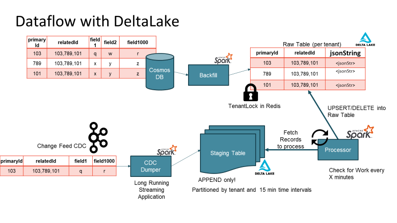

The Adobe Experience Platform includes a set of analytics, social, advertising, media optimization, targeting, Web experience management, journey orchestration, and content management products.

The Adobe Real-Time Customer Data Platform (CDP) team unifies customer data collected across different touch points to create a single customer view.

In the world of data-driven decision-making, large-scale SaaS companies face unique challenges when it comes to efficiently processing and analyzing graph data. As a SaaS company ourselves, we experienced the complexities associated with handling graph data from multiple sources, each with its own schema, and executing thousands of queries on individual records. To address these challenges, we embarked on a journey to find a scalable and versatile data storage solution.

In this blog post, we share our experiences and lessons learned from our real-world use case of scaling graph data processing with [Delta Lake](delta.io) and [Apache Spark](https://spark.apache.org/). We will discuss the intricacies of our migration from a NoSQL database to Delta Lake, the custom solutions we implemented, and the surprising performance benefits we gained along the way.

## Challenges and the Need for a Custom Solution

At our company, we manage massive amounts of graph data that come from diverse sources, including JSON, customer web metrics, and [Avro](https://avro.apache.org/docs/1.10.2/spec.html), each with its own unique schema.

Our existing NoSQL database was reaching its limits as the data volume grew, leading to increased latencies and resource contention during concurrent writes. Moreover, our use cases demanded not only low-latency point lookups but also high-throughput batch scans for complex queries. We had two primary access patterns: Point lookup, where we want to return only one, or a small number of distinct rows, and batch scan, where we’re querying for data based on our search criteria.

### We faced multiple challenges:

1. Concurrency Conflict: Handling concurrent writes from multiple sources was a primary concern. We needed to ensure that the data remained consistent and that no resource was wasted on failed write attempts.
2. Change Data Capture (CDC): Migrating from the NoSQL database to Delta Lake required a gradual switchover, as our existing system was serving multiple clients and generating substantial revenue.
3. Update Frequency: When updates were too frequent, it caused filestore metadata issues. When you have many writes in a very short time, you can generate a lot of small files. Every time this small file gets written, as you keep doing updates, it can trigger a copy on write which again is going to trigger a full rewrite of that file.
4. Schema Evolution: Graph data often comes with nested and evolving schemas. We needed a solution that could handle these schema changes without the need for extensive custom User-Defined Functions (UDFs).
5. Performance Optimization: Our performance requirements included fast data ingestion, efficient read throughput, and cost-effectiveness in terms of storage and computational resources.

#### Conquering Concurrency with Locks

To tackle concurrency challenges, we implemented a two-level locking strategy in Delta Lake. Our approach involved locking on the dataset level using both star-level read-write locks and dataset-level locks. Each source was assigned a specific lock, and before any writer could perform a write operation, it had to obtain the appropriate lock. This significantly improved latencies and resource utilization, ensuring that writes were only performed by the writers that successfully acquired the required locks.

#### Custom Change Data Capture (CDC)

The gradual migration from the NoSQL database to Delta Lake was a critical process. To achieve this, we developed a custom Change Data Capture (CDC) mechanism. Instead of relying on change events emitted by the database, we implemented an application-level CDC. Acknowledgment of each write event triggered a CDC message on the corresponding topic. The CDC topics fed into a structured streaming application, populating a multi-tenant staging table. This staging table served as a time-buffer queue, ensuring efficient and scalable data hydration into the raw table or the "bronze" table in Delta Lake terminology.

#### Update frequency solution: Staging Tables FTW

By implementing staging tables, you don’t end up reading small chunks of data. With staging tables, you also solve the issue with multiple writes. The staging tables are in APPEND ONLY mode so there are no conflicts while writing to it. Batch writes read larger blocks of data from the staging table and act as a time-aware message buffer.

#### Schema evolution: The Power of JSON String Representation

One of the critical challenges we faced was handling evolving nested schemas. While Delta Lake addressed this concern with nested schema evolution support, we temporarily leveraged JSON string representation to achieve schema flexibility. JSON strings allowed us to handle diverse data schemas without the need to maintain a myriad of UDFs for each tenant. This approach enabled seamless handling of updates, inserts, and complex patch operations using readily available JSON patch libraries.

#### Performance Benefits and Lessons

During the migration process, we observed unexpected performance benefits with Delta Lake. Compression ratios for data stored as JSON strings were significantly higher, reducing storage requirements considerably. The read performance from Delta Lake outperformed the previous NoSQL database, even when partially projecting the JSON string representation. Additionally, the use of optimized writes in Delta Lake proved vital in efficiently buffering writes and minimizing the number of small files.

## Leveraging Table Properties

Delta Lake played a pivotal role in addressing several challenges with handling data. Features like auto scale, auto optimize, and Z-ordering, significantly contributed to our success. We utilized Delta Lake's table properties to fine-tune our storage, such as disabling data skipping on certain columns to avoid unnecessary statistics building.

Even though Delta Lake doesn’t have a native Time to Live feature (TTL) We were able to implement TTL on data by defining a source-level TTL. We implemented a highly efficient soft TTL on the read side set on a partition key level, which was safe since we dynamically generate a TTL predicate per the config. The hard TTL was implemented by issuing true deletes once a day after obtaining a lock, which allowed us to not degrade writes in the middle of a business day.

## Performance Metrics and Scale

Our real-world use case involved migrating two petabytes of actively queried data from the NoSQL database to Delta Lake. We currently manage over five thousand Delta tables for various tenants, each with millions of records generated daily. The entire system handles close to 250 billion messages per day across regions affecting close to 3 trillion changes a day on the delta tables.

## Conclusion

Scaling graph data processing for large-scale SaaS companies requires a thoughtful approach and a robust data storage solution. Delta Lake proved to be the perfect match for our needs, providing concurrency control, efficient CDC, and schema evolution support. Leveraging JSON string representation allowed us to handle evolving schemas with ease, resulting in surprising performance benefits.

As we continue to fine-tune and optimize our Delta Lake implementation, we are confident that it will remain the backbone of our data processing infrastructure, empowering us to make data-driven decisions faster and more efficiently. We hope that our experiences and lessons learned will inspire other data engineers and analysts to explore Delta Lake's capabilities and its potential for solving complex data processing challenges at scale.
